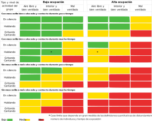

# Conceptos sobre CO2 y VOC
En general vamos a dar unas pautas de lo que son, por que son perjudiciales para la salud, que valores podemos tomar como referencia para determinar la calidad del aire y sus fuentes principales de emisión en entornos de trabajo no industriales (oficinas, locutorios, etc) y aulas escolares. Veremos al final el sensor que vamos a usar y algunas cosas interesantes sobre el mismo.

## **Sobre el CO2**
El dióxido de carbono es un gas inodoro e incoloro. Bajo presión puede encontrarse en estado líquido o estado sólido (hielo seco).

En el enlace podemos encontrar mas [definiciones de términos usuales](https://www.nj.gov/health/eoh/rtkweb/documents/fs/0343sp.pdf) dadas por el Departamento de Salud de New Jersey.

### Necesidad de vigilar los niveles de CO2
De manera muy resumida diremos que al respirar aire con mucho CO2, aumenta su concentración en sangre, baja el pH de la misma, y esto dispara la sensación de asfixia.

En la página 8 de la [Ficha Técnica de Seguridad número 300000000020](http://www.carburos.com/microsite/es/selector-gases-soldadura/pdf/SDS/CO2.pdf) se indican claramente los efecto perjudiciales del CO2 que relacionamos a continuación.

==**Efectos debido a la inhalación:**==

* Una concentración de CO2 superior o igual al 10% puede causar pérdida de consciencia o muerte.
* El bióxido de carbono tiene la capacidad de provocar la muerte, incluso si se mantienen los niveles normales de oxígeno (20 a 21%).
* El bióxido de carbono es fisiológicamente activo, afecta la circulación y la respiración.
* A concentraciones de 2 a 10%, el bióxido de carbono puede ocasionar náusea, mareo, dolor de cabeza, confusión, aumento de la presión arterial y la frecuencia respiratoria.
* A elevadas concentraciones puede causar asfixia.
* Los síntomas pueden incluir la pérdida de la consciencia o de la movilidad.
* La víctima puede no haberse dado cuenta de la asfixia. La asfixia puede causar la inconsciencia tan inadvertida y rápidamente que la víctima puede ser incapaz de protegerse.

==**Síntomas:**==

* Vértigo.
* Salivación.
* Náusea.
* Vómitos.
* Pérdida de movilidad/consciencia.
* Escalofríos.
* Sudor.
* Visión borrosa.
* Dolor de cabeza.
* Aumento de pulsaciones.
* Insuficiencia respiratoria.
* Respiración rápida.

==**Toxicidad aguda por inhalación:**==

* Un nivel de CO2 del 5% actúa de manera sinérgica e incrementa la toxicidad de otros gases (CO, NO2).
* El CO2 incrementa la producción de carboxihemoglobina o metahemoglobina ocasionada por estos gases, probablemente debido a los efectos estimulantes del bióxido de carbono en los sistemas respiratorio y circulatorio.

Podemos consultar mas datos sobre el CO2 en la [Ficha de seguridad oficial](http://www.ilo.org/dyn/icsc/showcard.display?p_card_id=21&p_edit=&p_version=2&p_lang=es).

En la entrada Dióxido de carbono del Instituto para la Salud Geoambiental podemos leer:

> **Efectos en la salud:**
>> El principal efecto que produce el CO2 es la asfixia por desplazamiento del oxígeno, pero esto se produce por concentraciones muy altas capaces de desplazar el oxígeno y reducir su concentración por debajo del 20%. En concentraciones altas, cercanas a la 30.000 ppm, puede causar dolores de cabeza, falta de concentración, somnolencia, mareos y problemas respiratorios. En entornos laborales, como oficinas, se comienzan a tener quejas de olores a partir de las 800-1000 ppm.

> **Colegios y CO2**
>>Es importante señalar que las personas con problemas de asma o SQM deben proveerse de un aire con bajas concentraciones de CO2.

>>Vamos a considerar solamente, y a efectos de estas notas, la última reglamentación RITE sin referirnos al RITE o NTE anteriores. Cómo se indica mas abajo el RITE, o [Reglamento de Instalaciones Térmicas en los Edificios](https://www.idae.es/tecnologias/eficiencia-energetica/edificacion/reglamento-de-instalaciones-termicas-de-los-edificios) y sus IT (Instrucciones Técnicas) contempla que el nivel de CO2 aconsejable en el interior de edificios, según los estudios y normas de referencia, se recomienda que se mantenga en niveles entre las 400 ppm y las 800 ppm. Teniendo en cuenta que el RITE se publica en su primera versión por el [Real Decreto 1027/2007, de 20 de julio, por el que se aprueba el Reglamento de Instalaciones Térmicas en los Edificios (BOE 29/08/2007)](https://www.boe.es/buscar/doc.php?id=BOE-A-2007-15820) y que tiene varias correcciones de errores y modificado de artículos hasta su [Versión consolidada del Real Decreto 1027/2007, de 20 de julio por el que se aprueba el Reglamento de instalaciones térmicas en los edificios](https://energia.gob.es/desarrollo/EficienciaEnergetica/RITE/Reglamento/Nota_periodo_transitorio_RITE%20238_2013.pdf) es muy posible que la mayoría de los centros educativos de construcción anterior a estas fechas no tengan adecuadas sus instalaciones para cumplir esta reglamentación, cosa que por otra parte sería muy deseable y que de seguro se habría logrado con una normativa específica para estos locales.

>>Un grupo a tener en cuenta especialmente son los niños en los colegios. En España no hay normativa específica que regule el nivel de CO2 en los colegios, como si lo tienen por ejemplo en Francia, y es bien conocida la relación entre el bajo rendimiento escolar y los altos niveles de CO2. Además los niños debido a su metabolismo y actividad producen mucho más CO2 que los adultos.

>>A raíz de la pandemia, que a día de hoy (mayo de 2021) nos sigue acompañando se han publicado multitud de guías y recomendaciones para indicar la necesidad de ventilación en las aulas, que con las medidas anti-covid establecidas en los centros y el gran compromiso adquirido por todo el personal relacionado con la vida de los centros y el propio alumnado, hemos de decir que los centros educativos han sido capaces de mantener un nivel de contagios que ha permitido mantenerlos en funcionamiento. A título de ejemplo tenemos la [Guía para ventilación en aulas](https://www.ciencia.gob.es/stfls/MICINN/Ministerio/FICHEROS/guia_para_ventilacion_en_aulas_csic.pdf) del Instituto de Diagnóstico Ambiental y Estudios del Agua, IDAEA-CSIC, Mesura en su VERSIÓN 3 de 6 de noviembre de 2020.

> **Principales Fuentes:**
>>La principal fuente en ambientes interiores es la respiración humana. Se deben considerar otras posibles fuentes debidas a combustión en casos de altos niveles de concentración.

> **Niveles habituales:**
>>Los niveles habituales que podamos encontrar en un ambiente interior estará relacionado con las diferentes variables que afectan a este factor como son: Niveles en aire exterior, fuentes interiores, niveles de ocupación y tasas de ventilación.

>>En la legislación existente no hay un valor concreto que se dé como bueno. Existen diferentes recomendaciones y valores límite ocupacionales. En el RITE por ejemplo en función del nivel de calidad de aire exigible al local los valores de concentración van desde las 400 ppm hasta más de 1.000 ppm. El valor límite de exposición profesional para exposiciones de 8 horas que vemos en las Guías del INSHT es de 5.000 ppm si bien este valor no se puede aplicar a entornos no industriales. Recordemos que en espacios como oficinas a partir de 800 ppm se producen quejas por olores y se recomienda no superar las 1.000 ppm.

>>Lo ideal es que el cociente entre exterior e interior sea lo más cercano a 1 posible.

En el artículo de la [International Journal of Emergency Medicine](https://intjem.biomedcentral.com/articles/10.1186/s12245-017-0142-y) dado en la webgrafía se pueden consultar mas datos relativos al tema del CO2 y en el de Centro Canadiense de Seguridad y Salud Ocupacional [(CCSSO)](http://www.ccsso.ca/oshanswers/chemicals/chem_profiles/carbon_dioxide/health_cd.html) tenemos respuestas a diversas cuestiones sobre el CO2.

### Riesgos de transmisión de covid-19 en distintas situaciones
En la figura 3 del artículo Editorial de BMJ dado en la webgrafía podemos leer que la gráfica exponer el **Riesgo de transmisión del SARS-CoV-2 de personas asintomáticas en diferentes entornos y para diferentes tiempos de ocupación, ventilación y niveles de hacinamiento (ignorando la variación en la susceptibilidad y las tasas de diseminación viral). Las calificaciones son indicativas de riesgo relativo cualitativo y no representan una medida cuantitativa. Es posible que también deban tenerse en cuenta otros factores no presentados en estas tablas al considerar el riesgo de transmisión, incluida la carga viral de una persona infectada y la susceptibilidad de las personas a la infección. Toser o estornudar, incluso si se deben a irritación o alergias mientras esté asintomático, agravaría el riesgo de exposición en un espacio interior, independientemente de la ventilación.**

Reproducimos aquí la gráfica en formato original traducida para que nos sirva de guía.

  
*Gráfica de riesgos de transmisión*  
***Clic para ver ampliada***

### Unidades de medida del CO2
Las formas más habituales de indicar la concentración de un contaminante atmosférico son las ppb (partes por billón) y las ppm (partes por millón), los µg/m³ (microgramos por metro cúbico) y los mg/m³ (miligramos por metro cúbico).

Las ppb y las ppm se suelen utilizar cuando se trata de un gas, y en este caso se sobreentiende que se expresa en volumen. Muchas veces se puede encontrar escrito como ppbv o ppmv, donde la “v” final indica precisamente que la concentración es en volumen.

De esta forma, 1 ppm es unidad de volumen de contaminante en un millón de unidades de volumen de aire. Para concentraciones altas de CO2 se usa el porcentaje volumétrico (unidades de volumen de CO2 en 100 unidades de volumen de aire), es decir que 10.000 ppm = 1%.

Es importante tener en cuenta que el billón de estas ppb es un billón anglosajón, esto es, 1000 millones de volúmenes ($10^9$). En Europa un billón es 1 millón de millones, $10^{12}$, por lo que la equivalencia es: **1ppm = 1000ppb**

Otras dos formas habituales de expresar la concentración de los contaminantes atmosféricos son los µg/m³ (microgramos por metro cúbico) y los mg/m³ (miligramos por metro cúbico). La equivalencia es similar a las de ppm y ppb:

1 mg/m³ = 1000 µg/m³

Para convertir las ppb en µg/m³ tenemos que tener en cuenta que dicha conversión depende del tipo de contaminante, y de una presión y una temperatura que tomemos como referencia. Para ver esto, tomemos una concentración de 1 ppb de un contaminante M. Esto implica que tenemos 1 m³ de M en $10^9$ m³ de aire. O lo que es lo mismo, $10^{−9}$ m³ de M en 1 m³ de aire.

La forma habitual de expresar la concentración de CO2 es en mg/m³ (miligramos por metro cúbico). Para convertir las ppm en mg/m³ tenemos que tener en cuenta que dicha conversión depende del tipo de gas, y de una presión y una temperatura que tomemos como referencia.

Teniendo en cuenta la ecuación general de los gases ideales, para el CO2 (con peso molecular 44,01 g/mol), y tomando como referencia P = 1 atm y T = 298,16 K (25 ºC), tenemos (R = 0,08205746 atm·L/mol·K):

$\dfrac{10^{6}\cdot 44,01\hspace{0.1cm} g/mol\cdot 1\hspace{0.1cm}atm\cdot 10^{-6}}{0,08205746\cdot 298,16\hspace{0.1cm}K}=1,798\hspace{0.1cm}mg\hspace{0.1cm}\approx\hspace{0.1cm}1,8\hspace{0.1cm}mg$

Luego:

$\boxed{1\hspace{0.1cm}ppm=1,8\hspace{0.1cm}mg/m^{3}\hspace{1cm}(CO_{2}\hspace{0.2cm}@\hspace{0.2cm}1\hspace{0.2cm}atm.\hspace{0.2cm} 25\hspace{0.2cm}ºC)}$

Que será la relación a usar para convertir entre unidades de CO2.

También se puede expresar como:

$\boxed{1\hspace{0.1cm}ppb=1800\hspace{0.1cm}\mu g/m^{3}\hspace{1cm}(CO_{2}\hspace{0.2cm}@\hspace{0.2cm}1\hspace{0.2cm}atm.\hspace{0.2cm} 25\hspace{0.2cm}ºC)}$

### Valores de referencia para el CO2
En la tabla siguientes damos los valores que vamos a considerar en nuestro caso. En la columna color se establece cual será el color que se ilumine en un posible semáforo.

| CO2 (ppm) | CO2 ($mg / m ^{3}$) | Ambiente | Mensaje | Color |
|:-:|:-:|---|---|---|
| de 0 a 500 | de 0 a 900 | Muy bueno | Aconsejado | Apagado |
| de 501 a 1000 | de 901 a 1800 | Bueno | Bueno | Verde |
| de 1001 a 1500 | de 1801 a 2700 | Moderado | ventilar | Amarillo |
| de 1501 a 2000 | de 2701 a 3600 | Muy malo | VENTILAR | Rojo fijo |
| mas de 2000 | mas de 3600 | Inaceptable | Desalojar | Rojo intermitente |

### Fuentes emisoras de CO2 en personas
En el ambiente que nos ocupa la principal fuente de emisión de CO2 va a ser el ser humano a través de la respiración, la sudoración, la transpiración y el sudor.

## **Sobre los VOC**
VOC (Volatile Organic Compounds) es la abreviatura inglesa para los compuestos orgánicos volátiles (COV) que hay en el aire en forma de gas o de vapor a temperatura ambiente. Los VOC tienen muy diversa procedencia pero nos interesa en este caso los generados en los procesos biológicos de las personas que los emiten a través de la respiración y de la piel.

Los efectos sobre la salud a corto plazo pueden ser:

* Irritación de ojos, garganta y nariz

* Náuseas

* Dolor de cabeza

* Vómito de sangre

* Reacciones alérgicas e hinchazones

* Mareos

* Dolores estomacales e intestinales

* Fatiga

* Manchas en la piel.

A largo plazo pueden dañar el hígado, los riñones o el sistema nervioso central. También pueden ser carcinógenos, como por ejemplo el benceno.

### Valores de referencia para VOC
En la tabla siguiente damos los valores que vamos a considerar en nuestro caso.

| VOC (ppb) | Ambiente | Mensaje | Color |
|:-:|:-:|---|---|
| de 0 a 200 | Muy bueno | Aconsejado | Apagado |
| de 201 a 600 | Bueno | Bueno | Verde |
| de 601 a 1000 | Moderado | ventilar | Amarillo |
| de 1001 a 2000 | Muy malo | VENTILAR | Rojo fijo |
| mas de 2000 |  Inaceptable | Desalojar | Rojo intermitente |

### Fuentes emisoras de VOC en personas
En el ser humano se producen diferentes gases VOC a través de la respiración (acetona, etanol, isopreno), la sudoración, la transpiración, el sudor, por flato (metano), los cosméticos (Limoneno, eucaliptol), el mobiliaario (alcoholes), la combustión de motores y calderas (hidrocarburos) y los ordenadores, impresoras o fotocopiadoras (benceno, estireno, fenol).

## **El sensor CCS811**
Es un sensor de gas digital que puede detectar una amplia gama de compuestos orgánicos volátiles. En este caso se denominan TVOC, pues el sensor no distingue unos de otros y la medida la totaliza. También detecta niveles equivalentes de dióxido de carbono que se denominan eCO2.

Los rangos de medida son:

* **eCO2:** de 400 a 29206 ppm (partes por millon).

* **TVOC:** de 0 a 32768 ppb (partes por billón).
