# Shield EASY Plug 1.1
Se trata de una placa que inicialmente está pensada para la placa micro:bit, que es una placa de desarrollo diseñada por la BBC para la enseñanza de programación a adolescentes. Podemos hacer actividades con la placa de micro:STEAMakers utilizando la Shield EASY Plug que nos sirve para extender los pines de borde de placa a conectores Easy Plugs (RJ11 6P6C) donde podemos conectar de forma rápida sensores y actuadores.

La Shield viene con cuatro LEDs WS2812 (controlados desde P9), un zumbador (controlado por P0). Hay un interruptor (Power Switch) que sirve para control de la alimentación externa y otro (Voltmeter_Switch) que se utiliza para control del voltaje (3,3V, 5V) de Easy Plug.

El aspecto de la placa por la cara frontal es:

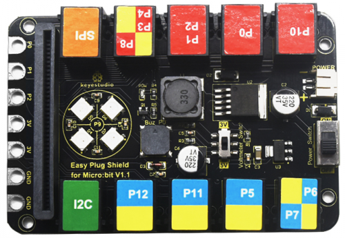  
*Cara frontal*

Y por la cara posterior es:

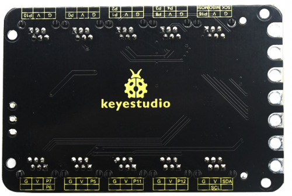  
*Cara posterior*

Los puertos EASY Plug tienen 6 pines que se serigrafian en la cara posterior con respecto a los puertos IO de la placa. La nomenclatura es la siguiente:

* **G**: GND
* **V**: Alimentación controlada por (Voltmeter_Switch) que será 3.3V o 5V siempre y cuando tengamos la alimentación externa conectada a una fuente de entre 6 y 10V. Sin alimentación externa los puertos EASY Plug no disponen de tensión positiva de alimentación.

## **Análisis alimentación Shield**
En la imagen siguiene vemos destacadas las zonas que vamos a analizar:

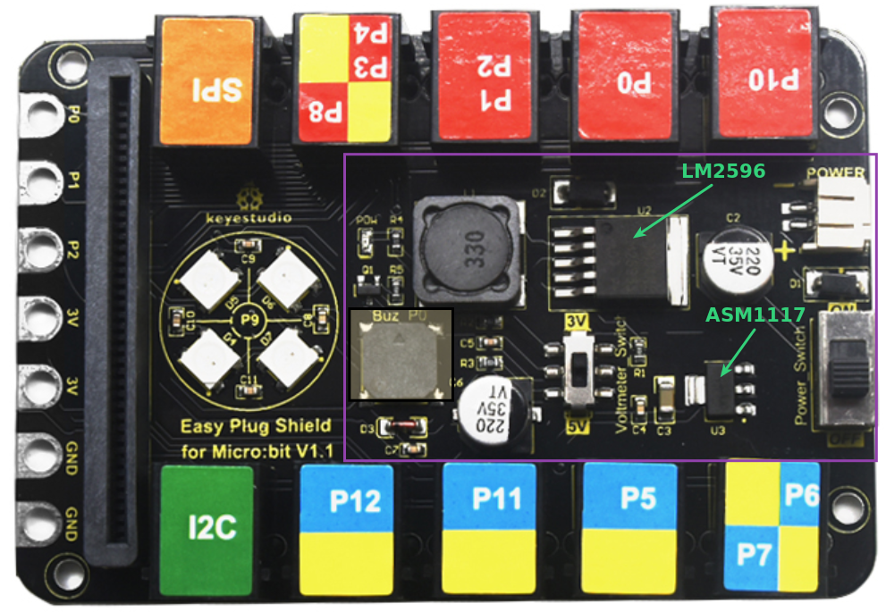  
*Alimentación Shield*

Vemos que entre otros elementos están los dos circuitos integrados destacados. Veamos que son estos circuitos:

<b>ASM1117</b>

Es un regulador de baja caída en formato SOT-223 capaz de entregar hasta 1A de corriente. En este caso se utiliza como regulador lineal de 5 a 3.3V con un circuito seguramente muy similar al circuito de apllicación que aparece en el datasheet del ASM1117 y que vemos en la imagen siguiente:

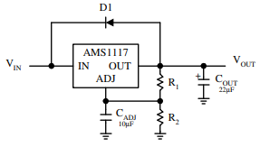  
*Regulador ASM1117*

<b>LM2596</b>

Se trata de un regulador reductor de tensión de salida ajustable, en formato TO-263 KTT, capaz de entregar hasta 3A. El circuito de aplicación típico que indica su datasheet lo vemos a continuación. Podemos observar como están los componentes en la placa junto al conector de entrada externa de alimentación. Este va a ser el encargado de regular la tensión externa al valor de tensión seleccionado en la placa con el interruptor Voltimeter-Switch.

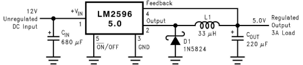  
*Regulador LM2596*

!!! warning "Uso sin alimentación externa"
	Sin alimentación externa los puertos EASY Plug no disponen de tensión positiva de alimentación. Por lo tanto no tiene sentido utilizar la Shield con la micro:STEAMakers sin dotarla de una alimentación entre 6 y 10V a través de su conector JST **POWER**.

## **Diagrama de pines**
En la figura siguiente podemos observar la relación de los puertos de la Shield con los pines de la micro:STEAMakers

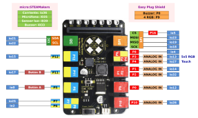  
*Pinout Shield*  
***Clic sobre la imagen para ampliarla***

Un análisis de la gráfica nos devuelve una serie de conclusiones a tener en cuenta para el trabajo con esta Shield:

* **1. Sensores micro:STEAMakers:** Los pines io36 (sensor de corriente), io35 (micrófono), io39 (sensor de luz) e io33 (Buzzer) no están utilizados en la Shield por lo que el uso de sus elementos asociados no tiene restricciones.
* **2. I2C (SDA - io21; SCL - io22):** El conector I2C está también disponible en formato EASY Plug y podemos conectar elementos a cualquiera de los conectores sin mas restricciones que las direcciones físicas y el número de elementos. Su interfaz de conexiones es:

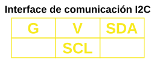  

* **3. P12 (io15):** El puerto P12 (io15) se puede usar sin restricciones. Su interfaz de conexiones es:

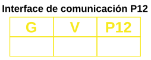  

<b>En la práctica esta interfaz de conexión es la que tienen todos los sensores y actuadores de tipo EASY Plug que requieren, además de los pines de alimentación, de un sólo pin para los datos digitales o analógicos. Por tanto a este tipo de puerto podemos conectar gran cantidad de elementos.</b>

* **4. P5 y P11:** Puertos asociados a los botones de la micro:STEAMakers no utilizables para otros propósitos.
* **5. P6+P7 (P6 - io2; P7 - io25):** Conector con dos puertos con la siguiente interfaz de conexionado de sus pines:

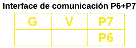  

<b>En la práctica esta interfaz de conexión la podemos considerar como la de P12 si solamente tenemos en cuenta el puerto P7 ignorando el P6. Lógicamente sería utilizable con cualquier dispositivo que tuviese la misma interfaz de conexionado.</b>

* **6. P10 (io26):** El puerto P10 (io26) se puede usar sin restricciones. Su interfaz de conexiones es:

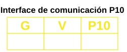  

* **7. P0 (io12):** El puerto P0 (io12) se puede usar pero con la restricción de que al mismo está conectado el altavoz con la que está equipada la Shield. Su interfaz de conexiones es:

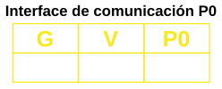  

* **8. P1+P2 (P1 - io14; P2 - io32):** Conector con dos puertos con la siguiente interfaz de conexionado de sus pines:

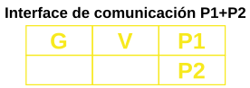  

<b>En la práctica esta interfaz de conexión la podemos considerar como la de P12 si solamente tenemos en cuenta el puerto P1 ignorando el P2. Lógicamente sería utilizable con cualquier dispositivo que tuviese la misma interfaz de conexionado.</b>

* **9. P3+P4+P8 (P3 - io13; P4 - io27; P8 - io4):** Conector con tres puertos con la siguiente interfaz de conexionado de sus pines:

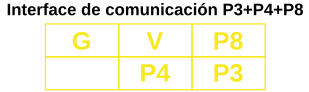  

**Como limitaciones de uso debemos tener en cuenta que el puerto P3 está conectado al pin de control de la matriz de 4x4 LEDs RGB de la Shield y que el pin P4 es el mismo que del sensor táctil de la micro:STEAMakers.**

<b>En la práctica esta interfaz de conexión la podemos considerar como la de P12 si solamente tenemos en cuenta el puerto P8 ignorando los otros dos. Lógicamente sería utilizable con cualquier dispositivo que tuviese la misma interfaz de conexionado o una interfaz en la que utilice una combinación de pines como P8 y P4.</b>.

* **10. SPI (SCK-P13; MISO-P14; MOSI-P15; CS-P16):** Conector con cuatro puertos dedicado al lector microSD con la siguiente interfaz de conexionado de sus pines:

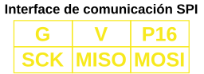

* **11. P9 (io16):** Se trata del pin al que están conectados los 4 LEDs RGB direccionables con los que cuenta la Shield. Veremos como programarlos en las actividades.

**En resumen, podemos usar sin restricciones, además de dispositivos I2C, los puertos P12 (io15), P7 (io25), P10 (io26), P1 (io14) y P8 (io4). Para el resto debemos tener en cuenta las restricciones vistas.**