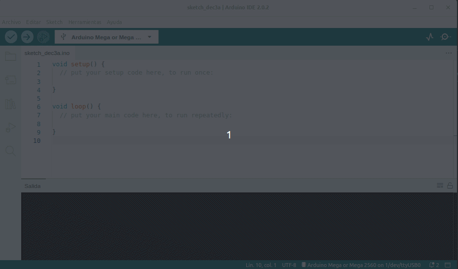

# Características principales del IDE 2.0

## **Ajustar preferencias**

En la animación de la figura siguiente vemos como acceder a la configuración de las mismas y también como se realiza algún ajuste adicional.

  
*Preferencias IDE 2.0*

## **La carpeta de programas**
Los programas o sketches de Arduino se guardan como .ino y deben almacenarse en una carpeta con el mismo nombre. Por ejemplo, un programa de nombre 'mi_programa.ino' debe almacenarse en una carpeta llamada 'mi_programa'. Generalmente se guardan en una carpeta de nombre 'Arduino' en la carpeta personal.

En la animación siguiente vemos como abrir y cerrar esta carpeta desde el botón de la barra lateral y como nos muestra el contenido

  
*Carpeta de programas*

## **Administrador de placas**
Con el Administrador de placas se pueden buscar e instalar paquetes o "núcleos" para nuestras placas. Compilar y cargar un programa en una placa siempre requiere un paquete de la placa. Hay muchos paquetes de placa Arduino disponibles, como avr, samd, megaav y muchos más.

Podemos decir que un "núcleo" está escrito y diseñado para microcontroladores específicos y sabemos que las diferentes placas tienen micros de diferentes tipos. Por ejemplo, un Arduino UNO tiene un **ATmega328P**, que usa el **núcleo AVR**, mientras que un Arduino Nano 33 IoT tiene un microcontrolador **SAMD21**, donde necesitamos usar el **núcleo SAMD**. En definitiva, para poder usar una placa concreta debemos instalar su núcleo específico.

Al hacer clic en el botón de la barra lateral se nos abren todas las opciones disponibles y ne indica si están o no instalados y además dispone de un buscador que permite localizar el núcleo que necesitamos. Hay que tener presente que la instalación de algunos de ellos puede tardar varios minutos.

En la animación vemos el funcionamiento de este botón.

  
*Administrador de placas*

## **Gestor de librerías**
Este botón nos permite buscar e instalar librerías, que son extensiones de la API de Arduino que facilitan el control de un servo, leer un sensor específico o utilizar un módulo WiFi.

En la animación vemos como utilizar este botón.

  
*Gestor de librerías*

## **Monitor serie**
Esta herramienta que habitualmente estaba en una ventana separada ahora se integra en el editor. La herramienta sirve para comunicarse con la placa o para depurar programas.

Una ventaja de tener el Serial Monitor integrado con el editor es la posibilidad de tener múltiples monitores abiertos simultáneamente. En el editor antiguo, al cambiar el puerto/placa, cambiaba en todas las ventanas. Además, estábamos limitados a una ventana de Serial Monitor, un obstáculo que el IDE 2.0 elimina.

En la animación vemos el uso básico del mismo.

  
*Monitor serie*

basica

Para obtener más información sobre Serial Monitor podemos visitar el [Serial Monitor tutorial](https://docs.arduino.cc/software/ide-v2/tutorials/ide-v2-serial-monitor).

## **Serial Plotter**
Nos permite visualizar datos utilizando gráficos permitiendo monitorizar varias variables de manera simultanea. Para ver mejor el funcionamiento de este elemento vamos a utilizar un potenciómetro conectado al pin analógico A3 junto con una variable estática y una aleatoria. El código del ejemplo es:

~~~C++
int potenciometro;
int aleatoria;
int static_variable = 500;

void setup() {
  Serial.begin(9600);
}

void loop() {
potenciometro = analogRead(A3);
aleatoria = random(0, 1000);
  Serial.print("Potenciometro:");
  Serial.print(potenciometro);
  Serial.print(",");
  Serial.print("Valor aleatorio:");
  Serial.print(aleatoria);
  Serial.print(",");
  Serial.print("Variable estatica:");
  Serial.println(static_variable);
}
~~~

En la animación vemos como cargar el programa y el funcionamiento en la ventana del Serial Plotter.

  
*Serial Plotter*

## **Debugger**
El depurador se utiliza para probar y depurar programas. Básicamente lo que permite es navegar a través de la ejecución de un programa, lo que sirve para detectar fallos o errores de código.

El depurador solamente está disponible con las placas SAMD.

Tenemos mas información en [Debugging tutorial](https://docs.arduino.cc/software/ide-v2/tutorials/ide-v2-debugger).

## **Autocompletado**
Es una nueva característica de la versión 2.0 muy bien equipada. Debemos tener presente que para que funcione debemos tener seleccionada la placa a utilizar.

En la animación siguiente vemos la herramienta funcionando.

  
*Autocompletado*
