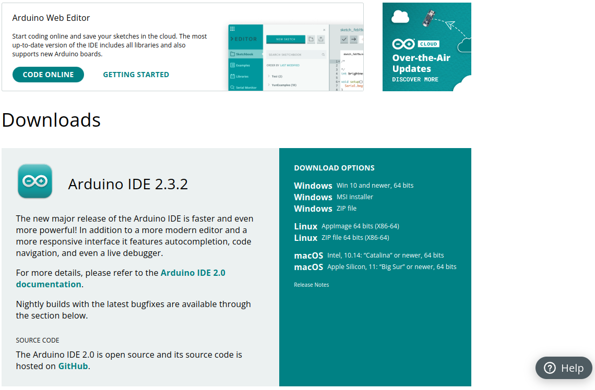

# Descarga
Podemos descargarlo desde la [página de software de Arduino IDE 2.0](https://www.arduino.cc/en/software) y en el momento de creación de este apartado de la web nos ofrece la versión 2.3.2 además de los enlaces al editor online, tal y como vemos en la figura siguiente.

  
*Descargas*

En esta página tenemos disponibles las versiones Nightly y otras informaciones importantes como:

* La versión de escritorio no está disponible para Chromebook donde deberemos trabajar con el [editor web de Arduino](https://create.arduino.cc/editor/).
* Es posible programar las placas utilizando MicroPython. En la página [MicroPython with Arduino](https://docs.arduino.cc/micropython) tenemos toda la información.
* Opciones de descarga de versiones anteriores del IDE.
* Términos de servicio

Si tenemos alguna duda podemos seguir el tutorial en inglés de [descarga e instalación de Arduino IDE 2.0](https://docs.arduino.cc/software/ide-v2/tutorials/getting-started/ide-v2-downloading-and-installing).
