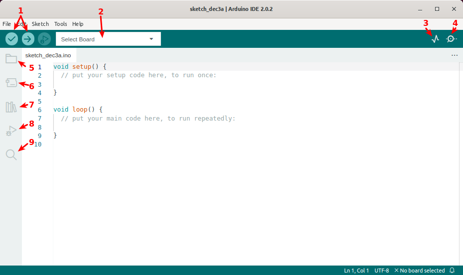

# Ventana principal del IDE 2.0
En la figura siguiente vemos el aspecto que presenta el IDE en la versión 2.0.

  
*Arduino IDE 2.0*

A continuación se describen de forma rápida los apartados señalados en la figura anterior.

1. Verify/Upload (Verificar/Cargar): Para compilar y cargar el código en la placa.
2. Select board & port (Seleccionar placa y puerto): En el desplegable se muestran las placas detectadas de forma automática, junto con el puerto asignado.
3. Open Serial Plotter (abrir trazador seríe): Abre la herramienta de graficado como una nueva ventana.
4. Open Serial Monitor (abrir el monitor serie): abre la herramienta Serial Monitor, como una nueva pestaña en la consola.
5. Sketchbook (Carpeta de programas): es el directorio o carpeta donde se almacenan localmente los programas. Además, desde aquí se puede sincronizar con Arduino Cloud y también obtener los sketch del entorno online.
6. Boards Manager (Administrador de placas): para explorar los paquetes de Arduino y de terceros que se pueden instalar. Por ejemplo, usar una placa MKR WiFi 1010 requiere tener instalado el paquete *Arduino SAMD Boards*.
7. Library Manager (Ad https://docs.arduino.cc/software/ide-v2./img/teo-basica/soft/ministrador de librerías): Para navegar por las librerías propias de Arduino y las creadas por la comunidad.
8. Debugger (Depurador): Para probar y depurar programas en tiempo real.
9. Search (Buscar): búsqueda de palabras en el código.
