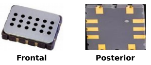
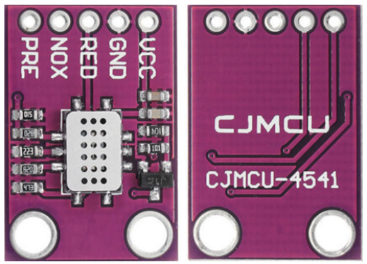
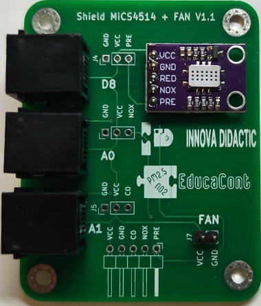
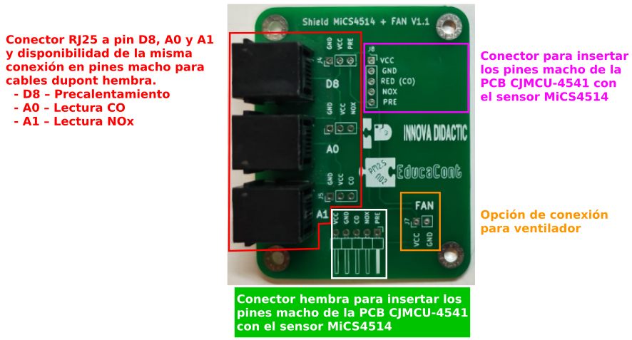

# Sensor MiCS4514 de NO2 y CO
## **El sensor**
El MiCS4514 es un sensor con tiempos de respuesta cortos y adecuado para monitorizar la calidad del aire, para detección de fugas de gas y detección de contaminación. Es un sensor de silicio para gases que tiene un diafragma micromaquinado de precisión con una resistencia de calentamiento integrada y la capa de detección en la parte superior. Su tiempo de respuesta es inferior a 10 segundos y opera dentro de un rango de temperatura de -30 ºC a 85 ºC.

Especificaciones:

* Sensor MOS (Metal Óxido Semiconductor)
* Tecnología MEMS (MicroElectroMechanical Systems)
* Tiempo de respuesta: menos de 10 segundos
* Rango de temperatura de funcionamiento: de -30ºC a 85ºC
* Gases detectables MiCS-4514:

> ◦ Monóxido de carbono (1-1000ppm)  
> ◦ Dióxido de nitrógeno (0.05-10ppm)  
> ◦ Hidrógeno (1-1000ppm)  
> ◦ Etanol (10-500ppm)  
> ◦ Amoniaco (1-500ppm)  
> ◦ Metano (mayor de 1000 ppm)  

El aspecto del sensor lo vemos en la imagen siguiente:

  
*Sensor MiCS4514*

Aunque el sensor se comercializa como tal, a nosotros nos interesa un módulo, placa o PCB en el que venga montado con los elementos auxiliares necesarios para hacerlo funcionar. Esta PCB existe comercialmente, se denomina CJMCU-4541 y tiene el siguiente aspecto:

  
*PCB CJMCU-4541 con sensor MiCS4514*

!!! note "Aviso"
    La PCB CJMCU-4514 es utilizable directamente en sistemas modulares pero para formato EASY Plug es necesario utilizar la shield que vemos seguidamente.

## **Shield CJMCU-4514 a EASY Plug**
La Shield MiCS4514 es un desarrollo de [INNOVA DIDACTIC](https://shop.innovadidactic.com/es/) creado para el proyecto Educacont del año 2019. La placa montada tiene el aspecto de la imagen siguinete:

  
*Shield MiCS4514*

A continuación vemos una imagen descriptiva de las partes de esta shield:

  
*Partes shield MiCS4514*

Los pines marcados D8, A0 y A1 son los correspondientes a la placa de control Easy Plug Control board V2.0. Para otras aplicaciones habrá que adaptarlos a la placa que se esté utilizando.

Los pines macho se han colocado para dar funcionalidad extra a la PCB y tener otras opciones de conexíon disponibles por si resulta necesario, pero inicialmente no serán usados.

La shield está equipada con la interfaz RJ11 6P6C, compatible con la placa de control **keyestudio EASY plug**. Si disponemos de placas de otras marcas con este tipo de conexión debemos verificar el orden de pines antes de conectarlas.
