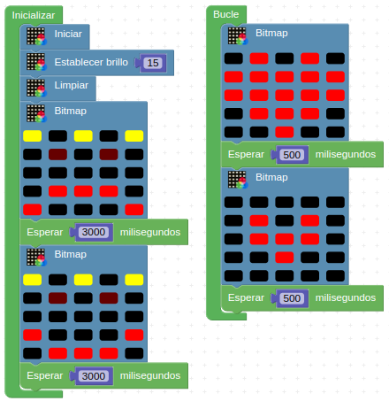

# A01-Hola Mundo
En esta actividad haremos que al inicio se muestre durante 3 segundo una carita triste que cambiará, tambien a los 3 segundo, a carita alegre para pasar a ver de forma permanente un corazón latiendo a razón de una pulsación cada segundo.

En la imagen siguiente tenemos el programa.

  
*[A01-Hola Mundo](../program/actividadesAB/A01. Hola Mundo.abp)*

A continuación vemos una animación de la actividad:

  
*A01-Hola Mundo funcionando*

