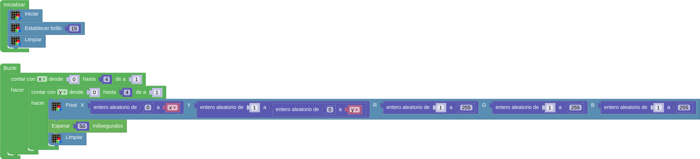

# A03-Pixel de color aleatorio
Se trata de hacer un programa que muestre iluminado un pixel aleatorio de un color también aleatorio.

En la imagen siguiente tenemos el programa.

  
*[A03-Pixel de color aleatorio](../program/actividadesAB/A03-Pixeles_color_aleatorio.abp)*

A continuación vemos una animación de la actividad:

  
*A03-Pixel de color aleatorio funcionando*

