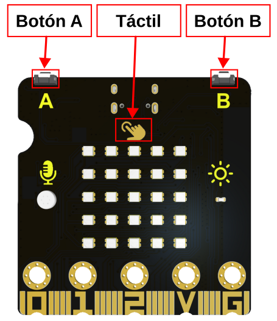
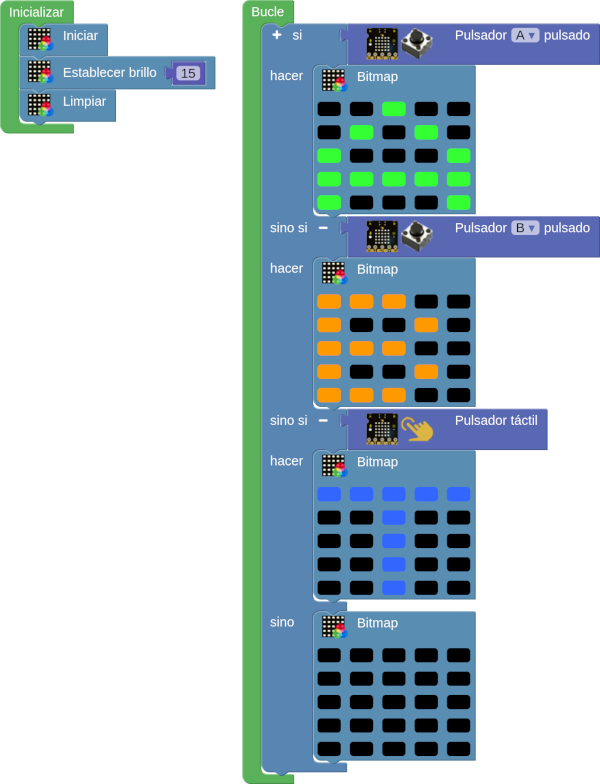
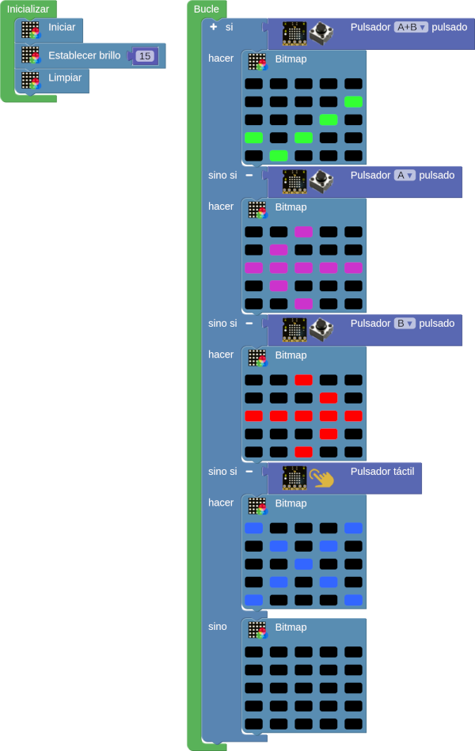
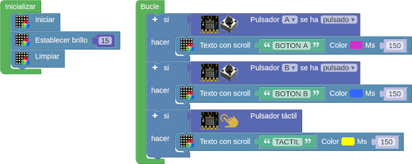
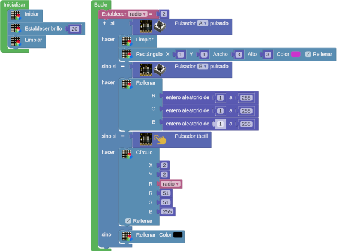

# A04-Botones
Los ejemplos vistos hasta ahora han permitido que la micro:STEAMakers nos muestre algo. Esto es lo que se conoce como salida. Ahora bien, es evidente que necesitamos también que la micro:STEAMakers reaccione a cosas externas, y estas cosas se denominan entradas. Para que sea fácil de recordar:

* **Salida** es lo que micro:bit nos muestra
* **Entrada** es lo que recibe la micro:bit para procesarlo

Aunque existen otros sistemas, por ahora nos vamos a centrar en los botones de la micro:STEAMakers, recordando que disponemos además de un tercer botón, en este caso tactil, que está marcado en la placa. En la imagen vemos estos botones.

  
*Botones en la micro:STEAMakers*

## **A04_1-Mostrar el botón pulsado**
Se trata de mostrar en la pantalla el botón que estamos pulsando mientras lo mantengamos accionado. El programa es el siguiente:

  
*[A04_1-Mostrar el botón pulsado](../program/actividadesAB/A04_1-Mostrar el botón pulsado.abp)*

A continuación vemos una animación de la actividad:

  
*A04_1-Mostrar el botón pulsado funcionando*

## **A04_2-Check y flechas**
Crear un programa que se esté ejecutando en un bucle infinito y que responda, según pulsemos los botones, de la forma siguiente:

* Si pulsamos simultaneamente A y B en la pantalla aparecerá el característico símbolo de check en color verde.
* Si pulsamos el botón A mostrará una flecha apuntando a la izquierda en color magenta.
* Si pulsamos el botón B mostrará una flecha apuntando a la derecha en color rojo.
* Si pulsamos el botón táctil en la pantalla veremos un aspa de color azul.
* Si no pulsamos nada dejaremos la pantalla estará en negro.

El programa es el siguiente:

  
*[A04_2-Check y flechas](../program/actividadesAB/A04_2-Check y flechas.abp)*

A continuación vemos una animación de la actividad:

  
*A04_2-Check y flechas funcionando*

## **A04_3-Botones como texto**
Crear un programa que se esté ejecutando en un bucle infinito y que responda, según pulsemos los botones, de la forma siguiente:

* Si pulsamos el botón A mostrará 'BOTON A' en color magenta.
* Si pulsamos el botón B mostrará 'BOTON B' en color AZUL.
* Si pulsamos el botón táctil en la pantalla veremos 'TACTIL' en color amarillo.
* Si no pulsamos nada dejaremos la pantalla estará en negro.

El programa es el siguiente:

  
*[A04_3-Botones como texto](../program/actividadesAB/A04_3-Botones como texto.abp)*

A continuación vemos una animación de la actividad:

  
*A04_3-Botones como texto funcionando*

!!! Nota "NO interrupción ejecución durante scroll"
	Al final observamos como el scroll no interrumpe la ejecución y podemos activar cualquier botón en el momento que necesitemos.

## **A04_4-Botones y rellenos**
Crear un programa que se esté ejecutando en un bucle infinito y que responda, según pulsemos los botones, de la forma siguiente:

* Si pulsamos el botón A mostrará un cuadrado relleno de 3x3 pixeles en color magenta.
* Si pulsamos el botón B mostrará un rellenos completo en colores aleatorios.
* Si pulsamos el botón táctil la pantalla estará apagada.

El programa es el siguiente:

  
*[A04_4-Botones y rellenos](../program/actividadesAB/A04_4-Botones y rellenos.abp)*

A continuación vemos una animación de la actividad:

  
*A04_4-Botones y rellenos*

!!! Nota "Botón táctil en pines de expansión"
	Podemos observar como el sensor táctil se encuentra justo en el pin que hay a la derecha del 0 en los pines de borde de placa.
