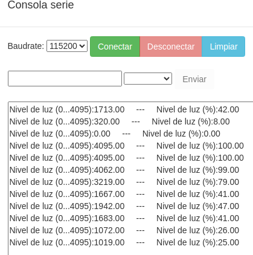
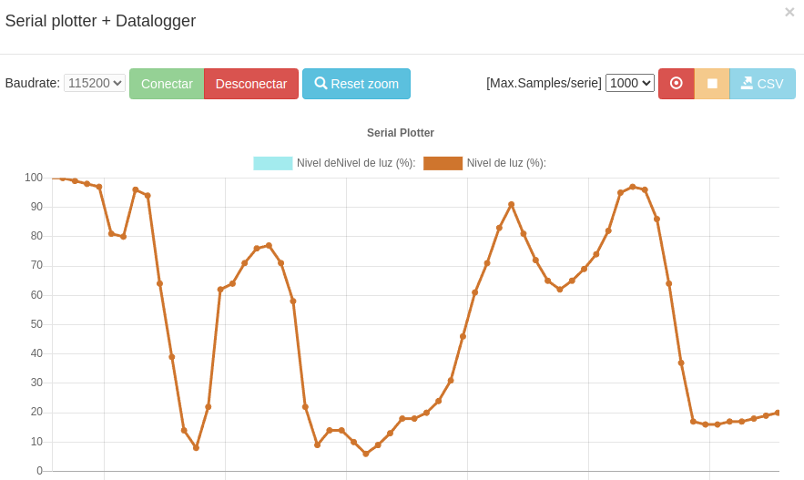

# A05-Sensores integrados
En esta actividad vamos a ver ejemplos de uso sencillo de los sensores que incorpora la ESP32 micro:STEAMakers programando su comportamiento con arduinoblocks.

Los veremos en el orden en que están los bloques y utilizaremos el puerto serie para mostrar los datos obtenidos de los mismos. En algunos ejemplos iremos mezclando elementos para su creación.

## **A05_1-Nivel de luz como datos**
El programa de prueba que vamos a crear consiste en mostrar en el monitor serie los datos de nivel de luz recibidos en sus dos formatos posibles, porcentaje y numérico. El programa es el siguiente:

  
*[A05_1-Nivel de luz como datos](../program/actividadesAB/A05_1-Nivel de luz como datos.abp)*

En la imagen siguiente vemos el resultado obtenido a partir de una fuente de luz a la que se acerca el sensor y se va alejando y/o tapando parcial o totalmente para variar la cantidad de luz que incide en el mismo.

  
*Resultados A05_1-Nivel de luz como datos*

## **A05_2-Nivel de luz grafico**
Crear un datalogger con el nivel de luz. El programa es el siguiente:

  
*[A05_2-Nivel de luz grafico](../program/actividadesAB/A05_2-Nivel de luz grafico.abp)*

En la imagen siguiente vemos el resultado obtenido a partir de una fuente de luz a la que se acerca el sensor y se va alejando y/o tapando parcial o totalmente para variar la cantidad de luz que incide en el mismo.

  
*Resultados A05_2-Nivel de luz grafico*

## **A05_3-Temperatura y humedad**
La actividad consistirá en enviar los dos datos de manera ordenada, con indicación de la unidad de medida, a la consola serie al tiempo que se muestran en la pantalla dos iconos, uno para frio y otro para calor (dentro de las posibilidades de dibujo que tenemos) en función de si se supera o no un determinado valor de temperatura.

  
*[A05_3-Temperatura y humedad](../program/actividadesAB/A05_3-Temperatura y humedad.abp)*

A continuación vemos el funcionamiento del programa. Cuando se pone el dedo por detrás de la placa en realidad se pone en contacto con el sensor para variar aunque sea minimamente su temperatura y que supere el umbral establecido. Cuando se retira el dedo se observa como la temperatura vuelve a su valor ambiente.

  
*A05_3-Temperatura y humedad funcionando*

En la imagen siguiente podemos observar los datos en la consola serie y como se producen los cambios de temperatura. También observamos los cambios en la humedad.

  
*Resultados A05_3-Temperatura y humedad*

## **A05_4-Nivel de sonido**
El programa que vamos a crear para la actividad consiste en mostrar en el monitor serie los datos de nivel de sonido recibidos en sus dos formatos posibles, porcentaje y numérico. El programa es el siguiente:

  
*[A05_4-Nivel de sonido](../program/actividadesAB/A05_4-Nivel de sonido.abp)*

En la imagen siguiente vemos el resultado obtenido creando variaciones de sonido en base a una reproducción musical {Oscar D'Leon - LLoraras} acercando y alejando la tarjeta del altavoz.

  
*Resultados A05_4-Nivel de sonido*

## **A05_5-Datalogger con todos**
Esta actividad consiste simplemente en reproducir el ejemplo que Juanjo desarrolla en el video [micro:STEAMakers 03 - Sensores integrados](https://www.youtube.com/watch?v=AJ6wFrjaN3k&list=PL1pKD-Bz2QBApBvH9_3hjr5Q6sORXN11h&index=3).

El programa es el siguiente:

  
*[A05_5-Datalogger con todos](../program/actividadesAB/A05_5-Datalogger con todos.abp)*

A continuación vemos el funcionamiento:

  
*A05_5-Datalogger con todos funcionando*

## **A05_6-Consumo**
Utilizaremos el plotter serie para observar los cambios que se producen en la corriente de consumo cuando activamos y desactivamos la pantalla a diferentes niveles de brillo.

El programa es el siguiente:

  
*[A05_6-Consumo](../program/actividadesAB/A05_6-Consumo.abp)*

A continuación vemos el funcionamiento:

  
*A05_6-Consumo funcionando*

En la gráfica podemos observar dos momentos diferentes:

1. El momento de la conexión del plotter y las partes planas de la gráfica se produce un diente de sierra de unos 10 microamperios de pico a pico. Esto se debe a las variaciones de consumo en reposo de la placa.
2. Los cambios entre unos 6mA a unos 30mA en el primer escalon debido a la pulsación del botón B. Un segundo escalón has unos 50mA debido a la pulsación del botón A. La vuelta a 6mA se produce al tocar el botón táctil.
