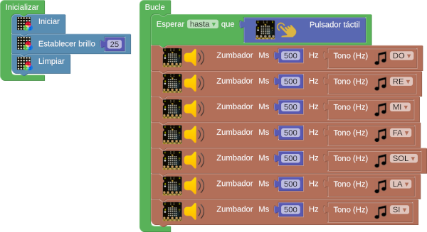
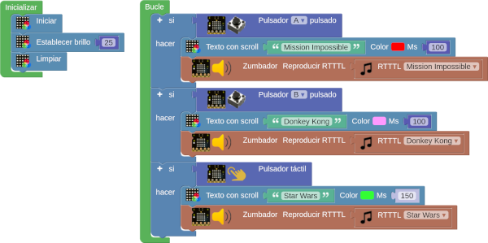

# A06-Actuadores integrados
En esta actividad vamos a ver ejemplos de uso sencillo de los bloques para el control del zumbador.

## **A06_1-Escala musical**
El programa de prueba que vamos a crear consiste en crear la escala musical y hacer que suene cuando activamos el pulsador táctil. El programa es el siguiente:

  
*[A06_1-Escala musical](../program/actividadesAB/A06_1-Escala musical.abp)*

## **A06_2-Melodia**
Reproducir la melodía de la imagen siguiente sabiendo que las negras tienen una duración de 500ms, las negras con un puntito 750ms y las blancas 1000ms.

  
*A06_2-Melodia: Himno a la alegria*

El programa es el siguiente:

  
*[A06_2-Melodia](../program/actividadesAB/A06_2-Melodia.abp)*

## **A06_3-RTTTL**
La actividad consistirá en reproducir diferentes melodías a partir de los bloques RTTTL (Ring Tone Text Transfer Language o lenguaje de tonos de llamada) en función del botón que pulsemos.

  
*[A06_3-RTTTL](../program/actividadesAB/A06_3-RTTTL.abp)*

