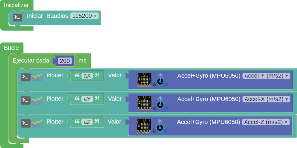

# A07-Acelerómetro y giroscopio
En esta actividad vamos a ver ejemplos de uso sencillo del bloque para el control de la posición de la placa.

## **A07_1-Acelerómetro**
El programa de prueba que vamos a crear consiste simplemente en asignar la acelaración en cada eje al plotter para visualizar los movimientos.

!!! warning "Reasignar ejes"
	Tendremos en cuenta lo indicado en la [explicación](http://127.0.0.1:8000/....https://fgcoca.github.io/ESP32-micro-STEAMakers/giroscopio/) acerca de los ejes X e Y.

  
*[A07_1-Acelerómetro](../program/actividadesAB/A07_1-Acelerometro.abp)*

En la animación vemos el funcionamiento del programa.

  
*A07_1-Acelerómetro funcionando*

## **A07_2-Giroscopio**
El programa de prueba que vamos a crear consiste simplemente en asignar el giro en cada eje al plotter para visualizar los movimientos.

!!! warning "Reasignar ejes"
	Tendremos en cuenta lo indicado en la [explicación](http://127.0.0.1:8000/....https://fgcoca.github.io/ESP32-micro-STEAMakers/giroscopio/) acerca de los ejes X e Y.

  
*[A07_2-Giroscopio](../program/actividadesAB/A07_2-Giroscopio.abp)*

En la animación vemos el funcionamiento del programa.

  
*A07_2-Giroscopio funcionando*

