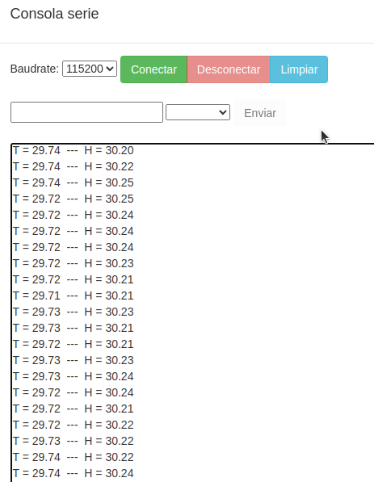
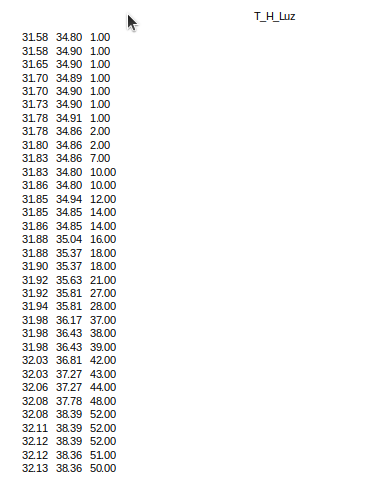

# A08-Tarjeta microSD
En esta actividad vamos a ver ejemplos de uso sencillo de los bloques para entender el manejo de los mismos.

## **A08_1-Registro y lectura básicos**
El programa de prueba que vamos a crear consta de dos partes: la primera consiste en grabar los datos de temperatura y humedad medidos con el sensor integrado cada 5 segundos. Dejaremos transcurrir un tiempo para que el archivo tenga varios datos. Ahora grabamos el segundo programa y veremos los resultados en la consola serie.

  
*[A08_1a-Grabar datos microSD](../program/actividadesAB/A08_1a-Grabar datos microSD.abp)*

Transcurrido un tiempo cargamos en la micro:STEAMakers el ejemplo siguiente, abrimos la consola serie y vemos los datos grabado en la microSD.

  
*[A08_1b-Leer datos microSD](../program/actividadesAB/A08_1a-Leer datos microSD.abp)*

En la consola veremos algo similar a lo siguiente:

  
*A08_1b-Resultado de leer datos microSD*

## **A08_2-Lectura de datos mejorada**
El programa anterior no nos muestra los datos medidos con el formato dato, pero es fácil cambiar esto haciendo simplemente el programa siguiente:

  
*[A08_2-Lectura de datos mejorada](../program/actividadesAB/A08_2-Lectura de datos mejorada.abp)*

En este caso el resultado obtenido es el siguiente:

  
*A08_2-Resultado de lectura de datos mejorada*

## **A08_3-Datos con formato CSV**
Vamos a añadir a los datos de temperatura y humedad de las actividades anteriores el dato de nivel de luz, pero dando a los datos el formato CSV. El ejemplo lo vemos a continuación:

  
*[A08_3-Datos con formato CSV](../program/actividadesAB/A08_3-Datos con formato CSV.abp)*

Cuando abrimos el archivo generado con una hoja de cálculo como Calc de [LibreOffice](https://es.libreoffice.org/) y nos aseguramos que el caracter delimitador es el correcto:

  
*A08_3-Importar datos con formato CSV*

Obtenemos un resultado como el siguiente:

  
*A08_3-Importar datos con formato CSV*

A partir de estos datos podemos darles formato, filtrarlos, crear gráficas, etc.
