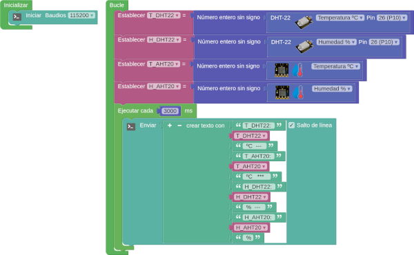
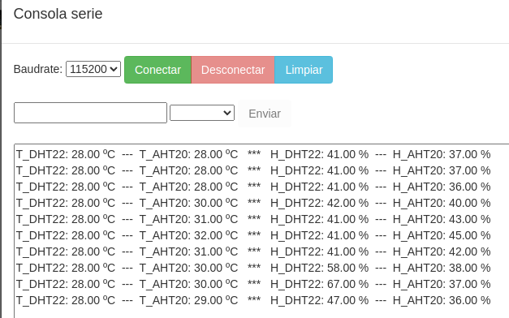
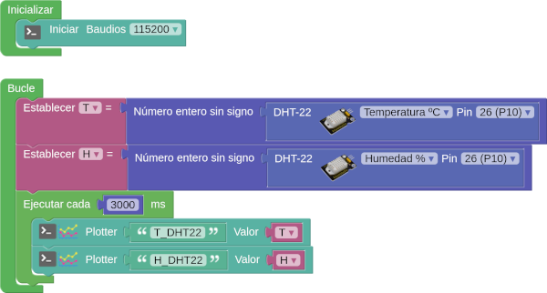
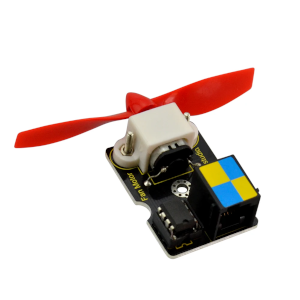
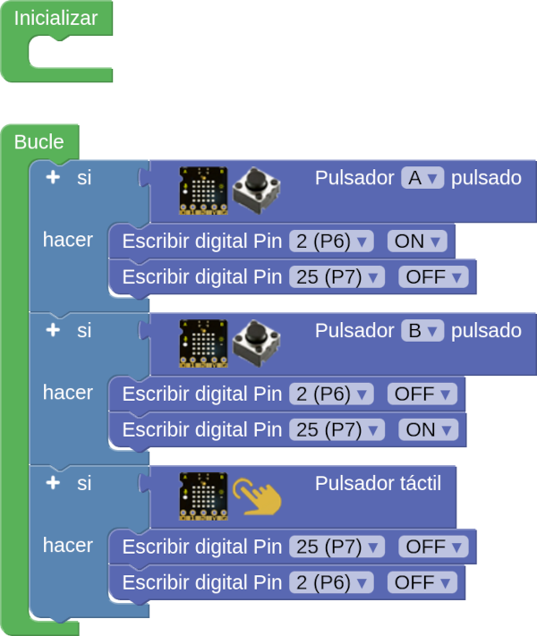
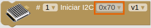
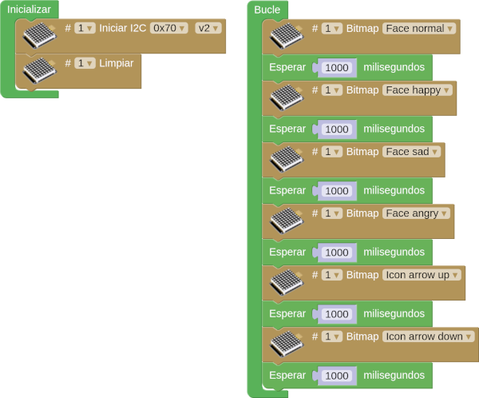
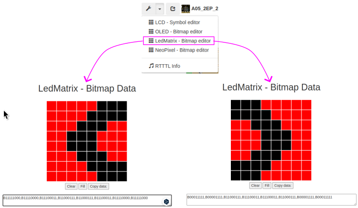
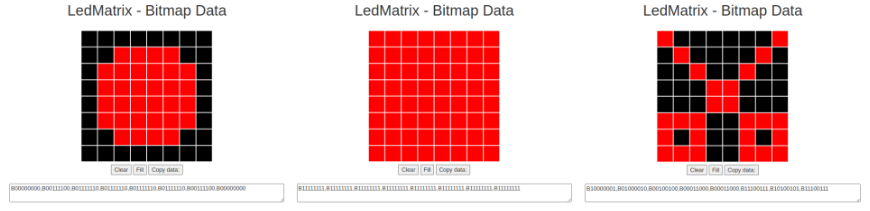

## **A01-LEDs y pantalla**
En esta primera actividad vamos a conectar dos diodos LEDs a los puertos P7 y P12 y haremos un programa que al pulsar el botón A muestre en la pantalla el texto "Boton A" desplazandose y mientras esto ocurre uno de los LED debe estar parpadeando. Cuando pulsemos el botón B aparecerá la letra B en scroll en la pantalla y se encenderá y apagará el otro LED de forma progresiva (control PWM).

!!! tip "Alimentación Shield"
	Recuerda que la Shield debe tener activada la alimentación externa para que funcione el sistema.

El programa es el siguiente:

  
*[A01-LEDs y pantalla](../program/actividadesAB/EP/A01EP-LEDs y pantalla.abp)*

## **A02-Mostrar datos del DHT22**
Vamos a ver varias actividades con formas diferentes de visualización de los datos obtenidos de un sensor DHT22 conectado al puerto P10.

!!! tip "Alimentación Shield"
	Recuerda que la Shield debe tener activada la alimentación externa para que funcione el sistema.

### **A02_1-Datos DHT22 por consola**
Envíar a la consola los valores de temperatura y humedad obtenidos del DHT22 cada 3 segundos. En la consola debe aparecer: T_DHT22: X ºC seguido de H_DHT22: X %. Para cumplimentar la práctica mediremos también los datos del sensor AHT20 de la micro:STEAMakers para compararlos. En la imagen siguiente vemos el programa:

  
*[A02_1-Mostrar datos del DHT22](../program/actividadesAB/EP/A02_1EP-Mostrar datos del DHT22.abp)*

En la imagen siguiente vemos algunos resultados:

  
*A02_1-Resultados de mostrar datos del DHT22*

### **A02_2-Datalogger DHT22**
Envíar al plotter los valores de temperatura y humedad obtenidos del DHT22 cada 3 segundos. En la imagen siguiente vemos el programa:

  
*[A02_2-Datalogger DHT22](../program/actividadesAB/EP/A02_2EP-Datalogger DHT22.abp)*

En la imagen siguiente vemos los resultados:

  
*A02_2-Resultados de Datalogger DHT22*

### **A02_3-Datos en OLED del DHT22**
Mostrar en una pantalla OLED I2C EASY Plug los valores de temperatura y humedad obtenidos del DHT22 actualizando el dato cada 5 segundos. En la imagen siguiente vemos el programa:

  
*[A02_3-Datos en OLED del DHT22](../program/actividadesAB/EP/A02_3EP-Datos en OLED del DHT22.abp)*

En la imagen siguiente vemos los resultados:

  
*A02_3-Resultados datos en OLED del DHT22*

## **A03-Servomotor**

!!! tip "Alimentación Shield"
	Recuerda que la Shield debe tener activada la alimentación externa para que funcione el sistema.

### **A03_1-Servo 0 a 180 grados**
El primer programa, una vez encontrado el origen del servo, va a consistir en hacerlo cambiar entre sus posiciones extremas a intervalos de un segundo. El programa es el siguiente:

  
*[A03_1-Servo 0 a 180 grados](../program/actividadesAB/EP/A03_1EP-Servo 0 a 180 grados.abp)*

### **A03_2-Barrera aparcamiento**
Actividad para mover el servo de su posición de reposo a otra de 90º, la primera corresponde a la barrera bajada por lo que el acceso está cerrado y el semáforo (pantalla) estará en rojo y la segunda equivale a barrera subida, el acceso estará abierto y el semáforo estará en verde. La posición de la barrera por defecto será bajada y el semáforo estará apagado. Cuando se pulsa A el semaforo estará rojo, la barrera bajada y estará en ese estado hasta que se accione el pulsador B que pone el semaforo en verde y sube la barrera. En posición de barrera subida debe permanecer 5 segundos y después bajar la barrera y apagarse hasta una nueva pulsación de A. El programa es el siguiente:

  
*[A03_2-Barrera aparcamiento](../program/actividadesAB/EP/A03_2EP-Barrera aparcamiento.abp)*

A continuación vemos el sistema funcionando:

  
*A03_2-Funcionamiento barrera aparcamiento*

### **A03_3-Barrera aparcamiento mejorada**
Mejora del programa de la actividad anterior añadiendo una pantalla OLED que muestra indicaciones a seguir para hacer funcionar la barrera. El programa es el siguiente:

  
*[A03_3-Barrera aparcamiento mejorada](../program/actividadesAB/EP/A03_3EP-Barrera aparcamiento mejorada.abp)*

A continuación vemos el sistema funcionando:

  
*A03_3-Funcionamiento barrera aparcamiento mejorada*

## **A04-Motor DC**

!!! tip "Alimentación Shield"
	Recuerda que la Shield debe tener activada la alimentación externa para que funcione el sistema.

Actividad en la que vamos a controlar un motor de corriente continua o DC como el de la imagen siguiente:

  
*Motor DC ventilador*

El módulo motor con ventilador utiliza el controlador L9110 para controlar la rotación de la hélice hacia izquierda y hacia derecha. Necesita por lo tanto dos pines para su control. Debe conectarse al puerto digital doble con una sola línea, bastante práctico.

La parte posterior del módulo presenta la serigrafía que vemos en la imagen siguiente:

  
*Cara posterior del módulo motor DC ventilador*

Tal y como se advierte en la nota de la conclusión 5 que podemos ver en [Pinout](http://127.0.0.1:8000/....https://fgcoca.github.io/ESP32-micro-STEAMakers/EasyPlug/EP1_1/#pinout), la serigrafia posterior del módulo es exactamente igual que la del puerto P6+P7. Esto quiere decir que el motor con ventilador lo podemos conectar a esa pareja de puertos mediante un solo cable para hacerlo funcionar.

Si buscamos en la entrada "Motor -->> DC motor" no encontraremos ningún bloque adecuado para hacer funcionar el módulo ventilador, por lo que inicialmente haremos la programación escribiendo directamente en los pines afectados.

El programa siguiente hace que el ventilador gire en un sentido, se para, gire en el otro sentido, se pare y asi sucesivamente.

  
*[A04-Motor DC](../program/actividadesAB/EP/A04EP-Motor DC.abp)*

La actividad la podemos hacer utilizando el bloque "Motor ventilador" que tenemos disponible en la entrada "Actuadores" sin mas que configurar los pines de manera adecuada. En la imagen vemos el programa realizado con el bloque:

  
*[A04-Motor DC con bloque "Motor ventilador"](../program/actividadesAB/EP/A04EP-Motor DC bloque Motor ventilador.abp)*

Una mejora rápida del programa sería ponerlo en marcha y paralo utilizando los botones. El programa sería ahora:

  
*[A04-Motor DC controlado por botones](../program/actividadesAB/EP/A04EP-Motor DC controlado por botones.abp)*

## **A05-Matriz de 8x8 LEDs**

!!! tip "Alimentación Shield"
	Recuerda que la Shield debe tener activada la alimentación externa para que funcione el sistema.

El objetivo es conocer la LEDMatrix 8x8 o también llamada matriz de LEDs. La matriz de LEDs es una pantalla pequeña que tiene 64 LEDs con el aspecto de la Figura siguiente y se conecta al puerto de comunicación I2C.

  
*Aspecto matriz 8x8*

En esta pantalla podemos programar diferentes símbolos o elementos, como: caras, iconos, letras... Hay opciones prediseñadas desde ArduinoBlocks y también, existe la opción de crearlos personalizados.

En el apartado de bloques de programación, se encuentra en "LedMatrix 8x8". Existen diferentes opciones de programación, según nuestro objetivo.

  
*Bloques programación matriz 8x8*

La primera tarea que debemos realizar cuando queremos hacer uso de la pantalla, es inicializarla. En la Figura siguiente vemos el primer bloque en el que pone: iniciar I2C.

  
*Bloques para inicializar matriz 8x8*

Se ha destacado la dirección física por defecto (0x70) porque esta es configurable a través de los microinterruptores de que dispone el módulo. Las posibilidades de configuración de la dirección las vemos en la tabla siguiente:

|| 1 | 2 | 3 |
|---|-:-|-:-|-:-|
|0x70| OFF (0) | OFF (0) | OFF (0) |
|0x71| ON (1) | OFF (0) | OFF (0) |
|0x72| OFF (0) | ON (1) | OFF (0) |
|0x73| ON (1) | ON (1) | OFF (0) |
|0x74| OFF (0) | OFF (0) | ON (1) |
|0x75| ON (1) | OFF (0) | ON (1) |
|0x76| OFF (0) | ON (1) | ON (1) |
|0x77| ON (1) | ON (1) | ON (1) |

### **A05_1-Caritas y flechas**
La pantalla LedMatrix muestra diferentes caras, una flecha hacia arriba y una flecha hacia abajo a intervalos de un segundo. El programa es el siguiente:

  
*[A05_1-Caritas y flechas](../program/actividadesAB/EP/A05_1EP-Caritas y flechas.abp)*

### **A05_2-Símbolos personalizados**
Cuando se pulse el pulsador, en la pantalla debe aparecer un símbolo personalizado durante dos segundos y después otro distinto. La actividad se puede resolver de dos formas. Para la primera de ellas el programa es el siguiente:

  
*[A05_2-Símbolos personalizados](../program/actividadesAB/EP/A05_2EP_1-Simbolos personalizados.abp)*

La segunda forma consiste en crear los śimbolos utilizando la herramienta LedMatrix - Bitmap editor y copiar el dato binario generado en el bloque correspondiente. En la imagen vemos la creación de los símbolos:

  
*rear símbolos personalizados*

Para esta segunda forma el programa es el siguiente:

  
*[A05_2-Símbolos personalizados](../program/actividadesAB/EP/A05_2EP_2-Simbolos personalizados.abp)*

### **A05_3EP-Piedra papel o tijera**
En esta tercera actividad recrearemos el famoso y conocido juego "Piedra, papel, tijera". También utilizaremos el pulsador para activar el juego y creamos una variable que elija aleatoriamente uno de los tres símbolos del juego. Cuando se pulse el pulsador, la pantalla muestra, de forma aleatoria, uno de los tres símbolos: piedra, papel o tijeras.

Lo primero que vamos a hacer es crear los tres símbolos: utilizando el "Bitmap". Para seleccionar los LEDs que queremos en estado ON:

  
*Piedra, papel, tijeras*

El programa es el siguiente:

  
*[A05_3-Piedra papel o tijera](../program/actividadesAB/EP/A05_3EP-Piedra papel o tijera.abp)*

## **A06-Neopixels Shield**

!!! tip "Alimentación Shield"
	Recuerda que la Shield debe tener activada la alimentación externa para que funcione el sistema.

En el momento de realizar este tutorial no existen bloques para trabajar con LEDs direccionables salvo los propios de la micro:STEAMakers y en estos no se puede configurar el pin P9 como puerto al que están conectados los LEDs.

Para solventar el problema vamos a crear un proyecto para ESP32 STEAMakers y vamos a poner en la mochila los tres bloques marcados en la imagen siguiente:

  
*Bloques neopixels de otra placa*

Si no sabes utilizar la mochila el corto [Uso mochila para pasar bloques entre proyectos de diferntes placas en Arduinoblocks. Uno a ESP32]() de [Ardutaller](https://www.ardutaller.com.es/principal) te explica claramente como hacerlo.

Una vez que tenemos los bloques necesarios creamos el programa siguiente:

  
*[A06-Neopixels Shield](../program/actividadesAB/EP/A06EP-Neopixels Shield.abp)*

El programa ilumina durante un segundo un numero aleatorio de LEDs en un color también aleatorio.

En la la imagen anterior se destacan los bloques traidos de un proyecto de otra placa.

A continuación vemos el programa funcionando:

  
*Funcionamiento A06-Neopixels Shield*

## **A07-Sensor de CO2**

!!! tip "Alimentación Shield"
	Recuerda que la Shield debe tener activada la alimentación externa para que funcione el sistema.

En esta actividad vamos a necesitar conectar dos dipsotivos al puerto I2C de la shield por lo que vamos a necesitar un expansor o hub. Un Hub sería como un "ladrón", que nos permite conectar varios dispositivos a la vez. Sería como el de la imagen siguiente:

  
*Hub I2C*

!!! note "Aviso"
	Se aconseja leer la entrada [Conceptos sobre CO2 y VOC](http://127.0.0.1:8000/....https://fgcoca.github.io/ESP32-micro-STEAMakers/CO2/) para poder entender correctamente el programa siguiente:

  
*[A07-Sensor de CO2](../program/actividadesAB/EP/A07EP-Sensor de CO2.abp)*

A continuación vemos el programa en un momento de su funcionamiento:

  
*Funcionamiento A07-Sensor de CO2*

## **A08-Particulas**

!!! tip "Alimentación Shield"
	Recuerda que la Shield debe tener activada la alimentación externa para que funcione el sistema.

Vamos a trabajar con un sensor que mide la materia particulada (PM) en el aire. Sensor imprescindible si estamos monitorizando la calidad del aire.

Su funcionamiento se fundamenta en la dispersión laser. Se utiliza un láser para irradiar las partículas en el aire haciendo que estas dispersen la luz. El sensor recoge la luz dispersa registrando su intensidad a lo largo del tiempo. Un procesador interno calcula el tamaño de particula equivalente y el número de partículas de diferentes tamaños. El mismo procesador convierte los datos en valores de concentración que transmite por interfaz I2C.

Destacar entre sus especificaciones:

* Respuesta en tiempo real y adquisición continua de datos.
* Tamaño mínimo reconocible de partículas de 0,3 µm.
* Voltaje de trabajo: 3,3 V ~ 5 V
* Corriente máxima de trabajo: 100 mA
* Corriente en espera: <= 2 mA
* Rango de medición de partículas: 0,3 ~ 1,0 µm; 1,0 ~ 2,5 µm; 2,5 ~ 10 µm
* Eficiencia de conteo de partículas: 50% @ 0,3 µm 98% @ >= 0,5 µm
* Resolución de concentración de masa de partículas: 1 µg/m³
* Volumen estándar: 0,1 L
* Rango de temperatura de trabajo: -10 ~ +60 ºC
* Rango de humedad de trabajo: 0 ~ 95% (sin condensación)

Su aspecto es el que vemos en la imagen siguiente:

  
*Sensor de partículas EASY Plug I2C*

### **A08_1-Concentración PM2.5 y PM10**
Medimos y mostramos la concentración de partículas de esos dos tamaños tomando la medida en ug/m3. El programa es el siguiente:

  
*[A08_1-Concentración PM2.5 y PM10](../program/actividadesAB/EP/A08_1EP-Concentracion PM2_5 y PM10.abp)*

A continuación vemos el programa en un momento de su funcionamiento:

  
*Funcionamiento A08_1-Concentración PM2.5 y PM10*

### **A08_2-Número de particulas**
Contamos el número de partículas de tamaño mayor o igual que 2.5 micrometros (um) por cada 0.1 L de aire (volumen de aire de la cámara de medida). El programa es el siguiente:

  
*[A08_2-Número de particulas](../program/actividadesAB/EP/A08_2EP-Numero de particulas.abp)*

## **A09-Sensor MiCS4114 (NO2 y CO)**

!!! tip "Alimentación Shield"
	Recuerda que la Shield debe tener activada la alimentación externa para que funcione el sistema.

La actividad que vamos a realizar consistirá en medir ambos parámetros y presentar los resultados, que en este caso se hará en la consola serie y en la pantalla OLED. El programa es el siguiente:

  
*[A09-Sensor MiCS4114](../program/actividadesAB/EP/A09EP-Sensor MiCS4114.abp)*

A continuación vemos una captura de la consola:

  
*Consola A09-Sensor MiCS4114*

