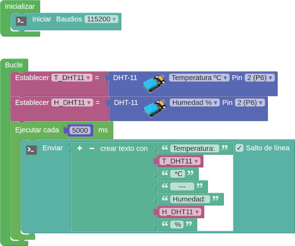
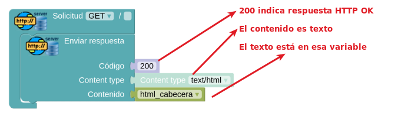
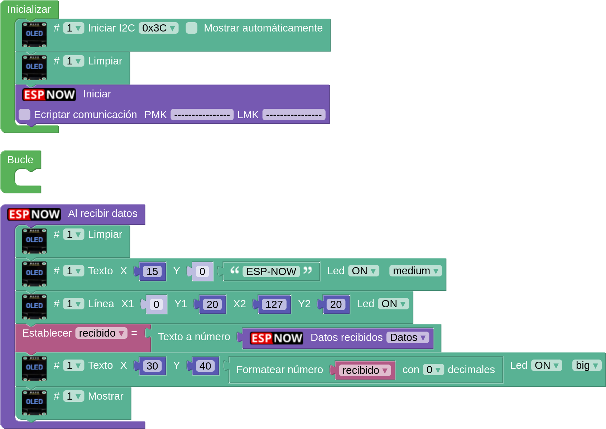
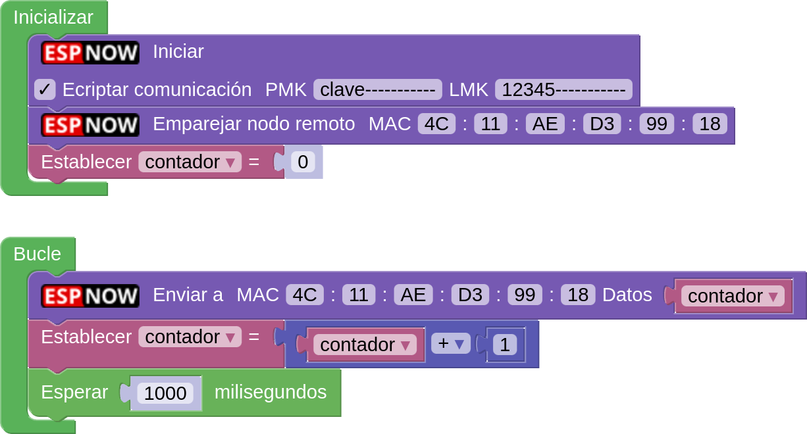
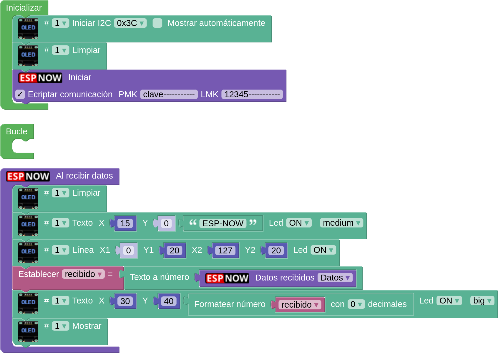
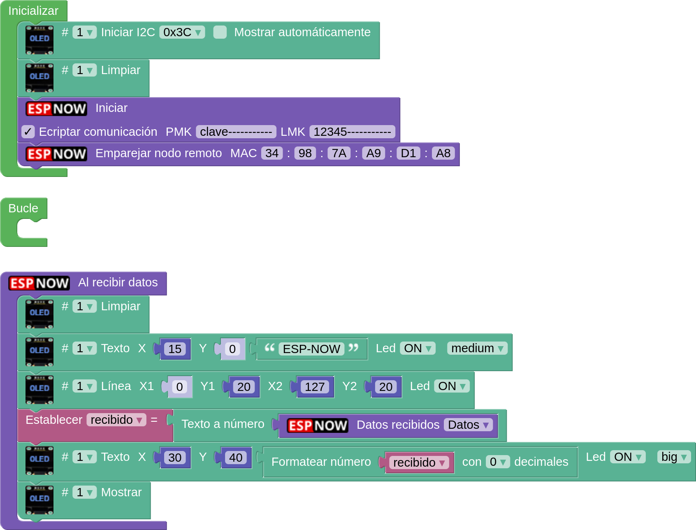
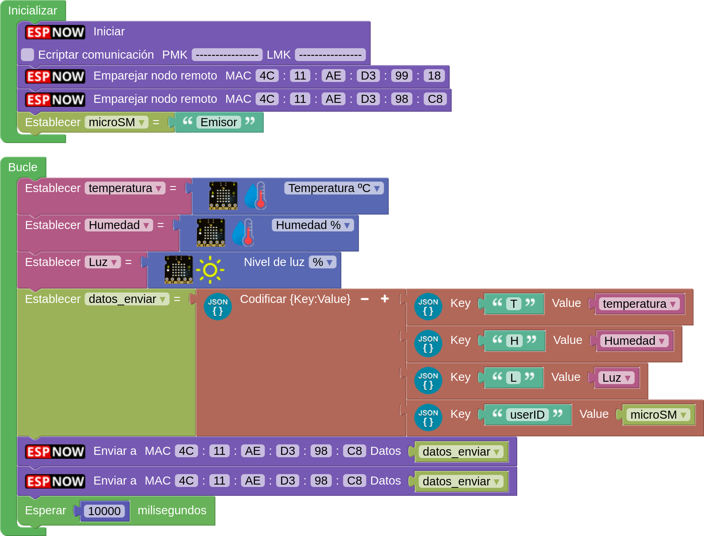
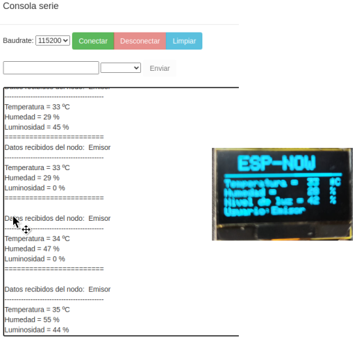
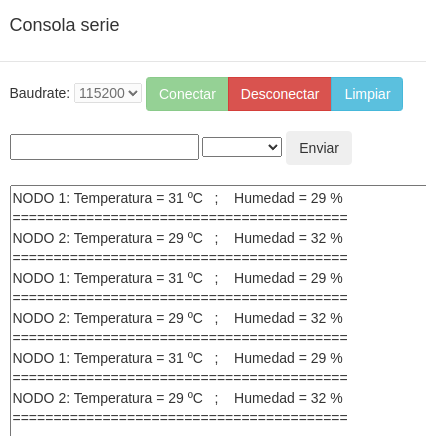
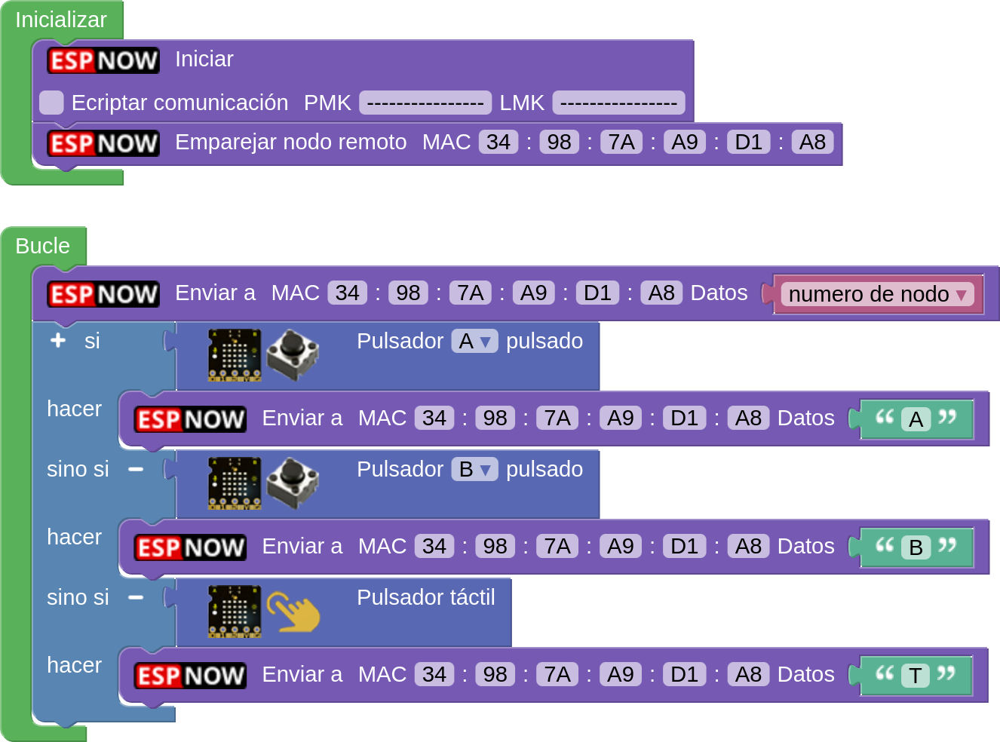

## **A01-Temperatura y Humedad con DHT11**

!!! tip "Alimentación Shield"
	**1**. Si no tenemos alimentación externa los jumpers deben estar en la posición 3.3V y los sensores y/o actuadores conectados tienen que poder trabajar a esa tensión.  
	**2**. Si tenemos alimentación externa uno los jumpers pueden estar en la posición 3.3V para los dispositivos de esta tensión y el otro en la de 5V para los sensores de esta otra tensión. Cada tipo conectado según la posición de los jumpers.

Inicialmente el objetivo es montar un sensor externo conectado a la shield para testar su funcionamiento, que lo haremos enviando los datos a la consola serie en una primera instancia.

!!! info "otros sensores y actuadores"
	Con la única limitación de los pines disponibles, podemos conectar a la shield muchos mas dispositivos y, si disponemos de los mismos, hacer las actividades desarrolladas para **EASY Plug**.

El programa es el siguiente:

  
*[A01-Temperatura_Humedad_DHT11](../program/actividadesAB/MOD/A01MOD-Temperatura_Humedad_DHT11.abp)*

## **A02-Temperatura y Humedad con DHT11 via web**

!!! tip "Alimentación Shield"
	**1**. Si no tenemos alimentación externa los jumpers deben estar en la posición 3.3V y los sensores y/o actuadores conectados tienen que poder trabajar a esa tensión.  
	**2**. Si tenemos alimentación externa uno los jumpers pueden estar en la posición 3.3V para los dispositivos de esta tensión y el otro en la de 5V para los sensores de esta otra tensión. Cada tipo conectado según la posición de los jumpers.

### **Actividad**
En esta ocasión lo que vamos a hacer es visualizar los datos de la actividad anterior en formato web. Vamos a ver primero el programa y su funcionamiento para despues ir describiendo los pasos de programación para mejor entendimiento de la actividad. El programa es:

  
*[A02-Temperatura y Humedad con DHT11 via web](../program/actividadesAB/MOD/A02MOD-TyH con DHT11 via web.abp)*

Lo que va a ocurrir es que, cuando carguemos en nuestro navegador la dirección IP de nuestro servidor web se va a mostrar una pantalla como la siguiente. Lógicamente antes nos hemos conectado a la red con SSID micro:STEAMakers.

  
*Punto de acceso WiFi*

A continuación vemos lo que ocurre tanto en el navegador como en la micro:STEAMakers:

  
*Interaccionando desde punto de acceso WiFi*

Vemos como al pulsar sobre el enlace o los botones la petición se refleja en la placa.

### **Explicación del programa**
Ahora vamos a ver el programa por partes omitiendo lo referente a la pantalla RGB que ya se ha tratado en otras actividades.

#### **Creación del punto de acceso WiFi**
Creamos nuestra propia red WiFi (punto de acceso) en la placa micro:STEAMakers donde nos podemos conectar con dispositivos como ordenador, tablet o móviles.

  
*Creación del punto de acceso WiFi*

Una vez creado el punto de acceso iniciamos el servidor en el puerto 80. Este puerto es el utilizado por el protocolo HTPP para transferencia de hipertexto y es el que se utiliza para acceder a todas las páginas web.

Hay que tener en cuenta que este punto de acceso nos permite conectarnos con la placa, pero no tendrá conexión a internet.

#### **Documento HTML**
Todo documento HTML tiene como mínimo dos partes, el **head** y el **body**. En el head debe estar la información descriptiva del sitio, como título, matadatos y estilos, mientras que en el body estará toda la información visible de la web. Para facilitar el trabajo en la actividad el documento HTML lo vamos a guardar en una variable de texto que hemos nombrado "html_cabecera". De esta forma podremos invocar todo el documento llamando a esta variable.

  
*Documento HTML*  
Imagen intencionadamente recortada por la derecha

La parte Head viene definida con el bloque HTML Document y lo único que hemos tocado ha sido el título y el color de fondo.

  
*Documento HTML - Head*  
Imagen intencionadamente recortada por la derecha

Para el Body creamos un texto con las partes que vemos en la imagen siguiente. Aquí hemos dado algún formato a los distintos elemento con el fin de destacarlos unos de otros. Sin entrar en detalles que podemos consultar buscando información sobre html, hemos establecido tipos de fuente, tamaño y color de la misma, nivel de indice, formatos como subrayado y negrita, dibujo de líneas horizontales, saltos de línea y lógicamente enlaces de texto y tipo botón donde se ha establecido el texto y la URL del enlace.

  
*Documento HTML - Body*  
Imagen intencionadamente recortada por la izquierda

Ahora debemos crear los bloques para atender las peticiones "get" y que en la web y la micro:STEAMakers se reflejen las interacciones. Pero antes se aconseja consultar el apartado [Peticiones HTTP](http://127.0.0.1:8000/....https://fgcoca.github.io/ESP32-micro-STEAMakers/program/server/#peticiones-http).

#### **Solicitud get /**
Con la acción "/" para indicar que no hay ninguna petición. La respuesta que vamos a enviar es que se establezca como contenido el de la variable definida "html_cabecera", es decir, que aparezcan los textos y botones definidos en el bloque "Inicializar".

  
*Solicitud get /*  

#### **Solicitud get/pant_ON**
Cuando se hace clic en el botón "Encender pantalla" (cuando se invoca esta petición) la pantalla se va a iluminar en un color aleatorio y como respuesta se envía la misma que en el caso anterior. De esta forma cada vez que hagamos clic en el botón cambiará el color y la pantalla en el navegador permacerá inalterable.

  
*Solicitud get/pant_ON*  

#### **Solicitud get/pant_OFF**
Cuando se hace clic en el botón "Apagar pantalla" (cuando se invoca esta petición) la pantalla se va a iluminar en color negro y como respuesta se envía la misma que en el caso anterior.

  
*Solicitud get/pant_OFF*  

#### **Solicitud get/Leer_DHT11**
Esta solicitud se hace desde una enlace de texto y en la misma se leen los valores del sensor, se envia a la pantalla el texto "DHT11" en color rojo (se espera mientras se realiza el scroll) y para enviar la respuesta a la petición se configura el "Contenido" de la misma como un documento HTML con su Head y su Body. En el Body se crea un texto con todo lo que contiene la varible que estamos utilizando, se agregan línea horizontal y salto de línea y los texto y valores de los datos que pretendemos visualizar.

  
*Solicitud get/Leer_DHT11*  

## **A03-Temperatura y Humedad con Telegram**

!!! tip "Alimentación Shield"
    **1**. Si no tenemos alimentación externa los jumpers deben estar en la posición 3.3V y los sensores y/o actuadores conectados tienen que poder trabajar a esa tensión.  
    **2**. Si tenemos alimentación externa uno los jumpers pueden estar en la posición 3.3V para los dispositivos de esta tensión y el otro en la de 5V para los sensores de esta otra tensión. Cada tipo conectado según la posición de los jumpers.

Actividad en la que vamos a mostrar mismos datos de la actividad [A02-Temperatura y Humedad con DHT11 via web](./A02MOD.md) mas los del sensor incorporado en la micro:STEAMakers tanto por el puerto serie como a través de un bot de Telegram. Los datos se obtienen cuando son demandados.

Ponemos el programa en dos partes para que la imagen se visualice mejor. La primera será de inicializaciones y trabajo con el puerto serie y la segunda para el evento de Telegram.

  

  

*[A03-Temperatura y Humedad con Telegram](../program/actividadesAB/MOD/A03MOD-TyH_Telegram.abp)*

En la imagen siguiente vemos el resultado que se obtiene por la consola de arduinoblocks con aclaraciones de como realizar las consultas.

  
*A03-Temperatura y Humedad con Telegram*

Esta otra imagen nos muestra los resultados en el bot creado para esta actividad.

  
*A03-Temperatura y Humedad con Telegram*

## **A04-Temperatura y Humedad con Thingspeak**

!!! tip "Alimentación Shield"
    **1**. Si no tenemos alimentación externa los jumpers deben estar en la posición 3.3V y los sensores y/o actuadores conectados tienen que poder trabajar a esa tensión.  
    **2**. Si tenemos alimentación externa uno los jumpers pueden estar en la posición 3.3V para los dispositivos de esta tensión y el otro en la de 5V para los sensores de esta otra tensión. Cada tipo conectado según la posición de los jumpers.

Actividad en la que vamos a mostrar mismos datos de la actividad [A03-Temperatura y Humedad con Telegram](./A03MOD.md) esta vez en el broker de Thingspeak.

El programa es el siguiente

  
*[A04-Temperatura y Humedad con Thingspeak](../program/actividadesAB/MOD/A04MOD-TyH_Thinspeak.abp)*

En la imagen siguiente vemos el resultado que se obtiene en el broker transcurrido un tiempo:

  
*A04-Temperatura y Humedad con Thingspeak*

## **A05-ESP-NOW**
Se realizan varias actividades comunicando placas micro:STEAMakers entre si por ESP_NOW.

Las direcciones MAC van a ser:

* Nodo 1: 4C:11:AE:D3:99:18
* Nodo 2: 34:98:7A:A9:D1:A8
* Nodo 3: 4C:11:AE:D3:98:C8

### **A05_1-Unidireccional 1 a 1**
Se trata de implementar la comunicación mas simple posible, un emisor y un receptor. Hacemos un contador de segundos en la placa emisora que serán mostrados en una pantalla OLED en la placa receptora.

Los nodos van a actuar de la siguiente forma:

* Emisor: Nodo 2
* Receptor: Nodo 1

El programa emisor es:

  
*[A05_1-Unidireccional 1 a 1](../program/actividadesAB/MOD/A05_1_ESPNOW_Emisor.abp)*

El programa receptor es:

  
*[A05_1-Unidireccional 1 a 1](../program/actividadesAB/MOD/A05_1_ESPNOW_Receptor.abp)*

En la imagen siguiente vemos el resultado de la comunicación:

  
*Funcionamiento A05_1-Unidireccional 1 a 1*

### **A05_2-Unidireccional encriptada 1 a 1**
Es el mismo ejemplo que en la actividad anterior, pero podemos comprobar que simplemente con activar la encriptación, poner las claves y dejando los programas tal cual están el sistema no funciona. Los programas siguientes no dan resultado alguno:

* Programa emisor:

  
*[A05_1-Unidireccional encriptada 1 a 1](../program/actividadesAB/MOD/A05_2_ESPNOW_Emisor.abp)*

* Programa receptor:

  
*[A05_2-Unidireccional encriptada 1 a 1](../program/actividadesAB/MOD/A05_2_ESPNOW_Receptor.abp)*

Una vez subidos los programas comprobamos como el contador del receptor (OLED) no cambia y siempre se mantiene en el mismo estado. Es evidente que si el receptor recibe datos encriptados, por el mismo protocolo de seguridad, debe saber quien se los envía por lo que la solución es bien simple, hay que emparejar ambos nodos. 

!!! warning "IMPORTANTE"
    Si encriptamos la información, aunque el envío sea en una dirección debemos emparejar también al nodo emisor con el receptor.

Los programas funcionales los vemos a continuación:

El programa emisor es:

  
*[A05_2-Unidireccional encriptada 1 a 1](../program/actividadesAB/MOD/A05_1_ESPNOW_EmisorOK.abp)*

El programa receptor es:

  
*[A05_2-Unidireccional encriptada 1 a 1](../program/actividadesAB/MOD/A05_1_ESPNOW_ReceptorOK.abp)*

El funcionamiento es idéntico al de la actividad A05_1.

### **A05_3-Unidireccional 1 a 2 + JSON**
En esta actividad seguimos con la comunicación unidireccional de datos, pero los enviaremos desde un emisor a dos receptores, enviaremos mas de un datos y les daremos para ello formato JSON (JavaScript Object Notation). En mi caso concreto en un nodo voy a mostrar los datos recibidos en una OLED y en el otro en la consola serie. El programa permite utilizar uno u otro sin cambiar nada, es decir cargamos el mismo programa a todos los nodos receptores.

La codificación JSON encapsula los datos en forma de clave-valor (key-value) de una forma sencilla de tratar en arduinoblocks. Si quieres aprender mas sobre JSON en arduinoblocks aquí tienes el enlace al tema [Análisis básico de datos en formato JSON](https://drive.google.com/file/d/1r290vEJVVZtt8yp4PELnxgTEFWqUUBZk/view).

El programa emisor es el siguiente:

  
*[A05_3-Unidireccional 1 a 2 + JSON](../program/actividadesAB/MOD/A05_3_ESPNOW_Emisor.abp)*

El programa receptor es el siguiente:

  
*[A05_3-Unidireccional 1 a 2 + JSON](../program/actividadesAB/MOD/A05_3_ESPNOW_Receptor.abp)*

A continuación vemos los resultados en uno y otro modo:

  
*A05_3-Unidireccional 1 a 2 + JSON*

### **A05_4-Unidireccional 2 a 1 + JSON**
En esta actividad construimos un datalogger con dos nodos distribuidos que envian periodicamente información a un nodo receptor que registra los datos recibidos en formato CSV (Comma Separated Values) que posteriormente podremos leer y visualizar en una hoja de cálculo. Para saber mas consultar [Tarjeta microSD](http://127.0.0.1:8000/....https://fgcoca.github.io/ESP32-micro-STEAMakers/program/inicio/#tarjeta-microsd) y la actividad [A08-Tarjeta microSD](http://127.0.0.1:8000/....https://fgcoca.github.io/ESP32-micro-STEAMakers/actividadesAB/A08/).

El programa para los emisores es el siguiente:

!!! info inline end "Nota"
    Debemos recordar asignar un número de nodo diferente a cada emisor o no podremos saber de donde viene el dato.

  
*[A05_4-Unidireccional 2 a 1 + JSON](../program/actividadesAB/MOD/A05_4_ESPNOW_Emisores.abp)*

El programa receptor es:

  
*[A05_4-Unidireccional 2 a 1 + JSON](../program/actividadesAB/MOD/A05_4_ESPNOW_Receptor.abp)*

El resultado que muestra la consola es:

  
*Consola A05_4-Unidireccional 2 a 1 + JSON*

Si extraemos la tarjeta microSD de su zócalo y abrimos el archivo en una hoja de cálculo podremos ver los mismos datos que en la consola.

### **A05_5-Latidos**
En esta actividad haremos que cuando en un nodo emisor pulsamos A o B se muestre en pantalla una A o una B y cuando tocamos el botón táctil que se vea un corazón latiendo.

El programa para emisor es el siguiente:

  
*[A05_5-Latidos](../program/actividadesAB/MOD/A05_5_ESPNOW_Emisor.abp)*

El programa receptor es:

  
*[A05_5-Latidos](../program/actividadesAB/MOD/A05_5_ESPNOW_Receptor.abp)*

