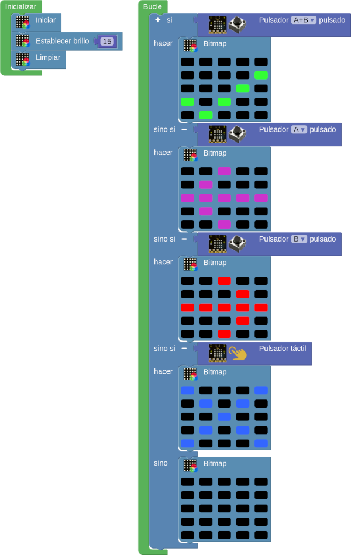
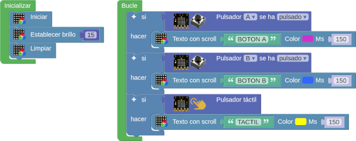

## **A01-Hola Mundo**
En esta actividad haremos que al inicio se muestre durante 3 segundo una carita triste que cambiará, tambien a los 3 segundo, a carita alegre para pasar a ver de forma permanente un corazón latiendo a razón de una pulsación cada segundo.

En la imagen siguiente tenemos el programa.

  
*[A01-Hola Mundo](../program/actividadesAB/A01. Hola Mundo.abp)*

A continuación vemos una animación de la actividad:

  
*A01-Hola Mundo funcionando*

## **A02-Medio relleno**
Se trata de hacer un programa que con el bloque línea nos cree un patrón de relleno del color que deseemos en el triángulo formado desde la diagonal (0,0) a (4,4) hacia la derecha.

En la imagen siguiente tenemos el programa.

  
*[A02-Medio relleno](../program/actividadesAB/A02-Medio relleno.abp)*

A continuación vemos una animación de la actividad:

  
*A02-Medio relleno funcionando*

## **A03-Pixel de color aleatorio**
Se trata de hacer un programa que muestre iluminado un pixel aleatorio de un color también aleatorio.

En la imagen siguiente tenemos el programa.

  
*[A03-Pixel de color aleatorio](../program/actividadesAB/A03-Pixeles_color_aleatorio.abp)*

A continuación vemos una animación de la actividad:

  
*A03-Pixel de color aleatorio funcionando*

## **A04-Botones**
Los ejemplos vistos hasta ahora han permitido que la micro:STEAMakers nos muestre algo. Esto es lo que se conoce como salida. Ahora bien, es evidente que necesitamos también que la micro:STEAMakers reaccione a cosas externas, y estas cosas se denominan entradas. Para que sea fácil de recordar:

* **Salida** es lo que micro:bit nos muestra
* **Entrada** es lo que recibe la micro:bit para procesarlo

Aunque existen otros sistemas, por ahora nos vamos a centrar en los botones de la micro:STEAMakers, recordando que disponemos además de un tercer botón, en este caso tactil, que está marcado en la placa. En la imagen vemos estos botones.

  
*Botones en la micro:STEAMakers*

### **A04_1-Mostrar el botón pulsado**
Se trata de mostrar en la pantalla el botón que estamos pulsando mientras lo mantengamos accionado. El programa es el siguiente:

  
*[A04_1-Mostrar el botón pulsado](../program/actividadesAB/A04_1-Mostrar el botón pulsado.abp)*

A continuación vemos una animación de la actividad:

  
*A04_1-Mostrar el botón pulsado funcionando*

### **A04_2-Check y flechas**
Crear un programa que se esté ejecutando en un bucle infinito y que responda, según pulsemos los botones, de la forma siguiente:

* Si pulsamos simultaneamente A y B en la pantalla aparecerá el característico símbolo de check en color verde.
* Si pulsamos el botón A mostrará una flecha apuntando a la izquierda en color magenta.
* Si pulsamos el botón B mostrará una flecha apuntando a la derecha en color rojo.
* Si pulsamos el botón táctil en la pantalla veremos un aspa de color azul.
* Si no pulsamos nada dejaremos la pantalla estará en negro.

El programa es el siguiente:

  
*[A04_2-Check y flechas](../program/actividadesAB/A04_2-Check y flechas.abp)*

A continuación vemos una animación de la actividad:

  
*A04_2-Check y flechas funcionando*

### **A04_3-Botones como texto**
Crear un programa que se esté ejecutando en un bucle infinito y que responda, según pulsemos los botones, de la forma siguiente:

* Si pulsamos el botón A mostrará 'BOTON A' en color magenta.
* Si pulsamos el botón B mostrará 'BOTON B' en color AZUL.
* Si pulsamos el botón táctil en la pantalla veremos 'TACTIL' en color amarillo.
* Si no pulsamos nada dejaremos la pantalla estará en negro.

El programa es el siguiente:

  
*[A04_3-Botones como texto](../program/actividadesAB/A04_3-Botones como texto.abp)*

A continuación vemos una animación de la actividad:

  
*A04_3-Botones como texto funcionando*

!!! Nota "NO interrupción ejecución durante scroll"
	Al final observamos como el scroll no interrumpe la ejecución y podemos activar cualquier botón en el momento que necesitemos.

### **A04_4-Botones y rellenos**
Crear un programa que se esté ejecutando en un bucle infinito y que responda, según pulsemos los botones, de la forma siguiente:

* Si pulsamos el botón A mostrará un cuadrado relleno de 3x3 pixeles en color magenta.
* Si pulsamos el botón B mostrará un rellenos completo en colores aleatorios.
* Si pulsamos el botón táctil la pantalla estará apagada.

El programa es el siguiente:

  
*[A04_4-Botones y rellenos](../program/actividadesAB/A04_4-Botones y rellenos.abp)*

A continuación vemos una animación de la actividad:

  
*A04_4-Botones y rellenos*

!!! Nota "Botón táctil en pines de expansión"
	Podemos observar como el sensor táctil se encuentra justo en el pin que hay a la derecha del 0 en los pines de borde de placa.

## **A05-Sensores integrados**
En esta actividad vamos a ver ejemplos de uso sencillo de los sensores que incorpora la ESP32 micro:STEAMakers programando su comportamiento con arduinoblocks.

Los veremos en el orden en que están los bloques y utilizaremos el puerto serie para mostrar los datos obtenidos de los mismos. En algunos ejemplos iremos mezclando elementos para su creación.

### **A05_1-Nivel de luz como datos**
El programa de prueba que vamos a crear consiste en mostrar en el monitor serie los datos de nivel de luz recibidos en sus dos formatos posibles, porcentaje y numérico. El programa es el siguiente:

  
*[A05_1-Nivel de luz como datos](../program/actividadesAB/A05_1-Nivel de luz como datos.abp)*

En la imagen siguiente vemos el resultado obtenido a partir de una fuente de luz a la que se acerca el sensor y se va alejando y/o tapando parcial o totalmente para variar la cantidad de luz que incide en el mismo.

  
*Resultados A05_1-Nivel de luz como datos*

### **A05_2-Nivel de luz grafico**
Crear un datalogger con el nivel de luz. El programa es el siguiente:

  
*[A05_2-Nivel de luz grafico](../program/actividadesAB/A05_2-Nivel de luz grafico.abp)*

En la imagen siguiente vemos el resultado obtenido a partir de una fuente de luz a la que se acerca el sensor y se va alejando y/o tapando parcial o totalmente para variar la cantidad de luz que incide en el mismo.

  
*Resultados A05_2-Nivel de luz grafico*

### **A05_3-Temperatura y humedad**
La actividad consistirá en enviar los dos datos de manera ordenada, con indicación de la unidad de medida, a la consola serie al tiempo que se muestran en la pantalla dos iconos, uno para frio y otro para calor (dentro de las posibilidades de dibujo que tenemos) en función de si se supera o no un determinado valor de temperatura.

  
*[A05_3-Temperatura y humedad](../program/actividadesAB/A05_3-Temperatura y humedad.abp)*

A continuación vemos el funcionamiento del programa. Cuando se pone el dedo por detrás de la placa en realidad se pone en contacto con el sensor para variar aunque sea minimamente su temperatura y que supere el umbral establecido. Cuando se retira el dedo se observa como la temperatura vuelve a su valor ambiente.

  
*A05_3-Temperatura y humedad funcionando*

En la imagen siguiente podemos observar los datos en la consola serie y como se producen los cambios de temperatura. También observamos los cambios en la humedad.

  
*Resultados A05_3-Temperatura y humedad*

### **A05_4-Nivel de sonido**
El programa que vamos a crear para la actividad consiste en mostrar en el monitor serie los datos de nivel de sonido recibidos en sus dos formatos posibles, porcentaje y numérico. El programa es el siguiente:

  
*[A05_4-Nivel de sonido](../program/actividadesAB/A05_4-Nivel de sonido.abp)*

En la imagen siguiente vemos el resultado obtenido creando variaciones de sonido en base a una reproducción musical {Oscar D'Leon - LLoraras} acercando y alejando la tarjeta del altavoz.

  
*Resultados A05_4-Nivel de sonido*

### **A05_5-Datalogger con todos**
Esta actividad consiste simplemente en reproducir el ejemplo que Juanjo desarrolla en el video [micro:STEAMakers 03 - Sensores integrados](https://www.youtube.com/watch?v=AJ6wFrjaN3k&list=PL1pKD-Bz2QBApBvH9_3hjr5Q6sORXN11h&index=3).

El programa es el siguiente:

  
*[A05_5-Datalogger con todos](../program/actividadesAB/A05_5-Datalogger con todos.abp)*

A continuación vemos el funcionamiento:

  
*A05_5-Datalogger con todos funcionando*

## **A05_6-Consumo**
Utilizaremos el plotter serie para observar los cambios que se producen en la corriente de consumo cuando activamos y desactivamos la pantalla a diferentes niveles de brillo.

El programa es el siguiente:

  
*[A05_6-Consumo](../program/actividadesAB/A05_6-Consumo.abp)*

A continuación vemos el funcionamiento:

  
*A05_6-Consumo funcionando*

En la gráfica podemos observar dos momentos diferentes:

1. El momento de la conexión del plotter y las partes planas de la gráfica se produce un diente de sierra de unos 10 microamperios de pico a pico. Esto se debe a las variaciones de consumo en reposo de la placa.
2. Los cambios entre unos 6mA a unos 30mA en el primer escalon debido a la pulsación del botón B. Un segundo escalón has unos 50mA debido a la pulsación del botón A. La vuelta a 6mA se produce al tocar el botón táctil.

## **A06-Actuadores integrados**
En esta actividad vamos a ver ejemplos de uso sencillo de los bloques para el control del zumbador.

### **A06_1-Escala musical**
El programa de prueba que vamos a crear consiste en crear la escala musical y hacer que suene cuando activamos el pulsador táctil. El programa es el siguiente:

  
*[A06_1-Escala musical](../program/actividadesAB/A06_1-Escala musical.abp)*

### **A06_2-Melodia**
Reproducir la melodía de la imagen siguiente sabiendo que las negras tienen una duración de 500ms, las negras con un puntito 750ms y las blancas 1000ms.

  
*A06_2-Melodia: Himno a la alegria*

El programa es el siguiente:

  
*[A06_2-Melodia](../program/actividadesAB/A06_2-Melodia.abp)*

### **A06_3-RTTTL**
La actividad consistirá en reproducir diferentes melodías a partir de los bloques RTTTL (Ring Tone Text Transfer Language o lenguaje de tonos de llamada) en función del botón que pulsemos.

  
*[A06_3-RTTTL](../program/actividadesAB/A06_3-RTTTL.abp)*

## **A07-Acelerómetro y giroscopio**
En esta actividad vamos a ver ejemplos de uso sencillo del bloque para el control de la posición de la placa.

### **A07_1-Acelerómetro**
El programa de prueba que vamos a crear consiste simplemente en asignar la acelaración en cada eje al plotter para visualizar los movimientos.

!!! warning "Reasignar ejes"
	Tendremos en cuenta lo indicado en la [explicación](http://127.0.0.1:8000/....https://fgcoca.github.io/ESP32-micro-STEAMakers/giroscopio/) acerca de los ejes X e Y.

  
*[A07_1-Acelerómetro](../program/actividadesAB/A07_1-Acelerometro.abp)*

En la animación vemos el funcionamiento del programa.

  
*A07_1-Acelerómetro funcionando*

### **A07_2-Giroscopio**
El programa de prueba que vamos a crear consiste simplemente en asignar el giro en cada eje al plotter para visualizar los movimientos.

!!! warning "Reasignar ejes"
	Tendremos en cuenta lo indicado en la [explicación](http://127.0.0.1:8000/....https://fgcoca.github.io/ESP32-micro-STEAMakers/giroscopio/) acerca de los ejes X e Y.

  
*[A07_2-Giroscopio](../program/actividadesAB/A07_2-Giroscopio.abp)*

En la animación vemos el funcionamiento del programa.

  
*A07_2-Giroscopio funcionando*

## **A08-Tarjeta microSD**
En esta actividad vamos a ver ejemplos de uso sencillo de los bloques para entender el manejo de los mismos.

### **A08_1-Registro y lectura básicos**
El programa de prueba que vamos a crear consta de dos partes: la primera consiste en grabar los datos de temperatura y humedad medidos con el sensor integrado cada 5 segundos. Dejaremos transcurrir un tiempo para que el archivo tenga varios datos. Ahora grabamos el segundo programa y veremos los resultados en la consola serie.

  
*[A08_1a-Grabar datos microSD](../program/actividadesAB/A08_1a-Grabar datos microSD.abp)*

Transcurrido un tiempo cargamos en la micro:STEAMakers el ejemplo siguiente, abrimos la consola serie y vemos los datos grabado en la microSD.

  
*[A08_1b-Leer datos microSD](../program/actividadesAB/A08_1a-Leer datos microSD.abp)*

En la consola veremos algo similar a lo siguiente:

  
*A08_1b-Resultado de leer datos microSD*

### **A08_2-Lectura de datos mejorada**
El programa anterior no nos muestra los datos medidos con el formato dato, pero es fácil cambiar esto haciendo simplemente el programa siguiente:

  
*[A08_2-Lectura de datos mejorada](../program/actividadesAB/A08_2-Lectura de datos mejorada.abp)*

En este caso el resultado obtenido es el siguiente:

  
*A08_2-Resultado de lectura de datos mejorada*

### **A08_3-Datos con formato CSV**
Vamos a añadir a los datos de temperatura y humedad de las actividades anteriores el dato de nivel de luz, pero dando a los datos el formato CSV. El ejemplo lo vemos a continuación:

  
*[A08_3-Datos con formato CSV](../program/actividadesAB/A08_3-Datos con formato CSV.abp)*

Cuando abrimos el archivo generado con una hoja de cálculo como Calc de [LibreOffice](https://es.libreoffice.org/) y nos aseguramos que el caracter delimitador es el correcto:

  
*A08_3-Importar datos con formato CSV*

Obtenemos un resultado como el siguiente:

  
*A08_3-Importar datos con formato CSV*

A partir de estos datos podemos darles formato, filtrarlos, crear gráficas, etc.
