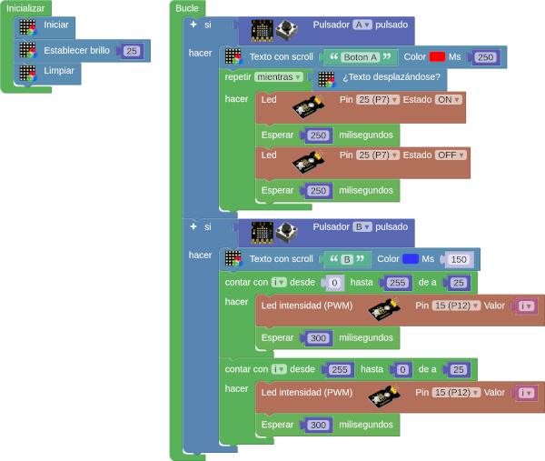

# A01-LEDs y pantalla
En esta primera actividad vamos a conectar dos diodos LEDs a los puertos P7 y P12 y haremos un programa que al pulsar el botón A muestre en la pantalla el texto "Boton A" desplazandose y mientras esto ocurre uno de los LED debe estar parpadeando. Cuando pulsemos el botón B aparecerá la letra B en scroll en la pantalla y se encenderá y apagará el otro LED de forma progresiva (control PWM).

!!! tip "Alimentación Shield"
	Recuerda que la Shield debe tener activada la alimentación externa para que funcione el sistema.

El programa es el siguiente:

  
*[A01-LEDs y pantalla](../program/actividadesAB/EP/A01EP-LEDs y pantalla.abp)*

