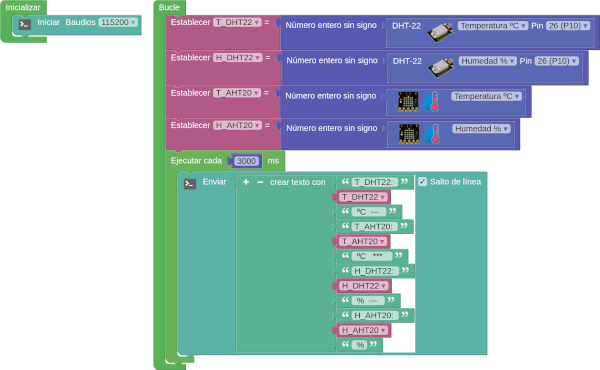
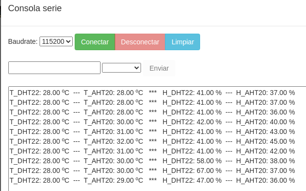
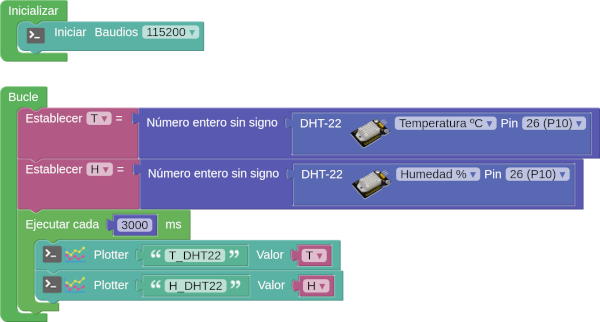
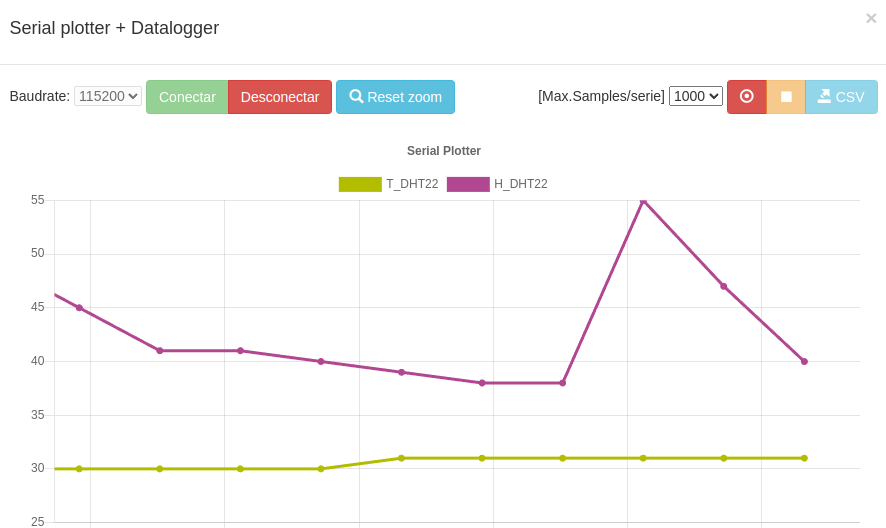
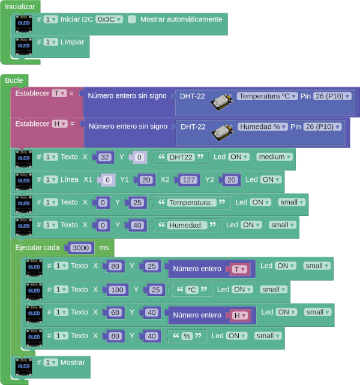
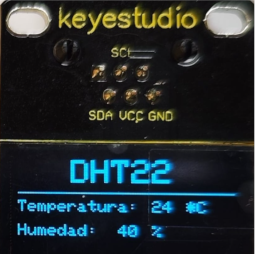

# A02-Mostrar datos del DHT22
Vamos a ver varias actividades con formas diferentes de visualización de los datos obtenidos de un sensor DHT22 conectado al puerto P10.

!!! tip "Alimentación Shield"
	Recuerda que la Shield debe tener activada la alimentación externa para que funcione el sistema.

## **A02_1-Datos DHT22 por consola**
Envíar a la consola los valores de temperatura y humedad obtenidos del DHT22 cada 3 segundos. En la consola debe aparecer: T_DHT22: X ºC seguido de H_DHT22: X %. Para cumplimentar la práctica mediremos también los datos del sensor AHT20 de la micro:STEAMakers para compararlos. En la imagen siguiente vemos el programa:

  
*[A02_1-Mostrar datos del DHT22](../program/actividadesAB/EP/A02_1EP-Mostrar datos del DHT22.abp)*

En la imagen siguiente vemos algunos resultados:

  
*A02_1-Resultados de mostrar datos del DHT22*

## **A02_2-Datalogger DHT22**
Envíar al plotter los valores de temperatura y humedad obtenidos del DHT22 cada 3 segundos. En la imagen siguiente vemos el programa:

  
*[A02_2-Datalogger DHT22](../program/actividadesAB/EP/A02_2EP-Datalogger DHT22.abp)*

En la imagen siguiente vemos los resultados:

  
*A02_2-Resultados de Datalogger DHT22*

## **A02_3-Datos en OLED del DHT22**
Mostrar en una pantalla OLED I2C EASY Plug los valores de temperatura y humedad obtenidos del DHT22 actualizando el dato cada 5 segundos. En la imagen siguiente vemos el programa:

  
*[A02_3-Datos en OLED del DHT22](../program/actividadesAB/EP/A02_3EP-Datos en OLED del DHT22.abp)*

En la imagen siguiente vemos los resultados:

  
*A02_3-Resultados datos en OLED del DHT22*

