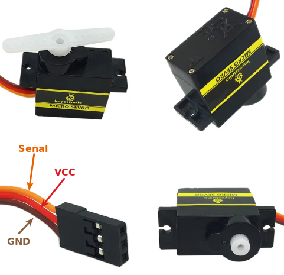
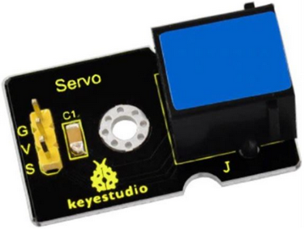
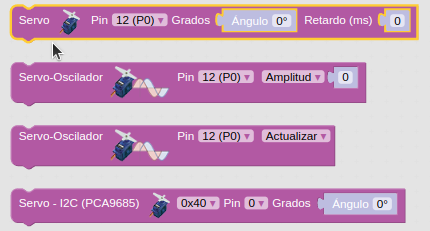

# A03-Servomotor

!!! tip "Alimentación Shield"
	Recuerda que la Shield debe tener activada la alimentación externa para que funcione el sistema.

## **El servomotor**
Un servomotor o abreviado servo es un motor especial que puede posicionar su eje en un ángulo determinado y lo puede mantener en esta posición. Los servos estándar suelen girar 180º, pero es habitual encontrar servos que giran 90º y otros 360º, que son los conocidos como servos de rotación continua. En el interior del mismo están ubicados tanto la electrónica de control como los engranajes reductores que a su vez pueden llevar o no topes físicos que marquen el ángulo de giro. Para su funcionamiento sólo necesitan ser alimentados (conexiones GND y VCC o 5V) y una señal de control.

Su aspecto es el siguiente:

  
*Aspecto servo 180 grados*

Vemos claramente que el conector no es EASY Plug sino con un conector hembra de tres pines para tres cables de conexión, que se distinguen por los colores marrón, rojo y naranja (diferentes marcas pueden tener diferentes colores).

### Principio básico de funcionamiento
La electrónica de control del servomotor tiene un circuito de referencia incorporado que emite la señal de referencia, que es un ciclo de 20 ms con un ancho de pulso de 1,5 ms. Se compara la tensión de control recibida con la de referencia y se genera una diferencia de tensión. El circuito de control en la placa decidirá la dirección de rotación en consecuencia y accionará el motor. El sistema de engranajes o reductora convierten el giro del motor en un par de fuerza a través del eje. El sensor detecta que se ha alcanzado la posición enviada de acuerdo con la señal de retroalimentación. Cuando la diferencia de tensión existe el motor gira y cuando la diferencia se reduce a cero, el motor se detiene. Normalmente, el ángulo de rotación es de 0 a 180 grados.

El ángulo de rotación del servomotor se controla regulando el ciclo de trabajo de la señal PWM cuyo estándar es de 20 ms (50 Hz).

### Conexión servo EASY Plug
Para poder conectar un servomotor a la placa EASY Plug debemos utilizar el adaptador que vemos en la imagen siguiente:

  
*Adaptador servo de modular a EASY Plug*

<b>Hay que tener mucho cuidado de posicionar el conector del servo (porque es reversible) en los tres pines macho del adaptador para hacerlo en el orden correcto o seguramente romperemos algo de manera irreversible.</b>

### Bloques de programación
En el apartado de bloques de programación, se encuentra en "Motor -->> Servo":

  
*Bloques Servo*

Para controlar el servomotor, indicamos los grados de rotación (Ángulo de giro) que queremos y el tiempo de retardo, o tiempo que tarda en ir de una posición a otra.

### Posición 0º u origen
Previo a cualquier actividad con un servo es averiguar cual es su posición 0º u origen. Un sencillo programa nos permite programar por primera vez el ángulo a 0º para descubrir el punto de origen y a partir de aquí montar alguna pala de las que vienen con el servo para poder visualizar la rotación del eje. El programa es el de la imagen siguiente:

  
*Encontrar el origen del servo*

## **A03_1-Servo 0 a 180 grados**
El primer programa, una vez encontrado el origen del servo, va a consistir en hacerlo cambiar entre sus posiciones extremas a intervalos de un segundo. El programa es el siguiente:

  
*[A03_1-Servo 0 a 180 grados](../program/actividadesAB/EP/A03_1EP-Servo 0 a 180 grados.abp)*

## **A03_2-Barrera aparcamiento**
Actividad para mover el servo de su posición de reposo a otra de 90º, la primera corresponde a la barrera bajada por lo que el acceso está cerrado y el semáforo (pantalla) estará en rojo y la segunda equivale a barrera subida, el acceso estará abierto y el semáforo estará en verde. La posición de la barrera por defecto será bajada y el semáforo estará apagado. Cuando se pulsa A el semaforo estará rojo, la barrera bajada y estará en ese estado hasta que se accione el pulsador B que pone el semaforo en verde y sube la barrera. En posición de barrera subida debe permanecer 5 segundos y después bajar la barrera y apagarse hasta una nueva pulsación de A. El programa es el siguiente:

  
*[A03_2-Barrera aparcamiento](../program/actividadesAB/EP/A03_2EP-Barrera aparcamiento.abp)*

A continuación vemos el sistema funcionando:

  
*A03_2-Funcionamiento barrera aparcamiento*

## **A03_3-Barrera aparcamiento mejorada**
Mejora del programa de la actividad anterior añadiendo una pantalla OLED que muestra indicaciones a seguir para hacer funcionar la barrera. El programa es el siguiente:

  
*[A03_3-Barrera aparcamiento mejorada](../program/actividadesAB/EP/A03_3EP-Barrera aparcamiento mejorada.abp)*

A continuación vemos el sistema funcionando:

  
*A03_3-Funcionamiento barrera aparcamiento mejorada*

