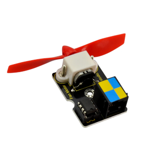
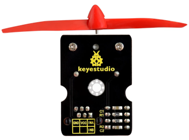
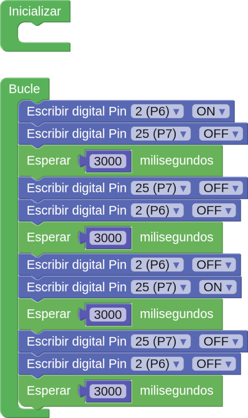
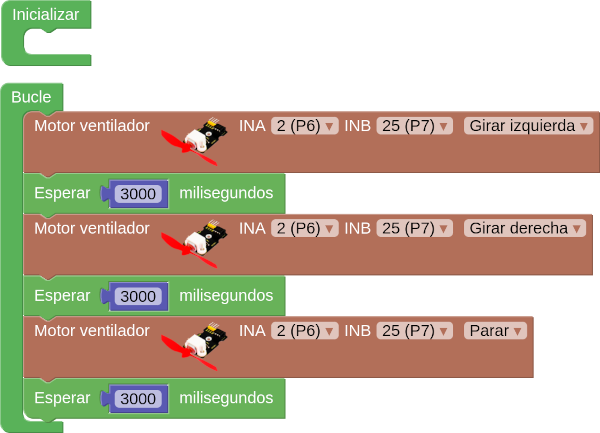
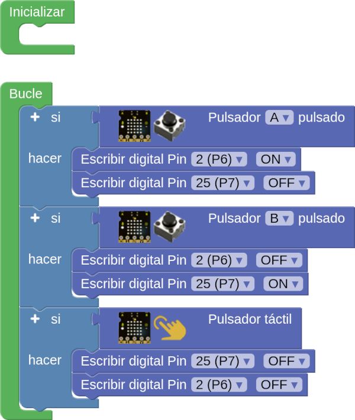

# A04-Motor DC

!!! tip "Alimentación Shield"
	Recuerda que la Shield debe tener activada la alimentación externa para que funcione el sistema.

Actividad en la que vamos a controlar un motor de corriente continua o DC como el de la imagen siguiente:

  
*Motor DC ventilador*

El módulo motor con ventilador utiliza el controlador L9110 para controlar la rotación de la hélice hacia izquierda y hacia derecha. Necesita por lo tanto dos pines para su control. Debe conectarse al puerto digital doble con una sola línea, bastante práctico.

La parte posterior del módulo presenta la serigrafía que vemos en la imagen siguiente:

  
*Cara posterior del módulo motor DC ventilador*

Tal y como se advierte en la nota de la conclusión 5 que podemos ver en [Pinout](http://127.0.0.1:8000/....https://fgcoca.github.io/ESP32-micro-STEAMakers/EasyPlug/EP1_1/#pinout), la serigrafia posterior del módulo es exactamente igual que la del puerto P6+P7. Esto quiere decir que el motor con ventilador lo podemos conectar a esa pareja de puertos mediante un solo cable para hacerlo funcionar.

Si buscamos en la entrada "Motor -->> DC motor" no encontraremos ningún bloque adecuado para hacer funcionar el módulo ventilador, por lo que inicialmente haremos la programación escribiendo directamente en los pines afectados.

El programa siguiente hace que el ventilador gire en un sentido, se para, gire en el otro sentido, se pare y asi sucesivamente.

  
*[A04-Motor DC](../program/actividadesAB/EP/A04EP-Motor DC.abp)*

La actividad la podemos hacer utilizando el bloque "Motor ventilador" que tenemos disponible en la entrada "Actuadores" sin mas que configurar los pines de manera adecuada. En la imagen vemos el programa realizado con el bloque:

  
*[A04-Motor DC con bloque "Motor ventilador"](../program/actividadesAB/EP/A04EP-Motor DC bloque Motor ventilador.abp)*

Una mejora rápida del programa sería ponerlo en marcha y paralo utilizando los botones. El programa sería ahora:

  
*[A04-Motor DC controlado por botones](../program/actividadesAB/EP/A04EP-Motor DC controlado por botones.abp)*

