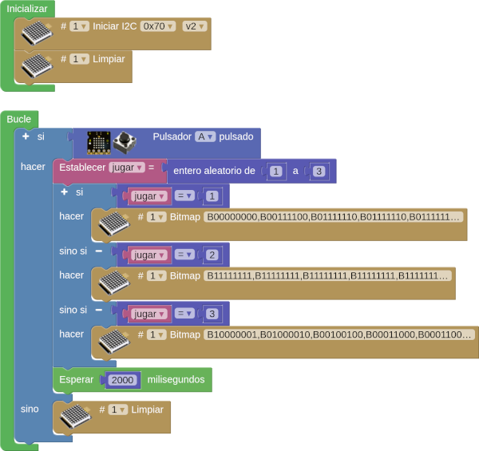

# A05-Matriz de 8x8 LEDs

!!! tip "Alimentación Shield"
	Recuerda que la Shield debe tener activada la alimentación externa para que funcione el sistema.

El objetivo es conocer la LEDMatrix 8x8 o también llamada matriz de LEDs. La matriz de LEDs es una pantalla pequeña que tiene 64 LEDs con el aspecto de la Figura siguiente y se conecta al puerto de comunicación I2C.

  
*Aspecto matriz 8x8*

En esta pantalla podemos programar diferentes símbolos o elementos, como: caras, iconos, letras... Hay opciones prediseñadas desde ArduinoBlocks y también, existe la opción de crearlos personalizados.

En el apartado de bloques de programación, se encuentra en "LedMatrix 8x8". Existen diferentes opciones de programación, según nuestro objetivo.

  
*Bloques programación matriz 8x8*

La primera tarea que debemos realizar cuando queremos hacer uso de la pantalla, es inicializarla. En la Figura siguiente vemos el primer bloque en el que pone: iniciar I2C.

  
*Bloques para inicializar matriz 8x8*

Se ha destacado la dirección física por defecto (0x70) porque esta es configurable a través de los microinterruptores de que dispone el módulo. Las posibilidades de configuración de la dirección las vemos en la tabla siguiente:

|| 1 | 2 | 3 |
|---|-:-|-:-|-:-|
|0x70| OFF (0) | OFF (0) | OFF (0) |
|0x71| ON (1) | OFF (0) | OFF (0) |
|0x72| OFF (0) | ON (1) | OFF (0) |
|0x73| ON (1) | ON (1) | OFF (0) |
|0x74| OFF (0) | OFF (0) | ON (1) |
|0x75| ON (1) | OFF (0) | ON (1) |
|0x76| OFF (0) | ON (1) | ON (1) |
|0x77| ON (1) | ON (1) | ON (1) |

## **A05_1-Caritas y flechas**
La pantalla LedMatrix muestra diferentes caras, una flecha hacia arriba y una flecha hacia abajo a intervalos de un segundo. El programa es el siguiente:

  
*[A05_1-Caritas y flechas](../program/actividadesAB/EP/A05_1EP-Caritas y flechas.abp)*

## **A05_2-Símbolos personalizados**
Cuando se pulse el pulsador, en la pantalla debe aparecer un símbolo personalizado durante dos segundos y después otro distinto. La actividad se puede resolver de dos formas. Para la primera de ellas el programa es el siguiente:

  
*[A05_2-Símbolos personalizados](../program/actividadesAB/EP/A05_2EP_1-Simbolos personalizados.abp)*

La segunda forma consiste en crear los śimbolos utilizando la herramienta LedMatrix - Bitmap editor y copiar el dato binario generado en el bloque correspondiente. En la imagen vemos la creación de los símbolos:

  
*rear símbolos personalizados*

Para esta segunda forma el programa es el siguiente:

  
*[A05_2-Símbolos personalizados](../program/actividadesAB/EP/A05_2EP_2-Simbolos personalizados.abp)*

## **A05_3EP-Piedra papel o tijera**
En esta tercera actividad recrearemos el famoso y conocido juego "Piedra, papel, tijera". También utilizaremos el pulsador para activar el juego y creamos una variable que elija aleatoriamente uno de los tres símbolos del juego. Cuando se pulse el pulsador, la pantalla muestra, de forma aleatoria, uno de los tres símbolos: piedra, papel o tijeras.

Lo primero que vamos a hacer es crear los tres símbolos: utilizando el "Bitmap". Para seleccionar los LEDs que queremos en estado ON:

  
*Piedra, papel, tijeras*

El programa es el siguiente:

  
*[A05_3-Piedra papel o tijera](../program/actividadesAB/EP/A05_3EP-Piedra papel o tijera.abp)*

