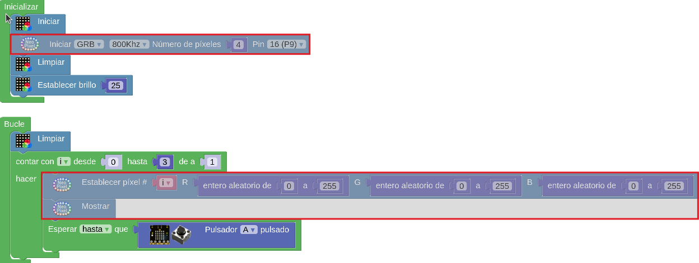

# A06-Neopixels Shield

!!! tip "Alimentación Shield"
	Recuerda que la Shield debe tener activada la alimentación externa para que funcione el sistema.

En el momento de realizar este tutorial no existen bloques para trabajar con LEDs direccionables salvo los propios de la micro:STEAMakers y en estos no se puede configurar el pin P9 como puerto al que están conectados los LEDs.

Para solventar el problema vamos a crear un proyecto para ESP32 STEAMakers y vamos a poner en la mochila los tres bloques marcados en la imagen siguiente:

  
*Bloques neopixels de otra placa*

Si no sabes utilizar la mochila el corto [Uso mochila para pasar bloques entre proyectos de diferntes placas en Arduinoblocks. Uno a ESP32]() de [Ardutaller](https://www.ardutaller.com.es/principal) te explica claramente como hacerlo.

Una vez que tenemos los bloques necesarios creamos el programa siguiente:

  
*[A06-Neopixels Shield](../program/actividadesAB/EP/A06EP-Neopixels Shield.abp)*

El programa ilumina durante un segundo un numero aleatorio de LEDs en un color también aleatorio.

En la la imagen anterior se destacan los bloques traidos de un proyecto de otra placa.

A continuación vemos el programa funcionando:

  
*Funcionamiento A06-Neopixels Shield*

