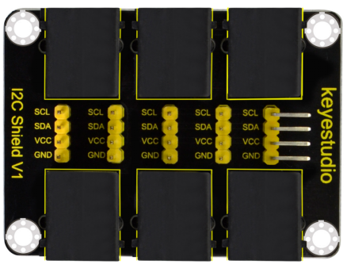

# A07-Sensor de CO2

!!! tip "Alimentación Shield"
	Recuerda que la Shield debe tener activada la alimentación externa para que funcione el sistema.

En esta actividad vamos a necesitar conectar dos dipsotivos al puerto I2C de la shield por lo que vamos a necesitar un expansor o hub. Un Hub sería como un "ladrón", que nos permite conectar varios dispositivos a la vez. Sería como el de la imagen siguiente:

  
*Hub I2C*

!!! note "Aviso"
	Se aconseja leer la entrada [Conceptos sobre CO2 y VOC](http://127.0.0.1:8000/....https://fgcoca.github.io/ESP32-micro-STEAMakers/CO2/) para poder entender correctamente el programa siguiente:

  
*[A07-Sensor de CO2](../program/actividadesAB/EP/A07EP-Sensor de CO2.abp)*

A continuación vemos el programa en un momento de su funcionamiento:

  
*Funcionamiento A07-Sensor de CO2*

