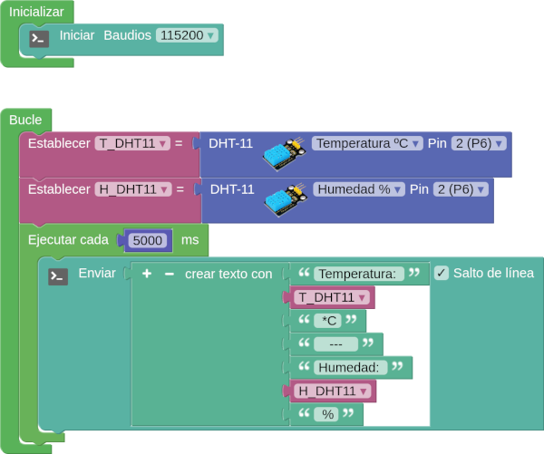

# A01-Temperatura y Humedad con DHT11

!!! tip "Alimentación Shield"
	**1**. Si no tenemos alimentación externa los jumpers deben estar en la posición 3.3V y los sensores y/o actuadores conectados tienen que poder trabajar a esa tensión.  
	**2**. Si tenemos alimentación externa uno los jumpers pueden estar en la posición 3.3V para los dispositivos de esta tensión y el otro en la de 5V para los sensores de esta otra tensión. Cada tipo conectado según la posición de los jumpers.

Inicialmente el objetivo es montar un sensor externo conectado a la shield para testar su funcionamiento, que lo haremos enviando los datos a la consola serie en una primera instancia.

!!! info "otros sensores y actuadores"
	Con la única limitación de los pines disponibles, podemos conectar a la shield muchos mas dispositivos y, si disponemos de los mismos, hacer las actividades desarrolladas para **EASY Plug**.

El programa es el siguiente:

  
*[A01-Temperatura_Humedad_DHT11](../program/actividadesAB/MOD/A01MOD-Temperatura_Humedad_DHT11.abp)*

