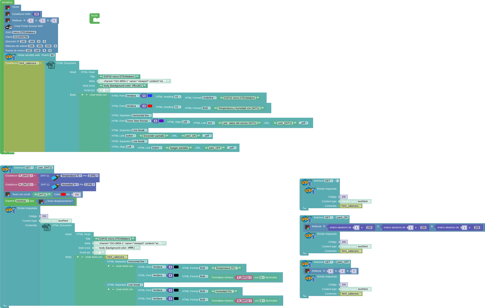
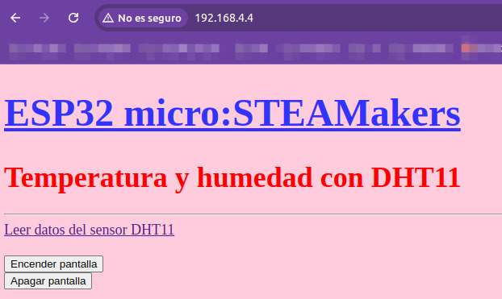
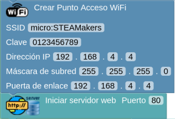
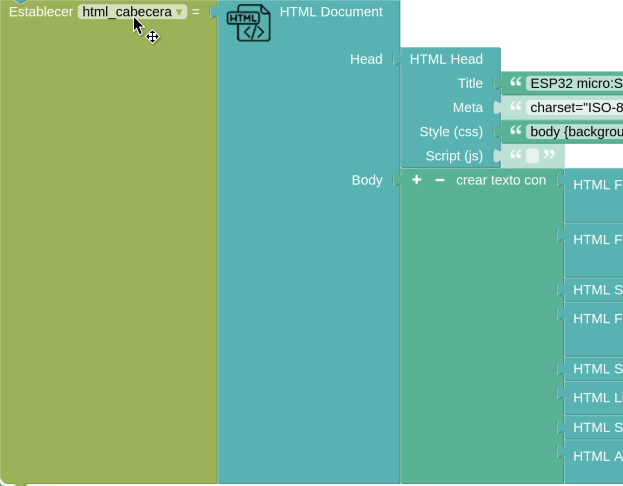
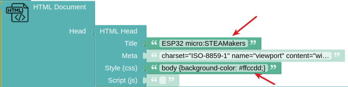
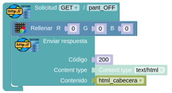

# A02-Temperatura y Humedad con DHT11 via web

!!! tip "Alimentación Shield"
	**1**. Si no tenemos alimentación externa los jumpers deben estar en la posición 3.3V y los sensores y/o actuadores conectados tienen que poder trabajar a esa tensión.  
	**2**. Si tenemos alimentación externa uno los jumpers pueden estar en la posición 3.3V para los dispositivos de esta tensión y el otro en la de 5V para los sensores de esta otra tensión. Cada tipo conectado según la posición de los jumpers.

## **Actividad**
En esta ocasión lo que vamos a hacer es visualizar los datos de la actividad anterior en formato web. Vamos a ver primero el programa y su funcionamiento para despues ir describiendo los pasos de programación para mejor entendimiento de la actividad. El programa es:

  
*[A02-Temperatura y Humedad con DHT11 via web](../program/actividadesAB/MOD/A02MOD-TyH con DHT11 via web.abp)*

Lo que va a ocurrir es que, cuando carguemos en nuestro navegador la dirección IP de nuestro servidor web se va a mostrar una pantalla como la siguiente. Lógicamente antes nos hemos conectado a la red con SSID micro:STEAMakers.

  
*Punto de acceso WiFi*

A continuación vemos lo que ocurre tanto en el navegador como en la micro:STEAMakers:

  
*Interaccionando desde punto de acceso WiFi*

Vemos como al pulsar sobre el enlace o los botones la petición se refleja en la placa.

## **Explicación del programa**
Ahora vamos a ver el programa por partes omitiendo lo referente a la pantalla RGB que ya se ha tratado en otras actividades.

* **Creación del punto de acceso WiFi**. Creamos nuestra propia red WiFi (punto de acceso) en la placa micro:STEAMakers donde nos podemos conectar con dispositivos como ordenador, tablet o móviles.

  
*Creación del punto de acceso WiFi*

Una vez creado el punto de acceso iniciamos el servidor en el puerto 80. Este puerto es el utilizado por el protocolo HTPP para transferencia de hipertexto y es el que se utiliza para acceder a todas las páginas web.

Hay que tener en cuenta que este punto de acceso nos permite conectarnos con la placa, pero no tendrá conexión a internet.

* **Documento HTML**. Todo documento HTML tiene como mínimo dos partes, el **head** y el **body**. En el head debe estar la información descriptiva del sitio, como título, matadatos y estilos, mientras que en el body estará toda la información visible de la web. Para facilitar el trabajo en la actividad el documento HTML lo vamos a guardar en una variable de texto que hemos nombrado "html_cabecera". De esta forma podremos invocar todo el documento llamando a esta variable.

  
*Documento HTML*  
Imagen intencionadamente recortada por la derecha

La parte Head viene definida con el bloque HTML Document y lo único que hemos tocado ha sido el título y el color de fondo.

  
*Documento HTML - Head*  
Imagen intencionadamente recortada por la derecha

Para el Body creamos un texto con las partes que vemos en la imagen siguiente. Aquí hemos dado algún formato a los distintos elemento con el fin de destacarlos unos de otros. Sin entrar en detalles que podemos consultar buscando información sobre html, hemos establecido tipos de fuente, tamaño y color de la misma, nivel de indice, formatos como subrayado y negrita, dibujo de líneas horizontales, saltos de línea y lógicamente enlaces de texto y tipo botón donde se ha establecido el texto y la URL del enlace.

  
*Documento HTML - Body*  
Imagen intencionadamente recortada por la izquierda

Ahora debemos crear los bloques para atender las peticiones "get" y que en la web y la micro:STEAMakers se reflejen las interacciones. Pero antes se aconseja consultar el apartado [Peticiones HTTP](http://127.0.0.1:8000/....https://fgcoca.github.io/ESP32-micro-STEAMakers/program/server/#peticiones-http).

* **Solicitud get /** con la acción "/" para indicar que no hay ninguna petición. La respuesta que vamos a enviar es que se establezca como contenido el de la variable definida "html_cabecera", es decir, que aparezcan los textos y botones definidos en el bloque "Inicializar".

  
*Solicitud get /*  

* **Solicitud get/pant_ON**. Cuando se hace clic en el botón "Encender pantalla" (cuando se invoca esta petición) la pantalla se va a iluminar en un color aleatorio y como respuesta se envía la misma que en el caso anterior. De esta forma cada vez que hagamos clic en el botón cambiará el color y la pantalla en el navegador permacerá inalterable.

  
*Solicitud get/pant_ON*  

* **Solicitud get/pant_OFF**. Cuando se hace clic en el botón "Apagar pantalla" (cuando se invoca esta petición) la pantalla se va a iluminar en color negro y como respuesta se envía la misma que en el caso anterior.

  
*Solicitud get/pant_OFF*  

* **Solicitud get/Leer_DHT11**. Esta solicitud se hace desde una enlace de texto y en la misma se leen los valores del sensor, se envia a la pantalla el texto "DHT11" en color rojo (se espera mientras se realiza el scroll) y para enviar la respuesta a la petición se configura el "Contenido" de la misma como un documento HTML con su Head y su Body. En el Body se crea un texto con todo lo que contiene la varible que estamos utilizando, se agregan línea horizontal y salto de línea y los texto y valores de los datos que pretendemos visualizar.

  
*Solicitud get/Leer_DHT11*  

