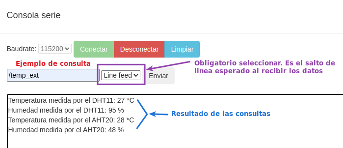
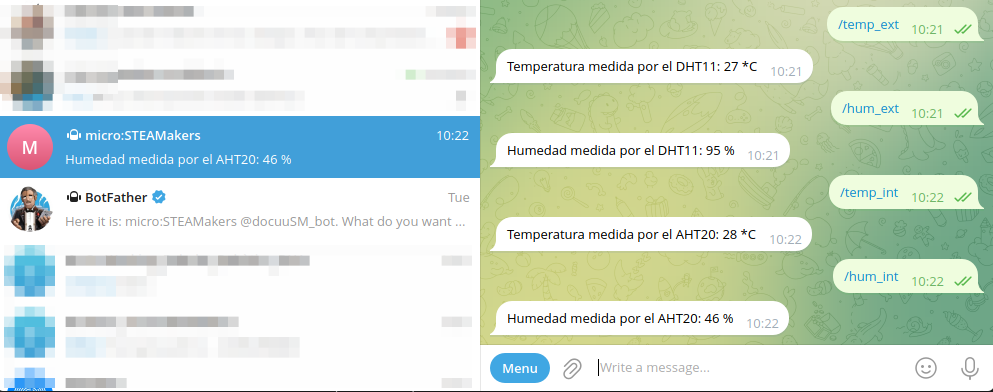

# A03-Temperatura y Humedad con Telegram

!!! tip "Alimentación Shield"
	**1**. Si no tenemos alimentación externa los jumpers deben estar en la posición 3.3V y los sensores y/o actuadores conectados tienen que poder trabajar a esa tensión.  
	**2**. Si tenemos alimentación externa uno los jumpers pueden estar en la posición 3.3V para los dispositivos de esta tensión y el otro en la de 5V para los sensores de esta otra tensión. Cada tipo conectado según la posición de los jumpers.

Actividad en la que vamos a mostrar mismos datos de la actividad [A02-Temperatura y Humedad con DHT11 via web](./A02MOD.md) mas los del sensor incorporado en la micro:STEAMakers tanto por el puerto serie como a través de un bot de Telegram. Los datos se obtienen cuando son demandados.

Ponemos el programa en dos partes para que la imagen se visualice mejor. La primera será de inicializaciones y trabajo con el puerto serie y la segunda para el evento de Telegram.

  

  

*[A03-Temperatura y Humedad con Telegram](../program/actividadesAB/MOD/A03MOD-TyH_Telegram.abp)*

En la imagen siguiente vemos el resultado que se obtiene por la consola de arduinoblocks con aclaraciones de como realizar las consultas.

  
*A03-Temperatura y Humedad con Telegram*

Esta otra imagen nos muestra los resultados en el bot creado para esta actividad.

  
*A03-Temperatura y Humedad con Telegram*

