# A05-ESP-NOW
Se realizan varias actividades comunicando placas micro:STEAMakers entre si por ESP_NOW.

Las direcciones MAC van a ser:

* Nodo 1: 4C:11:AE:D3:99:18
* Nodo 2: 34:98:7A:A9:D1:A8
* Nodo 3: 4C:11:AE:D3:98:C8

## **A05_1-Unidireccional 1 a 1**
Se trata de implementar la comunicación mas simple posible, un emisor y un receptor. Hacemos un contador de segundos en la placa emisora que serán mostrados en una pantalla OLED en la placa receptora.

Los nodos van a actuar de la siguiente forma:

* Emisor: Nodo 2
* Receptor: Nodo 1

El programa emisor es:

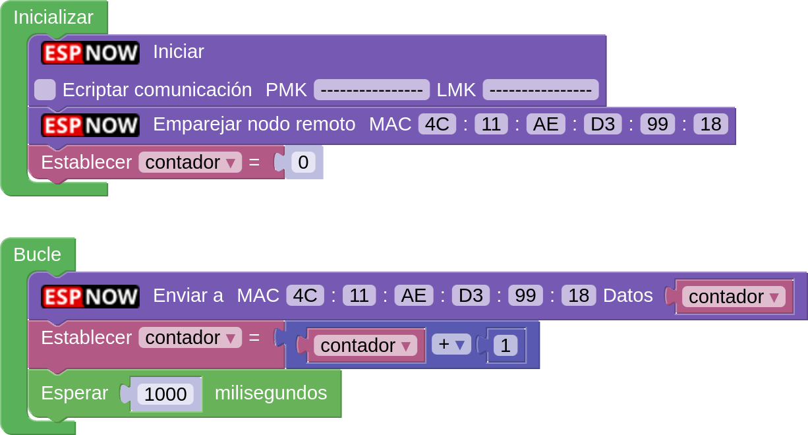  
*[A05_1-Unidireccional 1 a 1](../program/actividadesAB/MOD/A05_1_ESPNOW_Emisor.abp)*

El programa receptor es:

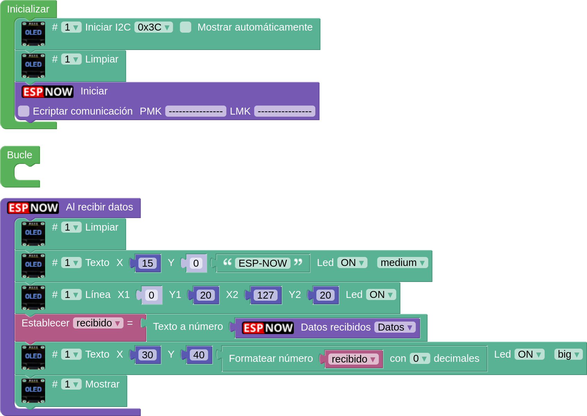  
*[A05_1-Unidireccional 1 a 1](../program/actividadesAB/MOD/A05_1_ESPNOW_Receptor.abp)*

En la imagen siguiente vemos el resultado de la comunicación:

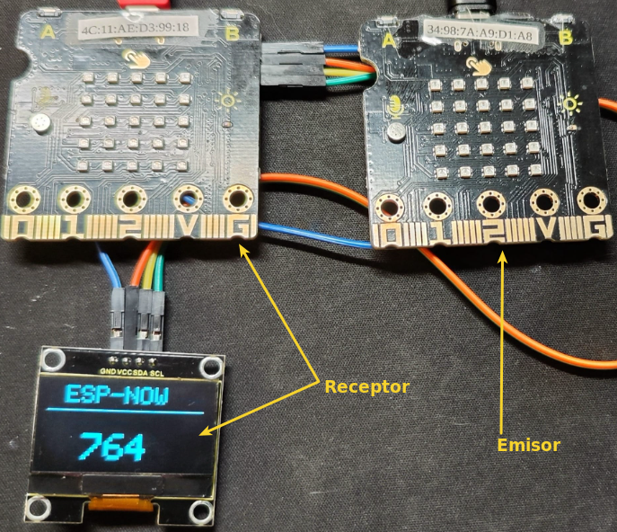  
*Funcionamiento A05_1-Unidireccional 1 a 1*

## **A05_2-Unidireccional encriptada 1 a 1**
Es el mismo ejemplo que en la actividad anterior, pero podemos comprobar que simplemente con activar la encriptación, poner las claves y dejando los programas tal cual están el sistema no funciona. Los programas siguientes no dan resultado alguno:

* Programa emisor:

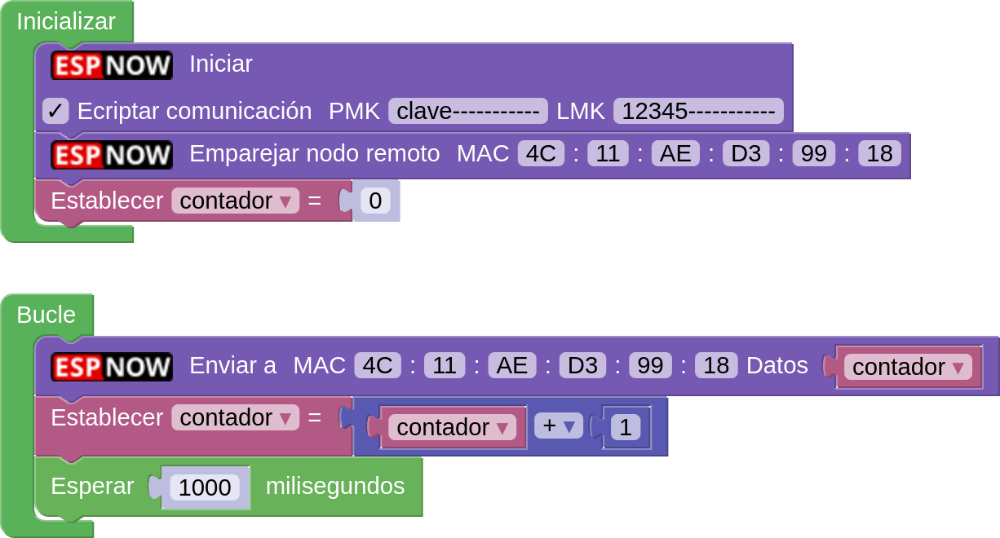  
*[A05_1-Unidireccional encriptada 1 a 1](../program/actividadesAB/MOD/A05_2_ESPNOW_Emisor.abp)*

* Programa receptor:

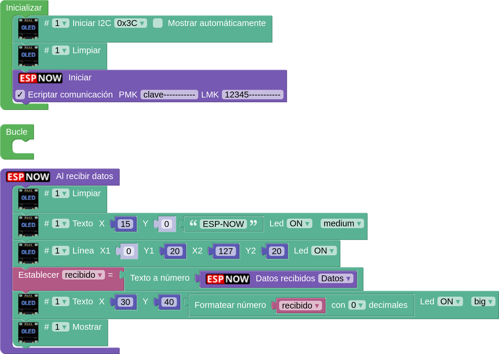  
*[A05_2-Unidireccional encriptada 1 a 1](../program/actividadesAB/MOD/A05_2_ESPNOW_Receptor.abp)*

Una vez subidos los programas comprobamos como el contador del receptor (OLED) no cambia y siempre se mantiene en el mismo estado. Es evidente que si el receptor recibe datos encriptados, por el mismo protocolo de seguridad, debe saber quien se los envía por lo que la solución es bien simple, hay que emparejar ambos nodos. 

!!! warning "IMPORTANTE"
    Si encriptamos la información, aunque el envío sea en una dirección debemos emparejar también al nodo emisor con el receptor.

Los programas funcionales los vemos a continuación:

El programa emisor es:

  
*[A05_2-Unidireccional encriptada 1 a 1](../program/actividadesAB/MOD/A05_1_ESPNOW_EmisorOK.abp)*

El programa receptor es:

  
*[A05_2-Unidireccional encriptada 1 a 1](../program/actividadesAB/MOD/A05_1_ESPNOW_ReceptorOK.abp)*

El funcionamiento es idéntico al de la actividad A05_1.

## **A05_3-Unidireccional 1 a 2 + JSON**
En esta actividad seguimos con la comunicación unidireccional de datos, pero los enviaremos desde un emisor a dos receptores, enviaremos mas de un datos y les daremos para ello formato JSON (JavaScript Object Notation). En mi caso concreto en un nodo voy a mostrar los datos recibidos en una OLED y en el otro en la consola serie. El programa permite utilizar uno u otro sin cambiar nada, es decir cargamos el mismo programa a todos los nodos receptores.

La codificación JSON encapsula los datos en forma de clave-valor (key-value) de una forma sencilla de tratar en arduinoblocks. Si quieres aprender mas sobre JSON en arduinoblocks aquí tienes el enlace al tema [Análisis básico de datos en formato JSON](https://drive.google.com/file/d/1r290vEJVVZtt8yp4PELnxgTEFWqUUBZk/view).

El programa emisor es el siguiente:

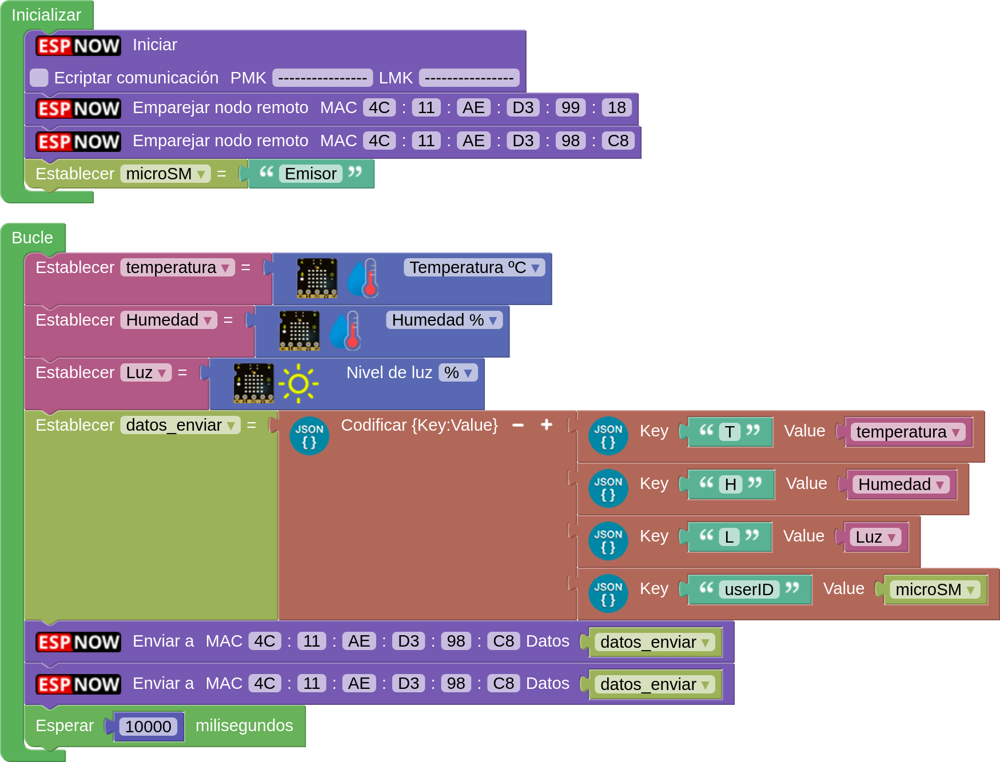  
*[A05_3-Unidireccional 1 a 2 + JSON](../program/actividadesAB/MOD/A05_3_ESPNOW_Emisor.abp)*

El programa receptor es el siguiente:

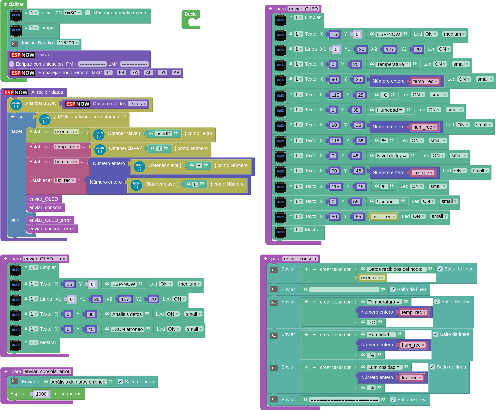  
*[A05_3-Unidireccional 1 a 2 + JSON](../program/actividadesAB/MOD/A05_3_ESPNOW_Receptor.abp)*

A continuación vemos los resultados en uno y otro modo:

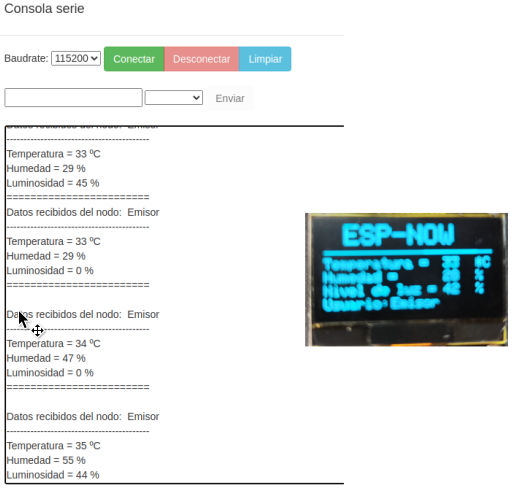  
*A05_3-Unidireccional 1 a 2 + JSON*

## **A05_4-Unidireccional 2 a 1 + JSON**
En esta actividad construimos un datalogger con dos nodos distribuidos que envian periodicamente información a un nodo receptor que registra los datos recibidos en formato CSV (Comma Separated Values) que posteriormente podremos leer y visualizar en una hoja de cálculo. Para saber mas consultar [Tarjeta microSD](http://127.0.0.1:8000/....https://fgcoca.github.io/ESP32-micro-STEAMakers/program/inicio/#tarjeta-microsd) y la actividad [A08-Tarjeta microSD](http://127.0.0.1:8000/....https://fgcoca.github.io/ESP32-micro-STEAMakers/actividadesAB/A08/).

El programa para los emisores es el siguiente:

!!! info inline end "Nota"
    Debemos recordar asignar un número de nodo diferente a cada emisor o no podremos saber de donde viene el dato.

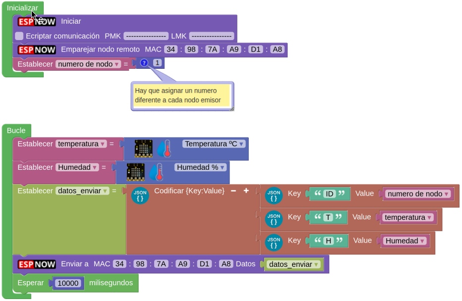  
*[A05_4-Unidireccional 2 a 1 + JSON](../program/actividadesAB/MOD/A05_4_ESPNOW_Emisores.abp)*

El programa receptor es:

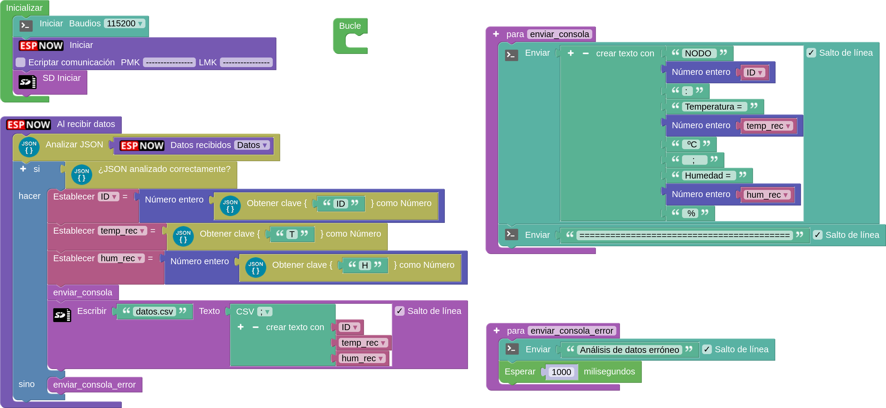  
*[A05_4-Unidireccional 2 a 1 + JSON](../program/actividadesAB/MOD/A05_4_ESPNOW_Receptor.abp)*

El resultado que muestra la consola es:

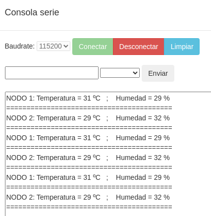  
*Consola A05_4-Unidireccional 2 a 1 + JSON*

Si extraemos la tarjeta microSD de su zócalo y abrimos el archivo en una hoja de cálculo podremos ver los mismos datos que en la consola.

## **A05_5-Latidos**
En esta actividad haremos que cuando en un nodo emisor pulsamos A o B se muestre en pantalla una A o una B y cuando tocamos el botón táctil que se vea un corazón latiendo.

El programa para emisor es el siguiente:

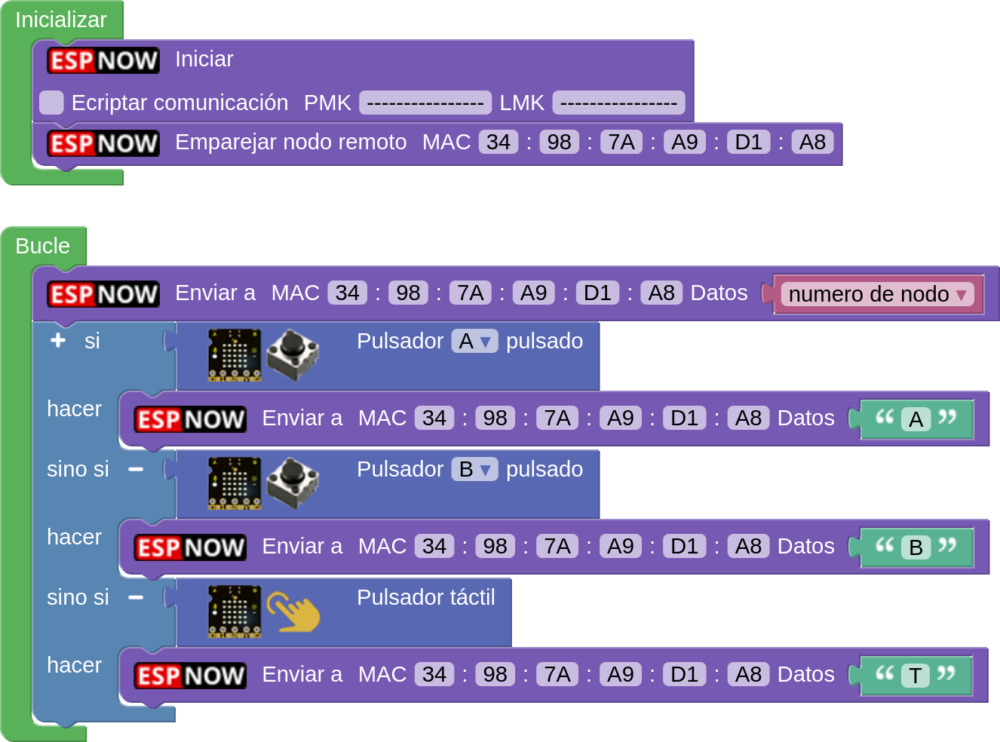  
*[A05_5-Latidos](../program/actividadesAB/MOD/A05_5_ESPNOW_Emisor.abp)*

El programa receptor es:

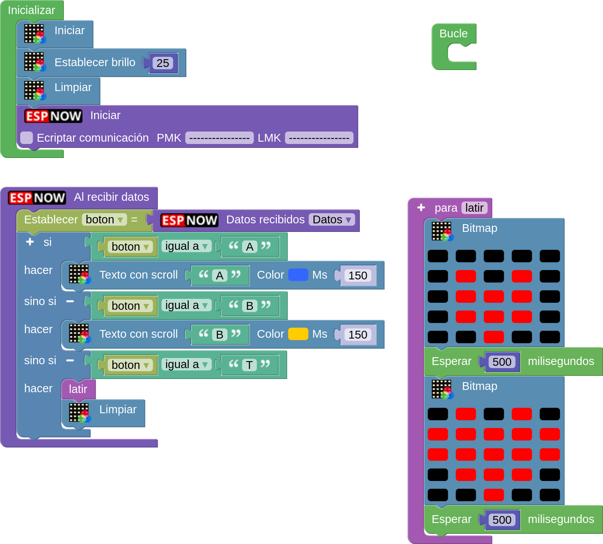  
*[A05_5-Latidos](../program/actividadesAB/MOD/A05_5_ESPNOW_Receptor.abp)*

