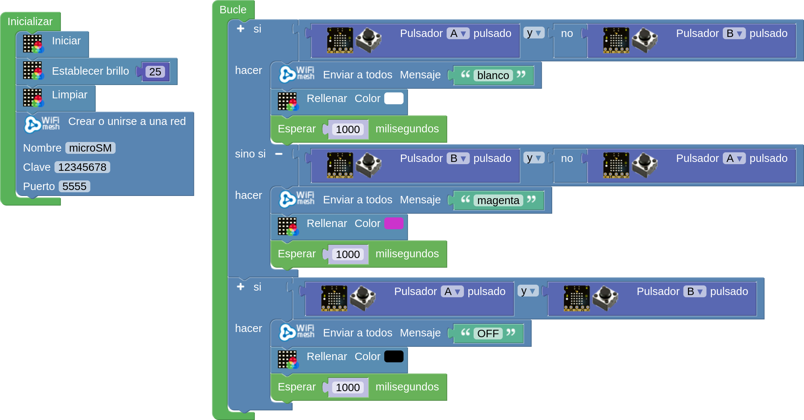
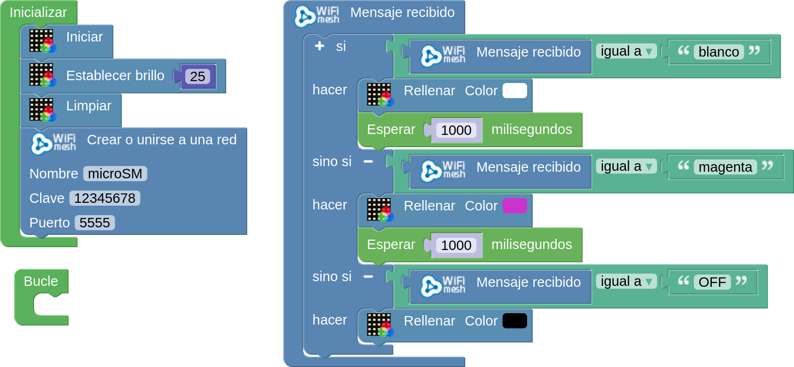
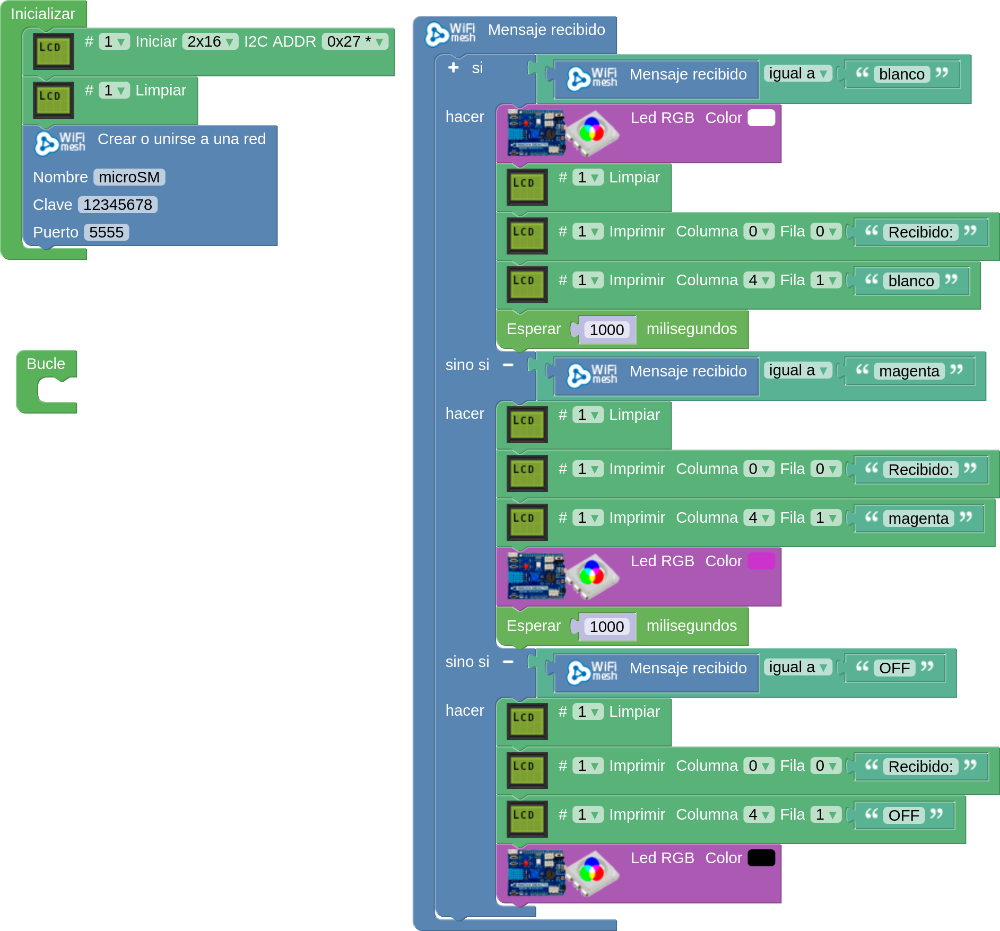
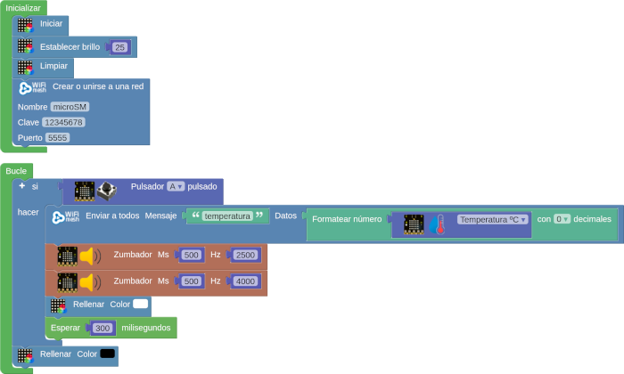
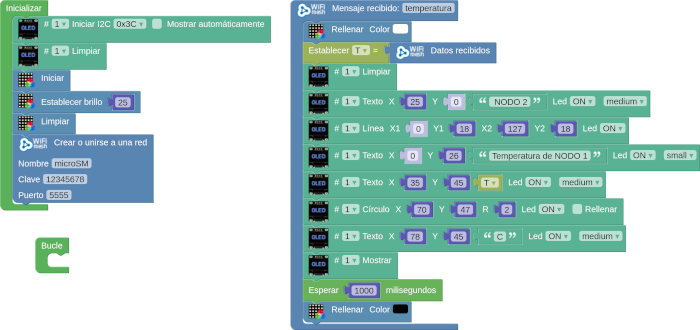
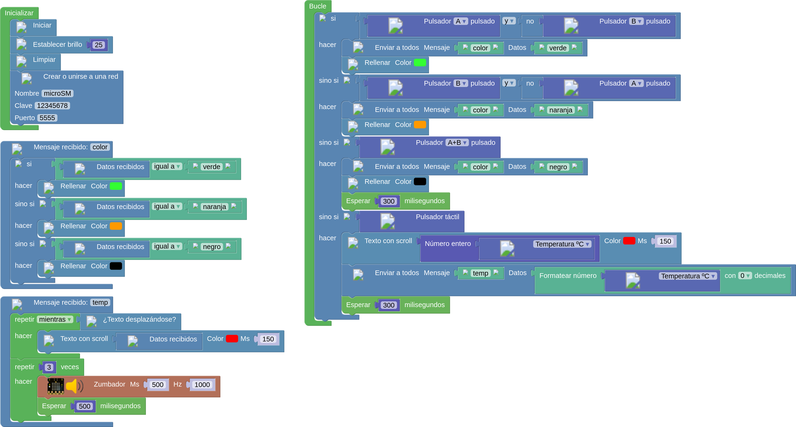

# A05-WiFiMesh
Se realizan varias actividades comunicando placas micro:STEAMakers entre si por WiFi Mesh.

!!! failure "¡¡ ADVERTENCIA !!"
	<b>WiFiMesh presente, en algunas ocasiones, un problema, y es se pierden más mensajes de los que deberían, y a veces a unos les llegan y a otros no, o incluso no le llegan a ningún nodo.  
    Es posible que en el momento que leas esto los bloques para WiFiMesh de arduinoblocks estén considerados como obsoletos (deprecated) y por lo tanto estén desabilitados. Pero las mismas o similares actividades se pueden realizar con ESPNOW.</b>

## **A05_1-WiFiMesh un emisor a varios receptores**
Se trata de hacer que una placa micro:STEAMakers actúe como emisor de mensajes diferentes según se pulse botón A, botón B o ambos:

* Botón A -> se emite el mensaje "blanco" y se iluminan todos los LEDs RGB en ese color.
* Botón B - > se emite el mensaje "magenta" y se iluminan todos los LEDs en ese color.
* Botón A + Botón B -> se emite el mensaje "OFF" y se apagan todos los LEDs RGB.

Las placas que actúan de receptores reciben esos mensajes y tras una breve espera tendrán que repetir lo que ha enviado la placa emisora.

El programa de la placa emisora es:

  
*[A05_1-WiFiMesh un emisor a varios receptores](../program/actividadesAB/MOD/A05_1_MOD_emisor-WiFiMesh.abp)*

El programa de las placas receptoras es:

  
*[A05_1-WiFiMesh un emisor a varios receptores](../program/actividadesAB/MOD/A05_1_MOD_receptor-WiFiMesh.abp)*

A continuación vemos el funcionamiento de los programas entre una placa emisora y dos receptoras. Debemos tener presente que al principio puede darnos la impresión de que el sistema no funciona, pero si damos unos segundos de tiempo a que se difundan las redes creadas todo comenzará a funcionar. 

  
*Funcionamiento A05_1-WiFiMesh un emisor a varios receptores*

Observese que para el mensaje OFF hay que mantener pulsado un segundo o mas ambos pulsadores o prevalecerá el mensaje del botón que se pulse primero.

Podemos ampliar el sistema a una tercera placa de otro tipo, en este caso un conjunto ESP32 STEAMakers + TdR STEAM con LCD, en la que haremos funcionar al LED RGB de la misma forma que a las pantallas y además pondremos en la LCD los mensajes recibidos. El programa receptor en este caso es:

  
*[A05_1-WiFiMesh un emisor a varios receptores, uno STEAMakers](../program/actividadesAB/MOD/A05_1_MOD_receptor-WiFiMesh-STEAMakers.abp)*

A continuación vemos el sistema en funcionamiento:

  
*Funcionamiento A05_1-WiFiMesh un emisor a varios receptores, uno STEAMakers*

Ya nos podemos ir imaginando la cantidad de posibilidades que nos ofrece el sistema.

## **A05_2-Mensaje y datos**
En esta ocasión vamos a utilizar el bloque que combina un mensaje con un dato para hacer que una pantalla OLED I2C conectada en la placa receptora nos muestre la información remitida por la placa emisora. Vamos a enviar la temperatura mientras se enciende en blanco la pantalla y se emite un sonido que va de menos a mas agudo. Cuando se recibe el dato en otra placa, esta ilumina su pantalla en blanco y muestra el valor de la temperatura en una pantalla OLED I2C conectada a ella.

El programa emisor es:

  
*[A05_2-Mensaje y datos](../program/actividadesAB/MOD/A05_2_MOD_emisor-WiFiMesh.abp)*

Y el programa receptor es:

  
*[A05_2-Mensaje y datos](../program/actividadesAB/MOD/A05_2_MOD_receptor-WiFiMesh.abp)*

En la animación siguiente vemos lo que ocurre cuando pulsamos el botón A y para hacerlo mas evidente hay unos instantes en que se sujeta la placa emisora tocando el sensor para que suba la temperatura.

  
*Funcionamiento de A05_2-Mensaje y datos*

## **A05_3-Todas emisores y receptores**
Haremos que todas las placas sean emisoras y receptoras con un sólo programa. Vamos a mandar dos mensajes diferentes, uno será "color" con el nombre del color como "Dato" y el otro será "temp" con el dato temperatura del sensor de la micro:STEAMakers, las placas receptoras deben mostrar el la temperatura por la pantalla como un texto con scroll y cuando finalice emitir 3 pitidos. El programa que debemos subir a todas las placas es el siguiente:

  
*[A05_3-Todas emisores y receptores](../program/actividadesAB/MOD/A05_3_MOD_Emisor_Receptor.abp)*

A continuación se muestra una animación donde se puede apreciar que hay mensajes que no llegan o que llegan mal a su destino. Incluso, aunque en la animación no se escucha el sonido, hay momentos en que el conjunto se vuelve inestable y no deja de repetir los pitidos sin responder a otras acciones.

  
*Funcionamiento de A05_3-Todas emisores y receptores*

