## **A01mB-Hola Mundo**
En esta actividad haremos que al inicio se muestre durante 3 segundos una carita triste que cambiará, tambien a los 3 segundos, a carita alegre para pasar a ver de forma permanente un corazón latiendo a razón de una pulsación cada segundo.

En la imagen siguiente tenemos el programa.

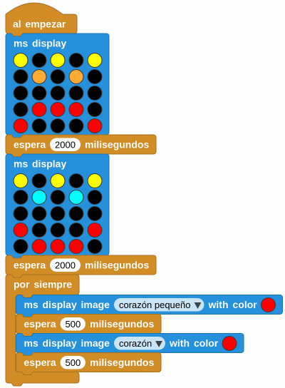  
*[A01mB-Hola Mundo](../program/actividadesmB/A01mB_HolaMundo.ubp)*

A continuación vemos una animación de la actividad:

  
*A01mB-Hola Mundo funcionando*

## **A02mB-Botones**
El programa que vamos a crear como ejemplo nos va a mostrar en la pantalla el botón que estamos pulsando mientras lo mantengamos accionado refrescandose cada segundo. En la imagen siguiente tenemos el programa.

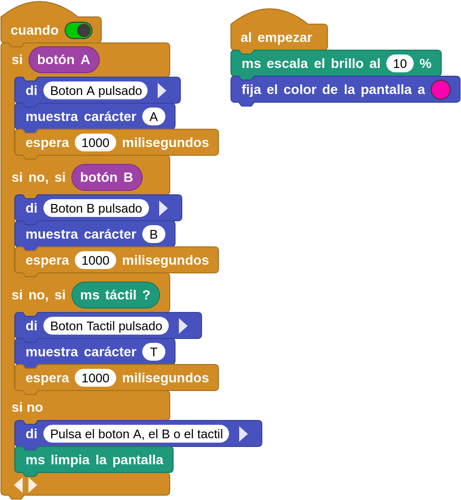  
*[A02mB-Botones](../program/actividadesmB/A02mB_Botones.ubp)*

A continuación vemos una animación de la actividad:

  
*A02mB-Botones funcionando*

## **A03mB-Sonidos**
Esta actividad va a estar compuesta por varios proyectos sencillos relativos al sonido reproducible en el altavoz que incorpora la micro:STEAMakers.

!!! info "Aviso"
    En las animaciones de estas actividades no se podrás escuchar sonidos, por lo que para completarlas de manera adecuada debes cargar los programas en tu placa micro:STEAMakers y ejecutarlos.

### A03_1mB-Pitidos
El programa hará sonar el zumbador 5 veces las frecuencias de 1000 y 800 Hz, cada una durante 200ms a modo de sirena. Entre cada frecuencia intercalamos un retardo de 50ms. Cada reproducción irá acompañada de la iluminación en el color elegido de una de las filas de LEDs de la pantalla y todo ello se reproducirá de forma indefinida cada 2 segundos. En la imagen siguiente tenemos el programa.

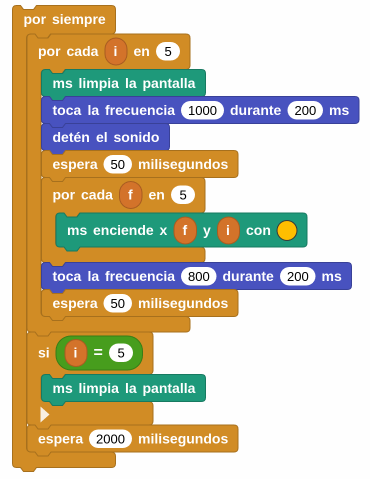  
*[A03_1mB-Pitidos](../program/actividadesmB/A03_1mB-Pitidos.ubp)*

A continuación vemos una animación de la actividad:

  
*A03_1mB-Pitidos funcionando*

### A03_2mB-Notas
Programa que al pulsar el botón A reproducirá las 7 notas en sus 8 octavas, al pulsar el botón B ocurrirá lo mismo pero sustituyendo cada nota por su bemol, si lo tiene, y en cualquier momento que se toque el botón táctil se detendrá la reproducción del sonido, no así la ejecución de los programas, que solamente se hará desde el botón de parada del IDE de MicroBlocks. Durante la duración de los programas de los botones se verá en pantalla y en el IDE del programa la octava que se está reproduciendo. En la imagen siguiente tenemos el programa.

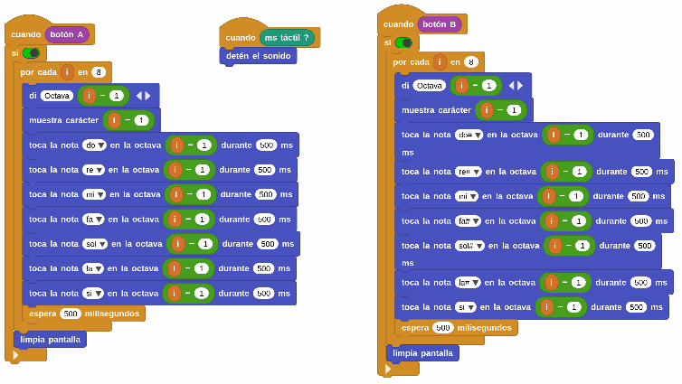  
*[A03_2mB-Notas](../program/actividadesmB/A03_2mB-Notas.ubp)*

A continuación vemos una animación de la actividad:

  
*A03_2mB-Notas funcionando*

### A03_3mB-Politonos
En esta actividad vamos a reproducir dos melodias diferentes de los 10.000 tonos de llamada recopiladas por un miembro de la comunidad Arduino. He aquí una versión ligeramente editada de esa gigantesca [colección de tonos de llamada](http://microblocks.fun/mbtest/NokringTunes.txt), una al pulsar A y otra al pulsar B. En la imagen siguiente tenemos el programa.

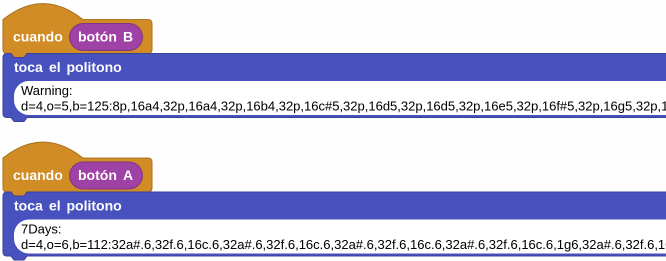  
*[A03_3mB-Politonos](../program/actividadesmB/A03_3mB-Politonos.ubp)*

## **A04mB-Aceleraciones**
El programa nos va a mostrar como mensaje y de forma gráfica las aceleraciones producidas en los tres ejes haciendo análisis de los valores obtenidos. En la imagen siguiente tenemos el programa.

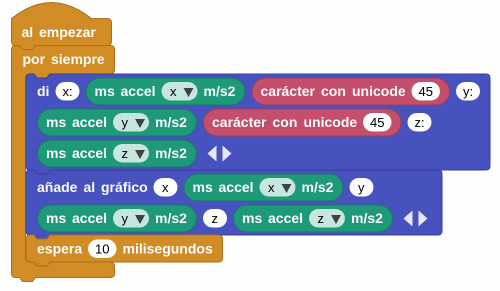  
*[A04mB-Aceleraciones](../program/actividadesmB/A04mB-Aceleraciones.ubp)*

Para analizar el programa en funcionamiento vamos a partir de la situación que vemos en la imagen siguiente. Es decir, la placa colocada en posición horizontal.

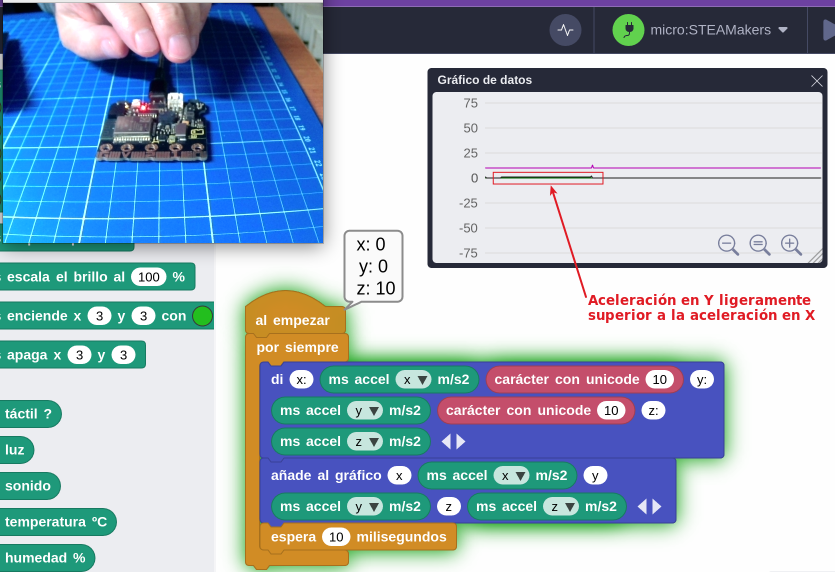  
*A04mB-Posición inicial*

**1. Aceleración en X.** En la animación siguiente vemos como se obtienen aceleraciones positivas y negativas respecto al eje X (verde) girando la placa en torno a ese eje.

  
*A04mB-Aceleración en X*

**1. Aceleración en Y.** En la animación siguiente vemos como se obtienen aceleraciones positivas y negativas respecto al eje X (gris oscuro) girando la placa en torno a ese eje.

  
*A04mB-Aceleración en Y*

**1. Aceleración en Z.** En la animación siguiente vemos como se obtienen aceleraciones positivas y negativas respecto al eje Z (gris oscuro) moviendo la placa en ese eje. Se parte del valor 10 que es el valor aproximado de la aceleración de la gravedad, que en realidad es de $g = 9,81 m/s^2$.

  
*A04mB-Aceleración en Z*

Se puede apreciar que al mover rapidamente la placa de forma ascendete la acelaración es positiva y si es descendente la aceleración es negativa.

## **A05mB-Luminosidad**
Programa para medir el nivel de luz como número devuelto por la placa micro:STEAMakers (0 a 1023) y convertido a porcentaje. En la imagen siguiente tenemos el programa.

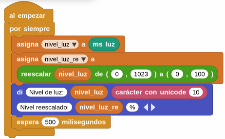  
*[A05mB-Luminosidad](../program/actividadesmB/A05mB-Luminosidad.ubp)*

A continuación vemos una animación de la actividad:

  
*A05_2mB-Luminosidad funcionando*

## **A06mB-Temperatura y humedad**
Programa para medir los valores de estas variables fśicas con el sensor que incorpora la placa micro:STEAMakers. En la imagen siguiente tenemos el programa.

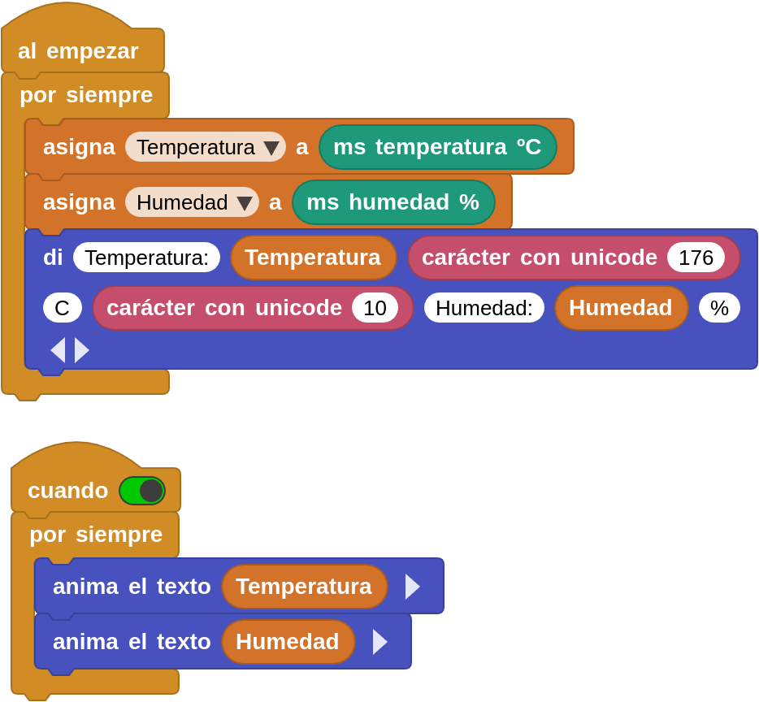  
*[A06mB-Temperatura y humedad](../program/actividadesmB/A06mB_Temperatura_humedad.ubp)*

A continuación vemos una animación que muestra el funcionamiento de la actividad:

  
*A06mB-Temperatura y humedad funcionando*

## **A07mB-Data Loggin**
En MicroBlocks el registro de datos está incorporado al botón "Gráfico" que es donde se visualizan los datos de forma gráfica y desde donde se pueden copiar o exportar como CSV haciendo clic derecho sobre el gráfico.

El programa va a crear un par de valores Temperatura/Humedad cada 5 segundos o cada vez que se pulse el botón A. Se irán mostrando gráficos según el instante en que se encuentra. Dos de los gráficos se han creado como funciones y se puede ocultar su definición. El programa es:

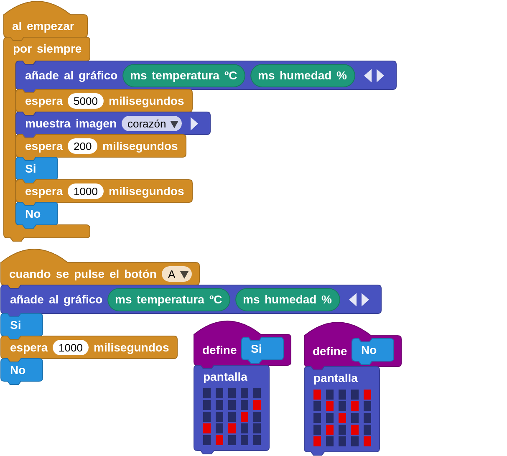  
*[A07mB-Data Loggin](../program/actividadesmB/A07mB_Data_Loggin.ubp)*

A continuación se ve el gráfico obtenido tras unos segundos y pulsaciones de A y los datos obtenidos:

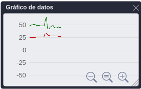{ align=left }

25, 49
25, 49
25, 49
25, 50
25, 50
25, 50
25, 50
25, 51
25, 51
25, 51
25, 51
25, 50
26, 50
26, 49
26, 49
26, 49
26, 49
26, 49
26, 49
26, 49
26, 48
26, 48
26, 48
26, 48
26, 48
26, 48
26, 48
26, 48
26, 48
29, 49
32, 55
32, 60
32, 63
33, 65
32, 55
31, 44
30, 42
29, 42
29, 42
29, 42
28, 45
28, 46
28, 46
28, 46
28, 48
28, 48
28, 49
28, 48
28, 46
28, 45
28, 44
28, 44

## **A08mB-Giroscopio**
Un programa dividido en dos que nos muestran por un lado las velocidades de giro en grados por segundo en cada eje y por otro las inclinaciones de 0 a 90º en los ejes X e Y y las mayores de 90º hasta los 180º denominadas down. En la imagen siguiente tenemos el programa.

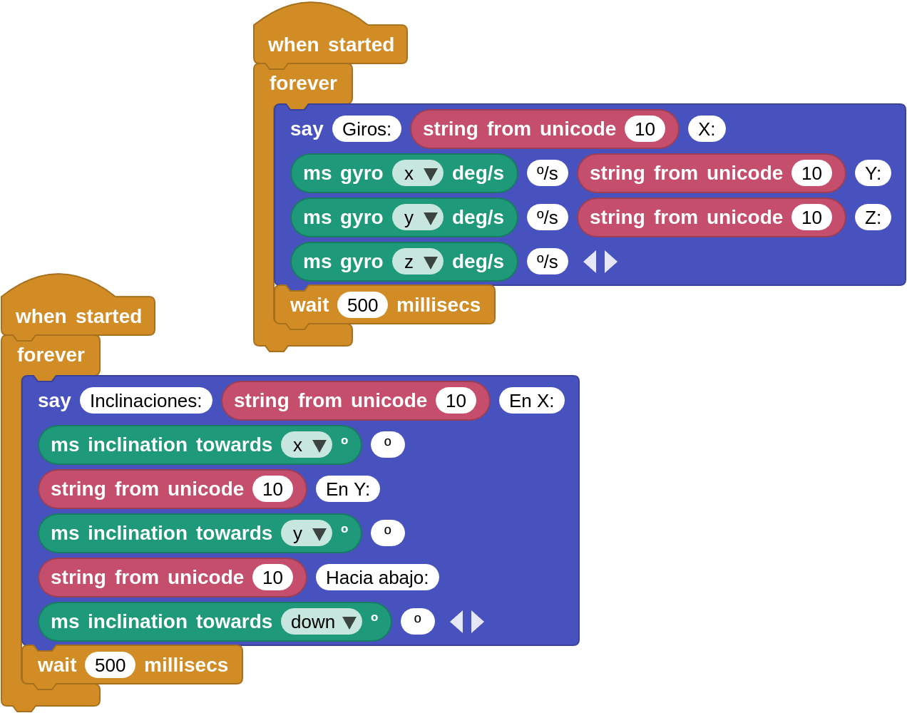  
*[A08mB-Giroscopio](../program/actividadesmB/A08mB_Giroscopio.ubp)*

A continuación vemos una animación que muestra el funcionamiento de la actividad:

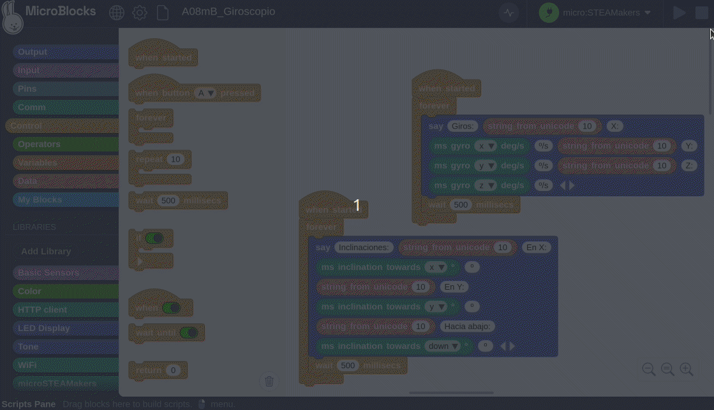  
*A08mB-Giroscopio funcionando*

## **A09mB-Energia**
Programa para medir los valores de tensión, corriente y potencia en la placa así como el consumo energético producido. Para variar ligeramente los valores, al accionar el pulsador A se encenderán todos los LEDs de la pantalla en color blanco y al pulsar el B se apagarán.

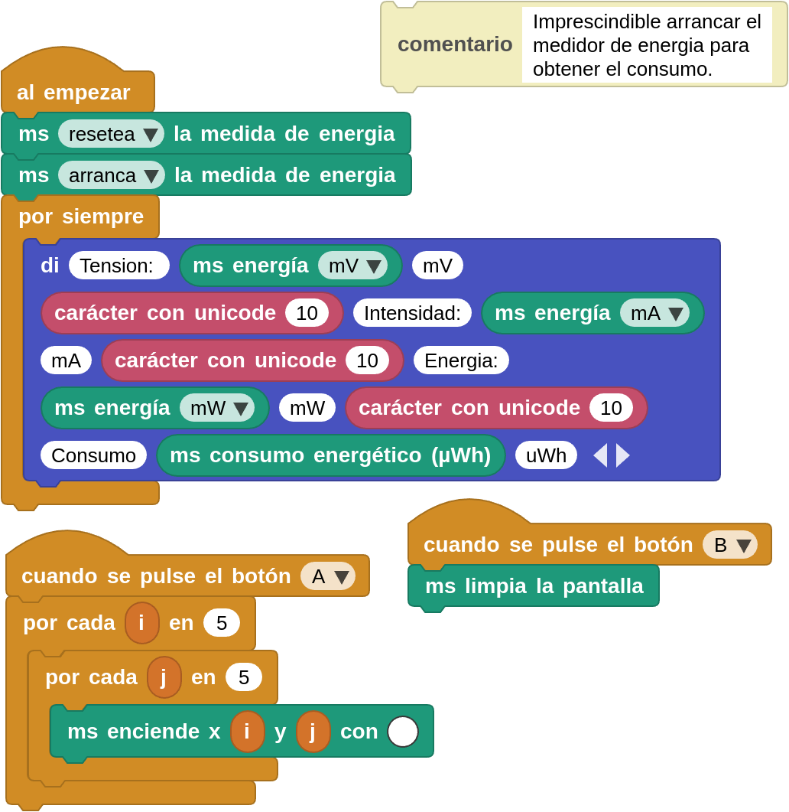  
*[A09mB-Energia](../program/actividadesmB/A09mB_Energia.ubp)*

A continuación vemos una animación que muestra el funcionamiento de la actividad:

  
*A09mB-Energia funcionando*

