## **A01sb-DHT22 y OLED I2C**
Vamos a utilizar un sensor de temperatura y humedad DHT22 para obtener los valores de los mismos y posteriormente mostrarlo en una pantalla OLED I2C de 0.96" de 128x64 pixels. Los datos se muestran o actualizan al pulsar el botón A de la micro:STEAMakers.

Material necesario

* Placa micro:STEAMakers
* Shield:bit con la micro:STEAMakers insertada en su ranura.
* Sensor DHT22
* Pantalla OLED I2C de 0.96"
* Cable I2C o 4 cables dupont hembra-hembra
* Cable SVG o 3 cables dupont hembra-hembra

Procedimiento

==**1.**== Conectamos la pantalla OLED a través de uno de los conjuntos de pines del hub I2C de la Shield:bit y el DHT22 al terminal P4 (io27).

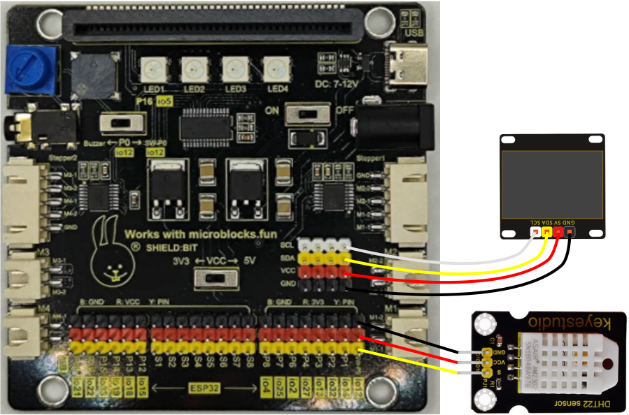  
*Esquema A01sb-DHT22 y OLED I2C*

!!! Warning "CUIDADO"
    Si utilizas cables dupont, controla que cada cable conecte los terminales correspondientes de la placa y de la pantalla (GND con GND, VCC con VCC, SCL con SCL y SDA con SDA).

    Si utilizas un conector I2C ten cuidado de respetar el orden de los pines, es decir, que las conexiones son las mismas que con cables individuales.

==**2.**== Inicia MicroBlocks en cualquiera de sus modos. Comenzamos por crear dos variables, una para la temperatura (T) y otra para la humedad (H).

==**3.**== Haz clic en el botón "Add Library" y en el directorio "Sensores" encontrarás la libreria "Temperature y Humidity (DHT11, DHT22) que hay que añadir a nuestro entorno.

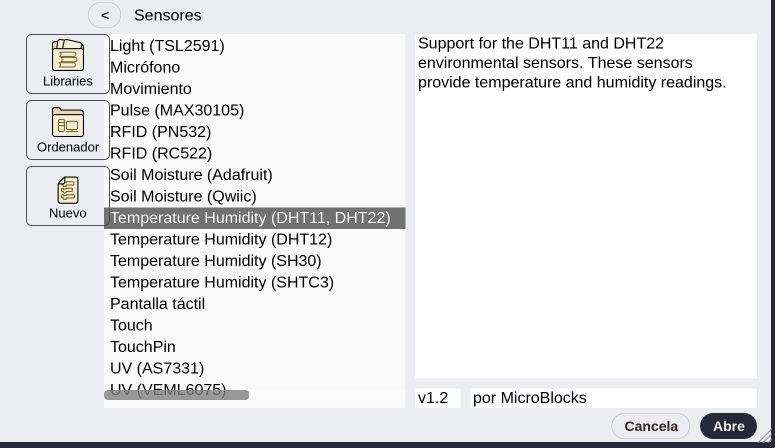  
*Libreria Temperature y Humidity (DHT11, DHT22)*

==**4.**== Asigna la lectura del sensor del DHTT22 a las variables creadas utilizando los bloques siguientes:

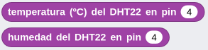  
*Bloques temperatura y humedad del DHT22*

==**5.**== Desde el directorio "Gráficos y pantallas" añadimos la libreria "OLED Graphics" para tener disponibles los bloques de manejo de la misma. Añade los bloques necesarios para crear el programa.

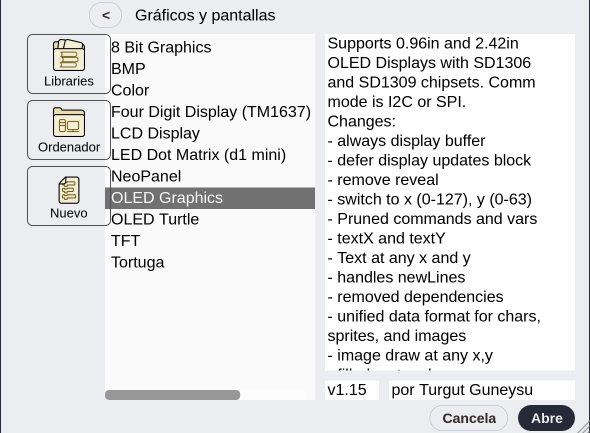  
*Libreria OLED Graphics*

En la imagen siguiente tenemos el programa.

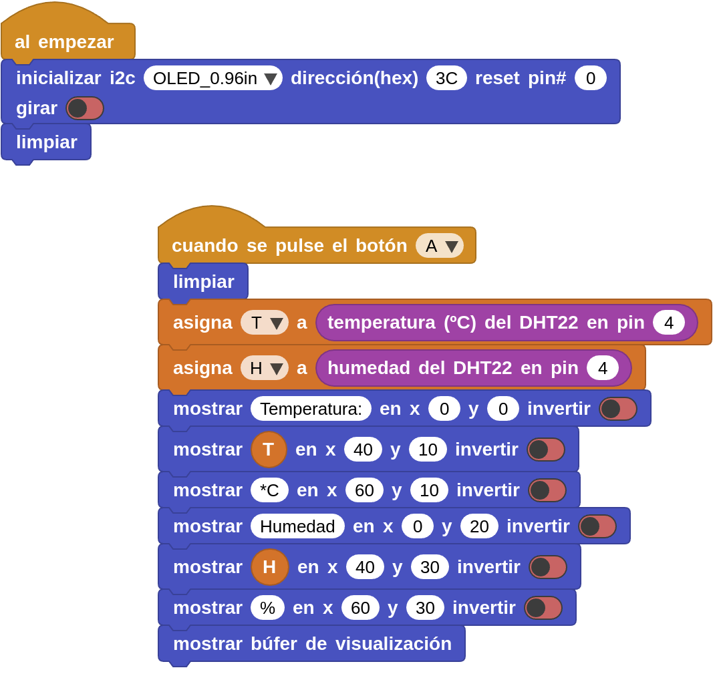  
*[A01sb-DHT22 y OLED I2C](../program/actividadesmB/A01sb-DHT22 y OLED I2C.ubp)*

## **A02sb-LEDs RGB. Parpadeo**
Vamos a hacer funcionar los 4 LEDs RGB que incorpora la placa Shiel:bit. Vamos a crear el clásico parpadeo de los 4 LEDs en el color por defecto que se efectue cada segundo.

Material necesario

* Placa micro:STEAMakers
* Shield:bit con la micro:STEAMakers insertada en su ranura.

Procedimiento

==**1.**== Inicia MicroBlocks en cualquiera de sus modos.

==**2.**== Haz clic en el botón "Add Library" y en el directorio "Kits y placas" encontrarás la libreria "Shielbit" que hay que añadir a nuestro entorno.

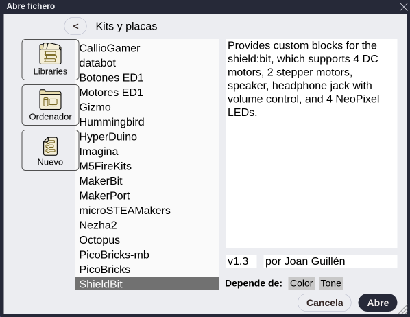  
*Libreria Shielbit*

==**3.**== En la imagen siguiente tenemos el programa.

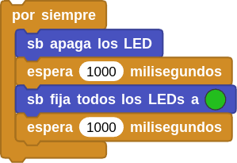  
*[A02sb-A02sb-LEDs RGB. Parpadeo](../program/actividadesmB/A02sb-LEDs RGB_Parpadeo.ubp)*

## **A03sb-LEDs RGB. Color aleatorio**
Vamos a hacer que al pulsar el botón A de la micro:STEAMakers se inicie un ciclo infinito que enciende cada LED de un color aleatorio a intervalos de un segundo. Tras encender el cuarto LED se apagarán todos y comienza de nuevo el ciclo, que se repetirá hasta que detengamos el programa.

Material necesario

* Placa micro:STEAMakers
* Shield:bit con la micro:STEAMakers insertada en su ranura.

Procedimiento

==**1.**== Inicia MicroBlocks en cualquiera de sus modos.

==**2.**== Haz clic en el botón "Add Library" y en el directorio "Kits y placas" encontrarás la libreria "Shielbit" que hay que añadir a nuestro entorno.

  
*Libreria Shielbit*

==**3.**== En la imagen siguiente tenemos el programa.

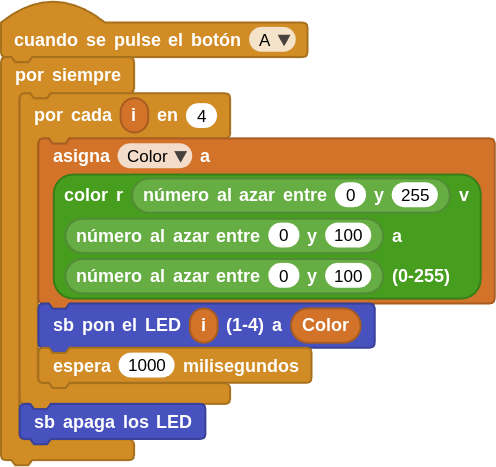  
*[A03sb-A02sb-LEDs RGB. Color aleatorio](../program/actividadesmB/A03sb-LEDs RGB_color_aleatorio.ubp)*

## **A04sb-LCD1602 I2C**
Vamos a mostrar en una LCD 1602 I2C los valores de tensión y corriente medidos por la micro:STEAMakers. Cuando ejecutamos el programa y mientras se están mostrando los valores los LEDs RGB estarámn iluminados en el color por defecto. Si queremos apagar los LEDs pulsamos el botón A.

Material necesario

* Placa micro:STEAMakers
* Shield:bit con la micro:STEAMakers insertada en su ranura.
* Pantalla LCD 1602 I2C
* Cable I2C o 4 cables dupont hembra-hembra

Procedimiento

==**1.**== Conectamos la pantalla LCD a través de uno de los conjuntos de pines del hub I2C de la Shield:bit y nos aseguramos de que el conmutador de tensión está en la posición 5V o la LCD no tendrá suficiente tensión para mostrar correctamente los caracteres. Esto último implica que se requiere alimentación externa en la Shield:bit.

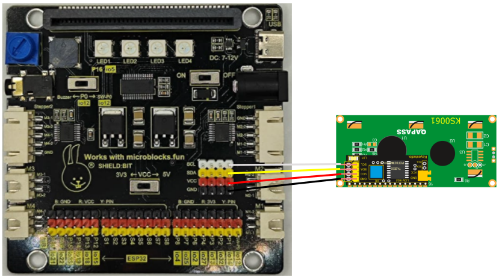  
*Esquema A04sb-LCD1602 I2C*

!!! Warning "CUIDADO"
    Si utilizas cables dupont, controla que cada cable conecte los terminales correspondientes de la placa y de la pantalla (GND con GND, VCC con VCC, SCL con SCL y SDA con SDA).

    Si utilizas un conector I2C ten cuidado de respetar el orden de los pines, es decir, que las conexiones son las mismas que con cables individuales.

==**2.**== Inicia MicroBlocks en cualquiera de sus modos. Comenzamos por crear dos variables, una para la tensión y otra para la intensidad.

==**3.**== Haz clic en el botón "Add Library" y añade la librería Shielbit y la microSTEAMakers si no están ya añadidas. Por defecto, cuando actualizamos el firmware de la placa y conectamos seleccionando micro:STEAMakers su libreria y dependiente se añaden por defecto, no así la Shielbit. Desde el directorio "Gráficos y pantallas" añadimos la libreria "LCD Display".

==**4.**== Asigna la lectura del sensor de energia de la micro:STEAMakers a las variables creadas utilizando los bloques siguientes:

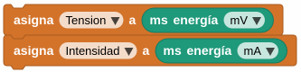  
*Bloques tensión e intensidad asignados a variables*

==**5.**==  Añade los bloques necesarios para crear el programa de la imagen siguiente:

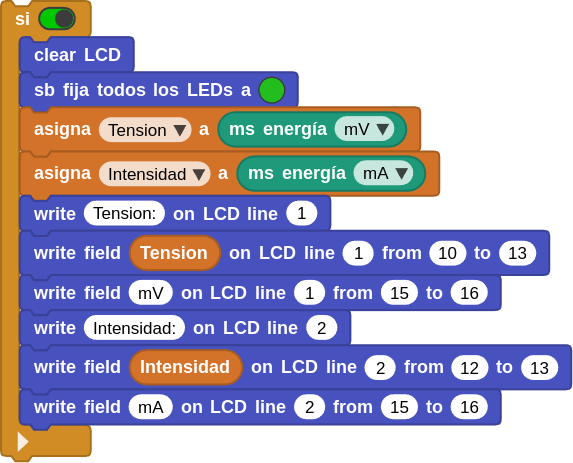  
*[A04sb-LCD1602 I2C](../program/actividadesmB/A04sb-A04sb-LCD1602 I2C.ubp)*

==**6.**== Recuerda poner en ON el interruptor de alimentación externa y en 5V el conmutador de tensión. En la animación siguiente vemos el programa en funcionamiento.

  
*A04sb-LCD1602 I2C*

## **A05sb-Melodias**
Crearemos una aplicación en la que si pulsamos el botón A sonará un trozo del politono Indy y si pulsamos el botón B un trozo de la marcha imperial de StarWars.

Material necesario

* Placa micro:STEAMakers
* Shield:bit con la micro:STEAMakers insertada en su ranura.
* Auriculares con jack de 3.5mm

Procedimiento

==**1.**== Inicia MicroBlocks en cualquiera de sus modos.

==**2.**== Haz clic en el botón "Add Library" y en el directorio "Kits y placas" encontrarás la libreria "Shielbit" que hay que añadir a nuestro entorno.

  
*Libreria Shielbit*

==**3.**== En la imagen siguiente tenemos el programa.

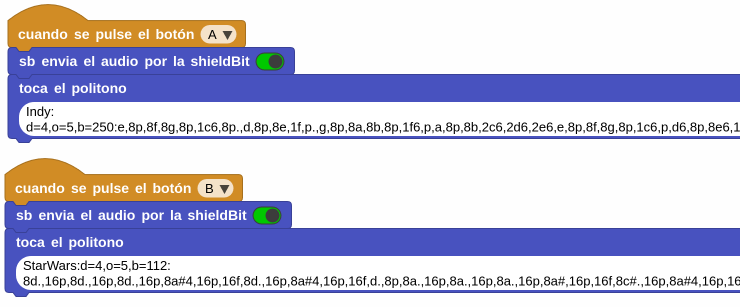  
*[A05sb-Melodias](../program/actividadesmB/A05sb-Melodias.ubp)*

==**4.**== Para probar el programa gira inicialmente el control de volumen totalmente a la izquierda y coloca el conmutador de sonido en su posición "Buzzer". Inserta los auriculares en el jack y ejecuta el programa pulsando cualquiera de los botones de la micro:STEAMakers. Ve girando el potenciómetro para aumentar el volumen hasta que escuches correctamente el sonido. Si es necesario pulsa de nuevo alguno de los botones.

## **A06sb-Sirena**
Crearemos una aplicación en la que de forma indefinida se reproduce una el sonido de una sirena con su frecuencia grave en 475Hz y la aguda en 1680Hz.

Material necesario

* Placa micro:STEAMakers
* Shield:bit con la micro:STEAMakers insertada en su ranura.

Procedimiento

==**1.**== Inicia MicroBlocks en cualquiera de sus modos.

==**2.**== Haz clic en el botón "Add Library" y en el directorio "Kits y placas" encontrarás la libreria "Shielbit" que hay que añadir a nuestro entorno. También necesitaremos la libreria "Tonos" que estará agregada si hemos conectado como microSTEAMakers.

  
*Libreria Shielbit*

==**3.**== En la imagen siguiente tenemos el programa.

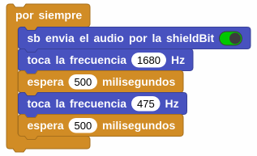  
*[A06sb-Sirena](../program/actividadesmB/A06sb-Sirena.ubp)*

==**4.**== Con el conmutador de sonido en posición Buzzer y el volumen al máximo escucharemos el sonido de una sirena cuando ejecutemos el programa. Para detener el sonido tenemos dos opciones:

1. Colocar el conmutador de sonido en la posición SW-P0 que pone la señal en el pin extendido io12 del conjunto de pines ESP32.
2. Cambiar el interruptor del bloque "sb envia el audio por la shuelkdBit" en posición desconectado.

EN DESARROLLO ***********************************************