## **A01sb-DHT22 y OLED I2C**
Vamos a utilizar un sensor de temperatura y humedad DHT22 para obtener los valores de los mismos y posteriormente mostrarlo en una pantalla OLED I2C de 0.96" de 128x64 pixels. Los datos se muestran o actualizan al pulsar el botón A de la micro:STEAMakers.

Material necesario

* Placa micro:STEAMakers
* Shield:bit con la micro:STEAMakers insertada en su ranura.
* Sensor DHT22
* Pantalla OLED I2C de 0.96"
* Cable I2C o 4 cables dupont hembra-hembra
* Cable SVG o 3 cables dupont hembra-hembra

Procedimiento

==**1.**== Conectamos la pantalla OLED a través de uno de los conjuntos de pines del hub I2C de la Shield:bit y el DHT22 al terminal P4 (io27).

  
*Esquema A01sb-DHT22 y OLED I2C*

!!! Warning "CUIDADO"
    Si utilizas cables dupont, controla que cada cable conecte los terminales correspondientes de la placa y de la pantalla (GND con GND, VCC con VCC, SCL con SCL y SDA con SDA).

    Si utilizas un conector I2C ten cuidado de respetar el orden de los pines, es decir, que las conexiones son las mismas que con cables individuales.

==**2.**== Inicia MicroBlocks en cualquiera de sus modos. Comenzamos por crear dos variables, una para la temperatura (T) y otra para la humedad (H).

==**3.**== Haz clic en el botón "Add Library" y en el directorio "Sensores" encontrarás la libreria "Temperature y Humidity (DHT11, DHT22) que hay que añadir a nuestro entorno.

  
*Libreria Temperature y Humidity (DHT11, DHT22)*

==**4.**== Asigna la lectura del sensor del DHTT22 a las variables creadas utilizando los bloques siguientes:

  
*Bloques temperatura y humedad del DHT22*

==**5.**== Desde el directorio "Gráficos y pantallas" añadimos la libreria "OLED Graphics" para tener disponibles los bloques de manejo de la misma. Añade los bloques necesarios para crear el programa.

  
*Libreria OLED Graphics*

En la imagen siguiente tenemos el programa.

  
*[A01sb-DHT22 y OLED I2C](../program/actividadesmB/A01sb-DHT22 y OLED I2C.ubp)*

## **A02sb-LEDs RGB. Parpadeo**
Vamos a hacer funcionar los 4 LEDs RGB que incorpora la placa Shiel:bit. Vamos a crear el clásico parpadeo de los 4 LEDs en el color por defecto que se efectue cada segundo.

Material necesario

* Placa micro:STEAMakers
* Shield:bit con la micro:STEAMakers insertada en su ranura.

Procedimiento

==**1.**== Inicia MicroBlocks en cualquiera de sus modos.

==**2.**== Haz clic en el botón "Add Library" y en el directorio "Kits y placas" encontrarás la libreria "Shielbit" que hay que añadir a nuestro entorno.

  
*Libreria Shielbit*

==**3.**== En la imagen siguiente tenemos el programa.

  
*[A02sb-A02sb-LEDs RGB. Parpadeo](../program/actividadesmB/A02sb-LEDs RGB_Parpadeo.ubp)*

## **A03sb-LEDs RGB. Color aleatorio**
Vamos a hacer que al pulsar el botón A de la micro:STEAMakers se inicie un ciclo infinito que enciende cada LED de un color aleatorio a intervalos de un segundo. Tras encender el cuarto LED se apagarán todos y comienza de nuevo el ciclo, que se repetirá hasta que detengamos el programa.

Material necesario

* Placa micro:STEAMakers
* Shield:bit con la micro:STEAMakers insertada en su ranura.

Procedimiento

==**1.**== Inicia MicroBlocks en cualquiera de sus modos.

==**2.**== Haz clic en el botón "Add Library" y en el directorio "Kits y placas" encontrarás la libreria "Shielbit" que hay que añadir a nuestro entorno.

  
*Libreria Shielbit*

==**3.**== En la imagen siguiente tenemos el programa.

  
*[A03sb-A02sb-LEDs RGB. Color aleatorio](../program/actividadesmB/A03sb-LEDs RGB_color_aleatorio.ubp)*

## **A04sb-LCD1602 I2C**
Vamos a mostrar en una LCD 1602 I2C los valores de tensión y corriente medidos por la micro:STEAMakers. Cuando ejecutamos el programa y mientras se están mostrando los valores los LEDs RGB estarámn iluminados en el color por defecto. Si queremos apagar los LEDs pulsamos el botón A.

Material necesario

* Placa micro:STEAMakers
* Shield:bit con la micro:STEAMakers insertada en su ranura.
* Pantalla LCD 1602 I2C
* Cable I2C o 4 cables dupont hembra-hembra

Procedimiento

==**1.**== Conectamos la pantalla LCD a través de uno de los conjuntos de pines del hub I2C de la Shield:bit y nos aseguramos de que el conmutador de tensión está en la posición 5V o la LCD no tendrá suficiente tensión para mostrar correctamente los caracteres. Esto último implica que se requiere alimentación externa en la Shield:bit.

  
*Esquema A04sb-LCD1602 I2C*

!!! Warning "CUIDADO"
    Si utilizas cables dupont, controla que cada cable conecte los terminales correspondientes de la placa y de la pantalla (GND con GND, VCC con VCC, SCL con SCL y SDA con SDA).

    Si utilizas un conector I2C ten cuidado de respetar el orden de los pines, es decir, que las conexiones son las mismas que con cables individuales.

==**2.**== Inicia MicroBlocks en cualquiera de sus modos. Comenzamos por crear dos variables, una para la tensión y otra para la intensidad.

==**3.**== Haz clic en el botón "Add Library" y añade la librería Shielbit y la microSTEAMakers si no están ya añadidas. Por defecto, cuando actualizamos el firmware de la placa y conectamos seleccionando micro:STEAMakers su libreria y dependiente se añaden por defecto, no así la Shielbit. Desde el directorio "Gráficos y pantallas" añadimos la libreria "LCD Display".

==**4.**== Asigna la lectura del sensor de energia de la micro:STEAMakers a las variables creadas utilizando los bloques siguientes:

  
*Bloques tensión e intensidad asignados a variables*

==**5.**==  Añade los bloques necesarios para crear el programa de la imagen siguiente:

  
*[A04sb-LCD1602 I2C](../program/actividadesmB/A04sb-A04sb-LCD1602 I2C.ubp)*

==**6.**== Recuerda poner en ON el interruptor de alimentación externa y en 5V el conmutador de tensión. En la animación siguiente vemos el programa en funcionamiento.

  
*A04sb-LCD1602 I2C*

## **A05sb-Melodias**
Crearemos una aplicación en la que si pulsamos el botón A sonará un trozo del politono Indy y si pulsamos el botón B un trozo de la marcha imperial de StarWars.

Material necesario

* Placa micro:STEAMakers
* Shield:bit con la micro:STEAMakers insertada en su ranura.
* Auriculares con jack de 3.5mm
* Opcionalmente podemos conectar un pequeño altavoz tipo hamburguesa como el de la imagen siguiente:

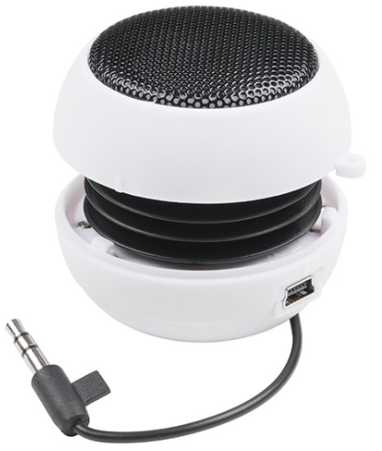  
*Altavoz miniatura tipo hamburguesa*

Procedimiento

==**1.**== Inicia MicroBlocks en cualquiera de sus modos.

==**2.**== Haz clic en el botón "Add Library" y en el directorio "Kits y placas" encontrarás la libreria "Shielbit" que hay que añadir a nuestro entorno.

  
*Libreria Shielbit*

==**3.**== En la imagen siguiente tenemos el programa.

  
*[A05sb-Melodias](../program/actividadesmB/A05sb-Melodias.ubp)*

==**4.**== Para probar el programa gira inicialmente el control de volumen totalmente a la izquierda y coloca el conmutador de sonido en su posición "Buzzer". Inserta los auriculares en el jack y ejecuta el programa pulsando cualquiera de los botones de la micro:STEAMakers. Ve girando el potenciómetro para aumentar el volumen hasta que escuches correctamente el sonido. Si es necesario pulsa de nuevo alguno de los botones.

==**5.**== En el video siguiente se puede ver y escuchar el resultado de la pulsación de ambos botones cuando se conecta un altavoz tipo hamburguesa a la placa Shiel:Bit.

<iframe width="740" height="420" src="https://www.youtube.com/embed/jvwYHHEe9ic?si=xFfRdcNmS7HMx3Pp" title="YouTube video player" frameborder="0" allow="accelerometer; autoplay; clipboard-write; encrypted-media; gyroscope; picture-in-picture; web-share" referrerpolicy="strict-origin-when-cross-origin" allowfullscreen></iframe>

## **A06sb-Sirena**
Crearemos una aplicación en la que de forma indefinida se reproduce una el sonido de una sirena con su frecuencia grave en 475Hz y la aguda en 1680Hz.

Material necesario

* Placa micro:STEAMakers
* Shield:bit con la micro:STEAMakers insertada en su ranura.

Procedimiento

==**1.**== Inicia MicroBlocks en cualquiera de sus modos.

==**2.**== Haz clic en el botón "Add Library" y en el directorio "Kits y placas" encontrarás la libreria "Shielbit" que hay que añadir a nuestro entorno. También necesitaremos la libreria "Tonos" que estará agregada si hemos conectado como microSTEAMakers.

  
*Libreria Shielbit*

==**3.**== En la imagen siguiente tenemos el programa.

  
*[A06sb-Sirena](../program/actividadesmB/A06sb-Sirena.ubp)*

==**4.**== Con el conmutador de sonido en posición Buzzer y el volumen al máximo escucharemos el sonido de una sirena cuando ejecutemos el programa. Para detener el sonido tenemos dos opciones:

1. Colocar el conmutador de sonido en la posición SW-P0 que pone la señal en el pin extendido io12 del conjunto de pines ESP32.
2. Cambiar el interruptor del bloque "sb envia el audio por la shuelkdBit" en posición desconectado.

## **A07sb-Control de un motor DC**
Vamos a hacer que mientras se mantiene pulsado el botón A el motor gire a muy baja velocidad en sentido horario mientras se muestra en la pantalla un letra "H" y mientras se mantiene pulsado el botón B el motor gire a máxima velocidad en sentido antihorario mientras se muestra el carácter A por pantalla. Si no estamos pulsando alguno de los botones el motor estará parado y la pantalla en negro.

Material necesario

* Placa micro:STEAMakers
* Shield:bit con la micro:STEAMakers insertada en su ranura.
* Motor DC amarillo con conector JST hembra de paso 2mm
* Cable con conectores hembra de paso 2 y 2.54 mm.

Procedimiento

==**1.**== Conectamos el motor al conector M1

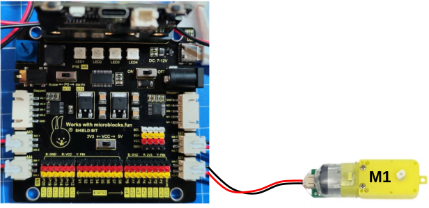  
*Esquema A07sb-Control de un motor DC*

!!! Warning "CUIDADO"
    Fijate bien y observa que los conectores del cable del motor son muy parecidos pero no iguales porque uno es algo mas pequeño que el otro. El de mayor tamaño va al conector de la Shield:bit y el mas pequeño al del motor.

    Además los conectores tienen una posición en la que entran con poca presión en su lugar. No fuerces en ningún caso porque los puedes dejar inservibles. Fíjate que el conector macho que va a la placa lleva dos resaltes a modo de guías que deben orientarse a las ranuras del conector hembra de la placa.

==**2.**== Inicia MicroBlocks en cualquiera de sus modos. Conecta la placa a un puerto USB y "actualiza el firmware de la placa" si es necesario para establecer la conexión.

==**3.**== Haz clic en el botón "Add Library" y en el directorio "Kits y placas" encontrarás la libreria "Shieldbit" que hay que añadir a nuestro entorno. Si es necesario, no debería serlo, agrega manualmente la libreria microSTEAMakers.

==**4.**== Crea el programa para el botón A. Para ello, desde el menú "Control" arrastra un bloque sobrero "cuando" y un bloque "si" a la zona de programa. Desde el menú "Entrada" arrastra el bloque "Botón A" y colocalo en la condición del bloque "si". Expande el bloque "si" haciendo clic sobre el triángulo. La situación en este momento debe ser así:

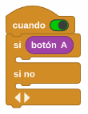  
*A07sb-Control de un motor DC*

==**5.**== Desde la libreria "Shielbit" arrastra el bloque "sb turn DC M-..." y colócalo en la parte cierta del condicional. Deja el número de motor en "1" y el sentido de giro como "sentido horario". Ajusta la velocidad de giro al 25%. Valores inferiores al 25% pueden provocar que el motor no gire. Ahora selecciona la libreria "Pantalla LED" y arrastra un bloque "pantalla" para colocarlo justo debajo del anterior. La situación en este momento debe ser así:

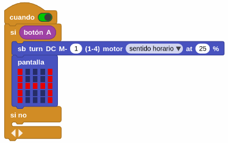  
*A07sb-Control de un motor DC*

==**6.**== Desde la libreria "Shieldbit" coloca, en la parte de falso, un bloque "sb stop..." y deja la opción "todos los motores". Desde la libreria "microSTEAMakers" coloca a continuación un bloque "ms limpia la pantalla". Aunque el programa puede funcionar sin estos dos bloques, se colocan para asegurar que ocurre lo uqe pretendemos cuando no se está pulsando el botón A. La situación en este momento debe ser así:

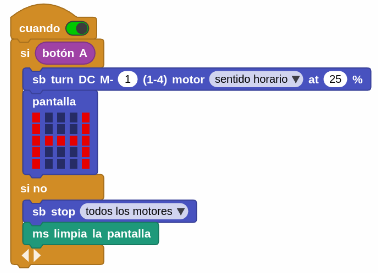  
*A07sb-Control de un motor DC*

==**7.**== Crea el programa de control para el botón B. El proceso es totalmente similar al del botón A pero en este caso en el bloque "sb turn DC M-..." seleccionamos "sentido antihorario" y establecemos la velocidad de giro en el 100%. En lugar de un bloque "pantalla" ahora colocamos un bloque "muestra carácter..." y colocamos en el mismo una letra "A" mayúscula.

En la imagen siguiente tenemos el programa completo.

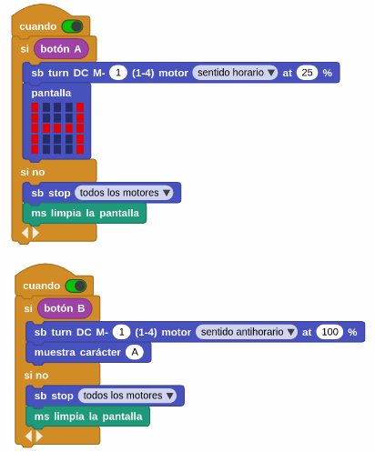  
*[A07sb-Control de un motor DC](../program/actividadesmB/un_motor_DC.ubp)*

!!! info "Advertencia"
    Si el motor no gira, además de revisar que está conectado en el lugar correcto, es posible que debas alimentar la placa Shield:bit externamente y colocar en interruptor de alimentación en la posición ON. Esto sería debido a que la micro:STEAMakers conectado a un puerto USB no puede suministrar toda la corriente necesaria para hacer funcionar al motor desde ese puerto USB.

==**8.**== En la animación siguiente podemos apreciar el funcionamiento del programa.

  
*A07sb-Control de un motor DC*

## **A08sb-Felicitacion**
Dadas las fechas en que se crea esta actividad se me ocurrió crear una felicitación navideña con 4 motores que reaccionarán a las pulsaciones de los botones A y B mientras se muestran mensajes y animaciones por la pantalla.

Material necesario

* Placa micro:STEAMakers
* Shield:bit con la micro:STEAMakers insertada en su ranura.
* Cuatro motores DC amarillo con conector JST hembra de paso 2mm.
* Cable con conectores hembra de paso 2 y 2.54 mm.

!!! Note
    **La actividad se puede realizar con un menor número de motores.**

Procedimiento

==**1.**== Conectamos los motores  a los conectores M1, M2, M3 y M4

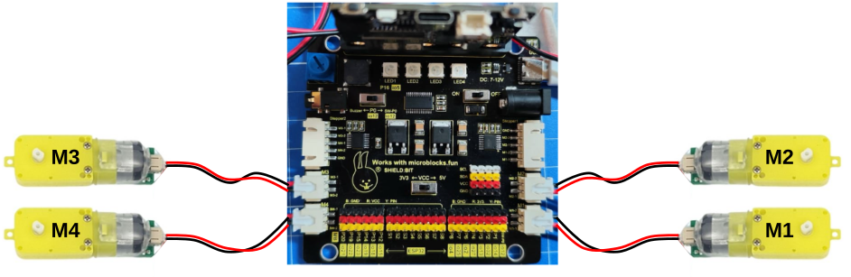  
*Esquema A08sb-Felicitacion*

!!! Warning "CUIDADO"
    Fijate bien y observa que los conectores del cable del motor son muy parecidos pero no iguales porque uno es algo mas pequeño que el otro. El de mayor tamaño va al conector de la Shield:bit y el mas pequeño al del motor.

    Además los conectores tienen una posición en la que entran con poca presión en su lugar. No fuerces en ningún caso porque los puedes dejar inservibles. Fíjate que el conector macho que va a la placa lleva dos resaltes a modo de guías que deben orientarse a las ranuras del conector hembra de la placa.

==**2.**== Inicia MicroBlocks en cualquiera de sus modos. Conecta la placa a un puerto USB y "actualiza el firmware de la placa" si es necesario para establecer la conexión.

==**3.**== Haz clic en el botón "Add Library" y en el directorio "Kits y placas" encontrarás la libreria "Shieldbit" que hay que añadir a nuestro entorno. Si es necesario, no debería serlo, agrega manualmente la libreria microSTEAMakers.

==**4.**== Arrastra de "Control" un bloque "al empezar" y coloca debajo del mismo un bloque "ms escala el brillo..." para ajustar el mismo al valor que quieras. Arrastra también un bloque "di 'texto'..." del menú salida y configuralo como se ve en la imagen siguiente. El bloque "ms energia..." se encuentra en la libreria "microSTEAMakers" y el bloque "carácter con unicode 10" (salto de línea) en el menú "Datos".

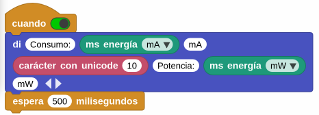  
*A08sb-Felicitacion. Bloque "cuando..."*

==**5.**== Crea los programas para el botón A y para el botón B. En la imagen siguiente tenemos el programa completo.

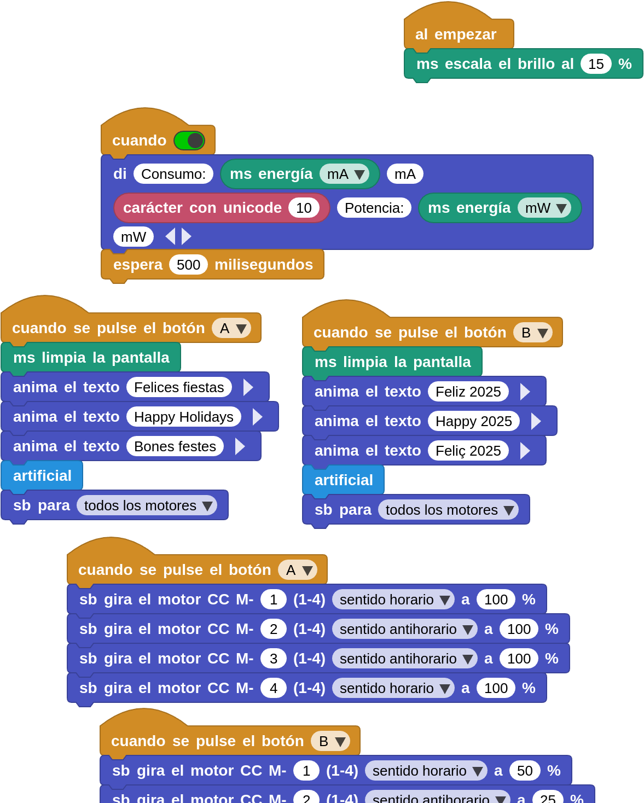  
*[A08sb-Felicitacion](../program/actividadesmB/A08sb-felicitacion_4_motores.ubp)*

!!! info "Advertencias"
    1. En el programa que se descarga del enlace existe un bloque "artificial" que no es mas que una función con la definición del estallido de un fuego artificial. Se hace así para simplificar el programa general.
    2. Si el motor no gira, además de revisar que está conectado en el lugar correcto, es posible que debas alimentar la placa Shield:bit externamente y colocar en interruptor de alimentación en la posición ON. Esto sería debido a que la micro:STEAMakers conectado a un puerto USB no puede suministrar toda la corriente necesaria para hacer funcionar al motor desde ese puerto USB.

==**6.**== En la animación siguiente podemos apreciar el funcionamiento del programa al pulsar el botón A.

  
*A08sb-Felicitacion. Botón A*

==**6.**== En la animación siguiente podemos apreciar el funcionamiento del programa al pulsar el botón A.

  
*A08sb-Felicitacion. Botón B*

## **A09sb-Motor PaP**
Activar el funcionamiento de dos motores paso a paso por la pulsación de los botones A o B.

Material necesario

* Placa micro:STEAMakers
* Shield:bit con la micro:STEAMakers insertada en su ranura.
* Dos motores paso a paso con conector JST hembra de paso 2mm.

Procedimiento

==**1.**== Conectamos los motores  a los conectores Stepper1 y Stepper2.

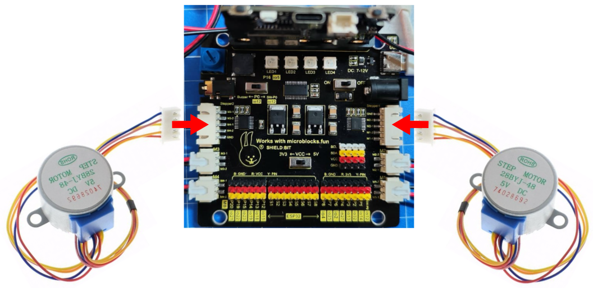  
*Esquema A09sb-Motor PaP*

!!! Warning "CUIDADO"
    El conector tiene una posición en la que entra con poca presión en su lugar. No fuerces en ningún caso porque lo puedes dejar inservible. Fíjate que el conector macho que va a la placa lleva dos resaltes a modo de guías que deben orientarse a las ranuras del conector hembra de la placa.

==**2.**== Inicia MicroBlocks en cualquiera de sus modos. Conecta la placa a un puerto USB y "actualiza el firmware de la placa" si es necesario para establecer la conexión.

==**3.**== Haz clic en el botón "Add Library" y en el directorio "Kits y placas" encontrarás la libreria "Shieldbit" que hay que añadir a nuestro entorno. Si es necesario, no debería serlo, agrega manualmente la libreria microSTEAMakers.

==**4.**== Se crean cuatro scripts muy similares para que al pulsar el botón A gire el motor conectado al Sepper1 2 vueltas en sentido horario y el conectado al Stepper2 otras dos en sentido antihorario. La otra pareja de scripts hace exactamente lo mismo pero en esta ocasión los motores giran 180 grados. Un quinto script realiza de forma permanente la consulta de si el botón táctil se ha tocado y si es afirmativo se detienen los motores. En la imagen siguiente tenemos el programa completo.

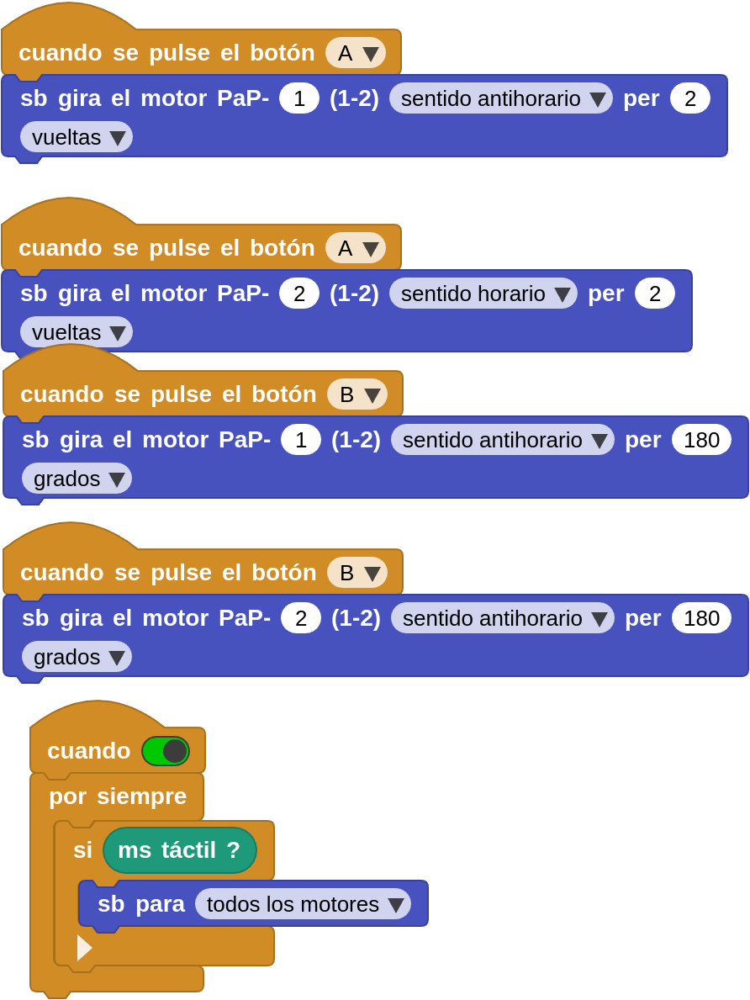  
*[A09sb-Motor PaP](../program/actividadesmB/A09sb-motores_PaP.ubp)*

==**6.**== En la animación siguiente podemos apreciar el funcionamiento del programa al pulsar cualquiera de los botones.

  
*A09sb-Motor PaP*

## **A10sb-Servos**
Activar el funcionamiento de tres servomotores capaces de girar entre cero y 180 grados para situar dos de ellos en posición inicial (0º), giro máximo (180º) y posición intermedia (90º) mientras se muestran gráficos definitorios de la posición en la pantalla. El tercer servo parte de su posición inicial y realiza un recorrido grado a grado de sus 180 grados y cuando llega a esa posición vuelve al inicio y repite la acción

Material necesario

* Placa micro:STEAMakers
* Shield:bit con la micro:STEAMakers insertada en su ranura.
* Tres servos de 180º.

Procedimiento

==**1.**== Conectamos los servos a S1, S2 y S3.

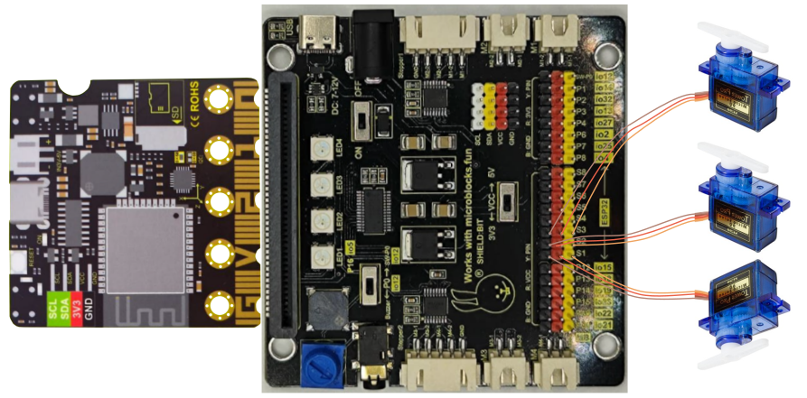  
*Esquema A10sb-Servos*

!!! Warning "CUIDADO"
    El terminal del servo es posible conectarlo en dos posiciones pero debemos siempre tener la precaución de que el color marrón coincida con la posición de GND. Fíjate bien a la hora de conectar los servos porque una conexión errónea puede provocar averias irreversibles.

==**2.**== Inicia MicroBlocks en cualquiera de sus modos. Conecta la placa a un puerto USB y "actualiza el firmware de la placa" si es necesario para establecer la conexión.

==**3.**== Haz clic en el botón "Add Library" y en el directorio "Kits y placas" encontrarás la libreria "Shieldbit" que hay que añadir a nuestro entorno. Si es necesario, no debería serlo, agrega manualmente la libreria microSTEAMakers.

==**4.**== Se crean varios scripts para que al pulsar el botón A giren los dos primeros servos hasta la posición 180º y cuando se pulsa el bvotón B que se coloquen en posición 90º. El bloque "al empeza" colocará a todos los servos en posición 0º al igual que cuando se toca el botón táctil. Existe un bloque cuando que si es verdadero ejecuta un bucle que realiza el recorrido 0 a 180 del tercer servo y si está en falso el servo estará parado.

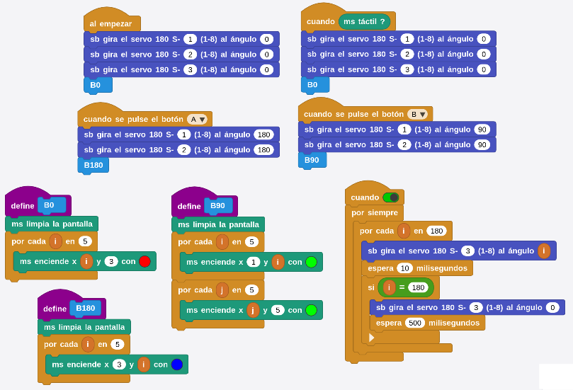  
*[A10sb-Servos](../program/actividadesmB/A10sb-Servos.ubp)*

En la imagen anterior podemos apreciar la definición de los bloques para los gráficos.

==**6.**== En la animación siguiente podemos apreciar el funcionamiento del programa al pulsar cualquiera de los botones.

  
*A10sb-Servos*

