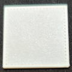
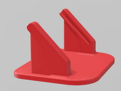
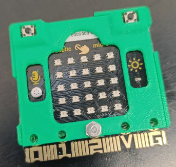

# **Elementos auxiliares 3D**
Algunos elementos que pueden resultar útiles en el uso diario de la placa.

* [Filtro](./3D/Filtro_NeoMatrix/filtro.stl) impreso en 3D para que los LEDs deslumbren menos

* Soporte [Micro:Steamakers Stand](https://github.com/maynej/Micro-Steamakers-Stand) creado por [Jordi Mayné](https://github.com/maynej)

* [Caja protectora para placa ESP32 micro:STEAMakers](https://www.printables.com/model/1257394-esp32microsteamakers-box/files) creada por [OPCION3D](http://www.opcion3d.com/#top)

