## **Introducción**
Los módulos Bluetooth permiten crear conexión inalámbrica serie punto a punto de manera que la forma de trabajar es muy similar a la comunicación serie por cable. A continuación vemos lo básico de los módulos más comunes.

Bluetooth es una especificación industrial para Redes Inalámbricas de Área Personal (WPAN) que posibilita la transmisión de voz y datos entre diferentes dispositivos mediante un enlace por radiofrecuencia en la banda ISM de los 2.4 a 2.485 GHz. Los principales objetivos que se pretenden conseguir con esta norma son:

* Facilitar las comunicaciones entre equipos móviles.
* Eliminar los cables y conectores entre estos.
* Ofrecer la posibilidad de crear pequeñas redes inalámbricas y facilitar la sincronización de datos entre equipos personales.

Se denomina Bluetooth al protocolo de comunicaciones diseñado especialmente para dispositivos de bajo consumo, que requieren corto alcance de emisión y basados en transceptores (dispositivos que cuentan con transmisor y receptor compartiendo parte de la circuiteria) de bajo costo.

El hardware que compone el dispositivo Bluetooth está compuesto por dos partes:

* un dispositivo de radio, encargado de modular y transmitir la señal.
* un controlador digital, compuesto por una CPU, un procesador de señales digitales (DSP – Digital Signal Processor) llamado Link Controller (o controlador de Enlace) y de las interfaces con el dispositivo anfitrión.

Su logotipo lo vemos en la figura siguiente:

  
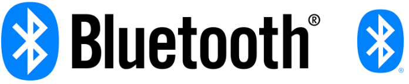.  
*Logotipo Bluetooth con texto y sin texto*

## **Bluetooth V2**
Existe un procedimiento definido que se llama Pairing (o emparejamiento) que vincula a dos dispositivos Bluetooth. Cuando vinculamos dos dispositivos Bluetooth, se inicia un proceso en el que ellos se identifican por nombre y dirección interna y se solicitan la clave PIN para autorizar la conexión.

Si el emparejamiento se realiza con éxito, ambos nodos suelen guardar la identificación del otro y cuando se encuentran cerca se vuelven a vincular sin necesidad de intervención manual.

Para manejar los módulos Bluetooth se utilizan los comandos Hayes o AT, de los que se puede encontrar información en este [enlace](https://es.wikipedia.org/wiki/Conjunto_de_comandos_Hayes) y a continuación damos algunos básicos:

* AT+VERSION: Versión del Firmware.
* AT+NAMEXXX: Para establecer el nombre que queremos presentar cuando otro dispositivo nos busque.
* AT+PINXXXX: permite establecer el número de identificación personal, que se requerirá para establecer la vinculación.
* AT+BAUDX: Permite fijar la velocidad de comunicación entre el modulo y la consola según los siguientes pares:

    1 -> 1200 bps | -5 -> 19200 bps

    2 -> 2400 bps | -6 -> 38400 bps

    3 -> 4800 bps | -7 -> 57600 bps

    4 -> 9600 bps | -8 -> 115200 bps

La velocidad por defecto es la de 9600 bps.

Los módulos mas conocidos son el HC-05 y HC-06 que son Bluetooth V2 y cuyo aspecto podemos ver en la figura siguiente:

  
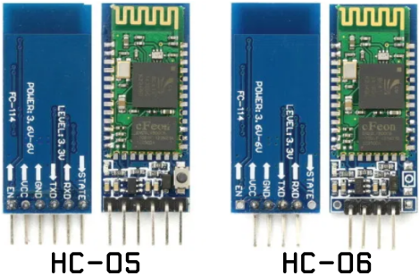.  
*Módulos HC-05 y HC-06*

## **BT 4.0, Low Energy (BLE) o Smart**
En realidad BLE se introduce como parte de la especificación Bluetooth 4.0. En la web podemos encontrar mucha información sobre el tema habitualmente poco accesible y poco estructurada.

Desde aquí voy a recomendar el artículo ***“Introduction to Bluetooth Low Energy: A basic overview of key concepts for BLE”*** publicado por [Adafruit](https://www.adafruit.com/) donde se hace un repaso de los conceptos en los que se basa BLE y su traducción libre ***"Bluetooth BLE: el conocido desconocido"*** publicada por [Izertis](https://ahorasomos.izertis.com/solidgear/author/izertis-s-a/):

* Enlace al original: “[Introduction to Bluetooth Low Energy: A basic overview of key concepts for BLE](https://learn.adafruit.com/introduction-to-bluetooth-low-energy/introduction)”
* Enlace a la traducción libre: "[Bluetooth BLE: el conocido desconocido](https://ahorasomos.izertis.com/solidgear/bluetooth-ble-el-conocido-desconocido/)"

  
.  
*Logotipo BLE*

Básicamente se trata de un nuevo protocolo diseñado para reducir en todo lo posible el gran consumo de energía de sus predecesores. Generalmente se le conoce como BLE (iniciales de Bluetooth Low Energy) o Bluetooth LE o también como Bluetooth Smart y tienen un consumo típico que podemos cifrar entre los 10 y 15 mA. Otra de sus principales novedades radica en que este módulo si es utilizables con dispositivos iOS.

El BLE es un subconjunto del estándar Bluetooth v4.0 que dispone de una pila de protocolos en referencia a la capa OSI (en inglés, Open Systems Interconnection) completamente nueva y orientada a conexiones sencillas en aplicaciones de muy baja potencia que suelen funcionar con pilas o baterías.

La pila de protocolos para Bluetooth Low Energy sigue la estructura definida en la figura siguiente.

  
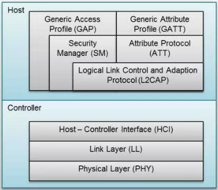.  
*Pila de protocolos para BLE*

El controlador aloja las capas inferiores de la pila del protocolo y también la radio. El Hots contiene las capas superiores de la pila de protocolos. Por encima de ambas estaría la aplicación de usuario que es la que interactúa con la pila de protocolos. La ventaja es que todas estas capas se pueden implementar en un solo chip o dividir en varios y conectarlos a través de una capa de comunicaciones como UART, USB o SPI.

* El controlador contiene las capas: Interfaz de controlador de host (HCI), Capa de enlace (LL) y Capa física (PHY)

    * En la capa física (physical layer) se implementa toda la circuiteria de comunicaciones. La tecnología BLE puede usar hasta 40 canales de 2MHz en la banda ISM. El estándar emplea la técnica “frequency hopping” o “saltos en frecuencia”, siguiendo una secuencia de saltos pseudo-aleatorios entre los canales frecuenciales mencionados que ofrece un alto grado de robustez frente a interferencias.
    * La capa de enlace (link layer), se encarga de gestionar características como los requerimientos temporales del estándar, chequeo de mensajes y reenvío de mensajes erróneos recibidos, gestión, filtrado de direcciones etc. Además ofrece la definición de roles (Advertiser, Scanner, Master and Slave) que permiten identificar de forma lógica el rol de cada dispositivo en el proceso de coElmunicación. El nivel LL es del mismo modo responsable de procesos de control como el cambio de parámetros de la conexión o la encriptación.
    * el Host Controller o HCI es un protocolo estándar que permite que la comunicación entre un host y un controlador se lleve a cabo a través de un interfaz serie. A modo de ejemplo, en la mayoría de smartphones u ordenadores el host y la aplicación corren en la CPU principal mientras que el controlador está situado en hardware específico y separado, conectado mediante UART o USB. El estándar Bluetooth define HCI como el conjunto de comandos y eventos para la interacción de ambas partes (host y controlador).

* El host contiene las siguientes capas: Perfil de acceso genérico (GAP), Perfil de atributo genérico (GATT), Protocolo de adaptación y control de enlace lógico (L2CAP), Protocolo de atributos (ATT), Gerente de seguridad (SM) y la Interfaz de controlador de host (HCI).
    * La capa L2CAP (Logic Link Control and Adaptation Protocol), se responsabiliza de dos tareas fundamentales en un proceso de comunicación. En primer lugar, el proceso de multiplexación, es decir, la capacidad de dar formato a mensajes provenientes de las capas OSI superiores y encapsularlos en paquetes estándar BLE así como el proceso inveMódulrso.
    * Para BLE, la capa L2CAP es la encargada de dar acceso y soporte a los dos protocolos fundamentales. Por un lado, ATT (Attribute Protocol), un protocolo basado en atributos presentados por dispositivo, con arquitectura cliente-servidor, que permite el intercambio de información. Por otro lado, SMP (Security Manager Protocol), protocolo que proporciona un framework para generar y distribuir claves de seguridad entre dos dispositivos.
    * En el nivel más alto de la capa de protocolos, encontraremos de forma paralela las capas GAP y GATT. Esta primera, GAP (Generic Acces Profile), permite que un dispositivo sea visible hacia el resto de dispositivos y además determina como puede interactuar un dispositivo entre otro. Establece distintas normas y conceptos para estandarizar las operaciones de más bajo nivel como:
>> * Roles de interacción
>> * Modos de operación y transición entre ellos
>> * Procedimientos para establecimiento de comunicación
>> * Modos de seguridad y procedimientos

* Al otro lado, GATT (Generic Attribute Profile), que define como dos dispositivos BLE transfieren información. Este proceso tiene lugar cuando dos dispositivos han superado la fase de establecimiento de comunicación (controlada por GAP) y comienza la transferencia de información pudiendo ser de forma bidireccional.

En dispositivos con microcontrolador ESP32 con BLE integrado simplemente comunicamos con el dispositivo indicando el nombre del mismo.

## **Aplicaciones Bluetooth**
Existen muchas aplicaciones y en todas, antes de usar cualquier aplicación, debemos emparejar el BLE de la ESP32 con nuestro móvil. Además, una vez emparejados los dispositivos, debemos establecer la conexión entre ambos dentro de la APP con la que pretendemos trabajar. Este punto puede presentarnos alguna dificultad si no tenemos correctamente configuradas las opciones de la APP. Veamos como proceder con un móvil que tiene instalado Android versión 14 UKQ1.230917.001.

<b>Opciones de APP</b>

Localizamos el icono de la aplicación y lo mantenemos pulsado hasta que aparezcan las opciones de "información" y "borrado" de la APP.

  
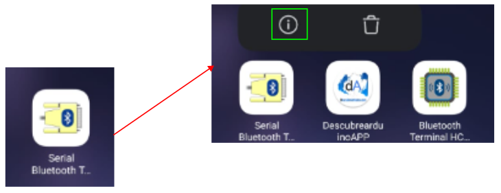.  
*Acceso a información de la APP*

Pulsamos sobre la "i" y nos aparece la pantalla de "Información de la aplicación":

  
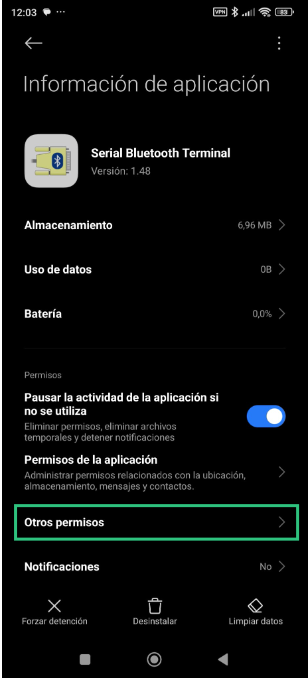.  
*Información de la información de la APP*

Desde la pantalla anterior podemos acceder a "Otros permisos" que tiene dicha aplicación. Estos pueden tener el aspecto que vemos en la imagen siguiente:

  
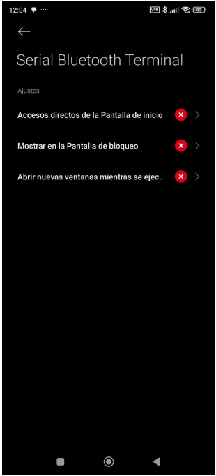.  
*Permisos de la APP*

En estas condiciones no podemos establecer una conexión entre el dispositivo vinculado y el móvil. Debemos establecer los permisos de la siguiente forma:

  
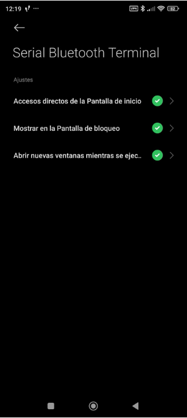.  
*Permisos de la APP*

Existen muchas aplicaciones capaces de actuar como apps que permiten transmitir datos entre dispositivos Bluetooth. Vamos a ver brevemente de Google Play Store las siguientes:

### Bluetooth Terminal Qwerty
[Bluetooth Terminal Qwerty](https://apkcombo.com/bluetooth-terminal/Qwerty.BluetoothTerminal/), una apk con una interface muy simple y fácil de configurar, basta conectarse con el dispositivo emparejado y comenzar a enviar comandos.

  
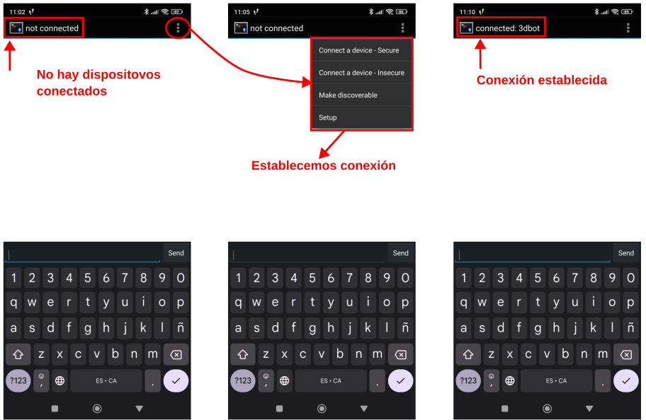.  
*Bluetooth Terminal Qwerty*

### Arduino Bluetooth Controller 
Arduino Bluetooth Controller es una aplicación que le permite controlar su placa arduino (y placas similares) a través de Bluetooth.

  
.  
*Logo Arduino Bluetooth Controller*

Al lanzar la aplicación se muestra una imagen y tras unos instantes aparece el menú gráfico de la aplicación. En la parte superior derecha tenemos el icono para conectar a un dispositivo.

  
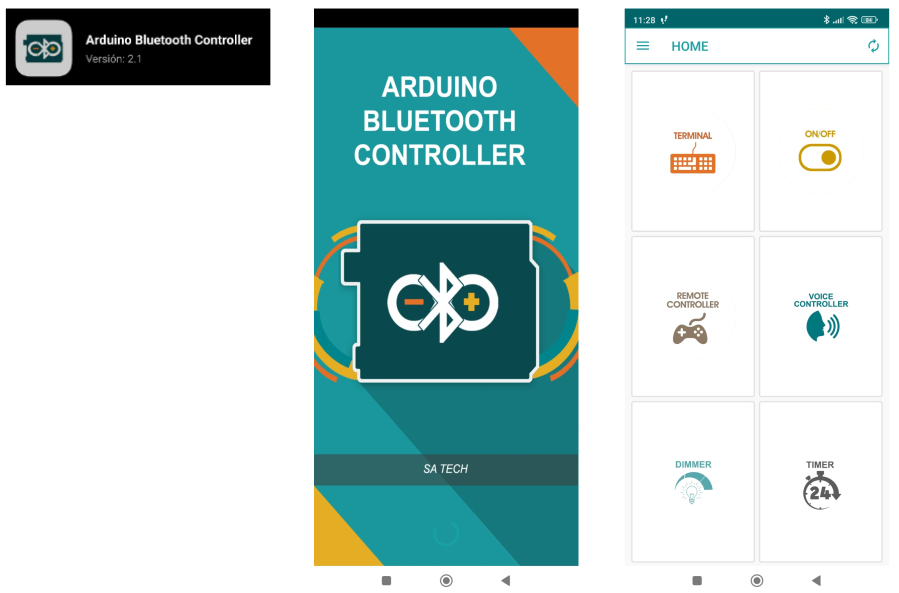.  
*Arduino Bluetooth Controller*

En la imagen siguiente vemos el modo terminal de la aplicación.

  
.  
*Modo terminal de Arduino Bluetooth Controller*

### Arduino Bluetooth Control
Arduino Bluetooth Control también es una aplicación que te permite controlar la placa arduino (y placas similares) a través de Bluetooth.

  
.  
*Logo Arduino Bluetooth Control*

Se lanza la app, se escoge dispositivo y selecciona el modo terminal para estar en una situación parecida a la de las otras aplicaciones.

  
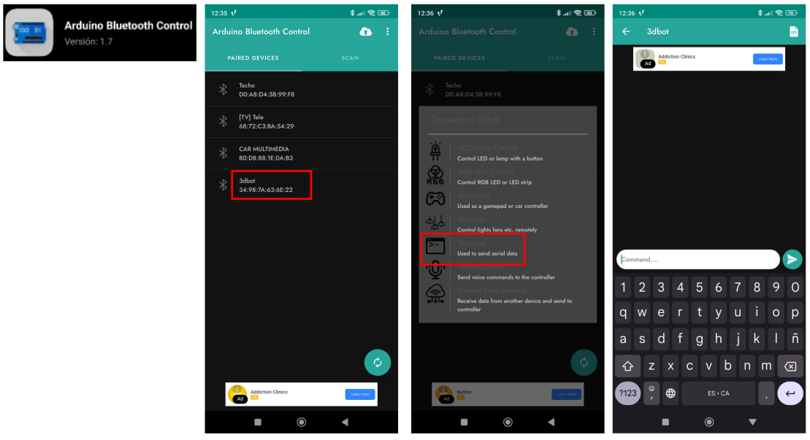.  
*Arduino Bluetooth Control*

### Serial Bluetooth Terminal
Aplicación para Android compatible con Bluetooth clásico y Bluetooth LE o Bluetooth Low Energy o BLE o Bluetooth Smart.

  
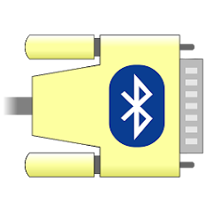.  
*Logo Serial Bluetooth Terminal*

Seguimos el proceso habitual de emparejar la ESP32 micro:STEAMakers con nuestro móvil:

  
.  
*Proceso para emparejar dispositivos*

Abrimos la APP, que por defecto nos muestra la pantalla siguiente:

  
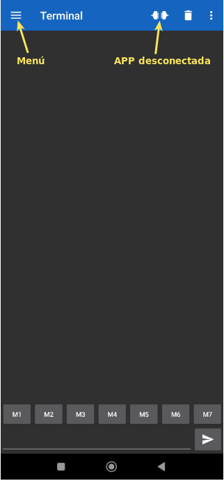.  
*Pantalla inicial Serial Bluetooth Terminal*

Si abrimos el menú de la parte izquierda vemos una pantalla con opciones. Entramos en "Devices" para que se muestren los dispositivos disponibles y así conectarnos con el dispositivo que hemos emparejado antes:

  
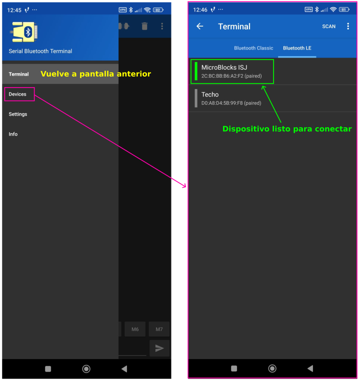.  
*Conexión con dispositivo*

En la pantalla de la derecha vemos que podemos volver al terminal mostrado en la primera página y escoger el tipo de Bluetooth con el que vamos a trabajar, BLE en nuestro caso. Pulsamos sobre el dispositivo marcado y se establece la conexión, indicándose esto mediante mensajes y por la posición del conector, y se retorna a la pantalla del terminal que vemos a continuación:

  
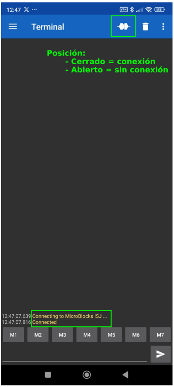.  
*Conexión con dispositivo establecida*

Con esto el sistema está listo para enviar datos de la placa al móvil y viceversa.
