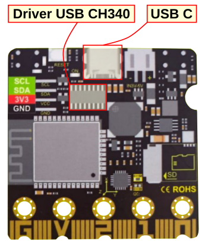

!!! info "A tener en cuenta"
    La información que verás en este apartado está referida exclusivamente al sistema operativo Linux, en concreto a la versión Ubuntu 22.04.5 LTS (Jammy Jellyfish) de 64 bits, con la versión 42.9 de GNOME y sistema de ventanas X11. Se darán algunas instrucciones genéricas para Linux.

## <FONT COLOR=#007575>**Dispositivos CH340 USB no funcionan en Ubuntu 22.04**</font>
El soporte (en Ubuntu 20.04 era nativo) para dispositivos CH340 USB a adaptador serie nos genera un /dev/ttyUSB0 cuando partimos de instalación limpia.

Vamos a ver que ocurre cuando tenemos una placa con el driver CH340, como es el caso de la micro:STEAMakers, conectada a un puerto USB y desde una terminal hacemos ```ls /dev``` pero no nos lista una entrada ttyUSB0.

<center>

  
*Driver CH340 en la micro:STEAMakers*

</center>

Si hacemos ```lsusb``` nos va a devolver algo como ```Bus 003 Device 002: ID 1a86:7523 QinHeng Electronics CH340 serial converter```.

<center>

  
*Resultado ```lsusb```*

</center>

Y podemos comprobar como el módulo ch34x no está cargado si hacemos ```lsmod```. Cualquier intento de crear manualmente el módulo va a resultar infructuoso.

El conflicto está en un conflicto entre la identificación del producto con un chip basado en CH340 y el lector de pantalla Braille. Si hemos ejecutado

<center> ```sudo apt remove brltty``` </center>

y no estamos utilizando una pantalla Braille debemos editar el fichero de reglas de brttty y realizar una modificación para asegurar que se soportan dispositivos CH340. Esto solamente lo podemos hacer como superusuario dado que se trata de un archivo del sistema.

!!! Danger "IMPORTANTE"
    Cuando desde una terminal nos logueamos con ```sudo su``` pasamos a ser los dueños absolutos del sistema y todo lo que hagamos se llevará a termino. Si no estás totalmente seguro de lo que estas haciendo mejor no sigas porque puedes dejar el sistema dañado de manera irreversible.

El proceso a seguir es:

1. Abrimos para editar el archivo ```/usr/lib/udev/rules.d/85-brltty.rules``` por ejemplo con el editor nano.
2. Buscamos la línea ```ENV{PRODUCT}=="1a86/7523/*", ENV{BRLTTY_BRAILLE_DRIVER}="bm", GOTO="brltty_usb_run"``` y la ponemos comentada.
3. Reiniciamos el sistema

Esto debería ser suficiente para tener soportados los dispositivos basados en CH340.

Si, con la placa micro:STEAMakers conectada a un puerto USB, ejecutas el siguiente comando en una terminal en cualquier distribución de Linux deberá aparecer el dispositivo conectado (en tu caso puede que el nombre de la placa sea diferente):

<center> ```ls /dev/ttyUSB*``` </center>

El puerto serie al que está conectado CH340 debería aparecer como resultado.

<center>

  
*Resultado ```ls /dev/ttyUSB*```*

</center>

## <FONT COLOR=#007575>**Distribuciones Linux**</font>
En este enlace a la web de [Sparkfun](https://www.sparkfun.com/) tenemos los [drivers CH340 en formato .ZIP](https://cdn.sparkfun.com/assets/learn_tutorials/8/4/4/CH341SER_LINUX.ZIP) listos para descargar.

Los drivers anteriores se deben utilizar cuando hay un fallo en la comunicación serie si se utilizan los drivers por defecto de Linux. Si te encuentras con este problema, puedes intentar instalar controladores parcheados como se explica en este post del foro [SparkFun Edge failing on “make bootload”](https://community.sparkfun.com/t/sparkfun-edge-failing-on-make-bootload/36593/40). Estos son los pasos a ejecutar desde la línea de comandos:

* Conecta y desconecta el dispositivo CH340 del puerto USB.
* Escribe ```sudo dmesg``` para ver lo que ha sucedido.
* La salida esperada debe tener lo siguiente en el registro reciente de la terminal:

<center>

  
*Resultado ```dmesg```*

</center>

## <FONT COLOR=#007575>**Referencias**</font>
En el enlace siguiente se puede encontrar mucha mas información acerca de los drivers CH340.

<center>[How to Install CH340 Drivers](https://learn.sparkfun.com/tutorials/how-to-install-ch340-drivers/)</center>
