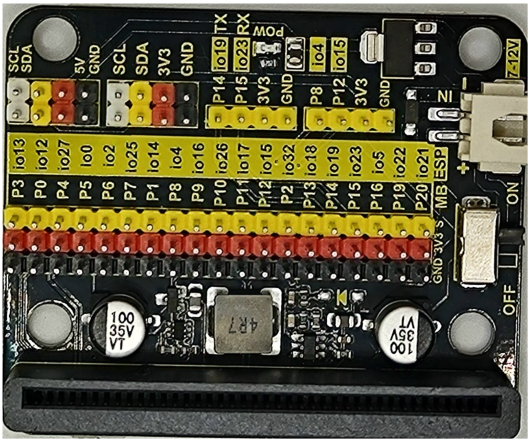
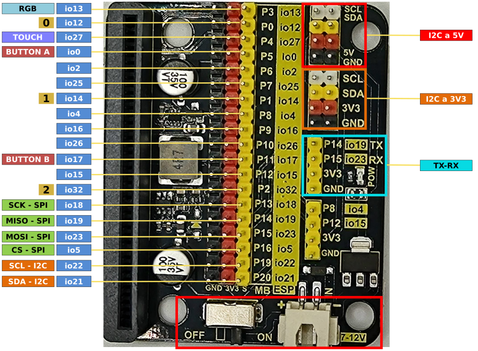
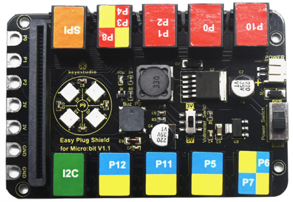
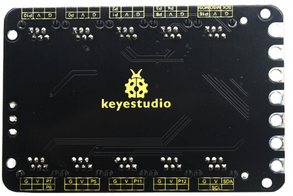
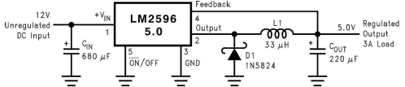
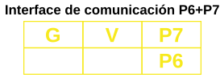
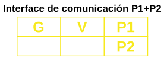

## <FONT COLOR=#007575>**Sensor shield modular V2**</font>
### <FONT COLOR=#AA0000>Introducción</font>
Se trata de un escudo con conexión rápida de sensores para la versión V2 de micro:bit. Su aspecto lo vemos en la imagen siguiente:

<center>

  
*Aspecto de la shield*

</center>

La shield V2 convierte todos los puertos PIO de la placa de control micro:STEAMakers en una interfaz de tres pines (GND, VCC, Señal), muy fácil para conectar la placa de control y módulos sensores.

Por otra parte, también dispone pines hembra para interfaz de comunicación serie y pines macho de comunicación I2C y SPI. De modo que esta shield permitirá la comunicación entre la placa de control micro:STEAMakers y otros dispositivos de comunicación. La placa se puede alimentar a través de un jack DC negro (DC 7-9V) o un puerto USB micro (DC 5V). Cuando alimentemos a través de la shield, se puede seleccionar el voltaje de alimentación V1 y V2 a 3.3V o 5V a través de los jumpers V1 y V2.

### <FONT COLOR=#AA0000>Selección y análisis de tensiones</font>
Las combinaciones posibles las vemos en la tabla siguiente:

<center>

|Posición| V2 (V)| V1 (V)|Posición| V2 (V)| V1 (V)|
|---|:-:|:-:|---|:-:|:-:|
|| 3.3 | 3.3 | | 5 | 5 |
|| 5 | 3.3 || 3.3 | 5 |

</center>

En la shield observamos como según estos selectores en los pines de alimentación positiva (rojos) estará presente una u otra tensión.

!!! failure "Aviso"
    Sin alimentación externa de la shield en V1 y/o V2 no habrá 5V aunque alimentemos externamente a la placa micro:STEAMakers. Alimentando la shield la tensión en V1 y/o V2 depende de la posición de su jumper y será de 5V si la alimentamos a través del conector micro USB o a través del Jack de alimentación.

La shield va dotada de dos reguladores de tensión un ASM1117 para 3.3V y un 117-5 para 5V, ambos en encapsulado SOT-223. Ambos reguladores se configuran facilmente con muy pocos componentes externos para, junto con los jumpers, cumplir con su misión en la placa.

### <FONT COLOR=#AA0000>Detalles técnicos</font>
Los principales detalles técnicos de la shield son:

* Entrada de alimentación externa: jack negro DC (DC 7-9V) o puerto micro USB (DC 5V)
* Tensión de salida: seleccionable a 3.3V o 5V a través de los jumpera V1/V2
* Indicador de alimentación externa.
* Convierte la interfaz de pines PIO de micro:STEAMakers a conectores de tres pines.
* Pines de comunicación serie.
* Pines de comunicación I2C.
* Pines de comunicación SPI.
* Dimensiones: 65mm x 58mm x 12mm.

### <FONT COLOR=#AA0000>Diagrama de pines</font>
En la imagen siguiente podemos ver el diagrama de pines original de esta placa:

<center>

  
*Pinout original*

</center>

Pero debemos tener muy presente que esta shield es para una placa micro:bit y no para un micro:STEAMakers por lo que la numeración impresa en la misma no es la correcta para nuestros propósitos. Por ello se ha estudiado la correspondencia de pines del borde de la micro:STEAMakers con esta shield obteniendo el siguiente **pinout**:

<center>

  
*Pinout micro:STEAMakers vs Shield*  
***Clic sobre la imagen para ampliarla***

</center>

### <FONT COLOR=#AA0000>Compatibilidad de pines</font>

!!! warning "<FONT COLOR=#FF0000>**AVISO IMPORTANTE**</font>"
    Cuando vamos a trabajar con señales analógicas debemos tener muy presente que, aunque todos los pines IOxx son entradas y salidas digitales, algunas incluso con más funciones. **Cuando tenemos que utilizar la comunicación WiFi el convertidor ADC2 NO funciona.**

Las placas ESP32 tienen disponibles dos ADC (Analog to Digital Converter) de 12 bits que se denominan ADC1 y ADC2. Esos 12 bits dan una precisión de $2^{12} = 4096$. Por lo tanto, si tenemos 12 bits para 3.3V podemos asegurar que $3.3V/4096 = 0,8 mV$ es la tensión correspondiente a cada paso.

!!! danger "<FONT COLOR=#FF0000>**Máxima tensión admisible en el ADC**</font>"
    Aunque los pines GPIO de la ESP32 pueden funcionar a 5V, los conversores ADC no pueden. Debemos tener cuidado de no sobrepasar esos 3.3V si el pin es uno de los que están conectados a uno de los conversores.

La placa ESP32 micro:STEAMakers es al fin y al cabo una ESP32 y la lectura de una entrada analógica se realiza de la forma habitual en entornos basados en Arduino, es decir con ```analogRead(pin_GPIO)```. Internamente la ESP32, de manera genérica, compara la tensión que pretendemos medir con un valor de referencia Vref mediante un circuito atenuador de ganancia variable, tipicamente de -11dB para poder medir hasta 3.3V.

En la ESP32 micro:STEAMakers los pines que tienen conxión con los conversores ADC y que pueden ser utilizados como entradas analógicas están distribuidos de la siguiente forma:

 * **ADC1** se conecta a 8 pines GPIO:

<center>32 , 33, 34, 35, 36, 37, 38, 39</center>

 * **ADC2** se conecta a 10 pines GPIO:

<center>0, 2, 4, 12, 13, 14, 15, 25, 26, 27<br>
<FONT COLOR=#FF00FF><b>WiFi ON → INHABILITA ADC2</b></font></center></br>

A efectos prácticos, aunque en el pinout de la placa no se indican las entradas analógicas, podemos asegurar que todos los pines que pueden ser usados como entradas analógicas, con la única excepción de la patilla 2 que se conecta a io32 y que pertenece a ADC1, funcionarán correctamente siempre y cuando no realicemos configuración WiFi alguna, dado que están conectados a ADC2.

## <FONT COLOR=#007575>**Shield modular 90º**</font>
### <FONT COLOR=#AA0000>Introducción</font>
Se trata de un escudo con conexión rápida de sensores con numeración de pines genérica para micro:bit y como GPIO para que resulte mas sencillo utilizar con la micro:STEAMakers. Su aspecto lo vemos en la imagen siguiente:

<center>

  
*Aspecto de la shield*

</center>

La shield convierte todos los puertos PIO de la placa de control micro:STEAMakers en una interfaz de tres pines (GND, VCC, Señal), muy fácil para conectar la placa de control y módulos sensores.

Por otra parte, también dispone pines macho de comunicación I2C y SPI. De modo que esta shield permitirá la comunicación entre la placa de control micro:STEAMakers y otros dispositivos de comunicación. La placa se puede alimentar a través de un conector JST (DC 7-12V) colocando el interruptor en posición ON.

Cuando alimentamos externamente tenemos disponible la conexión I2C con alimentación a 5V.

### <FONT COLOR=#AA0000>Diagrama de pines</font>
En la imagen siguiente podemos ver el diagrama de pines de esta placa en relación a la micro:STEAMakers:

<center>

  
*Pinout*

</center>

### <FONT COLOR=#AA0000>Compatibilidad de pines</font>

!!! warning "<FONT COLOR=#FF0000>**AVISO IMPORTANTE**</font>"
    Cuando vamos a trabajar con señales analógicas debemos tener muy presente que, aunque todos los pines IOxx son entradas y salidas digitales, algunas incluso con más funciones. **Cuando tenemos que utilizar la comunicación WiFi el convertidor ADC2 NO funciona.**

Las placas ESP32 tienen disponibles dos ADC (Analog to Digital Converter) de 12 bits que se denominan ADC1 y ADC2. Esos 12 bits dan una precisión de $2^{12} = 4096$. Por lo tanto, si tenemos 12 bits para 3.3V podemos asegurar que $3.3V/4096 = 0,8 mV$ es la tensión correspondiente a cada paso.

!!! danger "<FONT COLOR=#FF0000>**Máxima tensión admisible en el ADC**</font>"
    Aunque los pines GPIO de la ESP32 pueden funcionar a 5V, los conversores ADC no pueden. Debemos tener cuidado de no sobrepasar esos 3.3V si el pin es uno de los que están conectados a uno de los conversores.

La placa ESP32 micro:STEAMakers es al fin y al cabo una ESP32 y la lectura de una entrada analógica se realiza de la forma habitual en entornos basados en Arduino, es decir con ```analogRead(pin_GPIO)```. Internamente la ESP32, de manera genérica, compara la tensión que pretendemos medir con un valor de referencia Vref mediante un circuito atenuador de ganancia variable, tipicamente de -11dB para poder medir hasta 3.3V.

En la ESP32 micro:STEAMakers los pines que tienen conxión con los conversores ADC y que pueden ser utilizados como entradas analógicas están distribuidos de la siguiente forma:

 * **ADC1** se conecta a 8 pines GPIO:

<center>32 , 33, 34, 35, 36, 37, 38, 39</center>

 * **ADC2** se conecta a 10 pines GPIO:

<center>0, 2, 4, 12, 13, 14, 15, 25, 26, 27<br>
<FONT COLOR=#FF00FF><b>WiFi ON → INHABILITA ADC2</b></font></center></br>

A efectos prácticos, aunque en el pinout de la placa no se indican las entradas analógicas, podemos asegurar que todos los pines que pueden ser usados como entradas analógicas, con la única excepción de la patilla 2 que se conecta a io32 y que pertenece a ADC1, funcionarán correctamente siempre y cuando no realicemos configuración WiFi alguna, dado que están conectados a ADC2.

## <FONT COLOR=#007575>**Shield EASY Plug 1.1**</font>
### <FONT COLOR=#AA0000>Introducción</font>
Se trata de una placa que inicialmente está pensada para la placa micro:bit, que es una placa de desarrollo diseñada por la BBC para la enseñanza de programación a adolescentes. Podemos hacer actividades con la placa de micro:STEAMakers utilizando la Shield EASY Plug que nos sirve para extender los pines de borde de placa a conectores Easy Plugs (RJ11 6P6C) donde podemos conectar de forma rápida sensores y actuadores.

La Shield viene con cuatro LEDs WS2812 (controlados desde P9), un zumbador (controlado por P0). Hay un interruptor (Power Switch) que sirve para control de la alimentación externa y otro (Voltmeter_Switch) que se utiliza para control del voltaje (3,3V, 5V) de Easy Plug.

El aspecto de la placa por la cara frontal es:

<center>

  
*Cara frontal*

</center>

Y por la cara posterior es:

<center>

  
*Cara posterior*

</center>

Los puertos EASY Plug tienen 6 pines que se serigrafian en la cara posterior con respecto a los puertos IO de la placa. La nomenclatura es la siguiente:

* **G**: GND
* **V**: Alimentación controlada por (Voltmeter_Switch) que será 3.3V o 5V siempre y cuando tengamos la alimentación externa conectada a una fuente de entre 6 y 10V. Sin alimentación externa los puertos EASY Plug no disponen de tensión positiva de alimentación.

### <FONT COLOR=#AA0000>Análisis alimentación Shield</font>
En la imagen siguiene vemos destacadas las zonas que vamos a analizar:

<center>

  
*Alimentación Shield*

</center>

Vemos que entre otros elementos están los dos circuitos integrados destacados. Veamos que son estos circuitos:

<FONT COLOR=#BB00FF><font size="5"><b>ASM1117</font color></font size></b>

Es un regulador de baja caída en formato SOT-223 capaz de entregar hasta 1A de corriente. En este caso se utiliza como regulador lineal de 5 a 3.3V con un circuito seguramente muy similar al circuito de apllicación que aparece en el datasheet del ASM1117 y que vemos en la imagen siguiente:

<center>

  
*Regulador ASM1117*

</center>

<FONT COLOR=#BB00FF><font size="5"><b>LM2596</font color></font size></b>

Se trata de un regulador reductor de tensión de salida ajustable, en formato TO-263 KTT, capaz de entregar hasta 3A. El circuito de aplicación típico que indica su datasheet lo vemos a continuación. Podemos observar como están los componentes en la placa junto al conector de entrada externa de alimentación. Este va a ser el encargado de regular la tensión externa al valor de tensión seleccionado en la placa con el interruptor Voltimeter-Switch.

<center>

  
*Regulador LM2596*

</center>

!!! warning "Uso sin alimentación externa"
    Sin alimentación externa los puertos EASY Plug no disponen de tensión positiva de alimentación. Por lo tanto no tiene sentido utilizar la Shield con la micro:STEAMakers sin dotarla de una alimentación entre 6 y 10V a través de su conector JST **POWER**.

### <FONT COLOR=#AA0000>Diagrama de pines</font>
En la figura siguiente podemos observar la relación de los puertos de la Shield con los pines de la micro:STEAMakers

<center>

  
*Pinout Shield*  
***Clic sobre la imagen para ampliarla***

</center>

Un análisis de la gráfica nos devuelve una serie de conclusiones a tener en cuenta para el trabajo con esta Shield:

* **1. Sensores micro:STEAMakers:** Los pines io36 (sensor de corriente), io35 (micrófono), io39 (sensor de luz) e io33 (Buzzer) no están utilizados en la Shield por lo que el uso de sus elementos asociados no tiene restricciones.
* **2. I2C (SDA - io21; SCL - io22):** El conector I2C está también disponible en formato EASY Plug y podemos conectar elementos a cualquiera de los conectores sin mas restricciones que las direcciones físicas y el número de elementos. Su interfaz de conexiones es:

<center>

  

</center>

* **3. P12 (io15):** El puerto P12 (io15) se puede usar sin restricciones. Su interfaz de conexiones es:

<center>

  

</center>

<FONT COLOR=#FF0000><b>En la práctica esta interfaz de conexión es la que tienen todos los sensores y actuadores de tipo EASY Plug que requieren, además de los pines de alimentación, de un sólo pin para los datos digitales o analógicos. Por tanto a este tipo de puerto podemos conectar gran cantidad de elementos.</b></font>

* **4. P5 y P11:** Puertos asociados a los botones de la micro:STEAMakers no utilizables para otros propósitos.
* **5. P6+P7 (P6 - io2; P7 - io25):** Conector con dos puertos con la siguiente interfaz de conexionado de sus pines:

<center>

  

</center>

<FONT COLOR=#FF0000><b>En la práctica esta interfaz de conexión la podemos considerar como la de P12 si solamente tenemos en cuenta el puerto P7 ignorando el P6. Lógicamente sería utilizable con cualquier dispositivo que tuviese la misma interfaz de conexionado.</b></font>

* **6. P10 (io26):** El puerto P10 (io26) se puede usar sin restricciones. Su interfaz de conexiones es:

<center>

  

</center>

* **7. P0 (io12):** El puerto P0 (io12) se puede usar pero con la restricción de que al mismo está conectado el altavoz con la que está equipada la Shield. Su interfaz de conexiones es:

<center>

  

</center>

* **8. P1+P2 (P1 - io14; P2 - io32):** Conector con dos puertos con la siguiente interfaz de conexionado de sus pines:

<center>

  

</center>

<FONT COLOR=#FF0000><b>En la práctica esta interfaz de conexión la podemos considerar como la de P12 si solamente tenemos en cuenta el puerto P1 ignorando el P2. Lógicamente sería utilizable con cualquier dispositivo que tuviese la misma interfaz de conexionado.</b></font>

* **9. P3+P4+P8 (P3 - io13; P4 - io27; P8 - io4):** Conector con tres puertos con la siguiente interfaz de conexionado de sus pines:

<center>

  

</center>

**Como limitaciones de uso debemos tener en cuenta que el puerto P3 está conectado al pin de control de la matriz de 4x4 LEDs RGB de la Shield y que el pin P4 es el mismo que del sensor táctil de la micro:STEAMakers.**

<FONT COLOR=#FF0000><b>En la práctica esta interfaz de conexión la podemos considerar como la de P12 si solamente tenemos en cuenta el puerto P8 ignorando los otros dos. Lógicamente sería utilizable con cualquier dispositivo que tuviese la misma interfaz de conexionado o una interfaz en la que utilice una combinación de pines como P8 y P4.</b></font>.

* **10. SPI (SCK-P13; MISO-P14; MOSI-P15; CS-P16):** Conector con cuatro puertos dedicado al lector microSD con la siguiente interfaz de conexionado de sus pines:

<center>


</center>

* **11. P9 (io16):** Se trata del pin al que están conectados los 4 LEDs RGB direccionables con los que cuenta la Shield. Veremos como programarlos en las actividades.

**En resumen, podemos usar sin restricciones, además de dispositivos I2C, los puertos P12 (io15), P7 (io25), P10 (io26), P1 (io14) y P8 (io4). Para el resto debemos tener en cuenta las restricciones vistas.**

### <FONT COLOR=#AA0000>Compatibilidad de pines</font>

!!! warning "<FONT COLOR=#FF0000>**AVISO IMPORTANTE**</font>"
    Cuando vamos a trabajar con señales analógicas debemos tener muy presente que, aunque todos los pines IOxx son entradas y salidas digitales, algunas incluso con más funciones. **Cuando tenemos que utilizar la comunicación WiFi el convertidor ADC2 NO funciona.**

Las placas ESP32 tienen disponibles dos ADC (Analog to Digital Converter) de 12 bits que se denominan ADC1 y ADC2. Esos 12 bits dan una precisión de $2^{12} = 4096$. Por lo tanto, si tenemos 12 bits para 3.3V podemos asegurar que $3.3V/4096 = 0,8 mV$ es la tensión correspondiente a cada paso.

!!! danger "<FONT COLOR=#FF0000>**Máxima tensión admisible en el ADC**</font>"
    Aunque los pines GPIO de la ESP32 pueden funcionar a 5V, los conversores ADC no pueden. Debemos tener cuidado de no sobrepasar esos 3.3V si el pin es uno de los que están conectados a uno de los conversores.

La placa ESP32 micro:STEAMakers es al fin y al cabo una ESP32 y la lectura de una entrada analógica se realiza de la forma habitual en entornos basados en Arduino, es decir con ```analogRead(pin_GPIO)```. Internamente la ESP32, de manera genérica, compara la tensión que pretendemos medir con un valor de referencia Vref mediante un circuito atenuador de ganancia variable, tipicamente de -11dB para poder medir hasta 3.3V.

En la ESP32 micro:STEAMakers los pines que tienen conxión con los conversores ADC y que pueden ser utilizados como entradas analógicas están distribuidos de la siguiente forma:

 * **ADC1** se conecta a 8 pines GPIO:

<center>32 , 33, 34, 35, 36, 37, 38, 39</center>

 * **ADC2** se conecta a 10 pines GPIO:

<center>0, 2, 4, 12, 13, 14, 15, 25, 26, 27<br>
<FONT COLOR=#FF00FF><b>WiFi ON → INHABILITA ADC2</b></font></center></br>

A efectos prácticos, revisando el pinout de la placa podemos asegurar que todos los pines catalogados como entradas analógicas, con la única excepción de P2 que se conecta a io32 y que pertenece a ADC1, funcionarán correctamente siempre y cuando no realicemos configuración WiFi alguna, dado que están conectados a ADC2.
