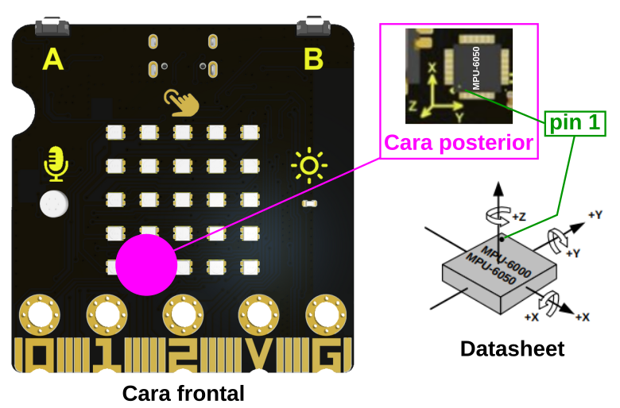
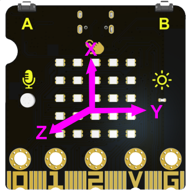

# Acelerómetro + giroscopio
La ESP32 micro:STEAMakers monta un chip MPU-6050 de InvenSense que es un dispositivo MEMS de 6 ejes (giroscopio + acelerómetro). El término MEMS, del inglés MicroElectroMechanical Systems, se refiere a la tecnología electromecánica de dispositivos microscópicos o sistemas microelectromecánicos.

Los dispositivos MPU-6050 combinan un giroscopio de 3 ejes y un acelerómetro de 3 ejes en el mismo chip, junto con un procesador digital (Digital Motion Processor™ o DMP) integrado, que procesa algoritmos complejos de 6 ejes. El dispositivo puede acceder a magnetómetros externos u otros sensores a través de un bus I²C maestro auxiliar, lo que permite a los dispositivos recopilar un conjunto completo de datos de sensores sin intervención del procesador del sistema.

Para un seguimiento preciso de los movimientos rápidos y lentos, el chip incorpora un giroscopio programable por el usuario con una escala completa de ±250, ±500, ±1000 y ±2000 °/seg (dps), y un acelerómetro programable por el usuario con una escala completa de ±2g, ±4g, ±8g y ±16g. Otras características son un sensor de temperatura integrado con una variación del ±1% en el rango de temperatura de funcionamiento.

En arduinoblocks se implementa el bloque del sensor con las aceleraciones y giros en los ejes X, Y y Z que vemos en la imagen siguiente:

  
*Bloque Accel+Gyro*

A continuación vamos a analizar la posición de los ejes X, Y, Z con la micro:STEAMakers vista por su cara frontal con el conector USB-C en la parte superior. La forma habitual en que vemos la pantalla de LEDs RGB.

Analizando la imagen siguiente:

  
*Analisis de la posición de los ejes*

Fijamos la posición de los ejes que vemos en la imagen siguiente:

  
*Posición de los ejes*

Tal y como vemos en la imagen siguiente, un programa en el que asignamos al plotter las aceleraciones en los tres ejes nos devuelve como resultado que cuando movemos la placa en el eje X habitual responde la aceleración en Y (marrón oscuro) y al moverlo en Y responde la de X (magenta claro). La tercera gráfica corresponde al eje Z.

  
*Cambios de ejes X e Y*

Como veremos en la actividad correspondiente el problema en muy sencillo de solucionar para que las direcciones del movimiento sean la que habitualmente utilizamos en los ejes coordenados.

En la imagen siguiente se analiza la aceleración en el eje Z:

  
*Aceleración eje Z*

El problema se repite cuando trabajamos con los datos de giro.
