## <FONT COLOR=#007575>**Enlaces**</font>
**Versión estable MicroBlocks v1**

* [https://microblocks.fun/downloads/latest/](https://microblocks.fun/downloads/latest/)
* [https://microblocks.fun/run/microblocks.html ](https://microblocks.fun/run/microblocks.html)

**Versión piloto MicroBlocks Version 2**

* [https://microblocks.fun/downloads/pilot/](https://microblocks.fun/downloads/pilot/)
* [https://microblocks.fun/run-pilot/microblocks.html](https://microblocks.fun/run-pilot/microblocks.html)

**MicroBlocks BLE Extension versión 1**

* [fun.microblocks.microblocks.aix](https://community.appinventor.mit.edu/uploads/short-url/e7MefojXbpMYaVtviwWfAKe6x9V.aix)

## <FONT COLOR=#007575>**Introducción**</font>
Para añadir funcionalidad Bluetooth Low Energy (BLE) a nuestras aplicaciones creadas con MIT App Inventor tenemos disponible como recurso oficial la extensión [BluetoothLE](https://mit-cml.github.io/extensions/).

Una vez descargada e importada la [versión 20240822](../img/guias/mb_inv_ble/edu.mit.appinventor.ble-20240822.aix) es posible acceder a la información (en inglés) de los bloques que utiliza la extensión a través del enlace que vemos en la imagen siguiente:

<center>

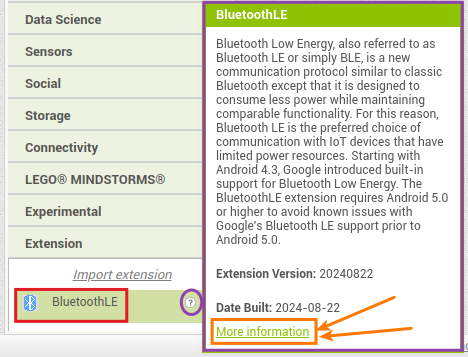  
*Enlace a información bloques extensión*

</center>

La idea es crear aplicaciones para móbiles o tablet que puedan comunicar con nuestra placa micro:STEAMakers hasta 100 metros de distancia.

Las aplicaciones las creamos en App Inventor.

## <FONT COLOR=#007575>**Conectar App**</font>
!!! info "**IMPORTANTE**"
    Los sistemas con tecnología Bluetooth 4.0+ o BLE se componen de dos elementos: una baliza o Beacon, encargada de enviar las señales, y un dispositivo que recibe y procesa estas señales.
    
    No es necesario emparejar el Beacon, ya que utiliza el canal de transmisión Bluetooth para transmitir señales.
    
    Un Beacon solo usa el canal de transmisión, por lo que no hay pasos de conexión relacionados con BLE, algo que concuerda con el significado literal de baliza. El dispositivo Beacon envía paquetes de datos en un cierto intervalo de tiempo, y los datos enviados pueden ser obtenidos por un dispositivo maestro como un teléfono móvil.

Debemos asegurarnos que Bluetooth está activado:

**1. Bluetooth encendido** Comprueba en la configuración de tu móbil o tablet y asegurate de que Bluetooth está encendido.  
**2. Sin emparejar** No emparejes las micro:STEAMakers. Puedes ignorar los ajustes de emparejamiento Bluetooth de tu dispositivo. Conectaremos la micro:STEAMakers a la aplicación en modo "**sin emparejamiento**", por lo que este paso es innecesario.

<center>

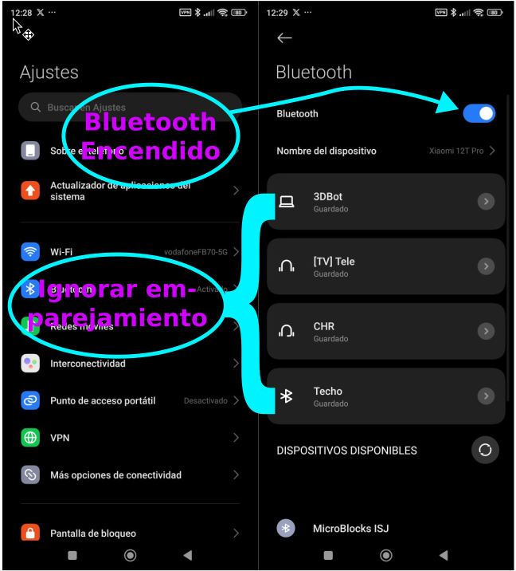  
*Bluetooth encendido e ignorar emparejamiento*

</center>

**3. Permisos de ubicación** Hay que habilitar el permiso de acceso a la ubicación en el teléfono o tablet. Para acceder a Bluetooth es necesario que el dispositivo tenga activados los permisos de localización en los ajustes de la App. La razón es que algunos dispositivos Bluetooth proporcionan una ubicación a nuestro dispositivo.  
Busca en la configuración en tu dispositivo.

<center>

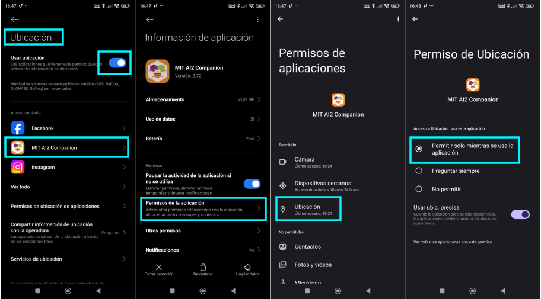  
*Permisos acceso a ubicación*

</center>

**4. Testear el código** Para ver lo que hace el código, hay que cargar el código de App Inventor Companion en el teléfono o tablet. El código de inicio puede tardar un tiempo en cargarse, así que ¡ten paciencia!

<center>

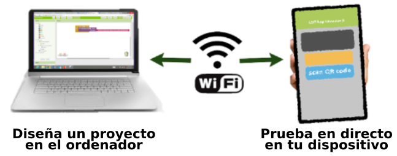  
*Testear el código*

</center>

Hay que tener un código apropiado subido a la micro:STEAMakers si queremos interactuar con la App.

## <FONT COLOR=#007575>**Ejemplos**</font>
Tomando como base los contenidos de [The Internet of Things: Data Acquisition and Analysis](https://appinventor.mit.edu/explore/ai2/IoT_unit) a los que nos conduce el enlace que encontramos en la extensión [BluetoothLE](https://mit-cml.github.io/extensions/).

!!!note "A tener en cuenta"
    Si vamos a trabajar en un lugar en el que habrá varias placas que pueden comunicarse entre si debemos previamente etiquetar cada una con su nombre único.

    Si no sabes como obtener el BLE id de las placas visita este [enlace](http://127.0.0.1:8000/....https://fgcoca.github.io/ESP32-micro-STEAMakers/guiamb/mb_inventor_BLE/#ejemplos).

    Recomendamos escribir el nombre en un trozo de cinta de carrocero o pintor y pegarlo a la micro:STEAMakers. Esto permite a los usuarios encontrar su placa cuando utilicen las Apps.

### <FONT COLOR=#AA0000>**Establecer conexión**</font>
Para probar esta App no hará falta tener ningún programa cargado en la micro:STEAMakers porque solamente vamos a conectar y desconectar la App con el Bluetooth de la placa. Si será necesario, logicamente, tener alimentada la placa micro:STEAMakers.

El diseño de la App tiene el aspecto de la imagen siguiente y bajo su título tenemos el enlace de descarga de EstablecerConexion.aia.

<center>

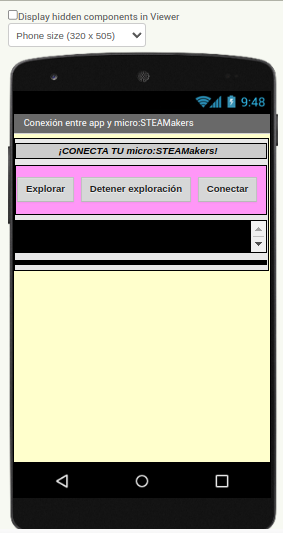  
*App EstablecerConexion*  
***[Descargar EstablecerConexion.aia](../program/AppInventor/EstablecerConexion.aia)***

</center>

Seguimos el siguiente procedimiento:

**1. Descarga la App EstablecerConexion.aia**

* El código permite conectarse rápidamente la App con la micro:STEAMakers.
* Localiza el archivo (EstablecerConexion.aia) descargado.
* Abre App Inventor AI2 Designer y Editor de Bloques [http://ai2.appinventor.mit.edu](http://ai2.appinventor.mit.edu).

**2. Haz clic en “Projects”**

<center>

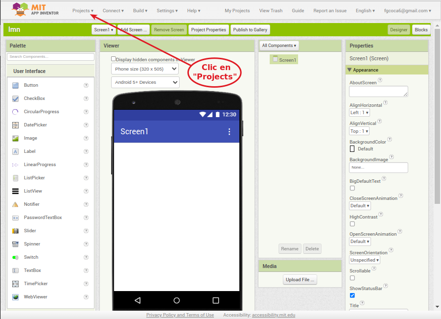  
*Abrir Projects*  

</center>

**3. Haz clic en la entrada “Import project (.aia) from my computer”**

<center>

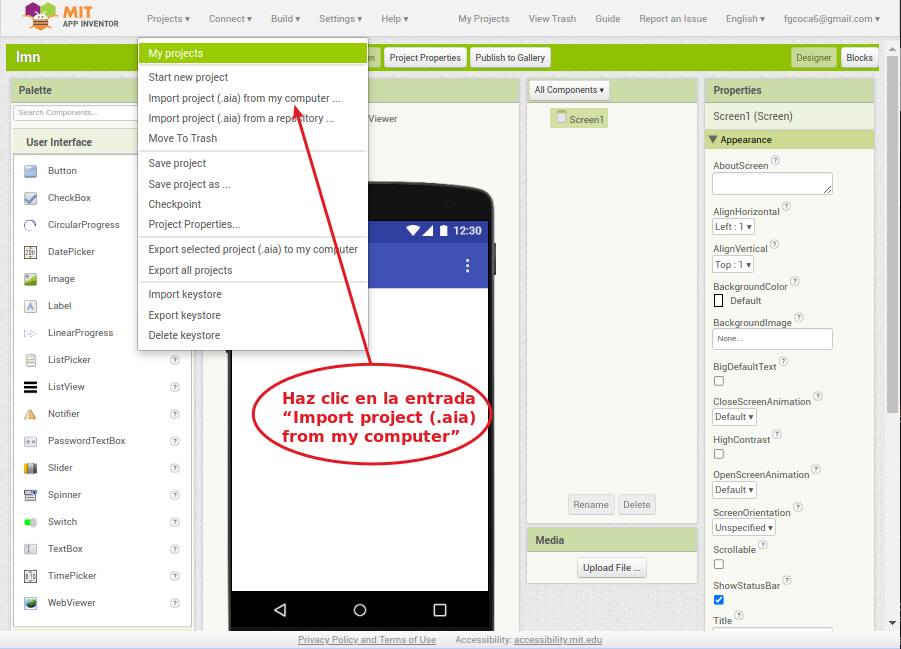  
*Elije la entrada “Import project (.aia) from my computer”*  

</center>

**4. Importa el archivo de inicio**

* Haz clic en Seleccionar archivo.

<center>

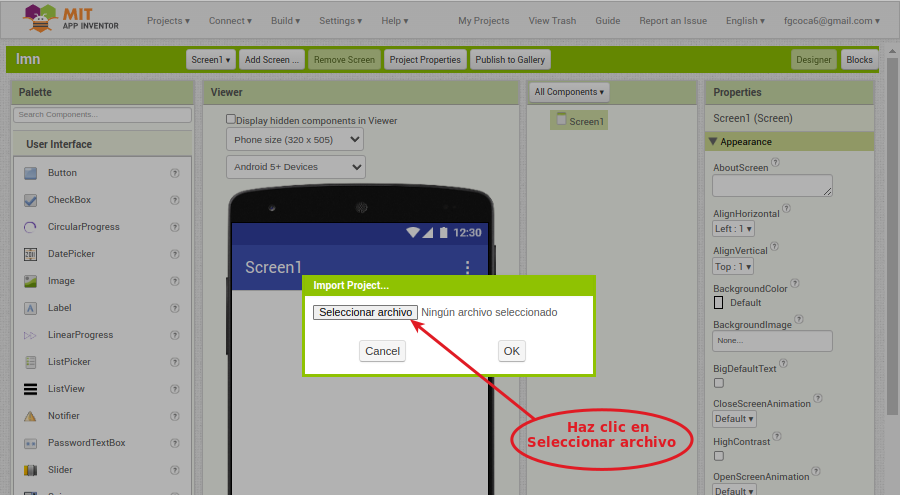  
*Haz clic en Seleccionar archivo*  

</center>

* Escoge el archivo descargado **EstablecerConexion.aia**.

<center>

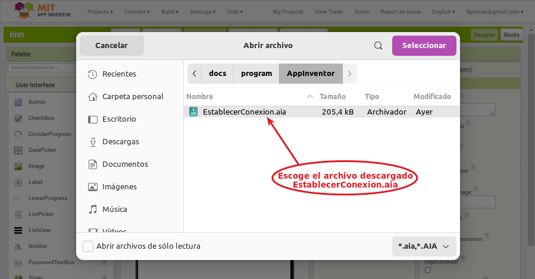  
*Escoge el archivo descargado*  

</center>

* El archivo inicialmente debe tener este aspecto en Designer:

<center>

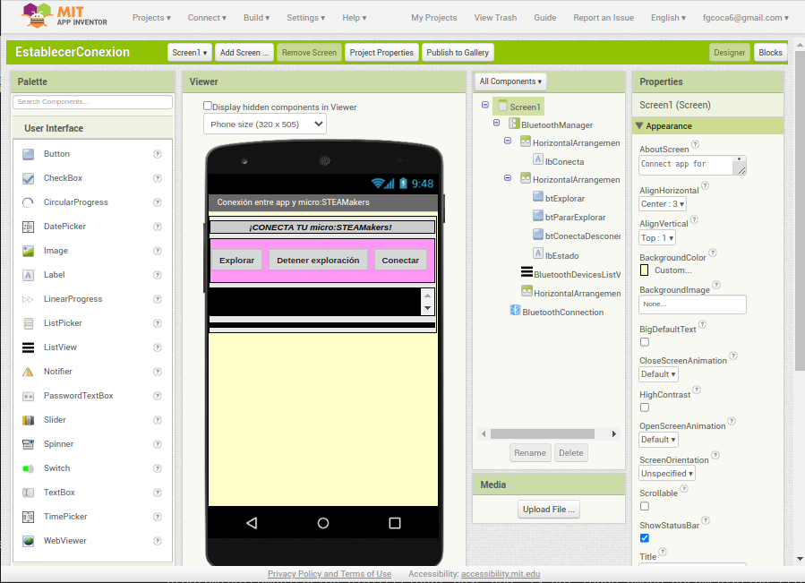  
*Aspecto en modo diseño*  

</center>

**5. Bluetooth activado**

* Comprueba en la configuración de tu móbil o tablet y asegurate de que Bluetooth está encendido.
* No emparejes las micro:STEAMakers. Puedes ignorar los ajustes de emparejamiento Bluetooth de tu dispositivo. Conectaremos la micro:STEAMakers a la aplicación en modo "**sin emparejamiento**", por lo que este paso es innecesario.

<center>

  
*Bluetooth encendido e ignorar emparejamiento*

</center>

**6. Permisos de ubicación** Hay que habilitar el permiso de acceso a la ubicación en el teléfono o tablet. Para acceder a Bluetooth es necesario que el dispositivo tenga activados los permisos de localización en los ajustes de la App. La razón es que algunos dispositivos Bluetooth proporcionan una ubicación a nuestro dispositivo.  
Busca en la configuración en tu dispositivo.

<center>

  
*Permisos acceso a ubicación*

</center>

**7. Testear el código** Para ver lo que hace el código, hay que cargar el código de App Inventor Companion en el teléfono o tablet. El código de inicio puede tardar un tiempo en cargarse, así que ¡ten paciencia!

* Elije AI Companion

<center>

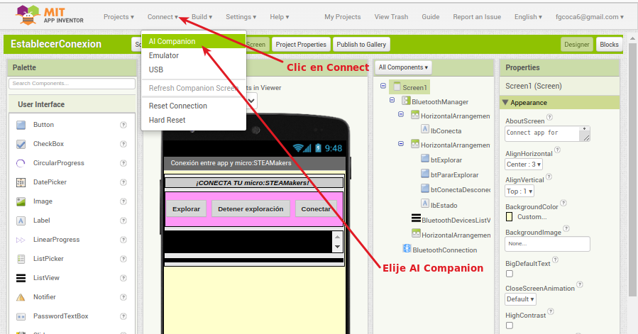  
*Testear el código*

</center>

* Escanea el QR o introduce el código que ves en la pantalla del ordenador en MIT App Inventor

<center>

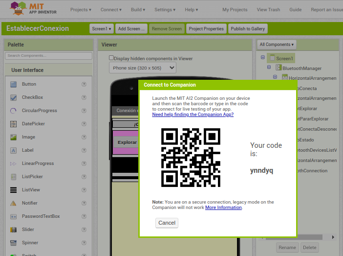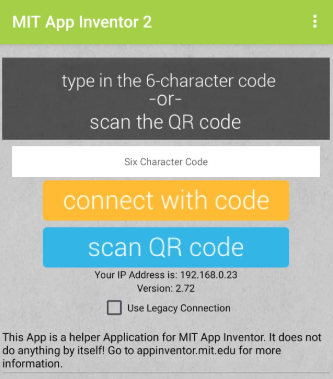  
*Testear el código*

</center>

* Deberías ver una aplicación como la de la imagen en la ventana de pruebas en vivo de tu dispositivo. ¡Sigue leyendo antes de pulsar Explorar!

<center>

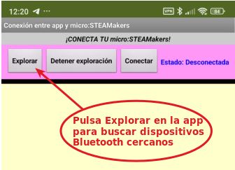  
*Testear el código*

</center>

**8. Alimenta la placa**

Conecta la micro:STEAMakers mediante un cable USB o a través del conector de alimentación externa. Asegurate de que la luz posterior de alimentación está encendida.

<center>

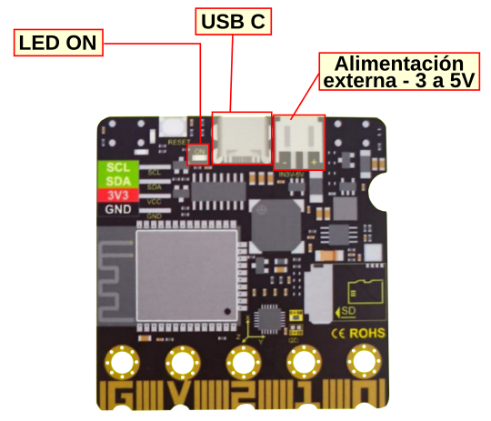  
*Alimenta la placa*

</center>

**9. Utiliza la aplicación para buscar dispositivos Bluetooth**

* Pulsa Explorar en la app para buscar dispositivos Bluetooth cercanos.

<center>

  
*Pulsa Explorar en la app para buscar dispositivos Bluetooth cercanos*

</center>

**10. Comprueba el listado**

Deberías ver una lista de todos los dispositivos Bluetooth cercanos - algunos de ellos podrían ser los auriculares o algún otro gadget cercano. El escáner trabaja rápidamente, pero deberías ver un elemento que diga "MicroBlocks XXX". **Pulsa el botón «Detener exploración para congelar la lista**.

<center>

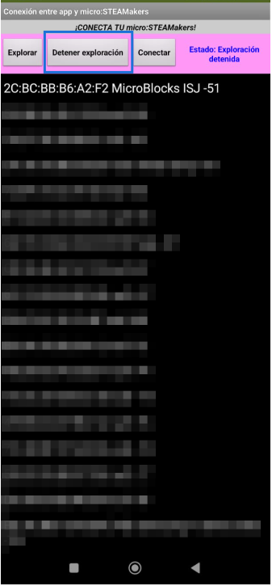  
*Comprobar lista y detener exploración*

</center>

**11. Clic en el nombre de tu placa y después en Conectar**

<center>

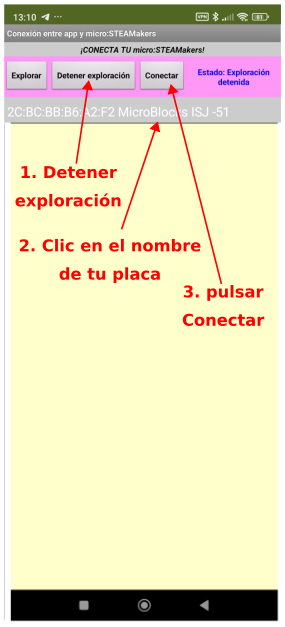  
*Detener exploración, seleccionar placa y conectar*

</center>

**12. Éxito**

* Ahora, hay una conexión inalámbrica entre la aplicación y la micro:STEAMakers,
* La aplicación debe mostrar la etiqueta con fondo verde Conectado en la parte superior,
* El botón Conectar ha cambiado su texto a Desconectar.

<center>

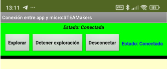  
*Conexión establecida*

</center>

* Practica desconectando y conectando la placa desde la aplicación. También puedes desconectarla quitando la alimentación o el botón Reset.

!!!Info "RECONEXIÓN:"
    Si la micro:STEAMakers se desconecta del Bluetooth y no puede reconectarse, presiona el botón Reset en la placa.

    Utiliza los botones Explorar/Conectar de la aplicación para volver a conectar la micro:STEAMakers.
    
    Si cambias el código en App Inventor mientras AI Companion y micro:STEAMakers están conectados, los cambios aparecerán sin problemas o la aplicación se desconectará y la micro:STEAMakers pensará que todavía está conectada. En este caso, reseteamos la placa, como se ha indicado antes. 

Aunque el ejemplo funciona correctamente no parece la mejor forma de realizar la conexión y desconexión y tampoco resulta demasiado útil ver todos los dispositivos al alcance de la App ya que el nombre del nuestro podemos saberlo a priori. También es muy probable que si intentamos enviar y/o recibir datos nos den errores.

### <FONT COLOR=#AA0000>Establecer conexión mejorado</font>
Vamos a ver una forma mas sencilla de resolver la conexión, aprovechando el ejemplo también para enviar datos desde la App y así comprobar que la conexión funciona.

!!!info "Versión piloto de Microblocks"
    En esta ocasión trabajaremos con una [versión piloto](https://microblocks.fun/run-pilot/microblocks.html) en la que podemos encontrar la libreria micro:STEAMakers en la entrada "WorkinProgress".

    <center>

    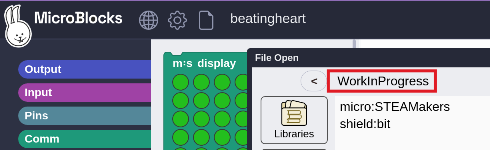  
    *Librerias WorkinProgress*

    </center>

La idea es comprobar que la conexión funciona haciendo que la micro:STEAMakers responda con cambios cuando se le indique desde la aplicación.

Para poder enviar mensajes desde la App a la micro:STEAMakers con un programa realizado con MicroBlocks vamos a necesitar añadir una extensión en App Inventor, la MicroBlocks BLE Extension. Las explicaciones sobre esta extensión las tenemos en el apartado [mBlocks + App Inventor + BLE](http://127.0.0.1:8000/....https://fgcoca.github.io/ESP32-micro-STEAMakers/guiamb/mb_inventor_BLE/).

Para mejorar el ejemplo anterior añadiremos tambien "Tools Extension", una colección de herramientas que no necesitan permisos adicionales y que se puede descargar desde la web de [Pura Vida Apps](https://puravidaapps.com/index.php). Utilizo esta extensión para mantener la pantalla activa mientras el microcontrolador permanece conectado. A continuación se exponen los términos y condiciones que aparecen en la web de la extensión mediante una imagen capturada de dicha web:

<center>

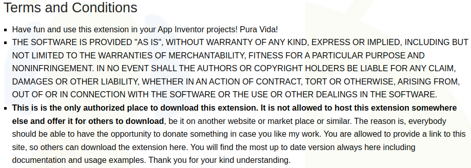  
*Captura de la web Pura Vida Apps*

</center>

A continuación se pone una traducción libre de esta captura:

!!!info "Términos y Condiciones"
    * ¡Diviértete y utiliza esta extensión en tus proyectos de App Inventor! ¡Pura Vida!
    * EL SOFTWARE SE PROPORCIONA "TAL CUAL", SIN GARANTÍA DE NINGÚN TIPO, EXPRESA O IMPLÍCITA, INCLUIDAS, ENTRE OTRAS, LAS GARANTÍAS DE COMERCIABILIDAD, IDONEIDAD PARA UN FIN DETERMINADO Y NO INFRACCIÓN. EN NINGÚN CASO LOS AUTORES O LOS TITULARES DE LOS DERECHOS DE AUTOR SERÁN RESPONSABLES DE NINGUNA RECLAMACIÓN, DAÑO U OTRA RESPONSABILIDAD, YA SEA EN UNA ACCIÓN CONTRACTUAL, EXTRACONTRACTUAL O DE OTRO TIPO, QUE SURJA DE, O ESTÉ RELACIONADA CON EL SOFTWARE O EL USO U OTRAS OPERACIONES CON EL SOFTWARE.
    * **Este es el único lugar autorizado para descargar esta extensión. No está permitido alojar esta extensión en otro lugar y ofrecerla para que otros la descarguen**, ya sea en otro sitio web o market place o similar. La razón es que todo el mundo debería tener la oportunidad de donar algo en caso de que le guste mi trabajo. Se le permite proporcionar un enlace a este sitio, para que otros puedan descargar la extensión. Aquí encontrará siempre la versión más actualizada, incluyendo documentación y ejemplos de uso. Gracias por su comprensión.
  
    <FONT COLOR=#FF0000><font size="5"><b>Por las razones expresadas en estos "Términos y Condiciones" aquí solamente se facilita el enlace a la web del autor.</b></font></font>

El diseño de la App tiene el aspecto de la imagen siguiente y bajo su título tenemos el enlace de descarga de EstablecerConexionMejorado.aia.

<center>

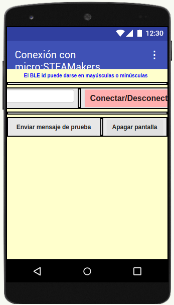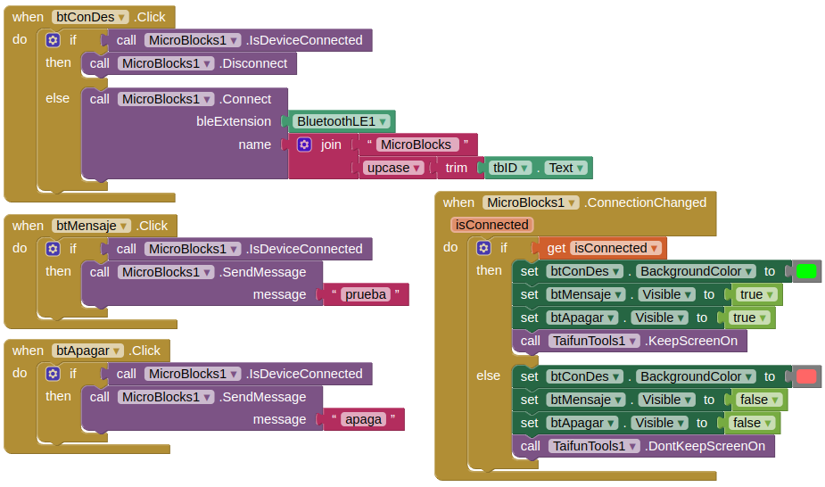  
*App EstablecerConexionMejorado*  
***[Descargar EstablecerConexionMejorado.aia](../program/AppInventor/EstablecerConexionMejorado.aia)***

</center>

Observamos que los mensajes enviados son: **```prueba```** y **```apaga```**.

Seguimos el mismo procedimiento y en las mismas condiciones que hemos visto en el ejemplo anterior.

Una vez escaneado el QR de AI Companion debemos ver la aplicación de la imagen, donde observamos que:

* Nos avisa que no distingue mayúsculas y minúsculas.
* Solicita el BLE id de la placa (ISJ en nuestro caso) para poder conectar.
* El botón se usará para conectar y desconectar la App con la placa.
* Inicialmente los botones están visibles pero posteriormente desaparecerán si estamos desconectados de la placa.

<center>

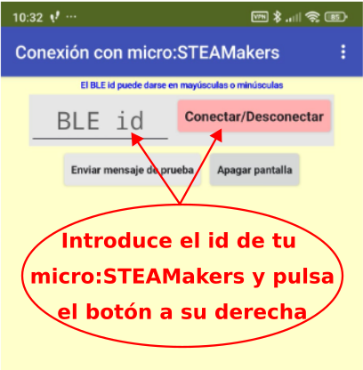  
*Pantalla inicial*

</center>

Introducimos el BLE id y pulsamos en el botón "Conectar/Desconectar". El botón se pone de color verde indicando que la conexión está establecida correctamente. Ya podemos proceder a pulsar alguno de los botones inferiores y observar el funcionamiento de la App controlando la micro:STEAMakers.

<center>

  
*Conexión establecida*

</center>

Si ahora pulsamos de nuevo el botón "Conectar/Desconectar" la App se desconecta de la placa y los botones de mensajes desaparecen, no volviendo a estar visibles hasta que no se restablezca la conexión.

<center>

  
*Desconexión*

</center>

Por otra parte necesitamos programar la placa con un firmware que se encargue de recibir los datos enviados desde la App y realizar las tareas que programemos. El programa en MicroBlocks va a guardar en una variable el último mensaje recibido (dependerá del botón pulsado en la App) y si este es "prueba" mostrará un símbolo de check en la pantalla en color verde. Si el mensaje recibido es "apaga" apagará todos los LEDs RGB.

<center>

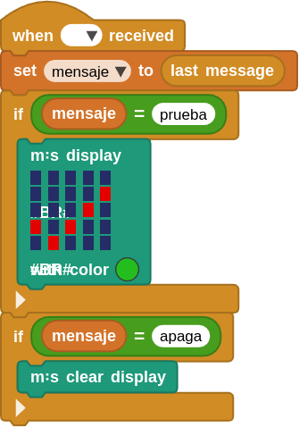  
*Programa EstablecerConexionMejorado.ubp*  
***[Descargar EstablecerConexionMejorado.ubp](../program/AppInventor/EstablecerConexionMejorado.ubp)***

</center>

Para que el programa esté en la placa necesitamos establecer conexión entre el IDE de MicroBlocks y la misma, pero es <FONT COLOR=#FF0000><b>MUY IMPORTANTE</b></font> que cuando finalicemos esta tarea desconectemos la placa del IDE o no podremos establecer la conexión desde la App. Recordemos que no están permitidas dos conexiones con la misma placa.

En la animación siguiente podemos observar el funcionamiento del sistema completo.

<center>

  
*Funcionamiento de EstablecerConexionMejorado*

</center>
