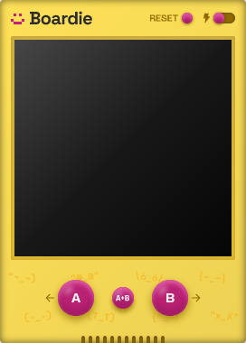
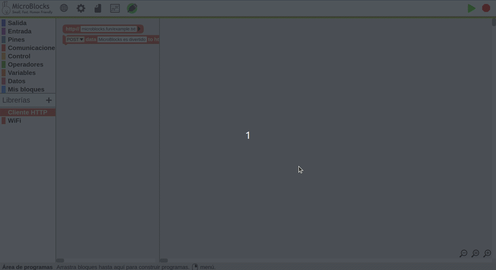
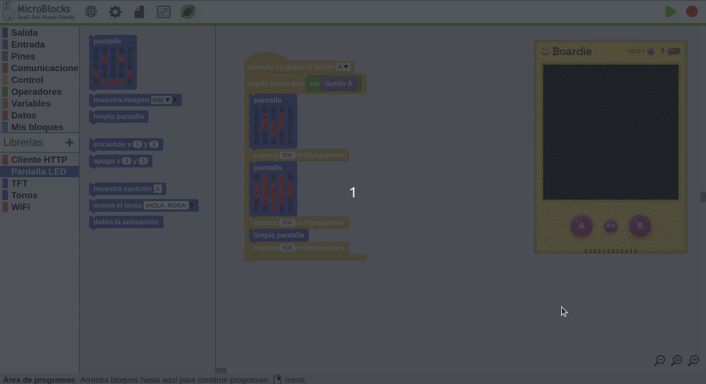
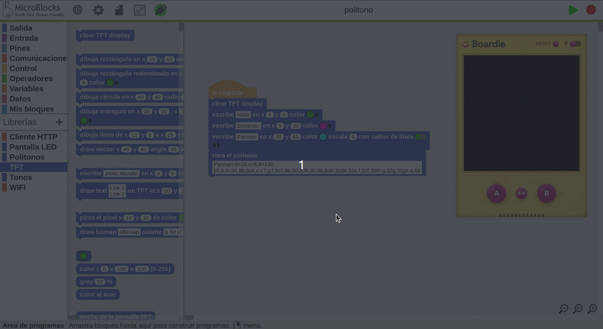
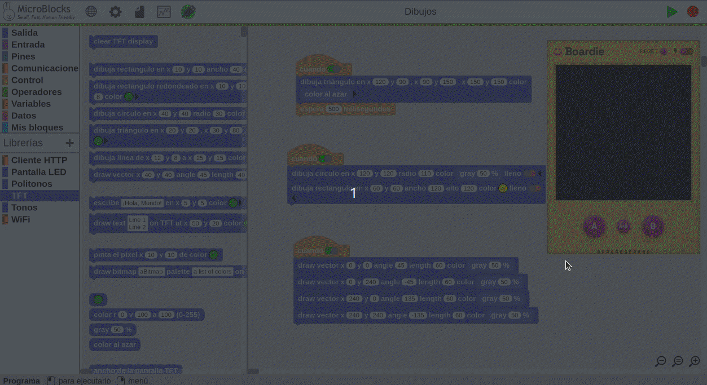

## **Introducción**
Lo que tenemos a continuación es una traducción de algunas de las partes de la la entrada en el blog de MicroBlocks de 7 de diciembre de 2022 titulado [Boardie: A Virtual Board for MicroBlocks](https://microblocks.fun/blog/2022-12-07-boardie-intro/) por [Bernat Romagosa, MicroBlocks](https://microblocks.fun/about#team). Además se agregan ejemplos de utilización básicos.

¿Cómo dar a alguien una introducción práctica a MicroBlocks si no tiene una placa de microcontrolada?

Es un problema que nos hemos encontrado muchas veces al presentar MicroBlocks en talleres virtuales durante los últimos años. También es un problema al que se enfrentan los profesores que no tienen suficientes placas para todos los alumnos de su clase.

Aparece **Boardie**, una placa virtual para MicroBlocks que permite probar MicroBlocks directamente en el navegador.

  
*Boardie*

El objetivo de Boardie es presentar MicroBlocks a las personas que están pensando en la computación física pero que aún no tienen una placa. Queremos ayudarles a ver que codificar un microcontrolador es fácil y divertido, y animarles a sumergirse en la computación física real.

## **Lo que no es Boardie**
Boardie no pretende sustituir a un microcontrolador real. La magia de la computación física radica en su capacidad para interactuar con el mundo físico: percibir fenómenos físicos como la luz, el sonido y la temperatura y controlar cosas como luces, motores y aparatos eléctricos.

Boardie no intenta simular sensores físicos ni dispositivos de salida. Aunque no es difícil simularlos -por ejemplo, los deslizadores pueden utilizarse como entradas de sensores virtuales y las imágenes animadas pueden mostrar motores y servos virtuales-, creemos que eso no es lo importante.

Queremos que la gente experimente la magia, y el aprendizaje resultante, de hacer computación física en el mundo físico real.

## **Lo que es Boardie**
Boardie es una placa virtual que hace algunas de las cosas que los microcontroladores reales pueden hacer. Tiene dos botones programables, como un micro:bit o una micro:STEAMakers, y puede emular la pantalla LED 5x5 del micro:bit o la pantalla TFT de 240x240 píxeles del Adafruit Clue. Puede emitir pitidos y reproducir melodías, y soporta un sencillo sistema de archivos. Por último, soporta la misma librería cliente HTTP de MicroBlocks que funciona en placas con WiFi.

## **Uso de Boardie**
Boardie se ejecuta en la aplicación web de MicroBlocks en [microblocks.fun/run](https://microblocks.fun/run). Como no requiere WebSerial, puede ejecutarse en Safari y Firefox, así como en Chrome y Edge. Boardie no es compatible con las aplicaciones independientes de MicroBlocks.

Boardie se inicia haciendo clic en el icono USB y seleccionando *abrir Boardie*. Cuando Boardie está abierto, MicroBlocks está conectado a él y puedes programar e interactuar con él de la misma manera que lo harías con un dispositivo físico real.

MicroBlocks sólo puede conectarse a una placa a la vez. Así que, como Boardie es una placa virtual, tendrá que desconectar Boardie antes de conectar MicroBlocks a una placa física. Utilice el comando de desconexión en el menú l icono USB o el interruptor de encendido de Boardie para desconectar. Boardie desaparece cuando se desconecta.

A continuación vemos como conectarnos con Boardie partiendo de una placa ESP32 micro:STEAMakers ya conectada y como volver a la situación anterior.

  
*Conexión con Boardie*

## **Especificaciones de Boardie**
Para los más técnicos, aquí están las especificaciones técnicas de esta placa virtual: 

* RAM: 65kB
* Almacenamiento de archivos: ~5MB
* Entradas: Botones A y B, más un botón combinado A+B, pantalla táctil
* Salidas: TFT de 240x240px y 24 bits, altavoz
* Capacidades de red: Cliente HTTP

## **Ejemplos**

### Latidos
Un sencillo ejemplo micro:bit ejecutándose en Boardie, el proyecto Latidos:

  
*Latidos*  
[Descargar el programa](../program/uB/latidos.ubp)

Al hacer clic, y mientras se mantiene pulsado, en el botón A de Boardie se ejecuta el programa.

Cuando el dispositivo Boardie tiene el foco, también puedes utilizar las teclas de flecha izquierda y derecha o las teclas A y B del teclado para activar los botones. Esta función es útil para los juegos.

### Politono y textos
Otro sencillo ejemplo micro:bit ejecutándose en Boardie en el que suena un politono en los altavoces del sistema y se muestran textos en la pantalla:

  
*Politono y textos*  
[Descargar el programa](../program/uB/politono.ubp)

### Dibujos
Un ejemplo en el que se dibujan figuras y vectores de diferentes colores:

  
*Dibujos*  
[Descargar el programa](../program/uB/Dibujos.ubp)

