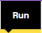
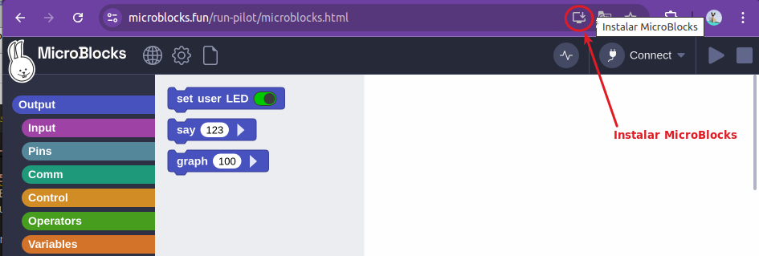
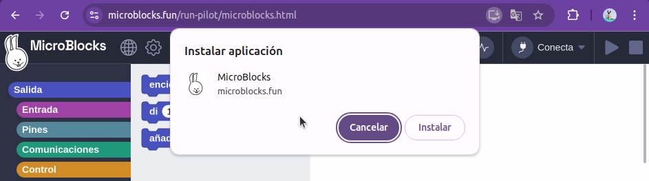
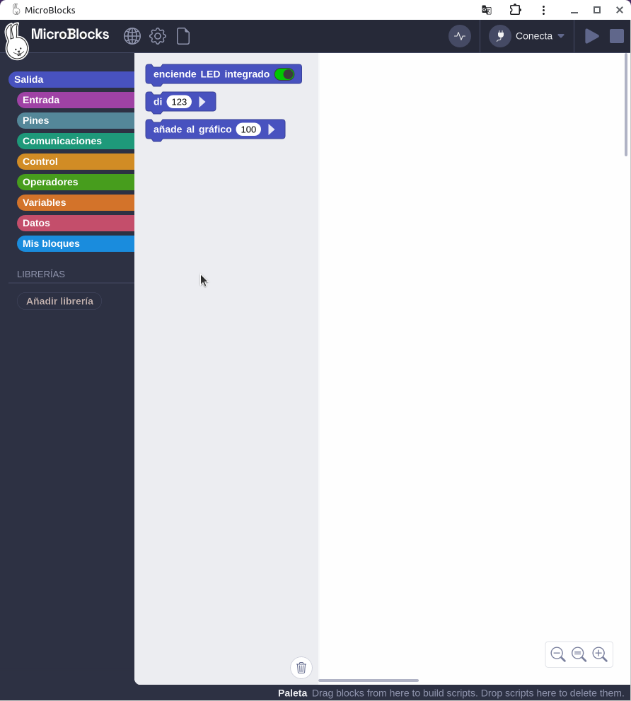
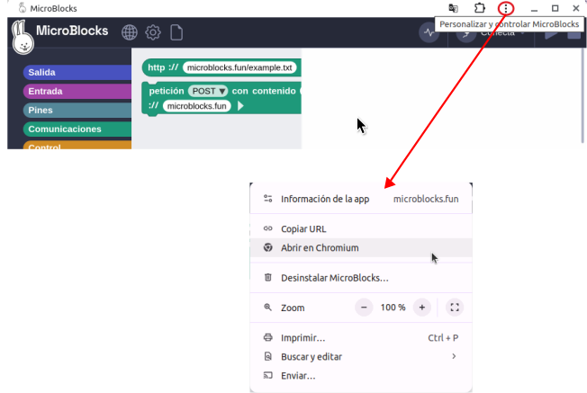
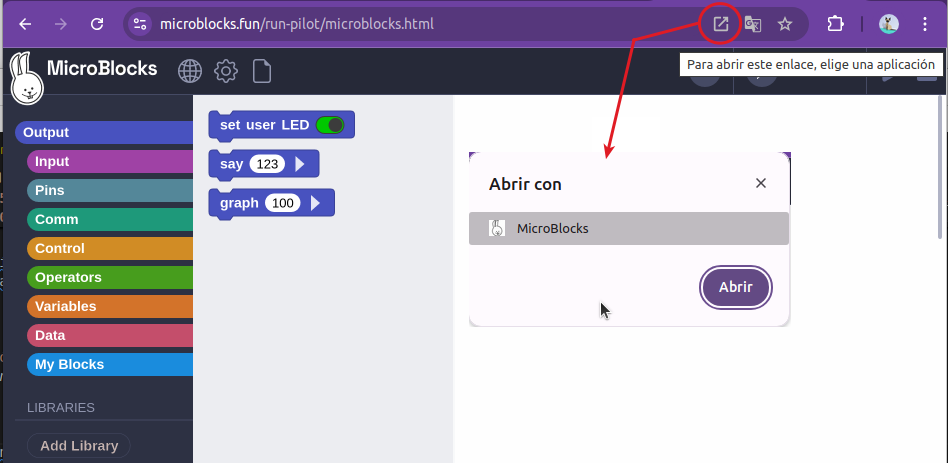

## <FONT COLOR=#007575>**Enlaces**</font>

{ align=left }  
**Versión estable MicroBlocks v1**

* [https://microblocks.fun/downloads/latest/](https://microblocks.fun/downloads/latest/)
* [https://microblocks.fun/run/microblocks.html ](https://microblocks.fun/run/microblocks.html)

**Versión piloto MicroBlocks Version 2**

* [https://microblocks.fun/downloads/pilot/](https://microblocks.fun/downloads/pilot/)
* [https://microblocks.fun/run-pilot/microblocks.html](https://microblocks.fun/run-pilot/microblocks.html)

## <FONT COLOR=#007575>**Configuración**</font>
Si se ejecuta MicroBlocks en un navegador Chromium, Chrome o Edge no es necesario instalar el programa en el ordenador; simplemente haz clic en el botón "Run" () en la parte superior derecha de la barra de navegación.

La ejecución de MicroBlocks en el navegador evita la necesidad de instalar una aplicación convencional.

### <FONT COLOR=#AA0000>Aplicación web MicroBlocks</font>
Para mayor comodidad, se puede guardar una copia de MicroBlocks como una "aplicación web progresiva (progressive web app)" que se puede iniciar como una aplicación convencional. Una vez guardada, la aplicación web de MicroBlocks ¡puede ejecutarse incluso sin conexión!

En la red podemos encontrar suficiente información si queremos profundizar mas sobre que es y como funciona una [Aplicación web progresiva](https://es.wikipedia.org/wiki/Aplicaci%C3%B3n_web_progresiva).

Para guardar la aplicación web MicroBlocks, ejecuta MicroBlocks en tu navegador y luego haz clic en el botón de instalación en la parte superior derecha de la barra de URL del navegador:

<center>

  
*Instalar MicroBlocks*

</center>

Tras hacer clic en el icono se da la opción de instalar o cancelar la operación:

<center>

  
*Instalar MicroBlocks*

</center>

Si se elige instalar se instalará la aplicación web y se abrirá MicroBlocks en una nueva ventana:

<center>

  
*MicroBlocks instalado*

</center>

Desde la barra de título de la aplicación podemos acceder a las opciones de configuración, entre las que se encuentra la opción de desinstalar la nueva aplicación web progresiva.

<center>

  
*Opciones aplicación web progresiva*

</center>

Con la aplicación instalada la barra de navegación muestra un nuevo icono indicativo desde el que podemos elegir la aplicación web progresiva que abrir, como se muestra en la imagen siguiente:

<center>

  
*Abrir aplicación web progresiva*

</center>

### <FONT COLOR=#AA0000>Configuración Linux</font>
Para usar Bluetooth Low Energy (BLE) en el navegador Chromium o Chrome en Linux, hay que habilitar una bandera (flag) ya que, al momento de escribir este artículo, Web Bluetooth todavía es experimental en la versión Linux de estos navegadores.

En la entrada [Web Serial ESPTool](http://127.0.0.1:8000/....https://fgcoca.github.io/ESP32-micro-STEAMakers/guiamb/webserial/) están todos los detalles para buscarla y habilitarla.

Si MicroBlocks no se conecta a la placa, asegúrate de haber reiniciado el sistema después de ejecutar el instalador. Luego ejecuta:

````sh
groups
````
para verificar que estás en los grupos dialout y tty.

Si no estás en los grupos dialout y tty, puedes agregarte manualmente haciendo lo siguiente:

````sh
sudo usermod -a -G dialout <tu nombre de usuario>
````

y

````sh
sudo usermod -a -G tty <tu nombre de usuario>
````

Necesitarás cerrar sesión y volver a iniciarla para que este cambio surta efecto.

Para verificar que Linux ve la placa, asegúrate de que la placa esté enchufada y luego ejecuta:

````sh
ls /dev | grep ACM
````

Deberías ver una entrada para tu placa, generalmente ttyACM0.

En 2022, algunas distribuciones de Linux, incluidas Ubuntu y Mint, comenzaron a instalar de forma predeterminada un paquete llamado BRLTTY (abreviatura de Braille TTY). Desafortunadamente, ese paquete entra en conflicto con las placas microcontroladas que utilizan el chip USB-serial CP210x, incluidas muchas compatibles con MicroBlocks. BRLTTY toma estas placas de modo que no aparezca ninguna entrada para la placa en /dev. Este problema se puede resolver eliminando el paquete BRLTTY:

````sh
sudo apt remove brltty
````
