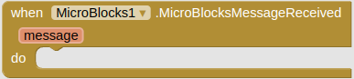

## <FONT COLOR=#007575>**Introducción**</font>
Se trata de ampliar las funcionalidades de Bluetooth LE utilizando como plataforma de programación MicroBlocks y la placa micro:STEAMakers que estamos tratando en esta web. Vamos a usar la versión de pruebas que nos servirá para introducir el nuevo IDE 2.0 de MicroBlocks.

Nos vamos a basar en [MicroBlocks BLE Extension](https://community.appinventor.mit.edu/t/microblocks-ble-extension/129412), extensión de App Inventor aportada a la [comunidad MIT APP INVENTOR](https://community.appinventor.mit.edu/) por **[Peter Mathijssen](https://petermathijssen.nl/)**:

<center>

  
*Peter en MIT App Inventor*

</center>

En la imagen siguiente vemos el aspecto del nuevo IDE con la libreria micro:STEAMaker cargada y un sencillo programa en la zona de programación:

<center>

  
*Aspecto del IDE 2.0*

</center>

## <FONT COLOR=#007575>**MicroBlocks**</font>
[MicroBlocks](https://microblocks.fun/) es un lenguaje de programación por bloques para computación física. Funciona en microcontroladores como [micro:bit](http://microbit.org/), [micro:STEAMakers](https://shop.innovadidactic.com/es/standard-placas-shields-y-kits/1677-placa-esp32-micro-steamakers-8436574314663.html), [Calliope mini](https://calliope.cc/en), [AdaFruit Circuit Playground Express](https://www.adafruit.com/product/3333) y muchas [otras](https://wiki.microblocks.fun/boards/supported).

### <FONT COLOR=#AA0000>Codificación de forma interactiva</font>
MicroBlocks es un entorno *"en vivo (en directo)"*. Al hacer clic en un bloque se ejecutará inmediatamente, directamente en la placa. Prueba comandos. Ver y graficar los valores de los sensores en tiempo real. Se acabó esperar a que el código se compile y se descargue.

### <FONT COLOR=#AA0000>Multitarea Natural</font>
¿Quieres visualizar una animación mientras controlas un motor? No hay problema, MicroBlocks permite escribir scripts separados para cada tarea y ejecutarlos al mismo tiempo. El código es más sencillo de escribir y más fácil de entender.

### <FONT COLOR=#AA0000>Correr en cualquier sitio</font>
MicroBlocks funciona en muchas placas diferentes, pero sus scripts son portables. Los botones, sensores y bloques de pantalla se comportan igual en todas las placas con el hardware relevante. MicroBlocks incluso simula la pantalla micro:bit 5x5 LED en pantallas TFT.

### <FONT COLOR=#AA0000>Desconecta y ¡adelante!</font>
MicroBlocks descarga el código en el microcontrolador a medida que lo escribes. Cuando te guste lo que hace tu programa, desconecta la placa y listo. Crea un juego de bolsillo, una aplicación de fitness o ropa luminosa que vaya contigo a todas partes.

### <FONT COLOR=#AA0000>MicroBlocks 2.0</font>
Las diferencias entre MicroBlocks 1.2 y 2.0 son obvias y se ven a primera vista.

<center>

  
*El viejo MicroBlocks 1.2*
  
*El nuevo MicroBlocks 2.0*

</center>

MicroBlocks 2.0 tiene una interfaz de usuario completamente rediseñada y moderna, con iconos limpios, una atractiva combinación de colores, una paleta de bloques animados y compatibilidad con el modo oscuro. Los cambios en el diseño de los bloques incluyen contornos más sencillos, mejor contraste de colores para mejorar la legibilidad, campos de entrada de datos más grandes y triángulos de selección de menús y opciones más grandes y manejables.

#### <FONT COLOR=#0000FF>Transición del firmware</font>
MicroBlocks 2.0 también mejora la máquina virtual (VM), el firmware que ejecuta el código MicroBlocks. La antigua VM utilizaba instrucciones de longitud fija de 32 bits; la nueva utiliza instrucciones de longitud variable de 16 bits.

Dado que utilizan conjuntos de instrucciones completamente diferentes, las dos VM no son compatibles. MicroBlocks 2.0 requiere la nueva VM (versiones de firmware 300 y posteriores) mientras que las versiones anteriores de MicroBlocks requieren la antigua VM (versiones de firmware anteriores a 300).

No hay diferencias a nivel de código fuente; los mismos archivos de proyecto y biblioteca de MicroBlocks funcionan tanto en MicroBlocks 2.0 como en versiones anteriores.

La primera vez que se conecta una placa con firmware antiguo a MicroBlocks 2.0 se pedirá que actualice el firmware:

<center>

  
*Primera conexión firmware antiguo*

</center>

Si intentas utilizar una placa con un firmware que no es compatible con la versión de MicroBlocks que estás utilizando, recibirás esta advertencia al intentar ejecutar el código:

<center>

  
*Firmware no compatible*

</center>

Si se recibe esa advertencia, sólo hay que actualizar el firmware de la placa utilizando el comando "actualizar firmware de la placa" en el menú engranajes. Esto actualizará la placa con el firmware que coincida con la versión de MicroBlocks que se esté utilizando. Se puede utilizar la misma técnica para revertir el firmware y utilizar una versión anterior de MicroBlocks, si lo necesitamos.

#### <FONT COLOR=#0000FF>Transición a la versión estable</font>
Tras varias semanas de pruebas de MicroBlocks 2.0 como versión piloto, la versión estable también se actualizará a MicroBlocks 2.0.

Sin embargo, incluso después de eso, las versiones anteriores de MicroBlocks podrán descargarse utilizando el botón "Previous Versions" de la [página de descargas](https://microblocks.fun/download):

<center>

  

</center>

La última versión estable de la versión antigua es la 1.2.100.

## <FONT COLOR=#007575>**MicroBlocks BLE Extension**</font>
La extensión hace que la conexión a microcontroladores sea muy fácil. Hace todo el trabajo difícil por ti utilizando los bloques que contiene.

### <FONT COLOR=#AA0000>Métodos</font>
Están disponibles los bloques para los siguientes métodos:

* **Connect**

<center>

  
*Bloque Connect*

</center>

Conectar a MicroBlocks el dispositivo con el nombre indicado. Tenemos que importar la extensión "[Bluetooth LE](https://mit-cml.github.io/extensions/)" y utilizar el bloque "BluetoothLE" () de esa extensión como primer parámetro de este bloque. El segundo parámetro es el nombre de la placa a la que desea conectarse, como "MicroBlocks XYZ", donde XYZ es el ID BLE de tres letras de la placa.

<table>
<tr>
<td><b>Parámetro</b></td>
<td><b>Tipo</b></td>
</tr>
<tr>
<td>bleExtension</td>
<td>componente</td>
</tr>
<tr>
<td>name</td>
<td>texto</td>
</tr>
</table>

* **Disconnect**

<center>

  
*Bloque Disconnect*

</center>

Se desconecta del dispositivo BluetoothLE actualmente conectado, si lo hubiera.

* **IsDeviceConnected**

<center>

  
*Bloque IsDeviceConnected*

</center>

Devuelve el valor booleano 'true' si un dispositivo está conectado.

* **SendMessage**

<center>

  
*Bloque SendMessage*

</center>

Envía el mensaje dado a MicroBlocks.

<table>
<tr>
<td><b>Parámetro</b></td>
<td><b>Tipo</b></td>
</tr>
<tr>
<td>message</td>
<td>texto</td>
</tr>
</table>

### <FONT COLOR=#AA0000>Eventos</font>
Están disponibles los siguientes eventos:

* **ConnectionChanged**

<center>

  
*Bloque ConnectionChanged*

</center>

Este evento se ejecuta cuando se conecta o desconecta un dispositivo.

<table>
<tr>
<td><b>Parámetro</b></td>
<td><b>Tipo</b></td>
</tr>
<tr>
<td>isConnected</td>
<td>booleano</td>
</tr>
</table>

* **MicroBlocksMessageReceived**

<center>

  
*Bloque MicroBlocksMessageReceived*

</center>

Este evento se ejecuta cuando se recibe un mensaje MicroBlocks.

<table>
<tr>
<td><b>Parámetro</b></td>
<td><b>Tipo</b></td>
</tr>
<tr>
<td>isConnected</td>
<td>texto</td>
</tr>
</table>

## <FONT COLOR=#007575>**Ejemplos**</font>
Si no conocemos el BLE id de la placa que estamos utilizando, una forma sencilla de averiguarlo es dirigirnos a la categoría 'Entrada' de MicroBlocks. La placa tiene que estar conectada al IDE para mostrar el BLE id.

<center>

  
*BLE id*

</center>

### <FONT COLOR=#AA0000>Enviar mensaje desde microcontrolador a una App</font>
Seguimos trabajando con las extensiones:

* MicroBlocks BLE Extension.
* Tools Extension, de [Pura Vida Apps](https://puravidaapps.com/index.php) según los términos y condiciones que aparecen en la web de la extensión:

Utilizo esta extensión para mantener la pantalla activa mientras el microcontrolador permanece conectado.

<center>

  
*Captura de la web Pura Vida Apps*

</center>

Traducción libre de esta captura:

!!!info "Términos y Condiciones"
    * ¡Diviértete y utiliza esta extensión en tus proyectos de App Inventor! ¡Pura Vida!
    * EL SOFTWARE SE PROPORCIONA "TAL CUAL", SIN GARANTÍA DE NINGÚN TIPO, EXPRESA O IMPLÍCITA, INCLUIDAS, ENTRE OTRAS, LAS GARANTÍAS DE COMERCIABILIDAD, IDONEIDAD PARA UN FIN DETERMINADO Y NO INFRACCIÓN. EN NINGÚN CASO LOS AUTORES O LOS TITULARES DE LOS DERECHOS DE AUTOR SERÁN RESPONSABLES DE NINGUNA RECLAMACIÓN, DAÑO U OTRA RESPONSABILIDAD, YA SEA EN UNA ACCIÓN CONTRACTUAL, EXTRACONTRACTUAL O DE OTRO TIPO, QUE SURJA DE, O ESTÉ RELACIONADA CON EL SOFTWARE O EL USO U OTRAS OPERACIONES CON EL SOFTWARE.
    * **Este es el único lugar autorizado para descargar esta extensión. No está permitido alojar esta extensión en otro lugar y ofrecerla para que otros la descarguen**, ya sea en otro sitio web o market place o similar. La razón es que todo el mundo debería tener la oportunidad de donar algo en caso de que le guste mi trabajo. Se le permite proporcionar un enlace a este sitio, para que otros puedan descargar la extensión. Aquí encontrará siempre la versión más actualizada, incluyendo documentación y ejemplos de uso. Gracias por su comprensión.
  
    <FONT COLOR=#FF0000><font size="5"><b>Por las razones expresadas en estos "Términos y Condiciones" aquí solamente se facilita el enlace a la web del autor.</b></font></font>

El diseño de la App tiene el aspecto de la imagen siguiente y bajo su título tenemos el enlace de descarga de Recibir_un_dato_desde_microncontrolador.aia.

<center>

  
*App Recibir_un_dato_desde_microncontrolador*  
***[Descargar Recibir_un_dato_desde_microncontrolador.aia](../program/AppInventor/Recibir_un_dato_desde_microncontrolador.aia)***

</center>

Una vez escaneado el QR de AI Companion debemos ver la aplicación de la imagen, donde observamos que:

* Nos avisa que no distingue mayúsculas y minúsculas.
* Solicita el BLE id de la placa (ISJ en nuestro caso) para poder conectar.
* El botón se usará para conectar y desconectar la App con la placa.
* Inicialmente la etiqueta donde se refleja el dato recibido no contiene ningún texto.

<center>

  
*Pantalla inicial*

</center>

Introducimos el BLE id y pulsamos en el botón "Conectar". El botón se pone de color verde y cambia su texto indicando que la conexión está establecida correctamente. Tmabién aparece la etiqueta que muestra el dato recibido.

<center>

  
*Conexión establecida*

</center>

Por otra parte el programa en MicroBlocks está enviado el valor de inclinación de la placa respecto al eje X cada 100ms.

<center>

  
*Programa Recibir_un_dato_desde_microncontrolador.ubp*  
***[Descargar Recibir_un_dato_desde_microncontrolador.ubp](../program/AppInventor/Recibir_un_dato_desde_microncontrolador.ubp)***

</center>

Para que el programa esté en la placa necesitamos establecer conexión entre el IDE de MicroBlocks y la misma, pero es <FONT COLOR=#FF0000><b>MUY IMPORTANTE</b></font> que cuando finalicemos esta tarea desconectemos la placa del IDE o no podremos establecer la conexión desde la App. Recordemos que no están permitidas dos conexiones con la misma placa.

En la animación siguiente podemos observar el funcionamiento del ejemplo.

<center>

  
*Funcionamiento de Recibir_un_dato_desde_microncontrolador*

</center>

### <FONT COLOR=#AA0000>Recibir múltiples datos</font>
Este ejemplo es una continuación del anterior "Enviar mensaje desde microcontrolador a una App" y por tanto seguimos trabajando con las extensiones:

* MicroBlocks BLE Extension.
* Tools Extension, de [Pura Vida Apps](https://puravidaapps.com/index.php) según los términos y condiciones que aparecen en la web de la extensión vistos anteriormente.

El diseño de la App tiene el aspecto de la imagen siguiente y bajo su título tenemos el enlace de descarga de RecibirMultiplesDatos.aia.

<center>

  
*App RecibirMultiplesDatos*  
***[Descargar RecibirMultiplesDatos.aia](../program/AppInventor/RecibirMultiplesDatos.aia)***

</center>

La conexión con AI Companion y la placa micro:STEAMakers es exactamente la misma que en los ejemplos anteriores.

El programa en MicroBlocks está enviado el valor de inclinación de la placa respecto a los tres ejes cada 100ms.

<center>

  
*Programa RecibirMultiplesDatos.ubp*  
***[Descargar RecibirMultiplesDatos.ubp](../program/AppInventor/RecibirMultiplesDatos.ubp)***

</center>

En la animación siguiente podemos observar el funcionamiento del ejemplo.

<center>

  
*Funcionamiento de RecibirMultiplesDatos*

</center>

### <FONT COLOR=#AA0000>Recibir múltiples datos utilizando palabras clave</font>
Otra forma de resolver el ejemplo anterior es utilizar palabras clave (keywords) para distinguir unos datos de otros.

Seguimos trabajando con las extensiones:

* MicroBlocks BLE Extension.
* Tools Extension, de [Pura Vida Apps](https://puravidaapps.com/index.php) según los términos y condiciones que aparecen en la web de la extensión vistos anteriormente.

Utilizo esta extensión para mantener la pantalla activa mientras el microcontrolador permanece conectado.

El diseño de la App tiene el aspecto de la imagen siguiente y bajo su título tenemos el enlace de descarga de RecibirMultiplesDatosKeywords.aia.

<center>

  
*App RecibirMultiplesDatosKeywords*  
***[Descargar RecibirMultiplesDatosKeywords.aia](../program/AppInventor/RecibirMultiplesDatosKeywords.aia)***

</center>

Aunque ya figura comentado en el programa, indicar que como carácter delimitador entre la clave y el valor del dato se utiliza el espacio en blanco y su [valor decimal en Latín básico del listado de caracteres Unicode](https://en.wikipedia.org/wiki/List_of_Unicode_characters) es 32 (U+0020).

La conexión con AI Companion y la placa micro:STEAMakers es exactamente la misma que en los ejemplos anteriores.

El programa en MicroBlocks está enviado el valor de inclinación de la placa respecto a los tres ejes cada 100ms.

<center>

  
*Programa RecibirMultiplesDatosKeywords.ubp*  
***[Descargar RecibirMultiplesDatosKeywords.ubp](../program/AppInventor/RecibirMultiplesDatosKeywords.ubp)***

</center>

El funcionamiento es totalmente idéntico al del ejemplo anterior.

### <FONT COLOR=#AA0000>Beating Heart</font>
Este ejemplo es el que aparece en [MicroBlocks BLE Extension](https://community.appinventor.mit.edu/t/microblocks-ble-extension/129412), extensión de App Inventor aportada a la [comunidad MIT APP INVENTOR](https://community.appinventor.mit.edu/) por **[Peter Mathijssen](https://petermathijssen.nl/)**.

Su adaptación a micro:STEAMakers y a los ejemplos anteriores es la que vamos a desarrollar en este apartado. Partimos del ejemplo EstablecerConexionMejorado que cargamos y archivamos como Beating_Heart_microSM

Seguimos trabajando con las extensiones:

* MicroBlocks BLE Extension.
* Tools Extension, de [Pura Vida Apps](https://puravidaapps.com/index.php) según los términos y condiciones que aparecen en la web de la extensión vistos anteriormente.

Utilizo esta extensión para mantener la pantalla activa mientras el microcontrolador permanece conectado.

El diseño de la App tiene el aspecto de la imagen siguiente y bajo su título tenemos el enlace de descarga de Beating_Heart_microSM.aia.

<center>

  
*App Beating_Heart_microSM*  
***[Descargar Beating_Heart_microSM.aia](../program/AppInventor/Beating_Heart_microSM.aia)***

</center>

La conexión con AI Companion y la placa micro:STEAMakers es la misma que en los ejemplos anteriores.

El programa en MicroBlocks está recibiendo mensajes que se envian y el valor recibido en el último mensaje lo guarda en la variable ```wait```, de forma que dicha variable tomará como valor el de la posición del deslizador de la App que como podemos comprobar varía entre 100 y 1000 y su posición inicial se sitúa en 500. Por defecto el programa también asigna dicho valor (500) a la variable, que en definitiva es el retardo entre las imágenes que se muestran, que ya podemos deducir que estará entre 100ms y 1000ms.

<center>

  
*Programa Beating_Heart_microSM.ubp*  
***[Descargar Beating_Heart_microSM.ubp](../program/AppInventor/Beating_Heart_microSM.ubp)***

</center>

En la animación siguiente podemos observar el funcionamiento del ejemplo. Como se observa el programa está grabado en la placa y como los latidos están dentro de un bucle infinito, el corazón ya está latiendo.

<center>

  
*Funcionamiento de Beating_Heart_microSM*

</center>

Como se observa al final, cuando no hay conexión los cambios en la pantalla no tienen efecto en la placa. Esto se debe al bloque "call TaifunTools1.DontKeepScreenOn".

### <FONT COLOR=#AA0000>LED editor micro:STEAMakers</font>
Este ejemplo creado y documentado por [Peter Mathijssen](https://petermathijssen.nl/) tiene su historial en el servidor [MicroBlocks en Discord](https://discord.com/channels/1000653853491998760/1228896347206451240) en el hilo #appinventor. Utilizaré aquí la versión que tan amablemente Peter me envió a través de esta misma plataforma.

La documentación del ejemplo está en [LED editor using MicroBlocks extension](https://community.appinventor.mit.edu/t/led-editor-using-microblocks-extension/130645).

Seguimos trabajando con las extensiones:

* MicroBlocks BLE Extension.
* Tools Extension, de [Pura Vida Apps](https://puravidaapps.com/index.php) según los términos y condiciones que aparecen en la web de la extensión vistos anteriormente.

Utilizo esta extensión para mantener la pantalla activa mientras el microcontrolador permanece conectado.

El diseño de la App tiene el aspecto de la imagen siguiente y bajo su título tenemos el enlace de descarga de led_editor_v1.aia.

<center>

!  
***[Descargar led_editor_v1.aia](../program/AppInventor/led_editor_v1.aia)***

</center>

Dada la extensión del software se pone por partes para facilitar su visualización.

<center>

  
*App led_editor_v1. Conexión/Desconexión*  

  
*App led_editor_v1. Variables*  

  
*App led_editor_v1. Botonera*

</center>

!!!info "[Any Component Blocks](https://ai2.appinventor.mit.edu/reference/other/any-component-blocks.html)"
    Este último evento es un bloque del tipo “Cualquier componente (Any Component)” propio de MIT App Inventor que resulta especialmente útil cuando queremos realizar una misma operación en muchos componentes diferentes sin necesidad de copiar y pegar cada bloque las veces que sea necesario. La idea es sustituir diferentes componentes por un solo componente, lo que se consigue con los bloques "cualquier componente".
    
    Los bloques de componentes tienen eventos, métodos y propiedades, y cada uno de ellos tiene sus correspondientes bloques "cualquier componente".
    
    Se puede cambiar entre un bloque para un componente específico y el bloque de cualquier componente equivalente a través de los elementos de menú "Make Generic" en el menú contextual (clic derecho) de un bloque.

    <center><b>En el enlace del título tenemos toda la información al respecto.</b></center>

La conexión con AI Companion y la placa micro:STEAMakers se realiza de la manera habitual.

En el programa en MicroBlocks, estando conectada la placa, se muestra al inicio el "BLE id" de la placa y se crea una lista con los mismos colores que la aplicación.

La recepción de mensajes se hace utilizando el separador "," (coma) para dividir el mensaje en sus tres partes, que son los índices de la fila, la columna y el color elegido. La coordenada (1,1) es el LED superior izquierdo y los colores se numeran de izquierda a derecha del 1 al 8.

<center>

  
*Programa led_editor_v1.ubp*  
***[Descargar led_editor_v1.ubp](../program/AppInventor/led_editor_v1.ubp)***

</center>

En la animación siguiente podemos observar el funcionamiento del ejemplo. Como se observa el programa está grabado en la placa sin el bloque que muestra los valores del mensaje recibido desplazándose.
<center>

  
*Funcionamiento de led_editor_v1*

</center>


Al final meter lo de la Extensión, descargandola y como obtenerla

