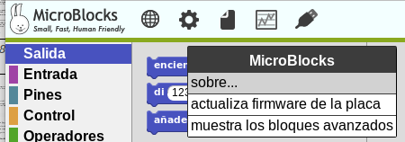
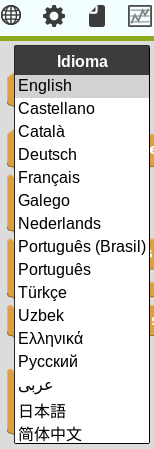
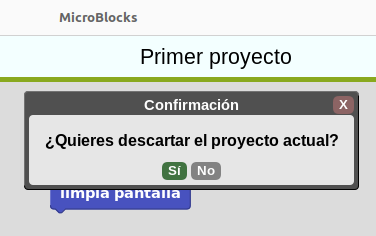
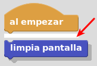

## **Introducción a MicroBlocks**

!!! info "**IMPORTANTE**"
    La presente guía de MicroBlocks hace referencia fundamentalmente a la placa micro:bit principalmente porque esta fue creada antes de la existencia de micro:STEAMakers.

    Esta web está dedicada a la placa micro:STEAMakers y su funcionamiento con MicroBlocks. En la práctica todo lo que aparece en la guía es aplicable a esta nueva placa con las lógicas excepciones de configuraciones y ejemplos realizados.

    En este otro apartado de esta web  se trabaja con los bloques de la placa micro:STEAMakers y se desarrollan actividades con la misma.

[MicroBlocks](https://microblocks.fun/) es una herramienta de programación por bloques basada en [Snap!](https://snap.berkeley.edu/). Se trata de un software que puede trabajar online o localmente y que nos va a permitir programar diferentes placas, entre ellas la micro:bit, ESP32 micro:STEAMakers, ESP32 STEAMakers, ED1, etc.

  
*Logotipo de MicroBlocks*

*Logotipo descargado de la entrada en [SAP](https://www.sap.com/spain/index.html?url_id=auto_hp_redirect_spain) de [Kathy Giori](https://people.sap.com/kgiori)   titulada [Recap of “Sneak Preview into MicroBlocks”](https://blogs.sap.com/2021/01/28/recap-of-sneak-preview-into-microblocks/).* 

**MicroBlocks** es un lenguaje de programación por bloques similar a Scratch que es una excelente herramienta para aprender desde nivel principiante hasta nivel experto y válido para edades que van desde los 8 hasta los 99 años.

En el apartado [Get Started](https://microblocks.fun/get-started) de su web tenemos descrito como trabajar desde un navegador y los distintos sistemas operativos así como los pasos a seguir para configurar nuestra placa y como comenzar a crear programas.

En esta ocasión vamos a trabajar de forma local [descargando](https://microblocks.fun/download) e instalando el programa en nuestro ordenador. En mi caso trabajaré con Linux de 64 bits instalando el paquete debian descargado 'ublocks-amd64.deb'. La forma elegida para instalarlo, suponiendo que el paquete está en Descargas, es:

~~~bash
sudo dpkg -i ~/Descargas/ublocks-amd64.deb
~~~

Tras la instalación verificamos que todo está correcto y que Linux ve la placa ejecutando en una terminal lo que vemos en la imagen siguiente.

  
*Verificación de conexión con micro:bit en Linux*

En el enlace [Mis notas sobre Linux trabajando con Ubuntu](https://fgcoca.github.io/Mis-notas-sobre-Linux-Ubuntu/) tenemos un par de entradas que describen problemas con el paquete *brltty* (Braille TTY). En el caso de placas con un chip microcontrolador de la serie USB CP210x, algunas de ellas compatibles con MicroBlocks. Si tenemos este caso el problema se puede resolver eliminando el paquete BRLTTY.

~~~sh
sudo apt remove brltty
~~~

El programa una vez instalado lo tenemos disponible en aplicaciones, como vemos en la imagen siguiente.

  
*App MicroBlocks disponible*

## **¿Por qué usar MicroBlocks?**
**MicroBlocks** tiene una característica que lo distingue de otros lenguajes de programación por bloques y es que la programación real ocurre según se desarrolla el programa, lo que podemos denominar como programación en directo o en vivo y, debido a esto, que implica que el código se descarga según se escribe tenemos la otra característica que le dota de independencia o autonomía, ya que cuando demos el programa por bueno, este ya está grabado como firmware en la placa.

Otra de la características importantes que ofrece **MicroBlocks** es la multitarea o posibilidad de desarrollar funcionalidades que trabajan de forma paralela y separada cada tarea. Por ejemplo, reproducir un sonido mientras se controla un servomotor. Esta forma de trabajo hace que el código sea mas sencillo de escribir y de entender.

Cuando trabajamos con **MicroBlocks** la placa que conectemos se comporta como una tarjeta de memoria. No hay necesidad de leer un archivo de proyecto, simplemente conectamos la placa y el script o programa nos aparecerá en el IDE. Es decir, **MicroBlocks** lee el programa que hay en la placa y lo carga de manera automática.

El funcionamiento de **MicroBlocks** se basa en:

* El editor de bloques o IDE que se puede ejecutar online o de manera local.
* Una máquina virtual que se ejecuta en la placa microcontroladora. Esta máquina virtual es la encargada de ejecutar el programa de usuario y lo hace compilando en código de bytes o instrucciones de bajo nivel muy parecidas al código máquina. Si tenemos habilitados los bloques avanzados podemos ver los bytes generados por el programa, como vemos en la animación siguiente:
  

  
*Código de bytes*

La parte más importante de la información de bytes es la primera línea, que muestra el número de bytes compilados. Los scripts en MicroBlocks no deben superar los 1000 bytes, de ahí la importancia de esta información.

* El sistema de comunicación entre la placa y el host remoto o el ordenador que hace que el firmware se actualice según se escribe el programa. Este sistema es el encargado de enviar los bytes y comandos para iniciar el programa y procesar mensajes del microcontrolador. Así el editor proporciona realimentación gráfica de lo que sucede en el microcontrolador y directamente puede mostrar valolres en un "bocadillo de conversación" como el de la figura siguiente.

  
*Bocadillo de conversación*

**MicroBlocks** también dispone de una herramienta de representación gráfica que estudiaremos en su momento.

Una funcionalidad importante del editor es que, además de programar por bloques, administra las **Librerias**, que están escritas en **MicroBlocks**. Existen muchas que iremos viendo poco a poco. Las librerias escritas en **MicroBlocks** pueden ser editadas por los usuarios.

## **Los cuatro pilares de MicroBlocks**
Según [Bernat Romagosa](http://romagosa.work/), que forma parte del [equipo de MicroBlocks](https://microblocks.fun/about), este es un software en vivo capaz de trabajar con varias placas diferentes como micro:bit, nodemcu y otras muchas. El lenguaje está desarrollado en torno a cuatro conceptos que consideran esenciales para un lenguaje de programación educativo. Ellos los llaman los cuatro pilares de MicroBlocks:

1. **Vivo**. El primero de estos pilares es que MicroBlocks es un lenguaje de programación "en directo" o "en vivo", lo que significa que puedo arrastrar un bloque a la zona de programa y ver el resultado de cambiarlo en la ejecución en la placa de manera inmediata. Esto significa que no hay que esperar ni ciclos de carga ni compilaciones ni nada de esto. El programa trabaja en tiempo real con la placa.
2. **Multitarea**. El segundo pilar es que se trata de un lenguaje de programación multitares o que trabaja en paralelo, lo que significa que se pueden ejecutar varias tareas al mismo tiempo.
3. **Autónomo**. El tercero de los pilares es que MicroBlocks es un lenguaje autónomo, lo que significa que si, en cualquier momento, desconectamos la micro:bit del ordenador y alimentamos de forma externa el programa se seguirá ejecutando tal y como estaba sin modificaciones y sin tener que presionar ningún botón. No hay que esperar ningún ciclo de carga de firmware.
4. **Portatil**. El cuarto pilar es que se trata de un programa diseñado para que sea portatil por lo que si cambiamos de tipo de placa, esta seguirá ejecutando exactamente el mismo programa. La portabilidad se ha llevado al extremos de que si nos hemos olvidado de guardar nuestro programa en el ordenador, simplemente con conectar la placa este se carga en el IDE o también podemos, con la placa desconectada, escoger la opción de "Recuperar proyecto de la placa" que está en el menú del icono "Fichero". Tengase en cuenta que en este proceso los comentarios se pierden.

Un sencillo ejemplo nos servirá para ver todo esto. Se trata de crear un programa en el que un corazón lata en la pantalla a un intervalo determinado por una variable. Con el botón A disminuiremos el intervalo y con el botón B lo aumentaremos. El programa se debe ir creando en orden, con una placa conectada y ejectándose la tarea principal, para poder ir viendo los cambios que hagamos como se reflejan en la placa inmediatamente. El programa es:

  
*Ejemplo cuatro pilares*

*Basado en [Exploring sound with the micro:bit V2 & MicroBlocks, MicroBlocks Team](https://www.youtube.com/watch?v=bJIswaur8Gg)*

[Descargar el programa](../ejemplos/Cuatro_pilares.ubp)

## **Configuración del equipo**
Necesitamos un ordenador (¡no un dispositivo móvil!. Actualmente en desarrollo) con un puerto USB, un cable USB y una placa soportada. Podemos ejecutar **MicroBlocks** en un navegador Chromium, Chrome o Edge, o descargarlo como una aplicación independiente para Linux, Chromebook, Windows o MacOS. Las [placas soportadas](https://wiki.microblocks.fun/boards/supported) son:

* BBC [micro:bit](http://microbit.org/) v1 y v2
* [Calliope mini](https://calliope.cc/calliope-mini/uebersicht)
* Circuit Playground [Express](https://www.adafruit.com/product/3333) y [Bluefruit](https://www.adafruit.com/product/4333)
* [Citilab ED1](https://market.citilab.eu/es/producte/placa-ed1/)
* [Raspberry Pi Pico and Pico W](https://www.raspberrypi.com/documentation/microcontrollers/raspberry-pi-pico.html)
* [Adafruit Clue](https://www.adafruit.com/product/4500)
* [M5Stack Core](https://m5stack.com/collections/m5-core/products/grey-development-core?variant=16804796006490) Grey
* ESP8266 y ESP32

Los instaladores están disponibles para las [versiones liberadas](https://microblocks.fun/releases) listas para descargar la apropiada para nuestro sistema operativo. Si estamos trabajando con Chrome o Edge es muy posible que nos advierta de que estamos descargando un archivo que podría dañar nuestro ordenador. Debemos ignorar esta y sucesivas advertencias para proceder con la descarga.

En Linux se descarga un paquete .deb, ublocks-amd64.deb en concreto para esta ocasión que se instala de forma muy sencilla. Con una terminal abierta en el directorio donde está el archivo .deb tecleamos:

~~~py
dpkg -i ~/Descargas/ublocks-amd64.deb
~~~

Tras breves instantes el programa estará instalado y lo tendremos disponible en aplicaciones, como ya hemos visto antes.

## **Configuración de la placa**
El proceso de configuración de las placas soportadas es muy similar en todas ellas y es seguir el proceso que vamos a ver a continuación. En este caso particular se toman las imágenes y animaciones realizando el proceso con una micro:bit V2.21.

Conectamos la placa al ordenador y en el menú de MicroBlocks hacemos clic en el engranaje y seleccionamos la opción 'actualizar firmware de la placa'.

  
*Actualizar firmware de la placa*

En el menú de la ventana emergente tenemos que seleccionar el tipo de placa que hemos conectado.

  
*Seleccionar placa*

Si estamos trabajando con MicroBlocks en un navegador, se nos pedirá que seleccionemos la placa si aún no está conectada.

Si no hay una placa conectada aparecerá el siguiente aviso.

  
*No puedo abrir puerto serie*

Si todo está correcto el icono del puerto USB pasa a estar acompañado de un círculo verde que indica la conexión.

  
*Conexión por puerto serie realizada*

En este video del canal Youtube de MicroBlocks Fun titulado [Quick introduction to MicroBlocks for programming a micro:bit](https://www.youtube.com/watch?v=cf2xsYSTqgY) (Introducción rápida a MicroBlocks para programar un micro:bit) tenemos una introducción rápida a MicroBlocks con micro:bit.

La información en inglés de la [guia de usuario](https://wiki.microblocks.fun/ide) y el [manual de referencia de bloques](https://wiki.microblocks.fun/reference_manual) también pueden resultarnos de gran ayuda.

### Actualizar firmware en ESP32
Los dispositivos ESP son una categoría especial de [Espressif](https://www.espressif.com/en) que cuentan con capacidad WIFI. En estas placas se borra totalmente el contenido de la memoria flash de la placa y se carga el firmware más reciente. Tras seleccionar ESP32 se inicia la actualización del firmware y aparece información del progreso en la pantalla.

  
*Actualizar firmware en ESP32*

### Habilitar/deshabilitar autocarga de librerias
Una de las cosas buenas del editor MicroBlocks es que siempre trata de simplificar las cosas a los usuarios. Dado que cada placa con microcontrolador tiene diferentes características, funciones y capacidades, MicroBlocks intenta de forma automática complementar las
funcionalidades básicas cargando las bibliotecas que estime necesarias, siempre que la opción esté habilitada, que se distinguirá porque la opción disponible es desactivar.

  
*Autocarga de librerias activada*

Cuando se selecciona, este elemento se deshabilita esta funcionalidad y depende del usuario cargar las bibliotecas requeridas.

  
*Autocarga de librerias desactivada*

### Habilitar/deshabilitar PlugShare
Otra característica muy interesante del editor de MicroBlocks es que cargará automáticamente un proyecto desde el microcontrolador conecvtado, si no hay otro proyecto cargado en el editor. La activación y desactivación de la opción es idéntica a la de la carga de librerías. Si la opción muestra desactivar es que está habilitada por lo que el editor leerá el proyecto desde el dispositivo y luego
procederá a cargarlo en el editor. Si la opción muestra activar es que la funcionalidad no está habilitada.

Esta función es muy importante porque permite a los usuarios compartir proyectos simplemente intercambiando sus dispositivos físicos y conectándolos a un ordenador. No hay que compartir archivos.

Podríamos denominar a esta funcionalidad como "conecta y comparte".

  
*PlugShare activado*

## **Descripción general**
En la imagen siguiente vemos los nombres de las distintas partes que componen el editor de MicroBlocks.

  
*Partes del editor*

* **Bloques**. Los bloques están organizados por categorias codificadas por colores. Cuando se selecciona una categoría se despliegan los correspondientes a esa categoria en la zona denominada **paleta de bloques**. En la wiki de MicroBlocks podemos encontrar una referencia completa a los bloques ([Block Reference](https://wiki.microblocks.fun/reference_manual)) con multitud de ejemplos resueltos.
* **Barra de menús**. Contiene, de izquierda a derecha, el icono en forma de globo terraqueo para configurar el idioma, la rueda dentada para entrar en opciones de MicroBlocks, la hoja de papel que muestra el menú archivo, el gráfico es un menú con opciones de graficar y conectar y el conector USB para el menú conectar.
* **Nombre del proyecto**. Es el nombre del proyecto actual.
* **Botones de inicio/parada**. Son dos iconos que sirven para controlar la ejecución de los programas.
* **Librerias**. Aquí se muestran las diversas bibliotecas que se cargan según sea requerido.
* **Área de bloques de programa**. Es donde se crea el programa o script de usuario y las funciones, que en MicroBlocks se conocen como bloques personalizados.
* **Barra de información**. Si vamos moviendo el ratón por los diversos bloques y áreas del IDE en esta barra se muestra el tipo de bloque y una breve información de ayuda sobre los bloques; así como la funcionalidad de las distintas áreas. La información detallada del bloque está disponible a través del menú contextual de cada bloque.
* **Controles tamaño bloques**. Estos tres controles permiten cambiar el tamaño de los bloques aumentando (+) o disminuyendo (-), así como establecerlos en el tamaño predeterminado o del 100% de zoom (=).

### Idioma
En la imagen siguiente vemos el menú desplegado.

  
*Idioma*

Simplemente tenemos que seleccionar el idioma deseado de entre los que está traducido MicroBlocks. Esto configura todos los menús, mensajes y bloques de código en ese idioma. La operación puede demorarse unos segundos dependiendo del equipo en el que se esté ejecutando el programa.

### MicroBlocks
En la figura siguiente vemos este menú desplegado.

  
*MicroBlocks*

* La opción 'acerca de...' nos muestra la información sobre MicroBlocks que vemos en la imagen siguiente.

  
*acerca de...*

* Actualizar el firmware de la placa es lo que permite al usuario cargar la última versión del firmware en la placa conectada. Dependiendo de los dispositivos conectados y de las condiciones se puede desplegar un menú para seleccionar el dispositivo concreto. Es la opción que utilizaremos para grabar los programas en la placa.
* Mostrar bloques avanzados modifica el menú MicroBlocks mostrando mas opciones, como vemos en la imagen siguiente.

  
*Bloques avanzados*

* La opción *versión de firmware* nos devuelve la versión de firmware de la máquina virtual para micro:bit, como vemos en la imagen siguiente.

  
*versión de firmware*

* La opción *borra y reparticiona el firmware en placa ESP* borra totalmente el contenido de la memoria y carga el programa actual en placas con capacidad EiFi tipo ESP.
* La opción *inicia el servidor HTTP*. Activa (o desactiva si está activo) el servidor HTTP de MicroBlocks en el puerto por defecto 6473, aunque este puede ser cambiado.
* La opción *desactiva autocarga de librerias de placa* permite desabilitar la funcionalidad de MicroBlocks de que intente automáticamente complementar las funcionalidades básicas del dispositivo conectado cargando varias bibliotecas.
* La opción *activar PlugShare en proyecto en blanco* es una función que si está habilitada hace que el editor de MicroBlocks cargue automáticamente un proyecto desde el microdispositivo conectado, siempre que no haya un proyecto cargado en el editor. Si el ícono de conexión no es verde y está habilitado PlugShare cuando estamos en un proyecto vacío, tan pronto como se establezca la conexión USB, MicroBlocks leerá y cargará el proyecto que contiene el dispositivo conectado.
* La opción *oculta los bloques avanzados* devuelve al menú MicroBlocks a su estado por defecto, que es la opción mas habitual.

### Archivo
En la figura siguiente vemos este menú desplegado.

  
*Archivo*

* **Guarda**. Cuando demos por finalizado un proyecto, o tengamos que dejarlo para otro momento sin perder el trabajo realizado, debemos guardarlo en el ordenador. Se nos abrirá una ventana como la de la imagen siguiente.

  
*Guarda fichero*

* **Nuevo**. Para crear nuevos proyectos. Si tenemos un programa cargado en el área de trabajo del editor, mostrará un mensaje solicitando confirmación para eliminar del editor el proyecto activo. En la imagen siguiente vemos el mensaje.

  
*Confirmacion*

Si la contestación es 'Si' el área de trabajo queda vacía y las bibliotecas añadidas por el usuario se borran.

* **Abre**. Esta opción permite cargar en el editor proyectos .ubp previamente guardados. Si hay un proyecto cargado en el área de trabajo, se mostrará un mensaje de confirmación (igual que en Nuevo) y se presenta una ventana de diálogo que permite localizar y abrir el archivo deseado. En la imagen siguiente vemos esta ventana.

  
*Diálogo abrir fichero*

En la categoría Ejemplos es donde se presentan muchos proyectos de MicroBlocks para diferentes microdispositivos y opciones de hardware.

* **Copia URL del proyecto al portapapeles**. Cuando trabajamos online permite compartir el proyecto.

### Conectar
Al hacer clic en este icono se muestra un menú que enumera las opciones de conectividad admitidas:

* **conecta** - puertos USB del sistema que tienen microdispositivos conectados.
* **conecta (BLE)** - dispositivos con conectiviad BLE.
* **open Boardie** - dispositivo vitual **BOARDIE**.

  
*Opciones de Conecta*

En la figura siguiente vemos este menú desplegado. En esta ocasión hay un dispositivo ya conectado y por eso se muestra la opción *disconnect (/dev/ttyACM0)*.

  
*Conectar*

Si tenemos varios dispositivos conectados a puertos USB se nos mostrarán los mismos para que podamos escoger el dispositivo que nos interesa. Al seleccionar uno y hacer clic en Conectar se establecerá una conexión con el dispositivo correspondiente. Si la conexión tiene éxito, el ícono USB cambiará a uno con un fondo circular verde, como vemos en la imagen siguiente.

  
*Conectado*

Es importante prestar atención al estado de este icono. MicroBlocks ejecuta muchos procesos internos automatizados y la actualización y sincronización automática del código del proyecto en el dispositivo conectado es uno de ellos, pero esto solo es posible cuando el ícono está en modo verde.

Existen diversas razones por las que la conexión puede interrumpirse. Cuando esto ocurre el icono dejará de estar verde y debemos buscar el motivo de la desconexión.

Una vez "actualizado el firmware en una placa ESP32" las opciones de conexión que nos ofrece las vemos en la imagen siguiente:

  
*Opciones de conexión*

Cuando se hace clic en **conecta**, se muestra un menú de puerto USB del sistema, con una lista de todos los dispositivos USB conectados a nuestro ordenador:

  
*Opciones de conexión*

Al seleccionar una entrada y hacer clic en **Conectar** se establecerá una conexión con el microdispositivo correspondiente.

Una vez realizada la conexión, el ícono USB cambiará a uno con un fondo circular verde: 

Cuando hacemos clic en **conecta (BLE)** es posible que se nos muestre una ventana como la de la imagen siguiente:

  
*Opciones de conexión BLE sin dispositivos disponibles*

Lo que ocurre es que no estamos utilizando un navegador adecuado o su configuración no es correcta. En el apartado [Web Serial ESPTool](http://127.0.0.1:8000/....https://fgcoca.github.io/ESP32-micro-STEAMakers/guiamb/webserial/) se dan detalles referentes a esto. También es posible que no tengamos emparejado nuestro dispositivo con el Bluetooth del ordenador:

  
*Opciones Bluetooth en ordenador*

Solucionados los problemas de conexión, se muestra una ventana con los puertos BLE del sistema de todos los dispositivos conectados al ordenador.

  
*Opciones de conexión BLE con dispositivos disponibles*

En la animación vemos el proceso de conexión con dispositivo BLE:

  
*conecta (BLE)*

El código de tres letras que sigue a MicroBlocks sirve para diferenciar unos dispositivos de otros.

Al seleccionar una entrada y hacer clic en Emparejar, se establecerá una conexión BLE con el microdispositivo correspondiente.

Una vez que la conexión se haya realizado correctamente, el ícono USB cambiará a uno con un fondo circular verde: 

Otra forma de confirmar el estado de conexión de MicroBlocks es haciendo clic en la pestaña del navegador correspondiente al IDE de MicroBlocks. Según la conectividad USB o BLE establecida podemos ver una de las dos pantallas que se muestran a continuación:

     
*Conexiones USB y BLE*

La opción "conéctate a Boardie" la vemos en el apartado [Boardie: un tablero virtual para MicroBlocks](boardie.md).

Una vez realizada la conexión el aspecto es el siguiente:

  
*Opciones de conexión*

Al icono que indica conectado debemos prestarle atención permanente. MicroBlocks ejecuta multitud de procesos internos que nos facilitan el trabajo con el editor. La actualización y sincronización del código del proyecto con el dispositivo conectado es uno de estos procesos. Esto solo es posible con el icono rodeado del círculo verde.

!!! warning "Aviso"
    Se aconseja no desarrollar ni solucionar problemas en los programas si no está establecida la conexión con el microdispositivo, lo que se indica con la ausencia del círculo verde alrededor del icono USB.

La conectividad BLE permite trabajar sin estar conectado por cable al ordenador donde se ejecuta el IDE de MicroBlocks. Normalmente, el microcontrolador se conecta al ordenador a través del cable USB, que proporciona la energía necesaria y permite las actividades de programación proporcionadas por el IDE. Esta conexión requiere que el microcontrolador se encuentre a una distancia que depende de la longitud del cable USB.

!!! info "Compatibilidad con conexión BLE"
    La compatibilidad con conectividad BLE es una nueva característica de MicroBlocks, introducida a partir de la versión piloto 1.2.52 VM 216 (enero de 2024).

Cuando conectamos a través de BLE, la idea es deshacerse de la conexión por cable USB y obtener la capacidad de tener el dispositivo programado lejos del ordenador. Con la tecnología Bluetooth, esto se traduce en una distancia teórica de aproximadamente 100 metros. En la práctica esta distancia será de alrededor de 25 metros. Lo que es bastante lejos del ordenador utilizado para programar el microcontrolador.

Con esto surge un nuevo problema: alimentar el microcontrolador lejos del ordenador. Sin el cable USB, que proporcionaba la energía, ahora hay que utilizar una fuente de alimentación diferente. Esta puede ser en forma de una conexión de alimentación USB o una batería conectada al microcontrolador. Muchos kits también proporcionan sus propias opciones de fuente de alimentación independiente.

!!! danger "Opciones de alimentación externa"
    Según el entorno en el que estemos trabajando y la edad de los usuarios hay que tener muy presente que las baterias de tipo LiPo, Li-Ion, Ni-MH y baterías de gel, como la 18650 que soportan algunas shield, pueden resultar muy peligrosas dado su poder de descarga instantáneo que se puede producir por conexión inadecuada o cortocircuito, cuando no llevan las protecciones adecuadas.  
    
    * En el artículo [Pilas y baterías, todos los tipos y sus diferencias – LiPo, Li-Ion, Ni-MH, etc.](https://solectroshop.com/es/blog/x-n71?srsltid=AfmBOooR1Xcr21sr1khRXWqHSfI0VjX-b8ZQ0ouHYNLR7gXpuMxUnvtk) de Solectro disponemos de mas información.  
    * El video [La GUÍA DEFINITIVA sobre las BATERÍAS LIPO para ROBÓTICA](https://www.youtube.com/watch?v=L3ct-dGK54Q) de [BricoGeek](https://tienda.bricogeek.com/) nos lo explica muy bien para el caso de las LiPo.  
    * El artículo [OJO CON LAS BATERÍAS 18650](https://catedu.github.io/rover-marciano-alphabot/18650.html) publicado en el github de [CATEDU. Centro Aragonés de Tecnologías para la educación](https://catedu.github.io/rover-marciano-alphabot/rover.html)

### Botones de inicio/parada
MicroBlocks siempre está en conexión; se puede hacer clic en bloques o secuencias de comandos individuales para ejecutarlos sin hacer clic en el botón de 'Inicio'.

La función principal del botón 'Inicio' es simular el encendido del dispositivo iniciando todas las secuencias de comandos.

El botón 'STOP' detiene la ejecución del proyecto. Todas las variables son desasignadas. Todos los scripts se detienen.

El proyecto cargado en el dispositivo estará en el mismo hasta nueva grabación de firmware. De hecho, podemos desconectarlo, encenderlo desde una fuente externa y ejecutar el proyecto sin el editor.

## **Programando**
Dado que es la parte en la que mas se trabaja, la creación de programas, la vemos en su propio apartado.

Los bloques colocados en el área de trabajo los podemos mover a voluntad con el ratón, así como con los menús contextuales que aparecen al pulsar el botón derecho. Existen una serie de atajos asociados a las teclas Ctrl y Shift que se irán viendo.

### Arrastrar y soltar
El movimiento de arrastrar y soltar es el habitual de entornos de programación por bloques y además resulta muy intuitivo. Lo nuevo en Microblocks es que mientras se arrastra aparece una sombra paralela que pretende crear un efecto 3D de que el bloque en movimiento va flotando sobre el área de trabajo, incluso por encima del resto de bloques.

  
*Sombra paralela*

### Acoplar bloques
Cuando nos acercamos con un bloque o un conjunto de bloques a otro u otros bloques, aparecerá una línea blanca blanca horizontal que designa un punto de acople.

  
*Línea blanca mostrando punto de acople*

Si soltamos el botón del ratón cuando se ve esa línea blanca el bloque o bloques se acoplarán a los del otro lado de la línea.

### Menú contextual de bloques
Si situamos el cursor sobre un bloque que está en un grupo de bloques y hacemos clic con el botón secundario o derecho, nos aparece un menú contextual.

  
*Menú contextual en bloques*

Este menú contextual ofrece mas opciones si hemos seleccionado 'Mostrar bloques avanzados'.

  
*Menú contextual en bloques avanzados*

* **Copiar en el portapapeles**. Es una operación que crea una copia de los conjuntos de bloques seleccionados en el portapapeles. Estos se pueden pegar dentro del mismo proyecto o en un proyecto diferente. También es posible copiar/pegar entre el editor online y el local.
* **Copiar al Portapapeles como URL**. Esta característica se utiliza principalmente para incorporar programas MicroBlocks en páginas web, ya que el formato está codificado como URL.

### Menú contextual de área de trabajo
Es el menú contextual que aparece cuando hacemos un clic derecho sobre cualquier zona vacía del área de trabajo.

  
*Menú contextual en área de trabajo*

* **tamaño de bloques**. Cuando se selecciona nos muestra una lista con porcentajes para escoger estándo tildado el valor actual.
* **deshaz el último movimiento**. Invierte el último movimiento de bloque completado.
* **limpia**. Organiza los conjuntos y los bloques sueltos en la pantalla en una disposición de arriba hacia abajo y de izquierda a derecha desde el lado izquierdo del área de trabajo. Los bloques se organizan en múltiples columnas determinadas por el ancho del área IDE. ¡Esta operación no se puede deshacer!
* **copia todos los programas al portapapeles**. Es la pareja de copiar al portapapeles. Mientras que el primero solamente copia el bloque o el programa, este copia todos los programas del proyecto.
* **copia todos los programas al portapapeles como URL**. Es lo mismo que el visto anteriormente.
* **guarda una imagen de todos los programas visibles**. Es la versión complementaria de la vista en el menú contextual de bloques.
* **fija la escala de la imagen a exportar**. Al seleccionarla nos muestra una lista con porcentajes para escoger estándo tildado el valor actual.

## **Crear un programa**
Por defecto, al iniciar Microblocks aunque se haga con la micro:bit conectada, no tendremos disponibles los bloques de manejo de la pantalla de 5x5 LEDs. Estos bloques se encuentran en la libreria 'Pantalla LED' que debemos añadir a nuestro programa. Desde 'Control debemos situar los bloques *'al empezar'* y *'por siempre'*.

Repetimos el 'Primer proyecto' en el que vamos a utilizar, además de los dos nombrados, el 'limpia pantalla' y 'muestra carácter'. En la animación siguiente vemos el proceso y la simulación.

  
*Primer proyecto*

Podemos observar que tras unos instantes el programa comienza a ejecutarse en la micro:bit conectada. En el caso de Microblocks el bloque usado solamente permite un carácter y no crea la animación si ponemos mas de uno. Para hacer esto tenemos disponible otro bloque.

Ya tenemos creado el programa y comprobado que funciona, es hora de salvarlo en el ordenador. Esto lo haremos asi principalmente para tener [disponibles todos los programas](../programas/lista.md) y poder enlazarlos donde convenga en estas notas. En la animación siguiente vemos el proceso de descarga del archivo.

  
*Descarga del archivo Primer-proyecto.ubp*

El [Primer proyecto](../programas/ublocks/Primer-proyecto.ubp) lo podemos descargar desde este enlace.

Durante el proceso de cambios en el programa podemos comprobar que el conjunto de bloques esta rodeado de una línea verde que indica que el programa se está ejecutando en la micro:bit. Lo apropiado cuando vamos a realizar cambios es detener la ejecución, hacer los cambios y volver a poner la ejecución en marcha.

  
*Realizando cambios*

En la animación vemos junto a los botones de inicio/parada el icono indicador de progreso de la sincronización entre el IDE y la placa.

## **Enlaces útiles**

* En la web de Francisco Soldado denominada 'ardutaller' nos vamos a encontrar con una entrada [MicroBlocks --> micro:bit](https://www.ardutaller.com.es/microblocks/microbit) donde aparece un video con detalles adicionales sobre el trabajo con esta pareja de software/hardware. En ese mismo enlace tenemos disponibles varias actividades totalmente resueltas tanto en catalán como español.

* Este es el video en [Youtube](https://www.youtube.com/) integrado en la web titulado [Introducion al Software Microblocks. Conexión a Microbit](https://www.youtube.com/watch?v=bMVCnjxcD2w)

## **Libreria WiFi**

  
*Logo Wi-Fi*  
[Obtenido en Wikipedia](https://upload.wikimedia.org/wikipedia/commons/a/ae/WiFi_Logo.svg)

Wi-Fi es el nombre comercial propiedad de la Wi-Fi Alliance para designar su familia de protocolos de comunicación inalámbrica basados en el estándar IEEE 802.11 para redes de área local sin cables. Su primera denominación en inglés fue Wireless Ethernet Compatibility Alliance.

**WLAN** (Wireless Local Area Network o red de área local inalámbrica) es una red inalámbrica que permite conectar de forma inalámbrica dos o más dispositivos para formar una red de área local a escala limitada.

  
*WLAN*  
[Traducido de MicroBlocks Wiki](hhttps://wiki.microblocks.fun/en/network_libraries/wifi)

la libreria WIFI de MicroBlocks es compatible con muchas placas microcontroladas con capacidad WIFI. Con unos simples bloques, no es muy complicado configurar una conexión WIFI para participar en la infraestructura IP local; o incluso crear una red basada en hotspot o punto de acceso portatil.

Esta librería forma la base para aplicaciones más avanzadas basadas en WIFI donde uno de los muchos protocolos IP son usados para construir aplicaciones; ej: WebSocket, UDP, HTTP, MQTT etc. Hay bibliotecas separadas y ejemplos proporcionados sobre cómo lograr estos.

Para ver algunos ejemplos de proyectos WIFI, consulte el artículo [Métodos de control remoto WIFI](https://wiki.microblocks.fun/en/wifi) en la WIKI de MicroBlocks. También se pueden probar los ejemplos proporcionados en el menú Archivo/Abrir/Ejemplos/ Red:

  
*Abrir ejemplo*  

### Resumen de los bloques
Para cada bloque hay una breve descripción y una descripción detallada del bloque y los componentes.

Se dan códigos de ejemplo sobre cómo utilizar los bloques. Para probarlos, todo lo que tienes que hacer es descargar los archivos ubp y abrirlos en una sesión del IDE de MicroBlocks en un navegador y los tendrás en el área de programación del editor. A continuación, basta con hacer clic sobre ellos y ver los resultados.

||Descripción corta|
|:-:|---|
||Permite conectarse a la red local|
||Crea un punto de acceso dando sus credenciales|
||Retorna la dirección IP obtenida|
||Retorna la dirección MAC del dispositivo WIFI|
||Habilita el uso simultaneo de WIFI y BLE|

Hay dos tipos distintos de formas de bloque:

* oval: son bloques de información que devuelven algún tipo de información. Normalmente, el usuario los asignaría a una variable del proyecto o los utilizaría en una ranura de entrada adecuada de otros bloques.
* rectangular: son bloques de comando que realizan una función programada y no devuelven ninguna información.

!!! info "Sobre la descripción de los bloques"
	Estos bloques sólo funcionarán con placas que tenga capacidad WIFI; por ejemplo: ESP8266 y ESP32.

    Asegúrate de utilizar **credenciales WIFI específicas para tu entorno de red**. Las utilizadas aquí son a modo de ejemplo y **NO FUNCIONARÁN**.

### Conéctate a la wifi
  
Este bloque se utiliza para iniciar sesión en la red IP local con las credenciales proporcionadas. Una vez completado el proceso de registro, se obtiene una dirección IP del router local.

El siguiente ejemplo demuestra la conexión a la red WIFI local mostrando las credenciales utilizadas. Recuerda sustituir tus propios valores de SSID (Service Set Identifier o nombre público de una red WLAN) y CONTRASEÑA.

  
*Conéctate a la wifi*  
[Descargar archivo](../program/uB/wifi_conectar.ubp)

### Crea un punto de acceso wifi
  
Si no hay una red IP disponible en las proximidades, es posible hacer que el microcontrolador cree un punto de acceso para proporcionar este servicio. En este caso, el microcontrolador actúa como un punto de acceso (AP) al igual que lo hace el router en el ejemplo de red WIFI normal. Una vez establecido el hotspot, todos los dispositivos remotos pueden conectarse a él y obtener sus direcciones IP directamente del dispositivo hotspot.

Asegúrate de que la contraseña que utiliza es del tipo **STRING** y tiene como **mínimo 8 caracteres de longitud**. Hay entornos como Windows, en los que el SO no permitirá la creación de hotspots "sin contraseña" (hotspots de acceso abierto). En la imagen siguiente se ha pulsado el botón derecho del ratón sobre el campo de entrada de valor de la variable password y vemos cómo verificar el tipo de variable de contraseña:

  
*Verificar tipo de variable*  

Cuando seleccione sólo texto en el menú desplegable, el campo cambiará de un blanco ovalado a un blanco rectangular.

En el ejemplo siguiente, programamos el microcontrolador para crear un hotspot con las credenciales dadas. Los detalles del hotspot se muestran una vez completado con éxito el inicio del hotspot.

Tengase en cuenta que en este modo de funcionamiento, no es posible el acceso a Internet en circunstancias normales. Además, el rango de direcciones IP asignadas por el punto de acceso será diferente del asignado por tu router de Internet.

  
*Crea un punto de acceso wifi*  
[Descargar archivo](../program/uB/wifi_hotpost.ubp)

!!! info "El hotpost no provee acceso a internet"
	Tengase en cuenta que, en circunstancias normales, el **hotspot NO proporciona acceso a Internet**.
    
    Es sólo un medio para que los dispositivos locales se comuniquen entre sí.

    

      
    *Crea un punto de acceso wifi*  

### dirección IP
  

!!! info "De Wikipedia, la enciclopedia libre"
¡/*Una dirección de Protocolo de Internet (dirección IP) es una etiqueta numérica como 192.0.2.1 que está conectada a una red informática que utiliza el Protocolo de Internet para la comunicación. Una dirección IP cumple dos funciones principales: la identificación de la interfaz de red y el direccionamiento de la ubicación.
    
    La versión 4 del Protocolo de Internet (IPv4) define una dirección IP como un número de 32 bits. Sin embargo, debido al crecimiento de Internet y al agotamiento de las direcciones IPv4 disponibles, en 1998 se estandarizó una nueva versión de IP (IPv6), que utiliza 128 bits para la dirección IP. El despliegue de IPv6 está en marcha desde mediados de la década de 2000.
    
    Las direcciones IP se escriben y muestran en notaciones legibles para el ser humano, como 192.0.2.1 en IPv4, y 2001:db8:0:123:0:567:8:1 en IPv6.
    
    El tamaño del prefijo de enrutamiento de la dirección se designa en notación CIDR sufijando la dirección con el número de bits significativos, por ejemplo 192.0.2.1/24, que equivale a la máscara de subred 255.255.255.0 utilizada históricamente.

En la imagen siguiente podemos ver la descomposición de una dirección IPv4:

  
*Dirección IPv4*

Cuando se establece con éxito una conexión entre el microcontrolador y el router de Internet, o se inicia un hotspot, se asigna una dirección IP.

En el caso de la conexión normal a Internet, se trata de la dirección asignada por el DHCP del router de Internet. En el caso del hotspot, la dirección es asignada por el dispositivo microcontrolador.

### dirección MAC
  

!!! info "De Wikipedia, la enciclopedia libre"
    Una dirección de control de acceso al medio (dirección MAC) es un identificador único asignado a un controlador de interfaz de red (NIC) para su uso como dirección de red en comunicaciones dentro de un segmento de red. Este uso es común en la mayoría de las tecnologías de red IEEE 802, incluidas Ethernet, Wi-Fi y Bluetooth. Tal y como suelen representarse, las direcciones MAC se reconocen como seis grupos de dos dígitos hexadecimales, separados por guiones, dos puntos o sin separador.

Una dirección MAC tiene el formato siguiente:

  
*Dirección MAC*  

En [HWaddress: MAC address and OUI lookup](https://hwaddress.com/) podemos localizar información sobre direcciones MAC.

En la imagen siguiente tenemos ampliada la información de la MAC:

  
/*Direcc_jhyt67890'ión MAC*  
[Obtenida de Wikipedia](https://en.wikipedia.org/wiki/MAC_address#/media/File:MAC-48_Address.svg)
Çkn ,._

El siguiente ejemplo nos devuelve la dirección MAC del ejemplo que demuestra la conexión a la red WIFI local mostrando las credenciales utilizadas.

  
*MAC del dispositivo*  
[Descargar archivo](../program/uB/wifi_MAC.ubp)

### Permitir WiFi y BLE
  
Para las placas que tienen funcionalidad WIFI y BLE soportadas en MicroBlocks, permite controlar el uso simultáneo de ambas al mismo tiempo, basándose en la configuración del interruptor booleano.

MicroBlocks IDE soporta conectividad BLE, para poder editar el código de forma inalámbrica. Uno puede combinar esto con la función WIFI de la placa si es necesario.

## **Libreria BLE Scanner**
[BLE Scanner Library](https://play.google.com/store/apps/details?id=com.macdom.ble.blescanner&hl=es) es una herramienta para monitorizar dispositivos BLE públicos y acceder a sus características. La más útil de ellas es el nombre del dispositivo. Los dispositivos BLE tienen asignado un nombre corto o largo, y se pueden identificar en las listas de exploración con esos nombres.

BLE Scanner está desarrollado para ayudar a la comunidad Bluetooth, tanto desarrolladores como usuarios para rastrear dispositivos inteligentes Bluetooth.

En las siguientes imágenes se ve cómo un escaneo BLE muestra los nombres de los dispositivos y las direcciones MAC en una aplicación de escaneo BLE de Android, así como los nombres de los dispositivos en el escaneo interno de la configuración BLE de Android.

  
*Dispositivos emparejados y resultado BLE Scanner*  

Los bloques disponibles son:

|Bloque|Descripción|
|:-:|---|
||Devuelve TRUE cuando se detecta un dispositivo por escaneo BLE|
||Devuelve el RSSI(*), oscila entre -26 (unos pocos centímetros) y -100 (40-50 m de distancia)|
||Devuelve la dirección MAC, un identificador único de 48 bits|
||Devuelve el tipo de dirección|
||Devuelve el nombre del dispositivo|
||Devuelve TRUE si el nombre del dispositivo es de tipo 8 o 9|

***(*) RSSI (Received Signal Strength Indicator) o indicador de fuerza de la señal recibida.***

