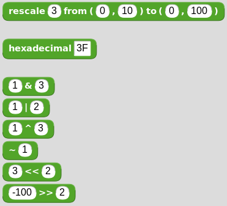
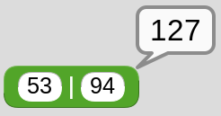
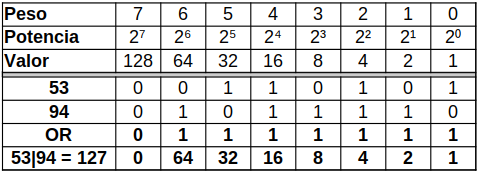
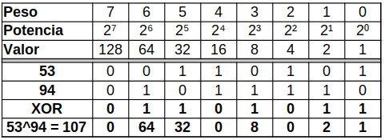
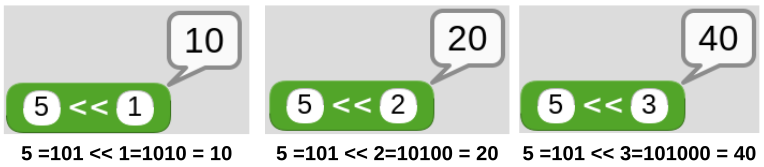
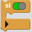
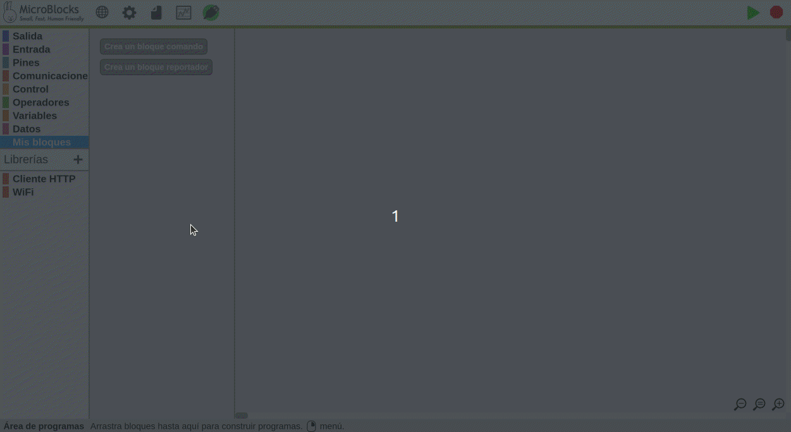
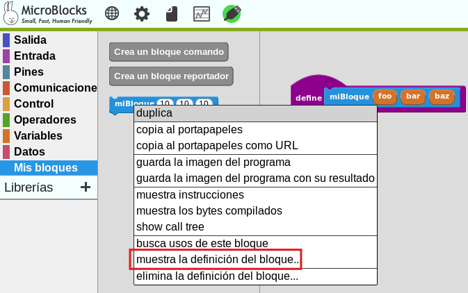
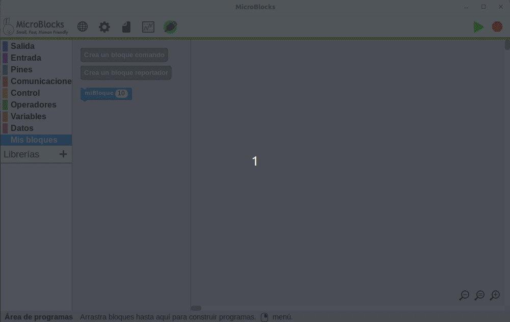
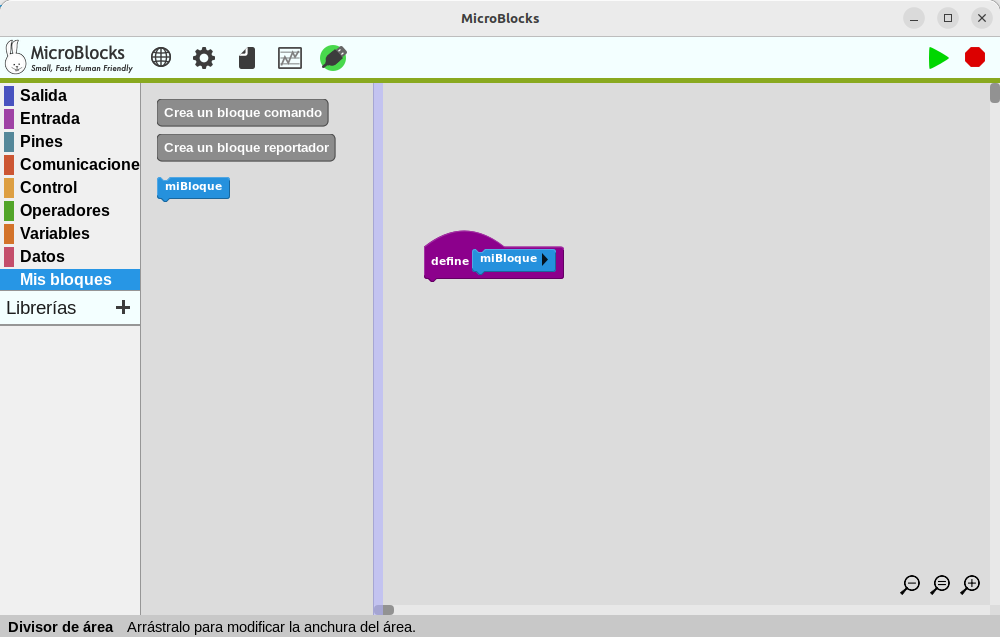

## <FONT COLOR=#007575>**Introducción**</font>
De manera muy resumida lo que haremos en esta sección es:

*  Describir los bloques y conceptos relacionados con la micro:STEAMakers.
* Incluiremos esquemas si resultan necesarios.

!!! Info "**AVISO**"
    Debido a que esta web se crea mientras la librería micro:STEAMakers está en desarrollo, nos encontraremos con situaciones en las que las imágenes y programas tengan ciertos cambios entre lo que vemos aquí y la realidad de la versión que estemos utilizando de MicroBlocks.

## <FONT COLOR=#007575>**Conexión y carga de la libreria**</font>
La primera tarea que vamos a realizar es conectar la placa micro:STEAMakers a un puerto USB del ordenador mediante un cable USB-A / USB-C y desde el menú MicroBlocks (el engranaje) proceder a actualizar el firmware de la placa.

<center>

  
*Actualizar el firmware de la placa*

</center>

Al final del todo vemos como se pone en verde el icono USB indicando que la conexión está realizada y en la micro:STEAMakers se está ejecutando y la máquina virtual se está ejecutando por lo que ya podemos trabajar en vivo con la placa.

<center>

  
*Primer trabajo en vivo*

</center>

Vamos a proceder a añadir la libreria (creada por Joan Guillén) con los bloques especificos de micro:STEAMakers. 

<center>

  
*Primer trabajo en vivo*

</center>

## <FONT COLOR=#007575>**Comentarios**</font>
En MicroBlocks los comentarios son tratados desde un único bloque que podemos encontrar en el menú 'Control'. Es un bloque que no hace nada. Se utiliza para añadir notas y documentación a los scripts.

<center>

  
*Comentarios*

</center>

La ventana de entrada de texto se autodimensiona según introducimos texto y se pueden añadir líneas pulsando la tecla enter.

## <FONT COLOR=#007575>**Control**</font>
En este grupo tenemos acceso a los bloques de control de la micro:bit.

* **al empezar**. Los bloques debajo de este se ejecutan cuando se enciende la placa o cuando se hace clic en el icono verde EJECUTAR que tiene forma de flecha. Es uno de los bloques denominados sombrero.

<center>

  
*Bloque 'al empezar'*

</center>

* **por siempre**. Se trata del bloque de la imagen y es un bloque que se ejecuta de manera indefinida.

<center>

  
*Bloque 'por siempre'*

</center>

* **espera xx milisegundos**. Espera el número de milisegundos indicado antes de continuar.

<center>

  
*Bloque 'espera xx milisegundos'*

</center>

## <FONT COLOR=#007575>**Pantalla LEDs RGB**</font>
Estos son los bloques de control de la matriz de 5x5 LEDs RGB.

<center>

  
*Bloques Pantalla LEDs RGB*

</center>

* **m:s clear display (limpia pantalla)**. Apaga todos los LEDs.

<center>

  
*Bloque m:s clear display (limpia pantalla)*

</center>

Se trata de un bloque que pone a 0 (cero) el color de todos los LEDs RGB actualizando su estado. En la imagen siguiente vemos su definición:

<center>

  
*Definición del bloque m:s clear display (limpia pantalla)*

</center>

* **pantalla micro:STEAM**. Muestra una imagen de la pantalla rodeada de las palabras "micro:STEAM" que permite cambiar el color de cada LED de manera individual haciendo clic sobre el mismo y utilizando la paleta RGB que se muestra.

<center>

  
*Bloque pantalla micro:STEAM*

</center>

El bloque lo que hace es sustituir el elemento de la lista *'_ms_neoPixels'* por el valor RGB que le demos desde la paleta. La definición del bloque es:

<center>

  
*Definición del bloque pantalla micro:STEAM*

</center>

En el video siguiente vemos el trabajo básico con el bloque en MicroBlocks, aunque el fuerte brillo de los LEDs deslumbra la webcam y no se aprecia en exceso. Vemos como la placa trabaja en vivo incluso en el menú de bloques sin necesidad de arrastrarlo al área de programa. Esto es especialmente útil para probar funcionalidad antes de llevarlo al programa.

<center>

<iframe width="560" height="315" src="https://www.youtube.com/embed/AuY8-PwJbhA?si=KtRtEOEmuFAVRwXL" title="YouTube video player" frameborder="0" allow="accelerometer; autoplay; clipboard-write; encrypted-media; gyroscope; picture-in-picture; web-share" referrerpolicy="strict-origin-when-cross-origin" allowfullscreen></iframe>

</center>

* **m:s display with (pantalla)**. Muestra la imagen que dibujemos en la pantalla cambiando el estado de cada LED haciendo clic sobre el mismo y asignando el color común a todos los LEDs RGB con la paleta.

<center>

  
*Bloque m:s display with (pantalla)*

</center>

El bloque lo que hace es recorrer toda la matriz y sustituir el estado del LED que ha sido seleccionado (elemento de la lista *'_ms_neoPixels'*) por el color escogido desde la paleta. La definición del bloque es:

<center>

  
*Definición del bloque pantalla micro:STEAM*

</center>

En el video siguiente vemos el uso básico del bloque para cambiar la carita de feliz a triste y asignarle el color rojo. Posteriormente se hace funcionar un ejemplo de uso sencillo.

<center><iframe width="560" height="315" src="https://www.youtube.com/embed/tr_-DPl3JQo?si=GggVvX0z-__cMPNn" title="YouTube video player" frameborder="0" allow="accelerometer; autoplay; clipboard-write; encrypted-media; gyroscope; picture-in-picture; web-share" referrerpolicy="strict-origin-when-cross-origin" allowfullscreen></iframe></center>

* **m:s display image with color**. Muestra la imagen que seleccionemos de la lista en la pantalla asignando el color común a todos los LEDs RGB escogido con la paleta.

<center>

  
*Bloque m:s display image with color*

</center>

El bloque muestra la imagen seleccionada en el color escogido desde la paleta. La definición del bloque es:

<center>

  
*Definición del bloque m:s display image with color*

</center>

En la animación siguiente tenemos un ejemplo de uso que utiliza diferentes imágenes.

<center>

  
*Uso del bloque m:s display image with color*  
[Descargar programa](../program/uB/B_display_image_with.ubp)

</center>

* **m:s set global brightness scale to**. Este bloque permite establecer el brillo de los LEDs en porcentaje. Su aspecto es el siguiente:

<center>

  
*Bloque m:s set global brightness scale to*

</center>

La definición del bloque es:

<center>

  
*Definición del bloque m:s set global brightness scale to*

</center>

Retomamos el ejemplo "Uso del bloque m:s display image with color" para reformarlo modificando el brillo según la imagen que se muestra. En la animación siguiente tenemos el resultado.

<center>

  
*Uso del bloque m:s set global brightness scale to*  
[Descargar programa](../program/uB/B_display_image_with_modif.ubp)

</center>

* **m:s plot x,y with**. Enciende el LED indicado en la coordenada x,y. La coordenadas x es la horizontal y la y es la vertical. La coordenada 1,1 es la esquina superior ezquierda, la 1,5 es la derecha, la 5,1 es la inferior izquierda y la 5,5 la inferior derecha. El color se elige desde la paleta. Las coordenadas por defecto corresponden al LED central.

<center>

  
*Bloque m:s plot x,y with*

</center>

La definición del bloque es:

<center>

  
*Definición del bloque m:s plot x,y with*

</center>

* **m:s unplot x,y**. Apaga el LED indicado en la coordenada x,y. La coordenadas x es la horizontal y la y es la vertical. La coordenada 1,1 es la esquina superior ezquierda, la 1,5 es la derecha, la 5,1 es la inferior izquierda y la 5,5 la inferior derecha. Las coordenadas por defecto corresponden al LED central.

<center>

  
*Bloque m:s unplot x,y*

</center>

La definición del bloque es:

<center>

  
*Definición del bloque m:s unplot x,y*

</center>

* **color al azar**. Genera un color aleatorio.

<center>

  
*Bloque color al azar*

</center>

La definición del bloque es:

<center>

  
*Definición del bloque color al azar*

</center>

En la animación siguiente tenemos un ejemplo de uso de los bloques plot, unplot color al azar. El ejemplo lo que hace es recorrer dos bucles, o para las filas y otro para las columnas que hará que se encienda un LED cada 100ms en un color aleatorio, se detenga un segundo y los apague en el mismo orden que se encendieron, se detiene un segundo y se inicia de nuevo el proceso.

<center>

  
*Uso de los bloques m:s plot x,y; m:s unplot x,y y color al azar*  
[Descargar programa](../program/uB/B_plot_unplot_color_azar.ubp)

</center>

* **m:s display character with**. Genera un color aleatorio.

<center>

  
*Bloque m:s display character with*

</center>

La definición del bloque es:

<center>

  
*Definición del bloque m:s display character with*

</center>

* **color rva (0-255)**. Para establecer colores en formato [RGB](https://es.wikipedia.org/wiki/RGB) (sigla del inglés Red, Green, Blue; en español, ‘Rojo, Verde, Azul’ o RVA), donde (0,0,0) corresponde a negro y (255,255,255) a blanco. 

<center>

  
*Bloque color rva (0-255)*

</center>

La definición del bloque es:

<center>

  
*Definición del bloque color rva (0-255)*

</center>

En la animación siguiente tenemos un ejemplo de uso de los bloques m:s display character y color rva. El ejemplo muestra la palabra 'Hola' caracter a caracter y tras un segundo muestra de forma intermitente el caracter '!' en un color RGB aleatorio.

<center>

  
*Uso de los bloques m:s display character y color rva*  
[Descargar programa](../program/uB/B_display_char_rva.ubp)

</center>

* **color hsv**. Para establecer colores en formato HSV (siglas del inglés Hue, Saturation, Value – Matiz, Saturación, Valor).

<center>

  
*Bloque color HSV*

</center>
La definición del bloque es:

<center>

  
*Definición del bloque color hsv*

</center>

En la animación siguiente tenemos un ejemplo de uso de estos bloques HSV.

<center>

  
*Uso de los bloques color hsv*  
[Descargar programa](../program/uB/color_hsv.ubp)

</center>

* **m:s scroll text with color (anima el texto)**. Muestra el texto introducido mediante desplazamiento caracter a caracter con el color que establezcamos.

<center>

  
*Bloque m:s scroll text with color (anima el texto)*

</center>

La definición del bloque es:

<center>

  
*Definición del bloque m:s scroll text with color (anima el texto)*

</center>

* **m:s stop scrolling**. Detiene el desplazamiento o scroll del texto si se está realizando. Hay que tener presente que en el bloque scroll la detención está desabilitada.

<center>

  
*Bloque m:s stop scrolling*

</center>

La definición del bloque es:

<center>

  
*Definición del bloque m:s stop scrolling*

</center>

A continuación vemos un ejemplo de uso de estos bloques.

<center>

  
*Uso de los bloques m:s scroll text with color y stop scrolling*  
[Descargar programa](../program/uB/B_scroll_text_stop.ubp)

</center>

## <FONT COLOR=#007575>**Operadores**</font>
Esta entrada se crea porque en MicroBlocks, en el menú específico, aparecen algunos operadores especiales. Las descripciones siguiente son las obtenidas de [MicroBlocks Wiki](https://wiki.microblocks.fun/reference_manual/operators).

Dentro del grupo de bloques estándar tenemos los que se ven en la imagen.

<center>

  
*Bloques estándar*

</center>

*   Devuelve el resto de la división entre los dos números introducidos, ambos inclusive.
*  Devuelve un número aleatorio (al azar) entre el primer y el segundo valor indicado.

En la imagen vemos un ejemplo donde se averigua si un número generado al azar es par o impar.
  
A la variable ```num_aleatorio``` se le asigna un número aleatorio del 1 al 15. La operación ```módulo``` se utiliza para comprobar si el resto es 0 y así saber si el número es par. Si el resto de la operación ```num_aleatorio``` dividido por 2 da como resultado 0, el número es par, en caso contrario es impar. Si el número es par se muestra un cuadrado (4 lados = par) y si es impar un triángulo rectángulo (3 lados = impar).

<center>

  
*Par o impar*  
[Descargar el programa](../program/uB/par_impar.ubp)

</center>

Con este ejemplo comprobamos que una vez conectada la micro:STEAMakers (si no el programa nos indica que no lo está y no funcionará), el bloque ```di``` muestra como retorno un mensaje que aparece asociado al bloque ```al empezar``` en la pantalla del ordenador. Esta es la forma de trabajar de MicroBlocks y hace que el código se compruebe de manera instantánea siempre que los bloques estén acoplados a ```al empezar```.

*   Devuelve ```True``` si la expesión de entrada del lado izquierdo coincide con la selección del menú de tipos de datos realizada en el lado derecho. Los tipos de datos son importantes a la hora de programar. Aunque un entorno como MicroBlocks facilita las cosas a los usuarios principiantes al encargarse de las conversiones de tipos de datos, todavía es posible engañarse visualmente al comparar variables cuyos valores parecen iguales. Este bloque pertenece al grupo de condicionales, pero se describe ahora porque se utiliza en el ejemplo siguiente.

<center>

  
*Número o cadena*  
[Descargar el programa](../program/uB/num_cad.ubp)

</center>

En la sección 'Avanzados' vemos algunos bloques que representan operaciones bit a bit. Los operadores bit a bit (bitwise) trabajan sobre representaciones binarias de datos y su utilidad está en cambiar bits individuales en un operando. Los dos operandos asociados al operador bit a bit deben ser enteros. En la imagen vemos los bloques que aparecen en avanzados.

<center>

  
*Bloques de operadores avanzados*

</center>

*  Permite modificar el rango de un valor o variable desde un rango origen a un rango destino. Esta función es especialmente útil para adaptar los valores leídos de sensores o para adaptar valores a aplicar en un actuador.
*  Convierte una cadena Hexadecimal en un número decimal. Por ejemplo, 5A hex. = 90 dec.
*   El operador AND compara dos bits y genera un resultado igual a 1 si ambos bits son 1; en caso contrario, devuelve 0. Números de mas de un bit son comparados bit a bit. Un ejemplo de aplicación lo vemos en la imagen siguiente.

<center>

  
*bitwise AND*

</center>

La tabla siguiente muestra la forma de obtener el resultado de forma teórica.

<center>

  

</center>

*   El operador OR compara dos bits y devuelve 1 si uno o ambos bits son 1 y da 0 si ambos bits son 0. Bitwise OR compara todas las posiciones de bits de ambos números e informa de aquellas en las que cualquiera de los dos está a 1.

Un ejemplo de aplicación lo vemos en la imagen siguiente.

<center>

  
*bitwise OR*

</center>

La tabla siguiente muestra la forma de obtener el resultado de forma teórica.

<center>

  

</center>

*   El operador EXCLUSIVE-OR compara dos bits y genera un resultado de 1 si los bits son complementarios (el bit se establece en un operando pero no en ambos); en caso contrario, devuelve 0. Otra forma de pensar en la operación XOR es que invertirá las posiciones de los bits en las que el segundo operando tenga un 1. Todas las demás se copiarán igual.

Un ejemplo de aplicación lo vemos en la imagen siguiente.

<center>

  
*bitwise XOR*

</center>

La tabla siguiente muestra la forma de obtener el resultado de forma teórica.

<center>

  

</center>

*   El operador NOT se utiliza para invertir (BIT FLIP) todos los bits del operando. Cuando el bit de posición más alta de un número se convierte en 1, ese número se considera un número negativo. La representación informática real de un número entero con signo en MicroBlocks es de 31 bits. El bit de mayor peso es un bit de signo. Esto permite números en el rango de -1073741824 a 1073741823. Cuando el bit de signo es 0, el número es positivo; y cuando es 1, el número es negativo.

Un ejemplo de aplicación lo vemos en la imagen siguiente.

<center>

  
*bitwise NOT*

</center>

La explicación es sencilla, el número 3 (0011) se convierte al binario 1100 y como el bit de mayor peso es 1 indica que es negativo y el número es 4, por lo tanto el resultado es -4.

*  El valor del operando izquierdo se desplaza hacia la izquierda el número de bits especificado por el operando derecho. Los bits se desplazan hacia la izquierda, el bit situado más a la izquierda se descarta y al bit situado más a la derecha se le asigna el valor 0. Cada posición de bit desplazada a la izquierda equivale en binario a multiplicar por 2. En la imagen siguiente vemos el funcionamiento del desplazamiento a la izquierda a nivel de bit.

<center>

  
*bitwise desplazamiento izquierda*

</center>

*  El valor del operando izquierdo se desplaza hacia la derecha el número de bits especificado por el operando derecho. Los bits se desplazan hacia la derecha, el bit situado más a la derecha se descarta y al bit situado más a la izquierda se le asigna una copia del bit de signo. Esto se denomina desplazamiento aritmético. Por cada posición de bit desplazada a la derecha, esta operación es el equivalente binario de dividir por 2. En la imagen siguiente vemos el funcionamiento del desplazamiento a la derecha a nivel de bit.

<center>

  
*bitwise desplazamiento izquierda*

</center>

## <FONT COLOR=#007575>Variables</font>
En MicroBlocks se contemplan dos tipos de variables, las globales y las locales. Cuando hablamos en estos términos hablamos de ámbito (scope) de las variables y determina la zona donde se define la variable, que son global y local.

Las variables locales son las definidas dentro de una función y solamente está disponible para el código que se ejecuta dentro de la función.

Las variables globales se definen en cualquier punto del programa, normalmente al principio, y pueden ser llamadas desde cualquier sitio del programa, incluso desde las funciones.

*  Este bloque es en realidad un botón que crea una nueva variable global. Si existe una variable con el mismo nombre, se creará una nueva con el mismo nombre y el número 2 añadido. Cuando creamos una variable se nos pide el nombre de la misma en una ventana emergente y una vez creada aparecerá un nuevo bloque para acceder al valor de la variable creada. Además esta nueva variable estará disponible para su selección en dos de los bloques que explicaremos después.
*   Este bloque es en realidad un botón que sirve para eliminar una variable previamente creada.

En la animación siguiente vemos el proceso de creación y eliminación de variables.

<center>

  
*Creación y eliminación de variables*

</center>

La opción de mostrar el nombre de las variables mostrada desde el bloque se puede utilizar para añadir variables mientras se edita el código del programa, sin pasar a las opciones de la categoría variables.

*   Este bloque asigna el valor a cualquier variable, global o local, en la cantidad especificada en el área de entrada. La cantidad que se asigna puede ser un número positivo o negativo. Para mostrar los nombres de las variables locales en el menú de selección, este bloque debe estar físicamente unido a la secuencia de bloques en la que se utiliza el bloque 'Inicializar local' que veremos a continuación.
*   Este bloque suma algebraicamente (cambia) el valor de cualquier variable, global o local, en la cantidad especificada en el área de entrada. La cantidad de cambio puede ser un número positivo o negativo.
*   Este bloque se utiliza para crear e inicializar variables locales. El nombre predeterminado de la variable 'var' puede cambiarse por cualquier otro haciendo clic en el nombre y escribiendo un nuevo nombre en el cuadro de diálogo que se abre. Despés, si es necesario cambiar el valor de la variable local, se puede utilizar el bloque 'asigna valor a' de la categoría variables. En la animación siguiente vemos este proceso y la disponibilidad o no de la variable local.

<center>

  
*Inicializa variable local*

</center>

Una variable global tiene:

* **Alcance global**: Una variable global puede utilizarse en cualquier script que no tenga una variable local del mismo nombre que la anule.
* **Tiempo de vida largo**: Una variable global es creada explícitamente y vive hasta que es explícitamente borrada. Conserva su valor cuando los scripts se inician y detienen e incluso cuando no hay scripts en ejecución. Sin embargo, al hacer clic en el botón "Detener", todas las variables globales se borran e inicializan con el valor cero. Las variables globales también se inicializan a cero cuando se crean por primera vez y cuando se carga un proyecto.

Por el contrario, una **variable local** tiene:

* **Ámbito local**: Una variable local sólo puede utilizarse en el script en el que aparece. Si varios scripts utilizan variables locales con el mismo nombre, esas variables son independientes entre sí. Aunque esta práctica se desaconseja porque puede inducir a errores.
* **Tiempo de vida limitado**: Una variable local de un script se crea cuando se inicia el script y se elimina cuando éste finaliza. Se crea una nueva variable local cada vez que se inicia un script (incluyendo un script de función), y las variables locales de cada invocación de script son independientes entre sí.
* **Precedencia sobre las globales**: Si una variable local tiene el mismo nombre que una variable global, la variable local prevalece sobre la global en el script en el que aparece la variable local. Una variable es local en todo el script sin importar en qué parte del script aparezca "inicializar var local a", aunque es una buena práctica de codificación que "inicializar var local a" preceda a cualquier otra referencia a esa variable.

Un ejemplo comentado de aplicación lo vemos en la imagen siguiente.

<center>

  
*Variables*  
[Descargar el programa](../program/uB/variables.ubp)

</center>

## <FONT COLOR=#007575>Bucles</font>
En el caso de MicroBlocks los bucles, condicionales y funciones están todos englobados en la categoría 'Control'. Vamos a ver algunos de ellos en esta ocasión y los que no veamos en esta actividad se irán viendo cuando los necesitemos.

*   Los bloques con forma de sombrero forman parte de un grupo de bloques de control que comienzan a ejecutarse cuando se pulsa el icono verde ```Inicia```. Este bloque se activa cuando se cumple la condición de inicio del programa.
*   Los bloques con forma de "C" son un grupo de bloques de control que ejecutan el código colocado en su interior siempre que se cumplan las condiciones descritas en sus subtítulos. Estos son los bloques de tipo bucle. Este en particular ejecutará los bloques en su interior indefinidamente.
*   Este bloque C ejecuta el código colocado en su interior el número especificado de veces.

En el ejemplo siguiente veremos tanto en el programa como en la pantalla la suma de los 10 primero números naturales.

<center>

  
*Suma de los 10 primeros números*  
[Descargar el programa](../program/uB/suma_10_primeros_numeros.ubp)

</center>

*   Este bloque es también de tipo C y pertenece al grupo de los bucles. Funciona de dos formas distintas en función del tipo de entrada especificado.

- Si la **entrada es un número**, los bloques interiores se ejecutarán tantas veces como el número. En cada iteración del bucle, empezando por uno, el parámetro o variable de control es 'i' por defecto y se incrementará en uno. Este valor se puede utilizar en el código del programa como se crea conveniente.
- El nombre del parámetro de control puede cambiarse por otro haciendo clic en la 'i' y escribiendo un nuevo nombre.
- Si la **entrada es una lista**, los bloques colocados dentro se ejecutarán tantas veces como elementos tenga la lista. En cada iteración, el parámetro de control 'i' tomará el valor de cada elemento de la lista de manera secuencial.

En el ejemplo siguiente vemos una animación de un sencillo programa de como hacer un contador con los 5 primeros números y hacer que se muestre en el ordenador y en la pantalla de la micro:STEAMakers.

<center>

  
*Mostrar los 5 primeros números*  
[Descargar el programa](../program/uB/muestra_5_primeros_numeros.ubp)

</center>

*   Este bloque pausa el flujo de ejecución del programa por el tiempo especificado en milisegundos. Se utiliza para pausar y reanudar la ejecución de código de forma controlada.
*   Este bloque pausa el flujo de ejecución del programa por el tiempo especificado en microsegundos. Se utiliza para pausar y reanudar la ejecución de código de forma controlada.
*   Emite el mensaje especificado. Véase en conjunto a . Este bloque envía el contenido del mensaje especificado. Todos los bloques de mensajes ```al recibir``` con el mismo mensaje en su contenido recibirán el mensaje y actuarán ejecutando su contenido.
*   Ejecuta cuando se emita el mensaje especificado. Este bloque y su par funcional  se suelen utilizar juntos para conseguir un medio de comunicación dentro del programa. Cualquier mensaje enviado con el comando ```envía``` es detectado y recibido por este bloque. Así, los bloques colocados bajo este bloque se ejecutarán al recibir el mensaje correspondiente. Los mensajes pueden ser cadenas o números. Además, el bloque  contiene el último mensaje emitido y recibido.
*   Devuelve el último mensaje enviado en todo el programa, cronológicamente hablando. Nótese que **NO** es el último mensaje recibido por una secuencia de bloques concreta del programa, y es independiente de la ejecución del bloque ```al recibir```. No hay colas de mensajes en el sistema. Si no hay ningún ```al recibir``` en espera cuando se envía un mensaje, se perderá y será sobrescrito por el siguiente mensaje.

En el ejemplo siguiente vemos de forma sencilla el funcionamiento de estos tres últimos bloques.

<center>

  
*Di el último mensaje*  
[Descargar el programa](../program/uB/ultimo_mensaje.ubp)

</center>

## <FONT COLOR=#007575>Listas</font>
Los bloques para trabajar con listas están en el menú 'Datos' y los disponibles los vemos en la imagen siguiente.

<center>

  
*Bloques para Listas. Datos*

</center>

*  Devuelve una lista corta que contiene algunos elementos en inglés. Con las flechas podemos añadir o eliminar elementos a la lista aunquw a partir del cuarto se repite siempre el mismo. Para crear una lista vacía () basta con eliminar el único elemento existente cuando se crea una nueva.
*  Une (concatena) cadenas, listas o matrices de bytes y devuelve el resultado.
*  Devuelve el carácter [Unicode](https://en.wikipedia.org/wiki/List_of_Unicode_characters) del número dado.
*  Devuelve el enésimo elemento de una lista, cadena o matriz de bytes.
*   Combina los elementos de una lista en una cadena, opcionalmente se puede usar un carácter delimitador.
*   Añade un elemento al final de una lista.

En el ejemplo siguiente vemos el uso de estos bloques. Comenzamos por crear una cadena de caracteres de la que vamos a extraer la palabra "un" mediante la unión de los elementos 9 y 10 de la cadena. Se crea una lista con cuatros animales y finalmente se muestra la palabra 'un' seguida de la posición 3 de la lista creada.

<center>

  
*Un pajaro*  
[Descargar el programa](../program/uB/un_pajaro.ubp)

</center>

En este otro ejemplo vemos como se generan los caracteres de latín básico comenzando por el espacio en blanco (32), diferentes símbolos, números, letras mayúsculas y letras minúsculas. Se muestra en pantalla un caracter cada 100ms y en pantalla la lista completa de caracteres generados.

<center>

  
*Caracteres Unicode de Latín básico*  
[Descargar el programa](../program/uB/unicode.ubp)

</center>

*  Devuelve el número de elementos de una lista, cadena o matriz de bytes.
*  Sustituye el enésimo elemento de una lista por el valor dado. También puede sustituir todos los elementos por un valor.
*  Elimina el elemento N de una lista. La lista resultante se reduce de tamaño. También puede eliminar todos los elementos.

A continuación vemos un ejemplo en el que se demuestra la funcionalidad de estos tres bloques.

<center>

  
*Sustituir, eliminar y tamaño*  
[Descargar el programa](../program/uB/sustituir_eliminar_long.ubp)

</center>

*  Devuelve la posición de la primera coincidencia de una subcadena dentro de una cadena o un elemento de una lista. Devuelve -1 si no encuentra coincidencias.

En el ejemplo siguiente las variables locales ```cadena``` y ```animales``` se inicializan como de tipo string y list respectivamente. El primer conjunto de resultados opera sobre la cadena, buscando la posición de la primera apariciones de "es". La primera coincidencia se encuentra en el carácter número uno. La segunda búsqueda se inicia en el carácter número tres, y localiza el objetivo de la búsqueda en el carácter número seis. La búsqueda de "perro" en la lista 'animales' la encuentra en el elemento número dos de la lista. La segunda búsqueda de "perro" en la lista 'animales' comienza en el elemento número tres y devuelve -1 porque no lo encuentra. No hay ningún "raton" en la lista, por lo que la búsqueda devuelve -1.

<center>

  
*Buscar*  
[Descargar el programa](../program/uB/buscar.ubp)

</center>

*  Copia una cadena desde/hasta el caracter especificado, o una desde/hasta el elemento indicado. Como ya sabemos para mostrar el parámetro hasta hay que hacer clic en el triángulo negro.

<center>

  
*Copiar*  
[Descargar el programa](../program/uB/copiar.ubp)

</center>

*  Devuelve una lista separando la cadena especificada por el delimitador opcional. Si no se especifica ningún delimitador, la cadena se divide por cada carácter.

En la imagen vemos una cadena delimitada por comas que separa los caracteres mediante el delimitador coma en una lista de tres elementos.

<center>


</center>

A continuación vemos una cadena que incluye un carácter retorno de línea después del ABC y DEF que se separa mediante el caracter unicode de nueva línea (return) en una lista de tres elementos.

<center>


</center>

En este otro caso separamos la URL de la descarga de MicroBlocks en partes mediante el delimitador /.

<center>


</center>

*   Devuelve el valor Unicode del carácter enésimo de la cadena introducida. El número de caracteres introducido debe estar comprendido entre uno y la longitud de la cadena. Este bloque es el opuesto de .

<center>


</center>

*  Crea una nueva lista del número de elementos especificado. Hay que controlar la disponibilidad de memoria. Los elementos de la lista creada se pueden inicializar a cualquier valor utilizando la opción de bloque con todos.
*  Crea una matriz del número de elementos especificado en función de la disponibilidad de memoria. Cada elemento es de tamaño byte y se le pueden asignar valores en el rango de 0-255 (0-FF).
*  Devuelve una cadena que indica el número de palabras de 32 bits de memoria dinámica disponibles para asignar nuevos objetos (cadenas, listas o matrices de bytes). Al pulsar el botón de parada se libera toda la memoria. Justo después de pulsar el botón de parada, este bloque informa del total de memoria dinámica disponible en un dispositivo determinado. Los dispositivos tienen diferentes cantidades de memoria dinámica, basadas en la cantidad de RAM proporcionada por el hardware. Por ejemplo, la micro:bit v2 tiene mucha más RAM que la micro:bit original.

Un ejemplo de uso.

<center>

  
*Nueva lista*  
[Descargar el programa](../program/uB/nueva_lista_mem.ubp)

</center>

*   Convierte un byte, una lista o una cadena especificada en una matriz de bytes. Cada elemento es el valor unicode de las letras de la cadena en el rango de 0-255 (0-FF).

## <FONT COLOR=#007575>**Mas operadores**</font>   
Los operadores aún no vistos son:

<center>


*Operadores aritméticos, de comparación y booleanos*

</center>

Los operadores aritméticos y de comparación no requieren de mayor explicación por lo que nos vamos a centrar en los booleanos.

*  Operador booleano ```True``` o ```False```. Devuelve verdadero o falso en función de la posición del selector, o de la evaluación binaria de la expresión utilizada como entrada. Este bloque se usa dentro de muchos otros bloques, donde se utiliza para controlar el flujo de las ejecuciones y eventos.

El bloque ```if``` es un buen ejemplo para demostrar el uso del bloque verdadero/falso.

<center>

  
*Uso sencillo del operador ```True/False```*  
[Descargar el programa](../program/uB/verdadero_falso.ubp)

</center>

El código del ejemplo se ejecuta de dos maneras diferentes siempre dentro de un bucle infinito en el que se genera un número aleatorio que puede valer 1, 2 o 3:

* La primera es la condición de la rama ```IF``` que será verdadera si el número generado es 1.
* La segunda es la rama ```ELSE IF``` que se evalúa si la condición del ```IF``` no es verdadera y se pone a verdadero, ejecutando su código.
* La tercera es la condición ```ELSE``` a la que nunca se llega porque si el número vale 1 se ejecuta el ```IF``` y si no se ejecuta el ```ELSE IF``` que siempre es cierto. Es decir, aunque se genere ```variable = 3``` la condición ```ELSE``` no se ejecuta.

*  Invierte el valor lógico asociado a la expresión sobre la que opera. Tal y como se muestra, ```NOT``` devolverá ```FALSE``` si el deslizador se establece en ```TRUE```, y ```TRUE``` si se establece en ```FALSE```.

En el ejemplo siguiente, una variable llamada ```cadena``` se inicializa como "MicroBlocks es genial", y una variable llamada ```expresion``` se inicializa en ```TRUE``` de una forma peculiar, diciendo que algo es igual a si mismo. Cuando se aplica ```NOT``` al resultado de la expresión de igualdad, se cambia a ```FALSE```.

<center>

  
*Uso sencillo del operador ```NOT```*  
[Descargar el programa](../program/uB/not.ubp)

</center>

*   Devuelve verdadero sólo si todas sus entradas son verdadero y devuelve falso en caso contrario. Como ambas condiciones tienen que ser verdaderas para obtener un resultado verdadero, si se detecta un falso en la primera condición, no es necesario evaluar la segunda; se devuelve falso inmediatamente.

En el ejemplo tenemos dos variables ```salir``` y ```llueve``` que se inicializan a falso. Se muestran una serie de mensajes y al final se evalúa si "necesito un paraguas" comprobando si es cirto 'voy a salir y si llueve'. Si no necesito un paraguas se muestra en pantalla un check y si lo necesito se muestra un paraguas. Ambas condiciones tienen que ser verdaderas para que necesitemos un paraguas. Podemos cambiar el estado de las variables y comprobar lo que ocurre.

<center>

  
*Uso sencillo del operador ```AND```*  
[Descargar el programa](../program/uB/and.ubp)

</center>

*   Devuelve verdadero si uno o ambos operandos son verdaderos y devuelve falso en caso contrario. Similar a ```AND``` pero opuesto a él, aquí sólo una de las dos condiciones tiene que ser verdadera para un resultado verdadero. Por lo tanto, si la primera condición es verdadera, no es necesario comprobar la segunda.

En el ejemplo estamos generando aleatoriamente dos números en el rango de 1 a 5. A continuación, comprobamos si alguno de los dos números es igual al número que estamos buscando (3). El bloque ```OR``` se utiliza para verificar el resultado de la comparación.

<center>

  
*Uso sencillo del operador ```OR```*  
[Descargar el programa](../program/uB/or.ubp)

</center>

Cada vez que pulsemos en 'Iniciar' se genera un nuevo resultado.

## <FONT COLOR=#007575>**Botones y bloques de control**</font>

* **m:s button?** Este bloque permite saber si se ha pulsado el botón A o el B.

<center>

  
*Bloque m:s button?*

</center>

La definición del bloque es la siguiente:

<center>

  
*Definición del bloque m:s button?*

</center>

* **m:s touching?** Este bloque permite saber si se ha tocado (pulsado) la zona táctil.

<center>

  
*Bloque m:s touching?*

</center>

La definición del bloque es la siguiente:

<center>

  
*Definición del bloque m:s touching?*

</center>

En el ejemplo siguiente vemos el uso básico de estos tres bloques de la libreria micro:STEAMakers.

<center>

  
*Uso sencillo de los botones*  
[Descargar el programa](../program/uB/uso_botones.ubp)

</center>

*   El bloque ```IF``` comprueba la condición booleana y ejecuta los bloques de una sola vez si la condición booleana se evalúa como verdadera. El triángulo negro permite la expansión del bloque ```IF``` con múltiples condiciones ```ELSE IF``` añadidas. En caso de que las ramas ```IF``` o ```ELSE IF``` anteriores no sean verdaderas, entonces se evalúan y ejecutan sucesivamente cada una de las siguientes ```ELSE IF```.

En el ejemplo siguiente, a la variable ```aleatorio``` se le asigna un número al azar entre el 1 y el 9. La operación MOD se utiliza para sondear el estado par/impar del número. Si el resto de la operación 'num dividido por 2' da como resultado 0, el número es par, en caso contrario es impar.

<center>

  
*Sentencia ```IF```*  
[Descargar el programa](../program/uB/if_else.ubp)

</center>

Cada vez que pulsemos en 'Iniciar' se genera un nuevo resultado, se indica si el número es par o impar mientras se muestra el número en los LEDs.

*   El bloque 'cuando' comprueba repetidamente una condición booleana. Cuando la condición se convierte en verdadera, se ejecutan los bloques bajo el sombrero. Si la condición sigue siendo verdadera al final de la ejecución, entonces los bloques se ejecutarán de nuevo, y ese proceso se repite hasta que la condición se convierte en falsa.

Nota: El sombrero 'cuando' incluye una espera de 10 milisegundos entre ciclos. Esto es útil para eliminar ruido en las entradas, por ejemplo rebotes en los botones, pero limita el rendimiento a un máximo de 100 iteraciones/segundo.

Vamos a ver el mismo ejemplo que en el bloque ```IF``` pero utilizando este bloque. Los tres bloques del tipo ```WHEN``` empiezan a funcionar simultáneamente cuando se pulsa el icono ```START```. El bloque 'por siempre' debajo de 'al empezar' genera un número aleatorio cada segundo. Y de forma simultanea los otros dos bloques evaluan continuamente sus condiciones mostrando el resultado que corresponde a cada uno.

<center>

  
*Bloque 'cuando'*  
[Descargar el programa](../program/uB/cuando.ubp)

</center>

*   Este bloque de control pausa la ejecución del programa y espera hasta que la condición booleana especificada se convierta en verdadera. Se puede utilizar para sincronizar bloques de código que se ejecutan en paralelo, basándose en los eventos monitorizados.
* **m:s light %**. Este bloque permite trabajar con el nivel de iluminación medido por el sensor montado en la placa micro:STEAMakers.

<center>

  
*Bloque m:s light %*

</center>

La definición del bloque es la siguiente:

<center>

  
*Definición del bloque m:s light %*

</center>

En este ejemplo, el nivel de luz ambiental se controla mediante el sensor de luz integrado. Cuando se inicia el programa, ambos bloques 'cuando se pulse el boton' comienzan a ejecutarse y a comprobar el estado del botón.

Al pulsar el botón A, se inicia la monitorización de la luz y el programa espera hasta que los sensores de la micro:bit informen de un nivel de luz < 75. Cuando esa condición se cumple, se emite una alerta para avisar de que hay que encender las luces.

El botón B está programado para detener el proceso de monitorización. Al pulsarlo, detiene la ejecución de esa rama del programa.

<center>

  
*Bloque 'cuando se pulsa el boton'*  
[Descargar el programa](../program/uB/cuando_pulsa_boton.ubp)

</center>

El bloque 'deten las otras tareas' se explica un poco mas adelante.

*   El bloque ```RETURN``` se utiliza para devolver el valor especificado en su área de entrada. El valor retornado puede ser cualquier tipo de dato. Aunque es posible utilizar el bloque ```RETURN``` en cualquier parte de un programa para mostrar un valor, de forma similar al bloque ```di```, su uso correcto y más común es en una función (o bloque personalizado) para devolver un valor como resultado del proceso realizado. Hay que tener en cuenta que los bloques colocados después del bloque ```RETURN``` no se ejecutarán.

*   Este bloque tipo C es un bucle que se utiliza para ejecutar los bloques colocados dentro de él, mientras que la condición booleana especificada se convierte en verdadera. En ese momento, se ejecutará el siguiente bloque después del bloque en forma de C.

En el ejemplo vemos como se monitoriza si se ha pulsado el botón A enviando un mensaje.

<center>

  
*Bloque 'repetir hasta que'*  
[Descargar el programa](../program/uB/B_repetir.ubp)

</center>

*   Este bloque, y su par relacionado , se utilizan para controlar el hilo de ejecución del programa. Este bloque detiene la ejecución de todos los bloques de los que forma parte, o que están bajo el mismo bloque sombrero. Una vez ejecutado este bloque en un grupo de bloques, no se ejecutará nada más en ese grupo.

En el ejemplo siguiente, el grupo de bloques de la derecha está en un bucle continuo que cuenta hacia atrás y decrementa su variable local ```numero```. El grupo de bloques de la izquierda también está en un bucle continuo, contando hacia abajo y decrementando su variable local ```numero```. Cuando la cuenta atrás alcanza el valor 7 se cumple la condición del ```else if``` y se detiene la cuenta del bloque derecho, mientras que la secuencia del bloque izquierdo continua su ejecución hasta que se cumpla la condición del ```if``` que será cuando se alcance el número 2, momento en que se detiene esta tarea.

Podemos comprobar como el último bloque ```di``` de la secuencia de la izquierda **NUNCA** se ejecuta porque una vez que el bloque 'deten esta tarea' se ejecuta, todas las actividades de este bloque izquierdo terminan.

<center>

  
*Bloques 'deten esta tarea' y 'deten las otras tareas'*  
[Descargar el programa](../program/uB/deten_tareas.ubp)

</center>

## <FONT COLOR=#007575>**Graficado de datos**</font>
En MicroBlocks es relativamente sencillo trabajar los datos de forma gráfica y para ello disponemos de un bloque para indicar el dato que queremos ver de manera gráfica y un icono en el menú que abre la ventana flotante 'Gráfico de datos'.

<center>

  
*Bloque e icono para mostrar 'Gráfico de datos'*

</center>

### <FONT COLOR=#AA0000>Bloque</font>
Está disponible en el menú 'Salida'.

* . Graficará el valor introducido en el panel de visualización de gráficos de datos. Se puede graficar cualquier tipo de dato: números, valores de pines digitales y analógicos, salidas de sensores, etc. Si tenemos que representar gráficamente más de un dato, hacemos clic en el triángulo negro para mostrar campos de datos adicionales. Se pueden graficar hasta seis valores simultáneos con diferentes colores.

La representación gráfica sólo es posible en el IDE. Por lo tanto, sólo es posible realizar gráficos mientras el microdispositivo está conectado al ordenador. Si intentamos realizar un gráfico mientras no está conectado al ordenador, aparecerá el mensaje "Placa no conectada".

### <FONT COLOR=#AA0000>Panel gráfico</font>
Se activa desde el icono y tiene el siguiente aspecto:

<center>

  
*Panel 'Gráfico de datos'*

</center>

El panel **Gráficos de datos** muestra los valores utilizados con el bloque de gráficos. El eje y del panel puede escalarse utilizando los controles de zoom del propio panel, y el eje x se desplazará lateralmente a medida que se grafiquen más datos.

La ventana de visualización del gráfico se puede redimensionar con el control situado en la esquina inferior derecha y puede colocarse en cualquier lugar de la ventana del IDE.

Tras el registro de cualquier dato, la ventana de visualización de gráficos puede cerrarse y abrirse, si es necesario, sin que se pierda ningún dato ni la imagen visualizada, aunque si pierde la reconfiguración realizada en la misma, como la posición del cero, el tamaño, etc. Además, es posible desconectar y volver a conectar el dispositivo en uso, sin perder los datos del gráfico.

En la animación vemos como funciona lo indicado. El escalado con la lupa del menos amplia el rango de valores del eje y, con la lupa del mas lo disminuye y la lupa del igual restaura la situación inicial tras el redimensionado de la ventana.

<center>

  
*Funcionamiento de 'Gráfico de datos'*

</center>

### <FONT COLOR=#AA0000>Opciones del panel gráfico</font>
Se accede haciendo clic con el botón derecho del ratón en cualquier zona del panel. Si tenemos el cursor del ratón sobre la zona de las lupas no funcionará.

<center>

  
*Opciones de 'Gráfico de datos'*

</center>

El menú de opciones del gráfico permite controlar la visualización de los ejes, así como la importación/exportación de datos y el ajuste de la frecuencia de muestreo de datos.

* **limpiar gráfico**. Borra cualquier gráfico de la ventana de visualización de datos.
* **cero abajo**. Sitúa el punto de origen del eje y en la parte inferior del área de visualización del gráfico.
* **exportar datos a archivo CSV**. Permite guardar los datos del gráfico en formato CSV. Se exportan los últimos diez mil (10000) valores.
* **importar datos desde archivo CSV**. Permite cargar datos CSV desde el ordenador en el que se está ejecutando MicroBlocks. Los datos importados se grafican y se muestran en el 'Gráfico de datos'. Es posible importar 10000 valores. Si tenemos mas de un dato para graficar, estos no se exportan individualmente sino todos juntos eparados por comas.
* **copiar datos del gráfico al portapapeles**. Se trata de una función avanzada que permite copiar en el portapapeles los últimos 10000 valores utilizados con el bloque gráfico.
* **ajustar latencia del puerto serie**. Se trata de otro función avanzada que permite establecer la frecuencia de muestreo de datos o latencia entre 1 y 20ms. Los números más bajos dan como resultado frecuencias de muestreo más altas.

Los archivos CSV (del inglés Comma-Separated Values) son un tipo de documento no estandarizado que tiene la idea básica de separar los campos de datos por una coma, de ahí su nombre [Valores separados por comas](https://es.wikipedia.org/wiki/Valores_separados_por_comas)

Vamos a ver un ejemplo de uso en el que se muestran de forma gráfica una serie de números aleatorio. El programa y el gráfico son:

<center>

  
*Ejemplo de 'Gráfico de datos'*  
[Descargar el programa](../program/uB/grafico_aleatorios.ubp)

</center>

## <FONT COLOR=#007575>**Libreria NeoPixeles**</font>
Los NeoPixels son pequeños módulos LED que combinan LEDs rojos, verdes y azules montados en un solo encapsulado con un chip controlador. Los NeoPixels pueden ser controlados individualmente por una sola línea de datos desde un dispositivo microcontrolado para crear diferentes colores y patrones. Un solo pin del microcontrolador puede controlar docenas (o incluso cientos) de NeoPixels. Los NeoPixels se encuentran en muchas configuraciones diferentes, como son anillos, barras, matrices y tiras flexibles.

* . Configura el pin de conexión de los Neopixels. Este bloque configura un dispositivo NeoPixel especificando cuántos LEDs hay en el dispositivo y qué pin se utilizará para controlarlos. El bloque debe ejecutarse antes de hacer nada con cualquiera de los otros bloques NeoPixel.

El bloque se expande a  para el trabajo con Neopixels blancos.

* . Establece los colores de los diez primeros NeoPixels. Es especialmente útil cuando se utiliza con placas o tiras con este número de LEDs. La secuencia de numeración (1-10) es de izquierda a derecha y de arriba a abajo. La configuración del color se hace desde la paleta que se muestra sin poder establecer mayor precisión. La paleta muestra los valores RGB en decimal.

<center>


</center>

* . Apaga todos los LEDs. Los pone a color negro.
* . Pone todos los LEDs con el color indicado.
* . Pone el número de LED especificado del color indicado. Los LEDs se numeran secuencialmente comenzando por uno.
* . Desplaza la secuencia de colores NeoPixel el número de NeoPixels indicado. Los colores al final de la secuencia se desplazan y se insertan al principio de la secuencia. Si los NeoPixels forman un círculo, los colores giran alrededor del círculo. El argumento determina el número de posiciones que se desplazan los colores. Un valor negativo hará que los NeoPixels roten en la dirección opuesta.
* . Devuelve un color definido especificando los valores de rojo (R), verde (G) y azul (B) entre 0 y255. El bloque puede utilizarse en cualquier bloque que reciba una entrada de color. Los valores inferiores a 40 pueden provocar que el LED no se encienda nada.
* . Devuelve un color aleatorio. El bloque puede utilizarse en cualquier bloque que reciba una entrada de color.

El siguiente ejemplo muestra el uso básico de algunos de los bloques de esta libreria como complemento del manejo de los bloques de la libreria micro:STEAMakers relativos a la pantalla. Al ser LEDs RGB direccionables pueden ser tratados como una tira de 25 LEDs numerada desde el 1 al 25 empezando por la esquina superior izquierda y contando de izquierda a derecha de de arriba hacia abajo.

<center>

  
*Ejemplo de 'Libreria NeoPixels'*  
[Descargar el programa](../program/uB/lib_neo_pix.ubp)

</center>

## <FONT COLOR=#007575>**Mis bloques**</font>
Aprenderemos a crear nuestros propios bloques, o lo que es lo mismo, a definir nuestras propias funciones. Acceder a su cración es sencillo ya que están en el menú de la aplicación. Basta con hacer clic en el apartado de color azul claro y veremos los dos bloques disponibles. Haciendo clic en cualquiera de ellos se nos abre una pequeña ventana emergente para ponerle un nombre, que por defecto es MyBlock.

<center>

  
*Mis bloques*

</center>

Observamos que se pueden crear dos tipos de bloques:

* **de comando:** . Este bloque es en realidad un botón y al hacer clic sobre el mismo se inicia el proceso de creación de un bloque personalizado (función).
* **reportador:** . Este bloque también es un botón. Inicia el proceso de creación de un bloque personalizado (función) que puede devolver un resultado. Junto con este bloque se suelen utilizar los bloques del menú "Control" que veremos mas abajo.

### <FONT COLOR=#AA0000>Descripción</font>
La principal diferencia entre el segundo y el primer bloque es que la definición del bloque personalizado que se cree en el segundo podrá devolver un valor mediante el bloque RETURN.

Esta capacidad única permitirá que el bloque personalizado se utilice en cualquier bloque en el que se espere un parámetro de entrada, y pasará el valor que informe a esa operación.

!!! info "En cuanto al uso del bloque RETURN:"
    * Cualquier bloque colocado después de él no será ejecutado.
    * Pueden existir múltiples bloques RETURN, manejando diferentes condiciones y devolviendo sus valores respectivos.

La creación de un bloque personalizado es un proceso detallado con los siguientes pasos y opciones:

* Asignación de un nombre de bloque personalizado
* Añadir parámetros y sus etiquetas
* Modificación de los tipos de parámetros
* Asignación de valores por defecto a los parámetros
* Valores de color

Los dos bloques citados de "Control" son los siguientes, que aunque de apariencia son idénticos, en realidad hay diferencias.

* .  Llama al bloque personalizado que se seleccione de la lista 'function name'. La lista de parámetros es opcional.
* .  Devuelve el resultado de la llamada del bloque personalizado que se seleccione de la lista 'function name'. La lista de parámetros es opcional.

### <FONT COLOR=#AA0000>Operaciones comunes</font>
Antes de examinar el proceso de creación de un nuevo bloque personalizado, repasemos algunas de las operaciones habituales disponibles al trabajar con una cabecera de bloque personalizada:

* **<FONT COLOR=#0000FF>MODO DE EDICIÓN</font>**

Cuando se hace clic en la parte púrpura del bloque con sombrero "define" o en la parte azul claro del bloque personalizado con el nombre del bloque, se entra en modo edición. Este modo puede identificarse por el cambio de aspecto de los parámetros de la cabecera, así como por la aparición de los triángulos negros. En la animación siguiente vemos como crear, activar y desactivar la edición y como añadir y eliminar casillas o etiquetas en un bloque.

<center>

  
*Crear un bloque*

</center>

Cada parámetro añadido debe tener un nombre diferente que MicroBlocks asigna de manera automática pero que podemos cambiar según nuestros intereses simplemente haciendo clic sobre el bloque del nombre.

<center>

  
*Cambios de nombre de parámetros y edición de un bloque*

</center>

El triángulo negro de la derecha sirve para añadir parámetros y etiquetas, mientras que el de la izquierda sirve para borrarlos. Al hacer clic en el mismo, se eliminará el elemento situado más a la derecha (ya sea un parámetro o una etiqueta).

Si hay que borrar una etiqueta situada en el centro de la cabecera del bloque, basta con hacer doble clic para seleccionarla, dejarla vacia, y pulsar la tecla Supr.

* **<FONT COLOR=#0000FF>RENOMBRAR PARÁMETROS Y ETIQUETAS</font>**

Para cambiar el nombre de una etiqueta de un bloque personalizado o de cualquier etiqueta de la cabecera, basta con hacer doble clic para seleccionarla y, a continuación, escribir un nuevo nombre. Dado que el nombre del bloque y las etiquetas son sólo campos de texto, es posible crear nombres con varias palabras separadas por espacios o caracteres de subrayado.

Si se utilizan espacios al crear el nombre de la etiqueta, el nombre de la etiqueta resultante se tratará como etiquetas sucesivas separadas. Aunque aparezcan una tras otra y se perciban como un nombre continuo, en realidad son etiquetas de texto individuales. Esto sólo es importante si va a editarlas posteriormente.

Si se utilizan caracteres de subrayado al crear el nombre de la etiqueta, el nombre de la etiqueta resultante se tratará como una sola etiqueta.

Por lo tanto, dependiendo de cuáles sean nuestras intenciones, puede que encontremos un método u otro más adecuado a nuestras necesidades.

Para cambiar el nombre de un parámetro, hacemos clic en el área ovalada marrón del parámetro y escribimos un nuevo nombre en la ventana de edición.

A continuación vemos el proceso para cambiar ambas etiquetas, el nombre del bloque y los parámetros.

<center>

  
*Cambios de nombres*

</center>

* **<FONT COLOR=#0000FF>MOSTRAR EL CONTENIDO DE UN BLOQUE PERSONALIZADO</font>**

Una vez creado un bloque personalizado y cerrada su cabecera y definición, este aparecerá automáticamente en el área de bloques de la categoría Mis bloques. Como el bloque recién creado reside en el área Mis bloques, se verá como el formato de control o bloque informador de su definición. Para ver realmente los bloques que componen la definición del bloque personalizado, debemos hacer clic derecho en el bloque y seleccionar "mostrar definición de bloque" en el menú.

<center>

  
*Mostrar la definición de un bloque*

</center>

Al seleccionar esta opción, la definición del bloque personalizado aparecerá en el Área de trabajo, como apreciamos en la siguiente animación.

<center>

  
*Mostrar la definición de un bloque*

</center>

Si queremos borrar la definición de un bloque de la zona de programa basta con que lo arrastremos a la zona de menú, donde observaremos como aparece un ojo tachado en color gris (indicando ocultar) en lugar de la papelera habitual.

Para elminar completamente la definición del bloque hay que escoger la opción "elimina la definición del bloque"

* <font size="5"><FONT COLOR=#0000FF><b><u>Proceso de creación de un bloque personalizado</u></b></font color></font size>

<font size="3"><FONT COLOR=#006400><b>Asignar nombre al bloque</b></font color></font size>

Al hacer clic en el botón añadir bloque, se abre un cuadro de diálogo en el que se introduce el nombre del bloque personalizado.

<center>

  
*Creación de un bloque personalizado*

</center>

Tras pulsar el botón "De acuerdo", se coloca una cabecera de definición de bloque personalizada en el área de programación.

<center>

  
*Bloque personalizado recien creado*

</center>

Ahora todos los bloques de código que compondrán este bloque personalizado pueden colocarse bajo el bloque de cabecera, y formarán parte de la nueva función programada. Observe también que se ha colocado un nuevo bloque que representa la función personalizada en la ventana de categoría Mis Bloques con el nombre predeterminado de miBloque.

Aunque no siempre es un requisito, algunas funciones necesitarán parámetros para completar su funcionalidad programada. Éstos actuarán como entradas de la función y podrán ser utilizados por los bloques que componen el código de bloque personalizado.

<font size="3"><FONT COLOR=#006400><b>Modificación de los tipos de parámetros</b></font color></font size>

Cuando se añade un parámetro, MicroBlocks le asigna un nombre por defecto (foo, baz, etc) y un tipo por defecto (número/cadena).

<center>

  
*Tipos de parámetros*

</center>

Hay varios tipos de parámetros posibles: número/texto, booleano y color. Estos están disponibles para seleccionar en el menú que se abre al hacer clic en el triángulo negro que apunta hacia abajo en el bloque de parámetros oval marrón. Para los parámetros de tipo número/texto, es posible restringir sus tipos a sólo número o sólo texto. A continuación se expone un sencillo bloque que muestra datos de todos los tipos.

<center>

  
*Ejemplo de tipos de parámetros*

</center>

Vemos que el nombre de la función parece ```Datos Nombre```. De hecho, el nombre de la función es ```Datos```, mientras que ```Nombre``` es el nombre del primer parámetro. Sin embargo, dado que MicroBlocks no permite la entrada de una etiqueta seguida de otra, ha sido necesario crear primero el parámetro ```nombre```, seguido de un doble clic en el nombre de la función ```Datos``` y añadir " ```Nombre```" (espacio ```Nombre```) al final de la misma.

Esta técnica parece extraña, pero es totalmente correcta, ya que los nombres de función nunca se utilizan específicamente por sí solos como en un lenguaje de programación basado en texto. Los bloques personalizados, al igual que todos los demás, se arrastran y sueltan en el área de programación, independientemente de su nombre. No obstante, no debemos crear varios bloques personalizados en los que el nombre de la primera etiqueta sea idéntico. De hecho, **NO** podremos hacerlo, ya que MicroBlocks asignará un nombre numerado que lo hará único.

<font size="3"><FONT COLOR=#006400><b>Asignar valores por defecto a los parámetros</b></font color></font size>

Como se ve en la imágen anterior de definición de bloque personalizado, la vista final del bloque muestra valores para cada parámetro, "Juan", 55, true, y 16715550 para el color rojo. Estos valores se denominan valores por defecto y son los que hemos asignado al bloque en su cración y se pueden modificar en cualquier momento si los ponemos en modo edición.

* <font size="5"><FONT COLOR=#0000FF><b><u>Interpretación del número que identifica al color</u></b></font color></font size>

Los valores por defecto de los tipos cadena, número y booleano se explican por sí mismos. Sin embargo, el tipo de color necesita alguna explicación mas. Vamos a utilizar el siguiente ejemplo para ello.

<center>

  
*Color como un número*

</center>

Como puede verse en la muestra de resultados los primeros corresponden a los valores en decimal de las variables R, G y B respectivamente, el valor del color magenta se obtiene del valor decimal 12398300. Analicemos estos valores y veamos qué representan.

Si cada uno de los tres valores decimales superiores se convierten a los equivalentes hexadecimales, se obtiene:

<center>

|Color (1,1)|Decimal|Hexadecimal|
|:-:|:-:|:-:|
|R|115|73|
|G|188|BC|
|B|180|B4|

</center>

Si llevamos esto a un programa que trabaje con colores RGB, como por ejemplo Inkscape, podemos ver como el color del pixel (1,1) es color verde claro.

<center>

  
*Color como un número*

</center>

Podriamos colocar los tres valores hexadecimales RGB uno a continuación del otro en el orden RGB para obtener 0x73BCB4, y este número expresado en el sistema de numeración decimal es el 7584948.

El valor decimal 12398300 pasado a hexadecimal es BD2EDC que descompuesto corresponde R = BD (189), G = 2E (46) y B = DC (220), tal y como se refleja en la tabla siguiente:

<center>

|Color (5,5)|Decimal|Hexadecimal|
|:-:|:-:|:-:|
|R|189|BD|
|G|46|2E|
|B|220|DC|

</center>

Si llevamos esto a un programa que trabaje con colores RGB, como por ejemplo Inkscape, podemos ver como el color del pixel (5,5) es color magenta claro.

<center>

  
*Color como un número*

</center>

* <font size="5"><FONT COLOR=#0000FF><b><u>Ejemplo de creación de bloque personalizado</u></b></font color></font size>

Vamos a definir algunos de ellos mediante Mis Bloques. Creamos los siguientes (aunque ya existen en otro bloque):

<center>

  
*Creación de bloques para iconos*

</center>

El uso de estos bloques lo vemos a continuación:

<center>

  
*Uso de bloques personalizados*  
[Descargar programa](../program/uB/bloques_iconos.ubp)

</center>

En el programa está la definición de los bloques.

En la imagen siguiente tenemos un sencillo ejemplo de uso de función con retorno de valor mediante bloque reportador.

<center>

  
*Función con retorno de valor*  
[Descargar programa](../program/uB/multiplicador.ubp)

</center>

## <FONT COLOR=#007575>**Sonidos**</font>
En MicroBlocks tenemos tres opciones de reproducción de sonidos o música, un conjunto de librerías englobadas bajo el seudónimo "Sonido", una librería de "Politonos" y otra librería de "Tonos". En "Sonido" nos encontraremos bloques "MultiTone", opciones para reproducir mp3 o WAV, radio AM, etc. No veremos estas librerías por el momento y nos centraremos en "Tonos" y "Politonos".

La libreria micro:STEAMakers dispone de dos bloques relacionados con el sonido. Estos son:

* **start m:STEAMakers audio**. Bloque para definir la conexión del buzzer o altavoz e inicializar las variables internas tone a verdaderas. Este bloque debe ejecutarse al menos una vez para que los bloques de ```Tonos``` y ```Politonos``` sean funcionales. El bloque es:

<center>
  
.  
*Bloque start m:STEAMakers audio*

</center>

La definición del bloque es la siguiente:

<center>
  
.  
*Definición del bloque start m:STEAMakers audio*

</center>

* **m:s sound %**. Bloque de lectura del nivel de sonido percibido por el micrófono de la placa expresado en tanto por ciento. El bloque es:

<center>
  
.  
*Bloque m:s sound %*

</center>

La definición del bloque es la siguiente:

<center>
  
.  
*Definición del bloque m:s sound %*

</center>

### <FONT COLOR=#AA0000>Tonos</font>
Añadimos la libreria "**Tonos**" a nuestro entorno y nos encontramos con los siguientes bloques:

* . Reproduce la nota y la octava y por el tiempo indicados.
* . Reproduce la nota indicada por el número de tecla en el teclado del piano (0-127) donde el Do central es 60. Este bloque es útil cuando se realizan transformaciones matemáticas de la música. MIDI es la abreviatura de "Musical Instrument Digital Interface", que se traduce como "Interfaz digital de instrumentos musicales", y es un estándar de la industria para controlar sintetizadores, cajas de ritmos y otros dispositivos musicales electrónicos.
* . Reproduce la nota especificada en Hertz (Hz) durante el tiempo indicado.
* . Reproduce el tono indicado en Hz.
* . Detiene la reproducción del tono actual.
* . Especifica el pin al que está conectado un zumbador piezoeléctrico o unos auriculares. En placas con altavoces integrados, se utilizará el altavoz integrado si se omite este bloque.

Veamos un ejemplo en el que se utilizan los bloques **start m:STEAMakers audio** y **m:s sound %** junto con bloques de la libreria ```Tonos```. El ejmplo simplemente emite distintos tonos por el altavoz y enciende el LED central de un color que dependerá del nivel de sonido detectado por el micrófono.

<center>

  
*Ejemplo básico de sonido*  
[Descargar programa](../program/uB/basico_sonido.ubp)

</center>

### <FONT COLOR=#AA0000>Politonos</font>
El formato [RTTTL](https://en.wikipedia.org/wiki/Ring_Tone_Text_Transfer_Language) (del inglés, Ring Tone Text Transfer Language) fue desarrollado por Nokia para codificar tonos de llamada a teléfonos móviles. El formato RTTTL es una cadena dividida en tres secciones: encabezado (nombre o título), valor predeterminado y datos. Por ejemplo, la siguiente cadena de texto se corresponde con la Intro de Donkey Kong:

*d=4,o=5,b=140:8a#,8p,8d6,16p,16f.6,16g.6,16f.6,8a#,8p,8d6,16p,16f.6,16g.6,<br>16f.6,8a#,8p,8d6,16p,16f.6,16g.6,16f.6,8a#,8p,8d6,16p,16f.6,16g.6,16f.6*</br>

Añadimos la libreria "**Politonos**" a nuestro entorno y nos encontramos con los siguientes bloques:

* . Reproduce la cadena de tono de llamada indicada.
* . Devuelve el nombre del tono de llamada que se está reproduciendo actualmente.

Para reproducir una melodia simplemente la copiamos en el bloque ```toca el politono```.

Existen páginas de donde se pueden descargar tonos, o incluso podemos hacerlo nosotros mismos. A continuación ponemos algunos enlaces:

* [RTTTL Ringtone Downloads](https://picaxe.com/rtttl-ringtones-for-tune-command/) de Picaxe.
* Colecciones de [ArcadeTones](http://arcadetones.emuunlim.com/) clasificados por temas.
* Archivo [NokringTunes.txt](http://microblocks.fun/mbtest/NokringTunes.txt) que contiene más de once mil melodías en formato Nokring. 

Una vez descargado lo abrimos y buscamos la melodia para copiar y pegar en el bloque.

<font size="5"><FONT COLOR=#0000FF><b><u>Información complementaria</u></b></font color></font size>

Ya hemos visto como añadir la librería politonos, enlaces para obtenerlos y el uso de los mismos en MicroBlocks, pero vamos a profundizar un poco mas sobre el tema.

El formato RTTTL es una cadena dividia en tres partes: nombre, valor por defecto y datos.

* **nombre**. Es una cadena que describe el nombre del tono de llamada. En principio su longitud máxima es de 10 caracteres y no puede contener el signo de dos puntos (:).
* **valor por defecto**. Lo forman un conjunto de valores separados por comas que son los que deben cumplirse durane la ejecución del tono de llamada. Cada valor es una clave a la que se asigna con una igualdad un valor, siendo los nombre posibles: **D** (duración), **o** (octava) y **B** (ritmo o tempo)
* **datos**. Es un conjunto de cadenas de caracteres separadas por comas, estando cada cadena formada por una *duración*, un *tono*, una *octava* y opcionalmente *puntos* que aumentan la duración de la nota a la mitad.

Un ejemplo de tono RTTTL puede ser:

```Abba - Money Money Money: d=4,o=5,b=112:8e7,8e7,8e7,8e7,8e7,8e7,16e6,16a6,16c7,16e7,8d#7,8d#7,8d#7,8d#7,8d#7,8d#7,16f6,16a6,16c7,16d#7,d7,8c7,8a6,8c7,c7,2a6,32a6,32c7,32e7,8a7```

donde se pueden distinguir facilmente las tres partes separadas por dos puntos (:):

* **nombre**. Abba - Money Money Money.
* **valor por defecto**. d=4,o=5,b=112 (d = duración; o = octava y b = tempo o ritmo). Mas adelante se describen mejor estos conceptos.
* **datos**. Las notas separadas por comas y formadas por una duración, una nota [a (La), b (Si), c (Do), d (Re), e (Mi), f (Fa) o g (Sol)] y la indicación de la octava, que si no se indica se aplica el valor predeterminado.

La duración de las notas es:

* **1** - nota entera
* **2** - media nota
* **4** - cuarto de nota
* **8** - octavo de nota (octava)
* **16** - dieciseisavo de nota
* **32** - treintaidosavo de nota

Los tonos pueden ser:

* **P** – descanso o pausa
* **A** – A (La)
* **A#** – A♯ B♭ (La#/Si♭)
* **B** – B/C♭ (Si/Do♭)
* **C** – C (Do)
* **C#** – C♯/D♭ (Do♯/Re♭)
* **D** – D (Re)
* **D#** – D♯/E♭ (Re♯/Mi♭)
* **E** – E/F♭ (Mi/Fa♭)
* **F** – F/E♯ (Fa/Mi♯)
* **F#** – F♯/G♭ (Fa♯/Sol♭)
* **G** – G (Sol)
* **G#** – G♯/A♭ (Sol♯/La♭)

En el formato RTTTL se permiten octavas comenzando desde la A por debajo del do medio y subiendo cuatro octavas. Esto se debe a la imposibilidad de los teléfonos móviles para reproducir ciertos tonos de forma audible. Las octavas están numeradas desde el tono
más bajo hasta el tono más alto de 4 a 7. La octava debe dejarse fuera de la notación en el caso de un descanso o pausa en el patrón.

En el ejemplo siguiente suena un politono u otro dependiendo del botón que pulsemos en la micro:STEAMakers.
<center>

  
*Ejemplo básico de politonos*  
[Descargar programa](../program/uB/ejem_politonos.ubp)

</center>

### <FONT COLOR=#AA0000>Abrir archivos de Sonido o música</font>
En MicroBlocks tenemos disponibles una serie de ejemplos resueltos a los que se puede acceder desde el menú "Fichero" escogiendo la opción "Abre" y dirigiendonos a la carpeta ejemplos, si no estamos ya en ella.

!!! info "**ADVERTENCIA**"
	Los ejemplos están desarrollados para micro:bit por lo que para hacer que funcionen hay que realizar ciertas adaptaciones de los mismos.

    Veremos solamente algunos de ellos.

<center>

  
*Ejemplos de música y sonido en MicroBlocks*

</center>

Podemos abrir cualquiera de los ejemplos de los directorios indicados. En el directorio "Sonido" basicamente hay diferentes ejemplos que trabajan con sonidos y vamos a abrir SoundLevel, que es un programa que simula vúmetros sencillos con la pantalla y/o tiras de LEDs. El programa, como hemos dicho está pensado para micro:bit y, tal cual lo cargamos, no funcionará en la micro:STEAMakers. El programa original lo vemos en la imagen siguiente:

<center>

  
*Ejemplo de nivel de sonido con los dos programas que lo forman*

</center>

En la imagen siguiente podemos ver las modificaciones realizadas para hacer que el ejemplo funcione. Se han dejado sacadas de los bloques funcionales los que venian en el original y se han colocado los nuevos bloques.

<center>

  
*Ejemplo de nivel de sonido modificado con los dos programas que lo forman*  
[Descargar programa](../program/uB/SoundLevel_modif.ubp)

</center>

La imagen siguiente, en formato svg, es una comparativa entre el antes y el después del programa.

<center>

  
*Comparativa ejemplo de nivel de sonido*  
**Clic sobre la imagen para agrandar**

</center>

En el directorio "Music" hay varios ejemplos en los que se utilizan bloques propios. En la figura vemos el ejemplo HarryPotter mostrando la definición de uno de los bloques.

<center>

  
*Ejemplo de sonido HarryPotter original*

</center>

El programa modificado lo tenemos a continuación. En este caso solamente hay que añadir el bloque de inicializar audio de la libreria micro:STEAMakers.

<center>

  
*Ejemplo de sonido HarryPotter modificado*  
[Descargar programa](../program/uB/ej_harrypotter_modif.ubp)

</center>

A simple vista se aprecia la utilidad de las funciones para simplificar el código y hacer mas sencilla la depuración del mismo.

Otro ejemplo con todos los bloques desplegados lo vemos para el caso de Bach Bouree, que se corresponden con la pieza musical integrada como quinto movimiento en la Suite en Mi menor para Laúd BWV 996 Bourrée en mi menor compuesta por Johann Sebastian Bach. En la imagen siguiente vemos el archivo orginal.

<center>

  
*Ejemplo de sonido Bach Bouree*

</center>

El programa sin los bloques expandidos, con la inicialización del audio y sin los comentarios es tan simple como:

<center>

  
*Ejemplo de sonido Bach Bouree*

</center>

## <FONT COLOR=#007575>**Sensor de temperatura y humedad**</font>
La micro:STEAMakers incorpora un sensor de temperatura y humedad AHT20 y en MicroBlocks se han contemplado dos bloques que nos devuelven sus lecturas. Estos bloques son:

* **m:s temperatura ºC** El bloque devuelve la temperatura medida por el sensor expresada en ºC. El aspecto del bloque es:

<center>
  
.  
*Bloque m:s temperatura ºC %*

</center>

La definición del bloque es la siguiente:

<center>
  
.  
*Definición del bloque m:s temperatura ºC*

</center>

* **m:s temperatura ºC** El bloque devuelve la humedad medida por el sensor expresada en porcentaje. El aspecto del bloque es:

<center>
  
.  
*Bloque m:s humidity %*

</center>

La definición del bloque es la siguiente:

<center>
  
.  
*Definición del bloque m:s humidity %*

</center>

El siguiente ejemplo muestra el uso de estos bloques.

<center>

  
*Ejemplo de uso de m:s temperature y m:s humidity*  
[Descargar programa](../program/uB/ej_temp_hum.ubp)

</center>

## <FONT COLOR=#007575>**Acelerómetro y giroscopio**</font>
La micro:STEAMakers incorpora un giroscopio acelerometro de seis ejes MPU6050 con Velocidad máxima de rotación de 2000°/s y un Rango de aceleración de ±2g，±4g，±8g，±16g. Hemos visto detalles sobre el mismo en el apartado [Acelerómetro + giroscopio](http://127.0.0.1:8000/....https://fgcoca.github.io/ESP32-micro-STEAMakers/giroscopio/).

MicroBlocks nos da dos bloques en la libreria micro:STEAMakers para trabajar con el mismo:

* **m:s accel m/s2**. Nos devuelve la aceleración respecto al eje escogido medida en m/s2. El aspecto del bloque es:

<center>
  
.  
*Bloque m:s accel m/s2*

</center>

La definición del bloque es la siguiente:

<center>
  
.  
*Definición del bloque m:s accel m/s2*

</center>

El siguiente ejemplo muestra la captura de un programa que hace uso de este bloque.

<center>

  
*Ejemplo de uso de m:s accel m/s2*  
[Descargar programa](../program/uB/ej_acel.ubp)

</center>

* **m:s gyro deg/s**. Nos devuelve la velocidad angular respecto al eje escogido medida en deg/s. El aspecto del bloque es:

<center>
  
.  
*Bloque m:s gyro deg/s*

</center>

La definición del bloque es la siguiente:

<center>
  
.  
*Definición del bloque gyro deg/s*

</center>

El siguiente ejemplo muestra la captura de un programa que hace uso de este bloque.

<center>

  
*Ejemplo de uso de m:s gyro deg/s*  
[Descargar programa](../program/uB/ej_gyro.ubp)

</center>

* **m:s inclination towards**. Nos devuelve la inclinación respecto al eje escogido medida en grados. El aspecto del bloque es:

<center>
  
.  
*Bloque m:s inclination towards*

</center>

La definición del bloque es la siguiente:

<center>
  
.  
*Definición del bloque inclination towards*

</center>

El siguiente ejemplo muestra la captura de un programa que hace uso de este bloque.

<center>

  
*Ejemplo de uso de m:s inclination towards*  
[Descargar programa](../program/uB/ej_incli.ubp)

</center>

## <FONT COLOR=#007575>**Sensor de energia**</font>
La micro:STEAMakers incorpora un circuito integrado con encapsulado SOT-23 de 5 pines que es un monitor de corriente, tensión y potencia. Esto nos permite trabajar con valores de energia a partir de los bloques que incorpora MicroBlocks, que son:

* **m:s energy**. El bloque devuelve el parámetro que indica la unidad seleccionada, es decir: corriente en mA, tensión en mV o potencia en mW. El aspecto del bloque es:

<center>
  
.  
*Bloque m:s energy*

</center>

La definición del bloque es la siguiente:

<center>
  
.  
*Definición del bloque energy*

</center>

* **m:s ```estado``` energy meter**.  Bloque que permite poner en marcha (aaranca), detener (detén) o reiniciar (reset) la monitorización del consumo energético que se está produciendo en la placa micro:STEAMakers. El aspecto del bloque es:

<center>
  
.  
*Bloque m:s ```estado``` energy meter*

</center>

La definición del bloque es la siguiente:

<center>
  
.  
*Definición del bloque ```estado``` energy meter*

</center>

* **m:s energy consumption ($\mu Wh$)**.  El bloque devuelve el consumo energético en $\mu Wh$ que se produce desde el momento en que se arranca el medidor (bloque anterior) hasta que se detiene o se resetea. El aspecto del bloque es:

<center>
  
.  
*Bloque m:s energy consumption ($\mu Wh$)*

</center>

La definición del bloque es la siguiente:

<center>
  
.  
*Definición del bloque energy consumption ($\mu Wh$)*

</center>

El siguiente ejemplo muestra un programa que hace uso de estos bloques. En la animación podemos apreciar como el consumo energético no retorna un valor distinto de cero hasta que no se pone en marcha el medidor. Se ha incluido un cálculo de la potencia en mW a partir de las medidas de tensión y corriente.

<center>

  
*Ejemplo de uso de m:s energy consumption ($\mu Wh$)*  
[Descargar programa](../program/uB/ej_energia.ubp)

</center>

## <FONT COLOR=#007575>**Libreria BLE Scanner**</font>
Vamos a describir los bloques de la libreria para finalmente ver un ejemplo de uso.
### <FONT COLOR=#AA0000>scan received</font>


Este bloque se utiliza para detectar avisos BLE. Cuando se detecta una exploración, la variable interna  se rellena con toda la información BLE relevante. Todos los demás bloques de la biblioteca extraen partes de la información BLE del contenido de esta variable.
### <FONT COLOR=#AA0000>RSSI</font>


RSSI son las siglas en inglés de Indicador de Intensidad de Señal Recibida. Es la intensidad de la señal tal y como se ve en el dispositivo receptor, por ejemplo, un smartphone. La intensidad de la señal depende de la distancia y del valor de la potencia de emisión. Con la máxima potencia de emisión (+4 dBm), el RSSI oscila entre -26 (unos pocos centímetros) y -100 (40-50 m de distancia). 
Esta información puede utilizarse para calcular la distancia entre el dispositivo emisor y el dispositivo receptor. Un ejemplo de ello puede verse en la imagen [Dispositivos emparejados y resultado BLE Scanner de la sección "Libreria BLE Scanner" del apartado "Guía de MicroBlocks"](http://127.0.0.1:8000/....https://fgcoca.github.io/ESP32-micro-STEAMakers/guiamb/mblocks/#libreria-ble-scanner), donde la aplicación BLE Scanner muestra las distancias reales de los dispositivos detectados.

### <FONT COLOR=#AA0000>address</font>

Una dirección Bluetooth, a veces denominada dirección MAC Bluetooth, es un valor de 48 bits que identifica de forma exclusiva un dispositivo Bluetooth.

Una dirección pública de dispositivo es un identificador único global de 48 bits, que consta de dos campos:

- Los 24 bits más significativos se denominan Identificador Único Organizativo, y su finalidad es identificar a cada empresa. Es administrado por la Autoridad de Registro del IEEE.
- Los 24 bits menos significativos son asignados por la empresa, y sirven para identificar cada dispositivo.
### <FONT COLOR=#AA0000>address type</font>


Existen dos tipos principales de direcciones Bluetooth: **públicas** y **aleatorias**.

Una **dirección pública Bluetooth** es una dirección fija global que debe registrarse en el IEEE. Esta dirección nunca cambia y se garantiza que es única para un dispositivo Bluetooth.

Las **direcciones aleatorias** son más populares que las públicas, ya que no requieren registro en el IEEE. Una dirección aleatoria es un identificador que está

* programado en el dispositivo o
* generado en tiempo de ejecución (dependiendo del subtipo).

Dirección estática aleatoria

Este tipo específico de dirección Bluetooth es una alternativa popular a las direcciones públicas, ya que su uso no conlleva ningún coste.

Las direcciones estáticas aleatorias pueden utilizarse de dos maneras:

* Puede ser asignada y fijada para toda la vida del dispositivo.
* Puede cambiarse en el arranque. Sin embargo, no se puede cambiar durante el tiempo de ejecución.

Una Dirección de Dispositivo Aleatoria es una característica de privacidad del protocolo BLE, y ayuda a prevenir el rastreo de un dispositivo.

### <FONT COLOR=#AA0000>device name</font>


Dado que sería bastante difícil para un usuario identificar un dispositivo utilizando sólo su dirección, BLE proporciona la propiedad *Nombre de dispositivo*, que es un nombre amigable utilizado para etiquetar un dispositivo.

Las especificaciones BLE definen el nombre del dispositivo como un campo de 20 bytes. Sin embargo, debido a las limitaciones de longitud de los paquetes, a menudo puede ser necesario utilizar un nombre más corto.

Existen dos tipos de nombre para BLE:

* Nombre local completo: tipo 9
* Nombre local abreviado: tipo 8

### <FONT COLOR=#AA0000>hasType</font>


Este bloque se utiliza internamente para escanear el paquete BLE y ver si contiene un nombre del tipo deseado.

### <FONT COLOR=#AA0000>Ejemplo</font>
Este programa está basado en el programa de ejemplo proporcionado en el Fichero/Abre/Ejemplos/Red/BLE Scanner Demo. Se ha mejorado para mostrar toda la información encontrada, así como una lista de todos los dispositivos detectados al final.

<center>

  
*Ejemplo BLE Scanner Demo mejorado*  
[Descargar programa](../program/uB/BLE_Scanner_Demo.ubp)

</center>

## <FONT COLOR=#007575>**Comunicación BLE bidireccional básica**</font>
Veamos algunos ejemplos de uso de Bluetooth para comunicarnos con la placa desde un móvil. Utilizaremos la APP [Serial Bluetooth Terminal](http://127.0.0.1:8000/....https://fgcoca.github.io/ESP32-micro-STEAMakers/bt/#serial-bluetooth-terminal) vista.

!!! info "Importante"
    Para que el programa creado en MicroBlocks se guarde en la placa es necesario tener establecida la conexión entre el IDE y la placa.  
    Cuando queremos transmitir datos entre la APP y la placa debemos establecer la conexión entre ambas y para ello no podemos tener establecida la conexión entre el IDE y la placa. No es posible tener dos conexiones establecidas con la misma placa.  
    Si se da esta circunstancia cuando tratemos de establecer la conexión esta se perderá de manera inmediata.

    <center>

      
    *Comunicación APP a placa perdida*  

    </center>

Desde MicroBlocks creamos y llevamos a la placa el siguiente programa:

<center>

  
*Comunicación bidireccional básica*  
[Descargar programa](../program/uB/comunicacion_bidireccional_base.ubp)

</center>

El programa realiza un desplazamiento de la cadena de texto recibida en la pantalla de la micro:STEAMakers y envia la cadena que se muestra al pulsar el botón A. El intercambio de mensajes se realiza desde la APP citada.

Con la APP abierta y la conexión realizada enviamos el mensaje que vemos en la captura.

<center>

  
*Comunicación APP a placa*  

</center>

Tras pulsar el botón de enviar el mensaje comienza a aparecer en la pantalla.

<center>

  
*Comunicación placa a APP*  

</center>

Si ahora pulsamos el botón de la placa en la APP se recivbe e mensaje que esta envia:

<center>

  
*Comunicación placa a APP*  

</center>
