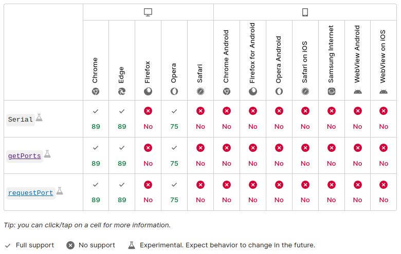
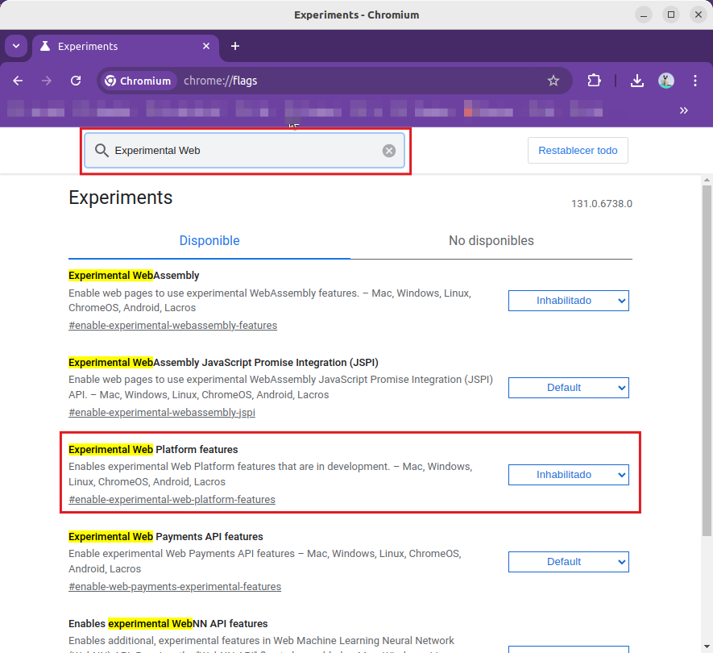
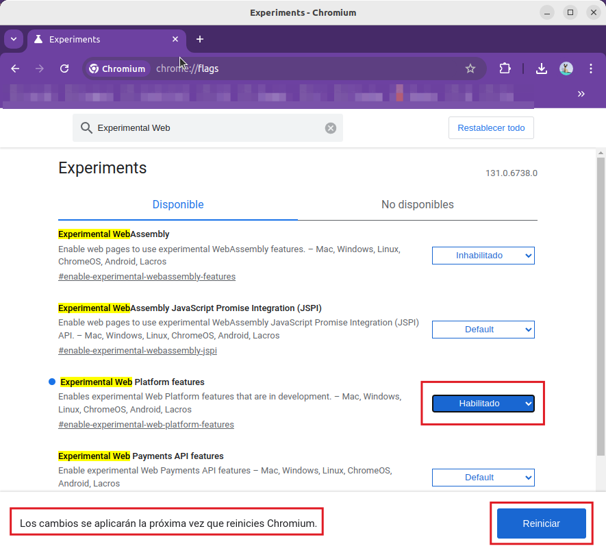

## **Compatibilidad y configuraciones**
Esta herramienta se ha diseñado para ser una opción web para programar placas microcontroladoras de la familia ESP de Espressif. Es una herramienta que nos permite cargar cualquier firmware sin necesidad de usar el conector y cable USB nativo de la placa.

Web serial funciona en el navegador Chrome, [Chromium](https://es.wikipedia.org/wiki/Chromium_(navegador)) o navegadores que son Chromium como Microsoft Edge y Opera. Safari, Firefox y otros sistemas no son compatibles porque [no implementan Web Serial! (they have not implemented Web Serial!)](https://developer.mozilla.org/en-US/docs/Web/API/Serial#browser_compatibility). En la imagen vemos una captura de la web anterior que muestra la compatibilidad de navegadores tanto en ordenadores como en dispositivos móviles:

  
*Compatibilidad de navegadores*

Es muy posible que debamos habilitar la API serie, lo cual es realmente sencillo. Visitamos ***chrome://flags*** desde la barra de navegación de Chrome o Chromium. En la imagen vemos como localizar ***Experimental Web Platform features*** y el estado actual.

  
*Experimental Web Platform features*

Cuando habilitamos la característica se nos avisa de que los cambios se aplican al reiniciar el navegador y nos muestra un botón para realizar la tarea.

  
*Experimental Web Platform features*

Con esto ya tendremos disponible el dispositivo para la conexión vía web.
