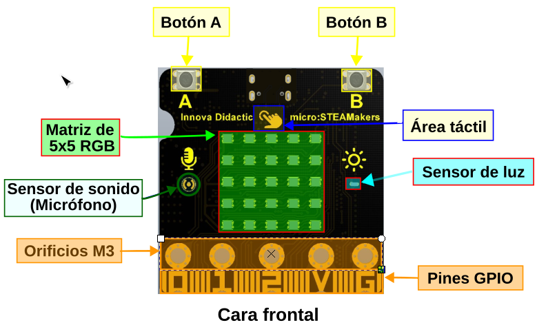
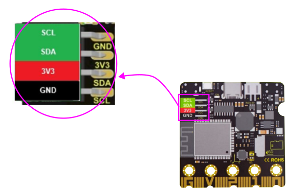
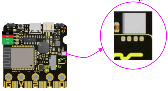

## <FONT COLOR=#007575>**Introducción**</font>
El aspecto de la placa es el que vemos en la imagen siguiente:

<center>

  
*Aspecto de la placa micro:STEAMakers*

</center>

La placa está equipada con 520 KB de memoria dinámica, 4 MB de memoria flash y un procesador de doble núcleo de 240 MHz. Además, incorpora Bluetooth de bajo consumo (BLE) y WiFi, capacidades excelentes para la comunicación inalámbrica.

Esta placa también integra diversos sensores, como el sensor de temperatura y humedad; El giroscopio acelerómetro de seis ejes que permite obtener movimientos y aceleración; El sensor de luz para capturar la intensidad de la luz ambiente; La interfaz para tarjeta microSD para guardar datos; El micrófono para detectar el sonido ambiente, y el zumbador que puede reproducir música; Los botones A y B y el botón táctil; La matriz de 5x5 puntos RGB para muestra de números, letras y patrones con desplazamiento continuo.

Por lo tanto, se puede aplicar para la enseñanza STEAM, IoT, proyectos de control inteligente, y una variedad de trabajos creativos de tipo maker.

## <FONT COLOR=#007575>**Partes micro:STEAMakers**</font>
En la imagen siguiente observamos la descripción gráfica de partes de la cara frontal.

<center>

  
*Hardware de la cara frontal*

</center>

En la imagen siguiente observamos la descripción gráfica de partes de la cara posterior.

<center>

  
*Hardware de la cara posterior*

</center>

## <FONT COLOR=#007575>**Pines GPIO**</font>
La placa ESP32 micro:STEAMakers está equipada con pines de expansión tipo gold-finger, incluyendo todos los pines IO, 19 puertos digitales, 7 puertos analógicos, interfaces I2C, UART y SPI. En la imagen siguiente tenemos la descripción de pines de la placa.

<center>

  
*Pinout del conector de borde*

</center>

Esta placa es compatible con una gran variedad de lenguajes de programación, incluyendo arduinoblocks, MicroBlocks, Arduino, MicroPython y KidsBlock3.0. Es adecuada para usuarios con diferentes niveles de programación.

## <FONT COLOR=#007575>**Compatibilidad de pines**</font>

!!! warning "<FONT COLOR=#FF0000>**AVISO IMPORTANTE**</font>"
    Cuando vamos a trabajar con señales analógicas debemos tener muy presente que, aunque todos los pines IOxx son entradas y salidas digitales, algunas incluso con más funciones. **Cuando tenemos que utilizar la comunicación WiFi el convertidor ADC2 NO funciona.**

Las placas ESP32 tienen disponibles dos ADC (Analog to Digital Converter) de 12 bits que se denominan ADC1 y ADC2. Esos 12 bits dan una precisión de $2^{12} = 4096$. Por lo tanto, si tenemos 12 bits para 3.3V podemos asegurar que $3.3V/4096 = 0,8 mV$ es la tensión correspondiente a cada paso.

!!! danger "<FONT COLOR=#FF0000>**Máxima tensión admisible en el ADC**</font>"
    Aunque los pines GPIO de la ESP32 pueden funcionar a 5V, los conversores ADC no pueden. Debemos tener cuidado de no sobrepasar esos 3.3V si el pin es uno de los que están conectados a uno de los conversores.

La placa ESP32 micro:STEAMakers es al fin y al cabo una ESP32 y la lectura de una entrada analógica se realiza de la forma habitual en entornos basados en Arduino, es decir con ```analogRead(pin_GPIO)```. Internamente la ESP32, de manera genérica, compara la tensión que pretendemos medir con un valor de referencia Vref mediante un circuito atenuador de ganancia variable, tipicamente de -11dB para poder medir hasta 3.3V.

En la ESP32 micro:STEAMakers los pines que tienen conxión con los conversores ADC y que pueden ser utilizados como entradas analógicas están distribuidos de la siguiente forma:

 * **ADC1** se conecta a 8 pines GPIO:

<center>32 , 33, 34, 35, 36, 37, 38, 39</center>

 * **ADC2** se conecta a 10 pines GPIO:

<center>0, 2, 4, 12, 13, 14, 15, 25, 26, 27<br>
<FONT COLOR=#FF00FF><b>WiFi ON → INHABILITA ADC2</b></font></center></br>

A efectos prácticos, revisando el pinout de la placa podemos asegurar que todos los pines catalogados como entradas analógicas, con la única excepción de la patilla 2 que se conecta a io32 y que pertenece a ADC1, funcionarán correctamente siempre y cuando no realicemos configuración WiFi alguna, dado que están conectados a ADC2.

## <FONT COLOR=#007575>**Especificaciones técnicas**</font>
* Alimentación: USB; conector JST PH2.0; puerto I/O gold-finger
* Tensión de funcionamiento: 3.3V
* Corriente de funcionamiento: 100mA
* Placa de control principal ESP32:
> * Procesador: ESP32-D0WDQ6 (doble núcleo)
> * Frecuencia básica: hasta 240MHZ
> * SRAM:520KB
> * Flash:4MB
> * Protocolo WiFi: 802.11 b/g/n (802.11n, rápido hasta 150 Mbps)
> * Rango de frecuencia de funcionamiento WiFi: 2412 ~ 2484 MHz
> * Protocolo Bluetooth: cumple los estándares Bluetooth v4.2BR /EDR y BLE RF
> * Bluetooth: receptor NZIF con sensibilidad de -97 dBm
> * Audio Bluetooth: Audio CVSD y SBC
* Recursos incorporados:
> * 2 botones digitales (botones A y B)
> * Giroscopio acelerometro de seis ejes MPU6050 con Velocidad máxima de rotación de 2000°/s y un Rango de aceleración de ±2g，±4g，±8g，±16g
> * Sensor de luz: fototransistor ALS-PT19-315C
> * Micrófono: 4013-SMD
> * Zumbador: MLT-8530AAC3V
> * 25 RGB: WS2812-2020 RGB-LED
> * Sensor de temperatura y humedad: AHT20
> * Interfaz de expansión de tarjeta microSD
> * Módulo de detección de consumo de corriente de alimentación: INA180A1IDBVR
> * Puerto de expansión I2C
* Interface de extensión:
> * 19 puertos de E/S digital (multiplexado parcialmente con recursos de a bordo)
> * 2 DAC de 8 bits (io25, io26)
> * 7 pines táctiles (io2, io4, io12, io13, io15, io27, io32)
> * 13 pines PWM (io2, io4, io5, io12, io15, io16, io18, io19, io23, io25, io26, io27, io32)
> * Dispositivo UART de 3 vías (cualquier pin), soporta control de flujo por hardware y DMA
> * 2 dispositivos I2C (cualquier pin), soporta modo host o esclavo
> * Control remoto IR (cualquier pin) Transceptor IR de 8 canales, soporta diferentes estándares de forma de onda.

## <FONT COLOR=#007575>**I2C en la micro:STEAMakers**</font>
La placa ESP32 micro:STEAMakers incorpora un puerto de expansión I2C localizado en un conector hembra de 4 pines de 100mils (2,54mm) de separación entre pines.

<center>

  
*Conector de expansión I2C*

</center>

Además la placa incorpora dos dispositivos que son I2C y que es conveniente tener claro cuales son y que direcciones físicas utilizan para que no interfiramos con los mismo desde lo que conectemos externamente al puerto de expansión I2C de la placa que sea de tipo I2C. Son los siguientes:

* Sensor de temperatura y humedad AHT20.

<center>

  
*Localización Sensor de temperatura y humedad AHT20*

</center>

* Acelerómetro, giroscopio de 6 ejes MPU-6050.

<center>

  
*Localización acelerómetro y giroscopio MPU-6050*

</center>

Observamos en este caso que el dispositivo tiene posibilidad de configurar la dirección I2C del mismo entre dos posibilidades:

* Dirección 0x68 configurada por defecto al estar unidos los dos pads de configuración mediante una resistencia de cero ohmios.
* Dirección 0x69 que podemos configurar desoldando la resistencia de la 0x68 y soldandola en los dos pads de la 0x69. Aunque no es una operación muy compleja no se recomienda acometerla si no tenemos experiencia trabajando con soldadura en este tipo de placas y componentes y en cualquier caso no se recomienda a no ser que resulte totalmente imprescindible.

A continuación vamos a ver un ejemplo en el que averiguamos las direcciones físicas de estos dos dispositivos I2C.

<center>

  
*Obtención de la dirección I2C de los dispositivos conectados*

</center>

Cargamos el programa en la placa, conectamos la consola serie y tras hacer un reset físico en la micro:STEAMakers nos aparece la siguiente información:

<center>

  
*Resultados obtención de la dirección I2C de los dispositivos conectados*

</center>

El bloque 'Escanear lo encontramos en 'Entrada/Salida' en I2C:

<center>

  
*Bloque Escaner I2C*

</center>

## <FONT COLOR=#007575>**Elementos auxiliares 3D**</font>

* [Filtro](./3D/Filtro_NeoMatrix/filtro.stl) impreso en 3D para que los LEDs deslumbren menos
* Soporte [Micro:Steamakers Stand](https://github.com/maynej/Micro-Steamakers-Stand) creado por [Jordi Mayné](https://github.com/maynej)
