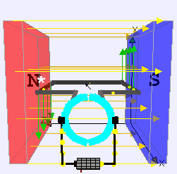
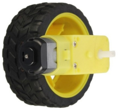
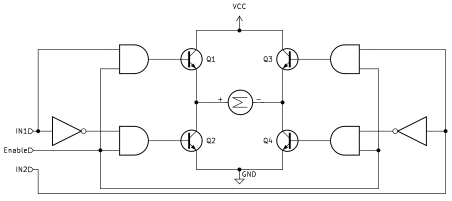
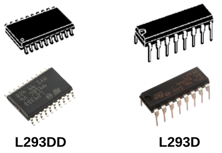
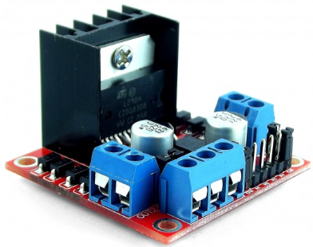
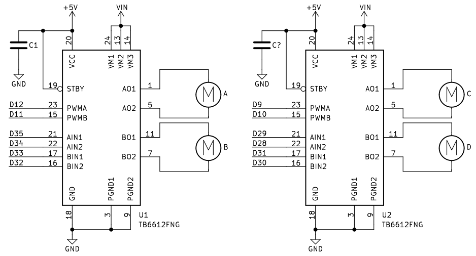
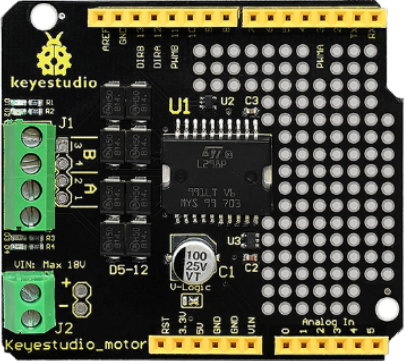

# El motor de corriente continua
Se suelen denominar como motores DC (del inglés Direct Current) o motores CC y son máquinas que convierten la energía eléctrica en mecánica en base a un campo magnético que provoca un movimiento de rotación en el eje del motor.

Un motor de corriente continua tiene dos partes bien diferenciadas:

* **Estator**. Es la parte fija del motor y son bobinas de hilo de cobre devanadas en núcleos magnéticos.
* **Rotor**. Es la parte movil del motor y suele tener forma de cilindro, también es un devanado con núcleo que se alimenta con corriente continua a través de las delgas.

En la animación de la figura siguiente vemos el principio de funcionamiento de un motor DC explicado a partir del caso de una espira conductora dentro de un campo magnético a la que se aplica una tensión entre sus extremos que hace circular por la misma una corriente eléctrica.

  
*Base de funcionamiento de un motor DC*
**Fuente: [Wikipedia](https://es.wikipedia.org/wiki/Motor_de_corriente_continua)**

En esta imagen existe un campo magnético permanente producido por imanes en el estator. El flujo de corriente en el devanado del rotor produce una fuerza de Lorentz sobre el devanado, representada por las flechas verdes. Debido a que en este caso el motor tiene dos polos, la conmutación se hace por medio de un anillo partido a la mitad, donde el flujo de corriente se invierte cada media vuelta (180 grados).

En la figura siguiente vemos el esquema del funcionamiento de un motor de c.c. elemental de dos polos con una sola bobina y dos delgas en el rotor. Se muestra el motor en tres posiciones del rotor desfasadas 90° entre sí.

* 1, 2: Escobillas
* A, B: Delgas
* a, b: Lados de la bobina conectados respectivamente a las delgas A y B

  
*Esquema de funcionamiento de un motor DC*
**Fuente: [Wikipedia](https://es.wikipedia.org/wiki/Motor_de_corriente_continua)**

En la figura siguiente vemos el aspecto de dos motores típicos para aplicaciones en las que se utilizan placas tipo Arduino.

  
*Aspecto de motores DC*

## **Motor amarillo con reductora**
A falta de información técnica sobre este motor vamos a dar sus características según lo que suministran los vendedores, que los suelen comercializar junto con una rueda de 66mm de diámetro y 25mm de anchura.

  
*Rueda y motor DC*

Sus especificaciones son:

* Color: Amarillo.
* Tensión de trabajo: de 3 a 12V (recomendado de 6 a 8V)
* Engranes: Plastico.
* Reductora: 48:1
* Dimensiones: Largo: 7 cm, Ancho: 2.2 cm, Alto: 3.5 cm
* Peso: 27 gramos total.
* Velocidad del motor sin reductora: 6000 RPM
* Nivel de ruido: menor de 65 dB

En la tabla siguiente se dan otras especificaciones para distintos valores de tensión de alimentación:

|Parámetro|3V|5V|6V|
|---|:-:|:-:|:-:|
|Velocidad sin carga|90 rpm|200 rpm|230 rpm|
|Velocidad con carga|95 rpm|160 rpm|175 rpm|
|Torque|800 g/cm|1 kg/cm|1.1 kg/cm|
|Corriente|120 mA|130 mA|140 mA|

En la imagen siguiente vemos las dimensiones de este motor:

  
*Dimensiones motor DC*

## **Control de motores DC**
Las salidas de las placas tipo Arduino o basadas en ESP32 son capaces de proporcionar entre 40 y 50mA por pin estándo limitada la corriente máxima total y, por si mismas, no van a servir para el control de un motor DC que tendrá un consumo de hasta 1A. La solución está en realizar el control del motor a través de un controlador o driver que es gobernado por la placa de control, se alimenta de forma externa y excita al motor. En la figura siguiente vemos esquematizado el concepto.

  
*Concepto de control por driver*

El sistema mas sencillo de control todo o nada de un motor DC lo conseguimos a través de un transistor, tal y como vemos en la figura siguiente.

  
*Control de motor DC con transistor*

Pero es evidente que necesitamos un control mas completo del motor en el que se permita:

* Invertir el sentido de giro.
* Controlar la velocidad de giro.

Existen muchos drivers diferentes que consiguen estos objetivos y casi todos basan su funcionamiento en el denominado puente en H estando su principal diferencia en el circuito integrado que utilizan y la corriente máxima que es capaz de entregar.

### Puente en H con interruptores
Vamos a explicar el funcionamiento de un puente en H utilizando para ello un circuito creado con interruptores y el principio básico de que en los motores DC el sentido de giro depende de la polaridad de alimentación. En la figura siguiente tratamos de expresar el hecho de que cambiando la polaridad de la batería cambia el sentido de giro del motor.

  
*Cambio de polaridad para cambiar sentido de giro*

El puente en H más básico que podemos construir lo vemos en la figura siguiente, donde observamos que su nombre se debe a la similitud que tiene el esquema con la letra H.

  
*Puente en H con interruptores*

Veamos las posibles combinaciones que podemos realizar accionando dos interruptores:

1. **Cerramos SW1 y SW4**. Las conexiones son: positivo motor a positivo batería y negativo motor a negativo batería. Sentido de giro: horario.
2. **Cerramos SW2 y SW3**. Las conexiones son: positivo motor a negativo batería y negativo motor a positivo batería. Sentido de giro: antihorario.
3. **Cerramos SW1 y SW2 o SW3 y SW4**. Se provoca un CORTOCIRCUITO en la alimentación.
4. **Cerramos SW1 y SW3 o SW2 y SW4**. Se cortocircuitan los terminales del motor lo que mantiene al motor frenado.

Es evidente que un puente en H así construido no nos va a servir para mucho mas que para explicar el funcionamiento del sistema, pero si reemplazamos los interruptores por un sistema de control que abra y cierre el circuito de cada interruptor es evidente que si tendremos un sistema de control del sentido de giro muy versátil.

### Puente en H con transistores
Si a un transistor lo hacemos trabajar en conmutación su comportamiento es muy similar al de un interruptor asimilando el estado de corte del transistor al de interruptor abierto y el de saturación al de cerrado. Es entonces posible sustituir los interruptores por transistores y tendremos una configuración de puente en H como la de la figura siguiente. Este es un circuito simplificado donde además se ha añadido una lógica de control básica que permite explicar el funcionamiento.

  
*Puente en H con transistores*

Los transistores pueden ser NPN (el caso expuesto), PNP o pares complementarios y pueden ser de unión o MOSFET de potencia variando así la máxima corriente que son capaces de entregar y por lo tanto el tamaño del motor.

El funcionamiento del circuito es el siguiente:

* **Pin enable**. Si es 0 todas las puertas AND tendrán un cero en la salida un 0 con lo que los transistores están en corte y al motor no le llega alimentación. El pin enable a 1 habilita la otra entrada de las 4 puertas AND para que en la misma aparezca la otra entrada.
* **Enable = 1, IN1 = 1 e IN2 = 0**. Los transistores Q1 y Q4 se saturan por lo que el motor queda polarizado directamente tal y como se muestra en la imagen y por lo tanto girará en sentido horario.
* **Enable = 1, IN1 = 0 e IN2 = 1**. Los transistores Q2 y Q3 se saturan por lo que el motor queda polarizado inversamente y por lo tanto girará en sentido antihorario.
* **Enable = 1, IN1 = 1 e IN2 = 1**. Se saturan los transistores Q1 y Q3 y al motor solamente le llega el positivo de alimentación por lo que permanecerá parado.
* **Enable = 1, IN1 = 0 e IN2 = 0**. Se saturan los transistores Q2 y Q4 y el motor permanecerá frenado.

### L293D
Se trata de un circuito integrado que con sus 16 patillas nos da la posibilidad de controlar dos motores DC y su sentido de giro gracias a los cuatro medios puentes en H que lleva en su interior. El [datasheet del L293D](https://www.ti.com/lit/ds/symlink/l293.pdf) nos ofrece toda la información referente al circuito, cuyo aspecto real vemos en la imagen siguiente.

  
*Aspecto L293D*

El circuito que debemos montar para el control bidireccional de un motor y su tabla de funcionamiento es el siguiente:

  
*Control bidireccional de motor DC con L293D*

<table border="1">
    <th>
    <b>EN</b>
    </th>
    <th>
    <b>1A</b>
    </th>
    <th>
    <b>2A</b>
    </th>
    <th>
    <b>Función</b>
    </th>
    <tr>
        <td>1</td>
        <td>0</td>
        <td>1</td>
        <td>Giro a derechas</td>
    </tr>
    <tr>
        <td>1</td>
        <td>1</td>
        <td>0</td>
        <td>Giro a izquierdas</td>
    </tr>
    <tr>
        <td>1</td>
        <td>0</td>
        <td>0</td>
        <td>Parada rápida del motor</td>
    </tr>
    <tr>
        <td>0</td>
        <td>X</td>
        <td>X</td>
        <td>Parada controlada del motor</td>
    </tr>
</table>

Si conectamos los pines enable a pines PWM podemos controlar la velocidad de giro de los motores.

### L298
Es también un driver puente en H capaz de manejar motores DC de hasta 2 amperios. El chip L298N internamente posee dos puentes en H completos que permiten controlar 2 motores DC o un motor paso a paso bipolar o unipolar. El [datasheet L298](https://www.st.com/resource/en/datasheet/l298.pdf) nos suministra toda la información del circuito integrado discreto, pero la forma usual que facilita su conexionado y manejo es una placa de control puente en H basada en el L298 que tiene el aspecto que vemos en la imagen siguiente.

  
*Aspecto driver basado en L298N*

El módulo permite controlar el sentido y velocidad de giro de motores mediante señales TTL. El control del sentido de giro se realiza mediante dos pines para cada motor y la velocidad de giro se puede regular haciendo uso de modulación por ancho de pulso. El módulo lleva un regulador de voltaje LM7805 de 5V encargado de alimentar la parte lógica del L298N, el uso de este regulador se hace a través de un Jumper y se puede usar para alimentar la etapa de control.

Sus principales especificaciones técnicas son:

* 2 Canales que permiten conectar 2 motores DC
* Voltaje para lógica: 5V
* Voltaje de potencia (alimentación motor): 5V - 35V
* Consumo de corriente (lógica): 0 a 36mA
* Corriente máxima de salida: 2A (soporta picos de hasta 3A)
* Potencia máxima: 25W

En este tutorial de [naylampmechatronics](https://naylampmechatronics.com/blog/11_tutorial-de-uso-del-modulo-l298n.html) nos explican muy claramente como utilizar este driver.

  
*Conexionado de los drivers*

Existe otro driver L298, el L298P que es una shield o módulo tipo UNO permite también manejar dos motores DC a través de una configuración de puente en H. Esta placa incorpora además interfaz bluetooth, zumbador, servo, motores paso a paso y también incorpora conexión a 6 pines analógicos (A0 - A5) y 6 pines digitales no utilizados (D2,D3,D5,D6,D7 y D9). En la figura siguiente vemos su aspecto.

  
*Aspecto driver basado en L298P*

Existe una versión de la shield en la que no se monta nada mas que el driver de motores dejando las zonas de la placa no ocupadas con perforaciones que permiten agregar componentes externos para completar nuestro propio experimento. En la figura siguiente vemos el aspecto de una de estas placas.

  
*Aspecto driver basado en L298P con solo el driver*

### HR8833
El módulo controlador de motores [HR8833](https://dfimg.dfrobot.com/nobody/wiki/1f19ca7c0797f9d725fe8e39e4f4a9ca.pdf) tiene una estructura de doble puente en H que le otorga capacidad para controlar dos motores de corriente contínua o un motor paso a paso.

El formato que incorpora la Shield:bit es el TSSOP16 capaz de entregar hasta 1,5A eficaces por puente en H. Las salidas se pueden conectar en paralelo para obtener 3A eficaces.

El esquema básico de conexionado a un controlador es el siguiente:

  
*Conexionado HR8833*

