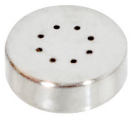
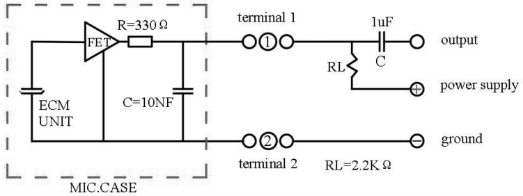

# Micrófonos
Un micrófono es un dispositivo de entrada que sirve para transformar ondas sonoras en energia electrica y vicerversa en procesos de grabación.

Existe multitud de tipos de micrófonos para distintas aplicaciones en las que no vamos a entrar. En el [enlace](https://es.wikipedia.org/wiki/Micr%C3%B3fono#:~:text=Un%20micr%C3%B3fono%20funciona%20como%20un,su%20intensidad%2C%20transmitirla%20y%20registrarla.) tienes un amplio artículo sobre los mismos.

Existe un tipo denominado MEMs ("Microelectromechanical systems" en inglés) que también se denominan chips microfónicos y son variantes del micrófono a condensador. El diafragma sensible está grabado sobre la oblea de silicio y suelen integrarse con un amplificador incorporado.

La micro:STEAMakers tiene un micrófono integrado. Puede usarse como una entrada simple (encender luces cuando se aplaude) o tambien se puede medir la cantidad de sonido, por lo que puede hacer un medidor de nivel de ruido o sonómetro básico Tambien podemos hacer que las luces se enciendan en modo disco, al compás de la música. Un micrófono funciona como un transductor o sensor electroacústico y convierte el sonido (ondas sonoras) en una señal eléctrica para aumentar su intensidad, transmitirla y registrarla.

El micrófono está en la parte delantera de la micro:STEAMakers y tiene el aspecto que vemos en la imagen siguiente:

  
*Aspecto del micrófono en la micro:STEAMakers*

Un circuito de aplicación típica lo vemos a continuación. En el mismo podemos observar que la capsula microfónica incluye su propia circuiteria amplificadora.

  
*Esquema circuito altavoz*

