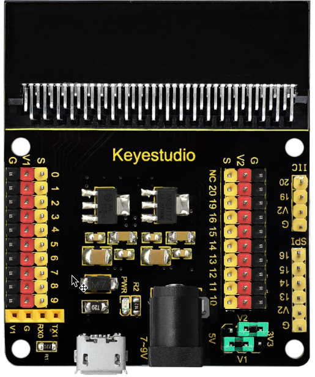
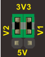
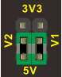
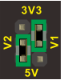
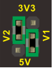
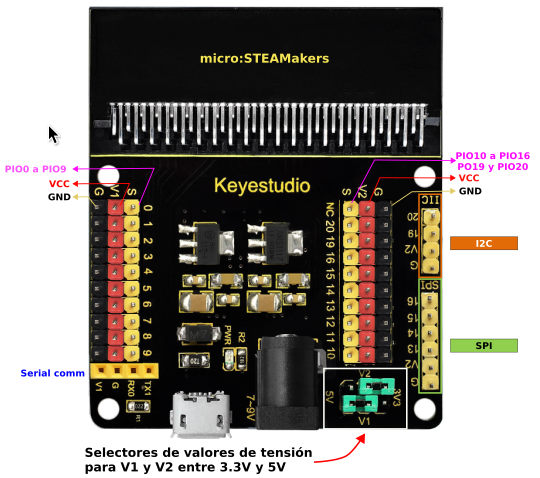
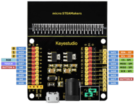

# <FONT COLOR=#8B008B>Sensor shield modular V2</font>
## <FONT COLOR=#007575>**Introducción**</font>
Se trata de un escudo con conexión rápida de sensores para la versión V2 de micro:bit. Su aspecto lo vemos en la imagen siguiente:

<center>

  
*Aspecto de la shield*

</center>

La shield V2 convierte todos los puertos PIO de la placa de control micro:STEAMakers en una interfaz de tres pines (GND, VCC, Señal), muy fácil para conectar la placa de control y módulos sensores.

Por otra parte, también dispone pines hembra para interfaz de comunicación serie y pines macho de comunicación I2C y SPI. De modo que esta shield permitirá la comunicación entre la placa de control micro:STEAMakers y otros dispositivos de comunicación. La placa se puede alimentar a través de un jack DC negro (DC 7-9V) o un puerto USB micro (DC 5V). Cuando alimentemos a través de la shield, se puede seleccionar el voltaje de alimentación V1 y V2 a 3.3V o 5V a través de los jumpers V1 y V2.

## <FONT COLOR=#007575>**Selección y análisis de tensiones**</font>
Las combinaciones posibles las vemos en la tabla siguiente:

<center>

|Posición| V2 (V)| V1 (V)|Posición| V2 (V)| V1 (V)|
|---|:-:|:-:|---|:-:|:-:|
|| 3.3 | 3.3 | | 5 | 5 |
|| 5 | 3.3 || 3.3 | 5 |

</center>

En la shield observamos como según estos selectores en los pines de alimentación positiva (rojos) estará presente una u otra tensión.

!!! failure "Aviso"
    Sin alimentación externa de la shield en V1 y/o V2 no habrá 5V aunque alimentemos externamente a la placa micro:STEAMakers. Alimentando la shield la tensión en V1 y/o V2 depende de la posición de su jumper y será de 5V si la alimentamos a través del conector micro USB o a través del Jack de alimentación.

La shield va dotada de dos reguladores de tensión un ASM1117 para 3.3V y un 117-5 para 5V, ambos en encapsulado SOT-223. Ambos reguladores se configuran facilmente con muy pocos componentes externos para, junto con los jumpers, cumplir con su misión en la placa.

## <FONT COLOR=#007575>**Detalles técnicos**</font>
Los principales detalles técnicos de la shield son:

* Entrada de alimentación externa: jack negro DC (DC 7-9V) o puerto micro USB (DC 5V)
* Tensión de salida: seleccionable a 3.3V o 5V a través de los jumpera V1/V2
* Indicador de alimentación externa.
* Convierte la interfaz de pines PIO de micro:STEAMakers a conectores de tres pines.
* Pines de comunicación serie.
* Pines de comunicación I2C.
* Pines de comunicación SPI.
* Dimensiones: 65mm x 58mm x 12mm.

## <FONT COLOR=#007575>**Diagrama de pines**</font>
En la imagen siguiente podemos ver el diagrama de pines original de esta placa:

<center>

  
*Pinout original*

</center>

Pero debemos tener muy presente que esta shield es para una placa micro:bit y no para un micro:STEAMakers por lo que la numeración impresa en la misma no es la correcta para nuestros propósitos. Por ello se ha estudiado la correspondencia de pines del borde de la micro:STEAMakers con esta shield obteniendo el siguiente **pinout**:

<center>

  
*Pinout micro:STEAMakers vs Shield*  
***Clic sobre la imagen para ampliarla***

</center>

## <FONT COLOR=#007575>**Compatibilidad de pines**</font>

!!! warning "<FONT COLOR=#FF0000>**AVISO IMPORTANTE**</font>"
    Cuando vamos a trabajar con señales analógicas debemos tener muy presente que, aunque todos los pines IOxx son entradas y salidas digitales, algunas incluso con más funciones. **Cuando tenemos que utilizar la comunicación WiFi el convertidor ADC2 NO funciona.**

Las placas ESP32 tienen disponibles dos ADC (Analog to Digital Converter) de 12 bits que se denominan ADC1 y ADC2. Esos 12 bits dan una precisión de $2^{12} = 4096$. Por lo tanto, si tenemos 12 bits para 3.3V podemos asegurar que $3.3V/4096 = 0,8 mV$ es la tensión correspondiente a cada paso.

!!! danger "<FONT COLOR=#FF0000>**Máxima tensión admisible en el ADC**</font>"
    Aunque los pines GPIO de la ESP32 pueden funcionar a 5V, los conversores ADC no pueden. Debemos tener cuidado de no sobrepasar esos 3.3V si el pin es uno de los que están conectados a uno de los conversores.

La placa ESP32 micro:STEAMakers es al fin y al cabo una ESP32 y la lectura de una entrada analógica se realiza de la forma habitual en entornos basados en Arduino, es decir con ```analogRead(pin_GPIO)```. Internamente la ESP32, de manera genérica, compara la tensión que pretendemos medir con un valor de referencia Vref mediante un circuito atenuador de ganancia variable, tipicamente de -11dB para poder medir hasta 3.3V.

En la ESP32 micro:STEAMakers los pines que tienen conxión con los conversores ADC y que pueden ser utilizados como entradas analógicas están distribuidos de la siguiente forma:

 * **ADC1** se conecta a 8 pines GPIO:

<center>32 , 33, 34, 35, 36, 37, 38, 39</center>

 * **ADC2** se conecta a 10 pines GPIO:

<center>0, 2, 4, 12, 13, 14, 15, 25, 26, 27<br>
<FONT COLOR=#FF00FF><b>WiFi ON → INHABILITA ADC2</b></font></center></br>

A efectos prácticos, aunque en el pinout de la placa no se indican las entradas analógicas, podemos asegurar que todos los pines que pueden ser usados como entradas analógicas, con la única excepción de la patilla 2 que se conecta a io32 y que pertenece a ADC1, funcionarán correctamente siempre y cuando no realicemos configuración WiFi alguna, dado que están conectados a ADC2.
