Sección en la que se va a describir de forma breve que es y como utilizar esta pequeña pantalla de apenas una pulgada.

Una pantalla OLED (Organic Light Emitting Diode) está constituida por un tipo de LED formado por un compuesto orgánico que emite luz en respuesta a la circulación de corriente por el mismo.

Quizá las pantallas OLED más conocidas sean las que incorporan un controlador SDD1306 de 0.96" de un tamaño aproximado de unos 25x15cm. Son pantallas monocromáticas y presentan una resolución de 128x64 pixels (anchura x altura).

Las pantallas OLED tienen una ventaja importante que es la de su bajo consumo, en torno a los 20 mA. Esto se debe a que solamente se encienden los pixeles necesarios y no requiere de retroiluminación.

Existen dos tipos de comunicación, por bus SPI y por bus I2C (será el que usaremos aquí) por lo que es fácil de controlar. Soportan alimentaciones de 3.3 y de 5V.

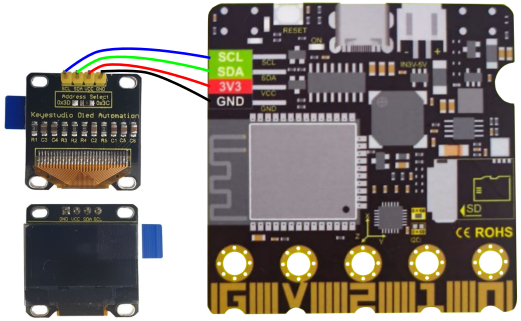  
*Aspecto y conexionado a la micro:STEAMakers*

La pantalla tiene una resolución de 128x64 pixels localizables por coordenadas según el siguiente esquema:

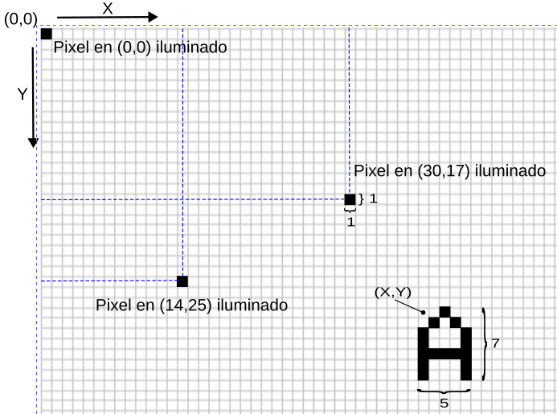  
*Coordenadas OLED 0.96"*

En arduinoblocks tenemos la posibilidad, además de escribir texto y hacer dibujos geométricos sencillos, de utilizar un bloque que permite dibujar una imagen a partir de un mapa de bits.

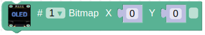  
*Bloque Bitmap*

Si hacemos clic derecho sobre el bloque y escogemos ayuda

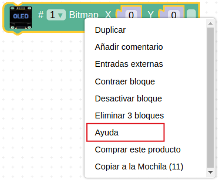  
*Clic derecho bloque Bitmap*

o desde el menú "Herramientas" accedemos a "OLED - Bitmap editor"

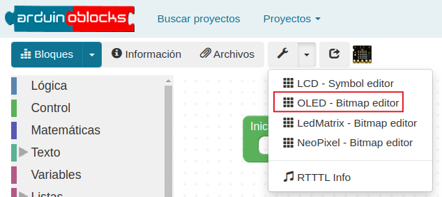  
*Herramientas -> "OLED - Bitmap editor"*

accedemos a un editor en el que podemos procesar imágenes de forma sencilla.

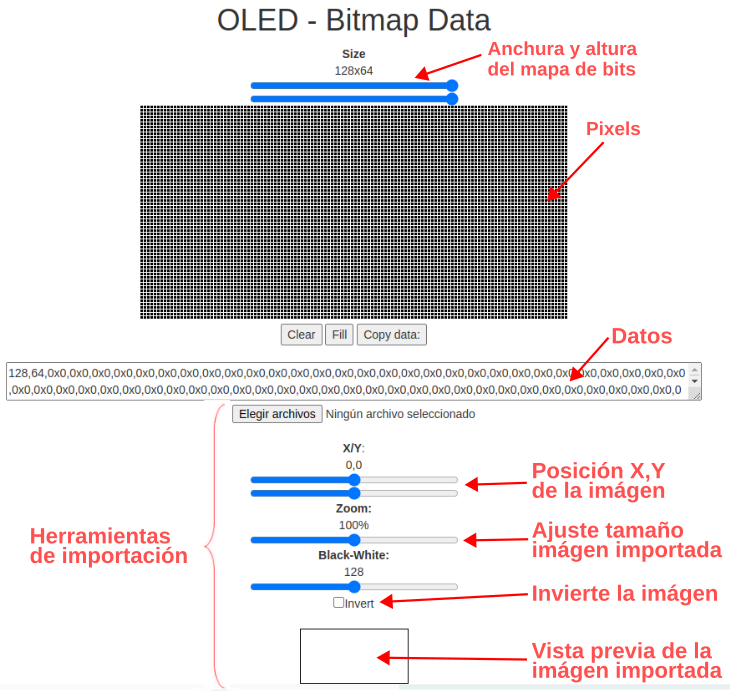  
*OLED - Bitmap editor*

## **Ejemplo imagen fija**
Vamos a procesar una imagen con el editor de mapa de bits y la mostraremos en una OLED. Para ello utilizaremos el logo de Keyestudio que puedes descargar desde el título de la imagen:

  
*[Logo Keyestudio](../img/oled/keyes_logo.png)*

El archivo recien importado se debe ver así:

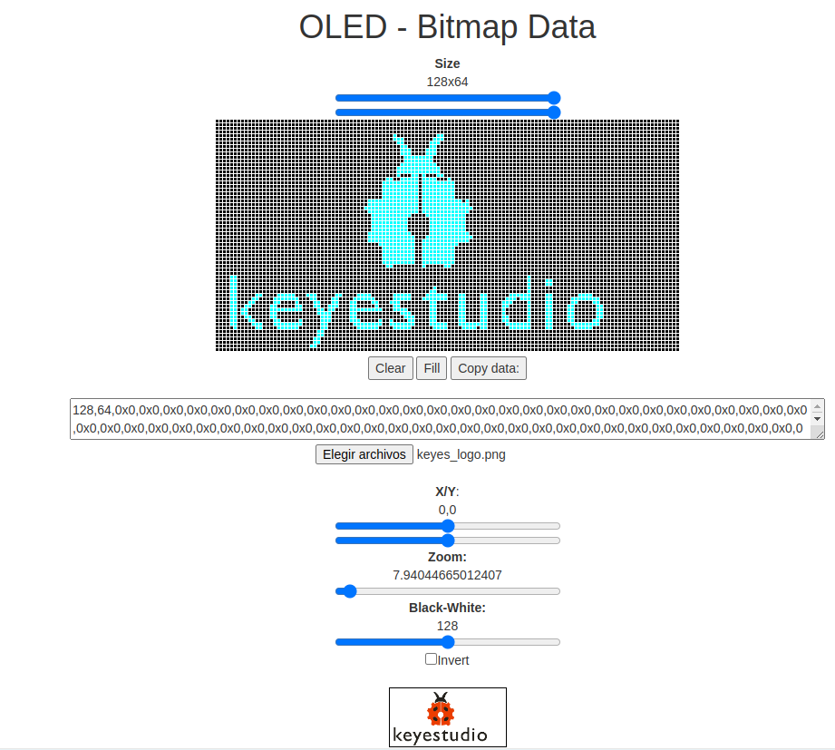  
*Logo Keyestudio en editor bitmap*

Aunque está bastante bien podemos retocarlo para arreglar los pequeños desperfecto que tiene y ya podemos copiar los datos para ponerlos en el bloque y crear un pequeño programa para mostrarlo en una OLED conectada a la micro:STEAMakers.

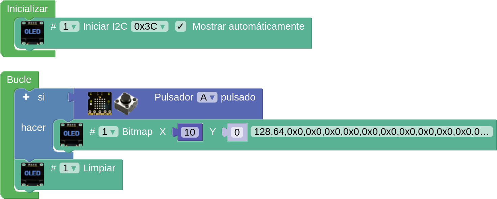  
*[Logo Keyestudio en OLED](../program/ejemplosAB/keyes_logo_oled.ubp)*

## **Ejemplo GIF animado**
Vemos una forma sencilla de crear una pequeña animación con los conocidos GIF animados. Concretamente vamos a recrear el siguiente GIF que podemos obtener de la web de [gifsanimados.org](https://www.gifsanimados.org/).

El GIF lo podemos descargar de [web gifanimados](https://www.gifsanimados.org/img-ojo-imagen-animada-0305-40351.htm) o [esta web](../img/oled/ojo-imagen-animada-0305.gif).

En principio nos puede valer cualquier imágen pero debemos tener en cuenta que las imágenes con demasiados colores, pueden no ser convertidas a blanco y negro con un resultado muy bueno y necesitamos que la conversión a blanco y negro sea lo más similar posible a la imagen original.

Ahora tenemos que convertir el gif descargado en imágenes .png para lo que vamos a ver dos métodos:

**1.** El primer método será utilizando FFmpeg, que es una aplicación multiplataforma con capacidad de trabajar con diferentes tipos de archivos multimedia. Si aún no lo tienes instalado en tu ordenador con Linux puedes hacerlo desde una terminal, para el caso de sistemas basados en Debian, con:

~~~sh
sudo apt update
sudo apt upgrade
sudo apt install ffmpeg
~~~

Una vez tenemos el programa en el sistema nos situamos en el directorio donde se encuentra el archivo GIF y en una terminal tecleamos:

~~~sh
ffmpeg -i ojo-imagen-animada-0305.gif ojo_%02d.png
~~~

siendo ***ojo-imagen-animada-0305.gif*** el nombre del archivo del que vamos a extraer las imágenes o frames y ***ojo_%02d.png*** es el nombre de los archivos de salida que se van a autonumerar con dos cifras. El resultado de la extracción lo vemos a continuación:

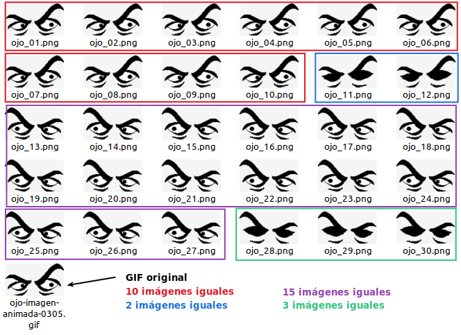  
*Imágenes extraidas del GIF con FFmpeg*

Observamos como en realidad existen sólo 4 imágenes diferentes y el número de veces que aparecen en nuestro programa lo resolvemos con retardos de 50ms por cada aparición.

**2.** El segundo método va a consistir en utilizar un programa online denominado [ezgif](https://ezgif.com/split) un editor básico de imágenes y creador de GIF:

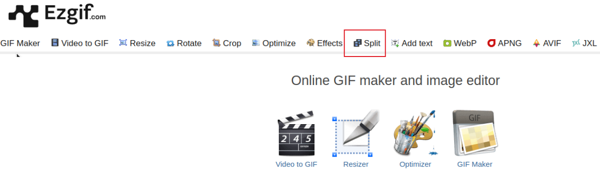  
*Ezgif*

La opción destacada es la que nos permite realizar la tarea que necesitamos.

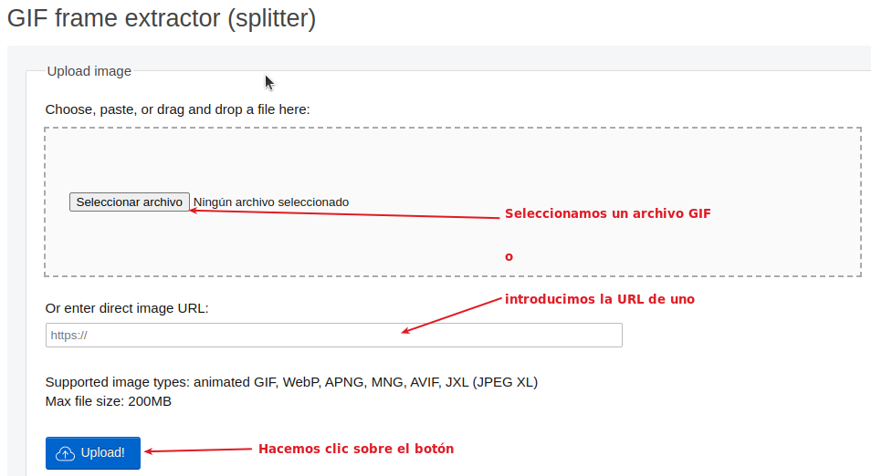  
*Ezgif/splitter*

Una vez subido el archivo se nos abren las opciones de trabajo con el mismo:

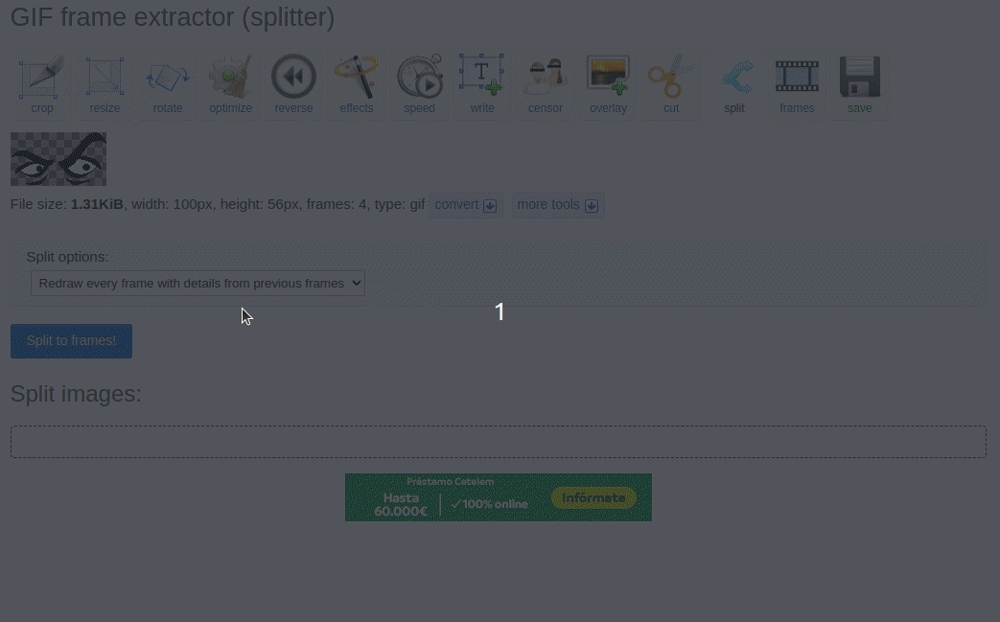  
*Ezgif/splitter*

Ya podemos descargar el archivo .zip que contiene las 4 imágenes diferentes de que consta el GIF. Si descomprimimos dicho archivo veremos lo siguiente:

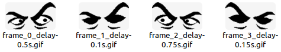  
*PNGs obtenidos de Ezgif*

En el nombre de los archivos viene indicado el retardo en segundos que debemos utilizar.

Aquí tienes el archivo [ezgif_ojo.zip](..//img/oled/ezgif_ojo.zip) comprimido listo para descargar aunque te aconsejo que hagas el proceso en la web para ver todas las opciones que tienes disponibles.

De forma similar a la vista anteriormente iremos cargando en el editor de mapas de bits cada imagen para obtener sus datos de los pixeles. Si realizamos modificaciones de zoom o posición es muy importante que sean las mismas en todas las imágenes. Con esto ya podemos crear un programa sencillo que funciona como un gif animado:

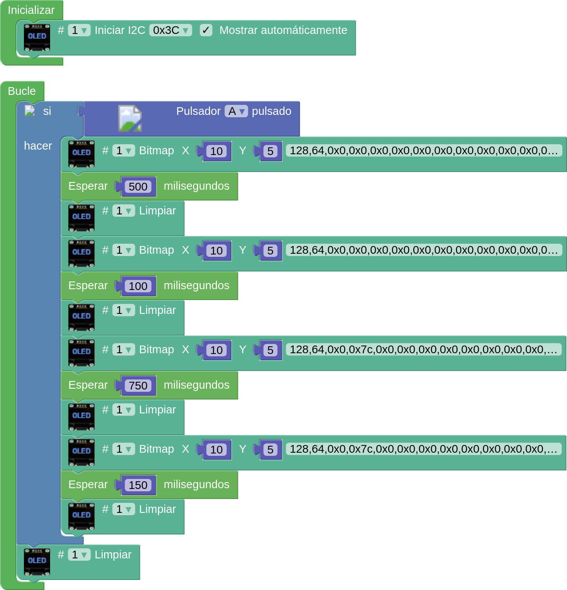  
*[GIF animado](../program/ejemplosAB/GIF_animado.ubp)*

En la animación siguiente vemos el trabajo realizado en funcionamiento:

  
*GIF animado*

