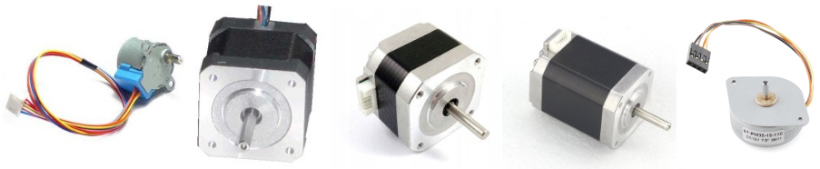
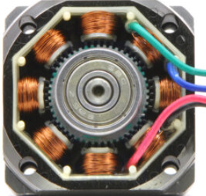
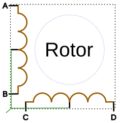
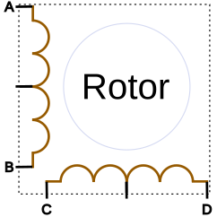
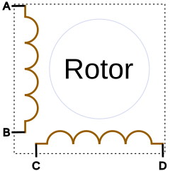
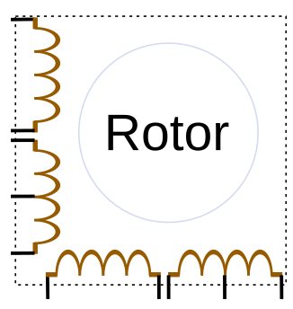
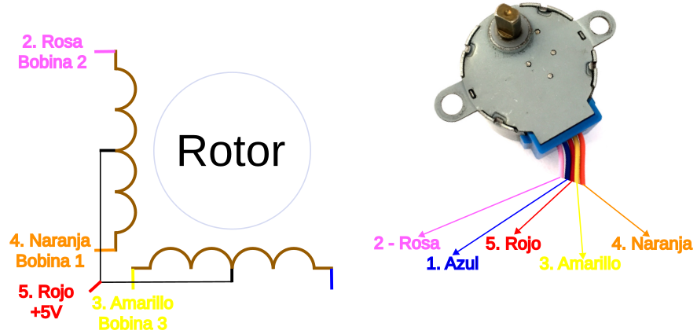

Un motor paso a paso (PaP), de pasos o stepper es un motor DC sin escobillas o dispositivo electromecánico que convierte la corriente que circula a través de él (impulsos eléctricos) en movimientos de rotación.

En lugar de girar de constantemente, un motor PaP da un paso cuando se aplica energia a uno de sus devanados o bobinados. Cada paso es una rotación en un ángulo que se determina en la fabricación, como por ejemplo 1,2 grados. De esta forma podemos controlar la cantidad de grados que debe girar un motor tanto en sentido horario como antihorario.

Sus principales ventajas son la precisión y la repetitividad en el posicionamiento y que existen motores casi para cualquier par motor que necesitemos.

El aspecto de algunos de los motores mas usuales en robótica educativa e impresión 3D los vemos en la imagen siguiente:

  
*Aspecto motores PaP*

Internamente estos motores tienen una serie de bobinas dispuestas de manera que al suministrarles energia en el orden adecuado obligan a los dientes del rotor a alinearse con los dientes solidarios con las bobinas del estátor que tienen energia en ese momento. En la imagen siguiente podemos apreciar la parte interna de un motor PaP unipolar:

  
*Interior motor PaP*

El número de dientes establecido en la fabricación va a determinar el ángulo de giro. Existen motores con los ángulos por paso, entre otros, siguientes:

* $0,6^o \rightarrow 360 \div 0.6 = 600 \space pasos \space por \space vuelta$
* $0,9^o \rightarrow 360 \div 0.9 = 400 \space pasos \space por \space vuelta$
* $1,0^o \rightarrow 360 \div 1.0 = 360 \space pasos \space por \space vuelta$
* $1,2^o \rightarrow 360 \div 1.2 = 300 \space pasos \space por \space vuelta$
* $1,8^o \rightarrow 360 \div 1.8 = 200 \space pasos \space por \space vuelta$
* $2,4^o \rightarrow 360 \div 2.4 = 150 \space pasos \space por \space vuelta$
* $3,6^o \rightarrow 360 \div 3.6 = 100 \space pasos \space por \space vuelta$
* $4,0^o \rightarrow 360 \div 4.0 = 90 \space pasos \space por \space vuelta$
* $7,2^o \rightarrow 360 \div 7.2 = 50 \space pasos \space por \space vuelta$

En la animación siguiente podemos observar de una manera muy esquematizada el funcionamiento de un motor paso a paso.

  
*Funcionamiento de motor PaP*  
Obtenido de esta **[fuente](https://www.miguelgrassi.com.ar/mecatronica/pap/)**

Para hacer funcionar a estos motores hay que alimentar las bobinas en una determinada secuencia y conectar los 4 o más cables de manera correcta. Para ello es necesario utilizar drivers o controles de potencia manejados por una placa de control tipo ESP32.

## **Tipos de motores PaP**
Los motores PaP se suelen clasificar, en función de como están construidos, en tres categorias:

* Imán permanente, o también conocidos como motores PMSM (Permanent Magnet Synchronous Motor). Son motores que se montan con imánes permanentes en el rotor tanto en la superficie como insertados en el mismo.
* Reluctancia variable, en los que el rotor es multipolar y el estátor devanado. Rota cuando los dientes mas cercanos del rotor son atraidos por las bobinas del estátor a las que se ha suministrado energia. Este efecto se produce por ser el camino con menor reluctancia (resistencia de un circuito al flujo magnético) y es lo que da nombre a estos motores. Aunque tienen un torque mas bajo que los de imán permanente son más rápidos y silenciosos que estos.
* Hibridos. Es una combinación de los dos anteriores para combinar las ventajas de ambas soluciones.

En el [Blog Engineering Notes](https://blog.orientalmotor.com/) de [Oriental Motor's](https://www.orientalmotor.com/index.html) podemos encontrar la entrada [Stepper Motor Basics: PM vs VR vs Hybrid](https://blog.orientalmotor.com/stepper-motor-basics-pm-vs-vr-vs-hybrid) donde se somparan los tres tipos citados.

Para poder hacer funcionar adecuadamente a estos motores necesitamos conocer el número de bobinados, su disposición y como trabajan. Las bobinas (puede ser cualquier número) se conectan internamente por grupos que se conocen como fases, de manera que a todas las bobinas de la misma fase se les suministra energia al mismo tiempo, pudiendo considerarse como una sola bobina con sus terminales accesibles desde el exterior.

Los motores PaP mas comunes son bifásicos (dos bobinas o grupos de bobinas) y de cada bobina puede se puede, o no, haber extraido una toma central. Esta toma central puede ser accesible de manera individual o estar unidas internamente y se accesible desde un solo cable. Las derivaciones centrales se conectan al positivo de la alimentación y mediante el driver se van conectando los extremos a masa de manera secuencial. De esta forma la corriente circula siempre en el mismo sentido y este tipo de motor se denomina **unipolar**. En la figura siguiente vemos esquematizado un motor bifásico unipolar de cinco cables.

  
*Motor bifásico unipolar de cinco cables*  

Si las tomas intermedias son ambas accesibles desde el exterior tenemos la opción de hacerlo funcionar como unipolar uniéndolas o como bipolar utilizando solamente los extremos de las bobinas e inviertiendo la polaridad de cada bobina desde el driver. La corriente circulará en un sentido y luego en el contrario, lo que da el nombre de bipolares a los motores PaP que funcionan de este modo. La representación de un motor PaP bifásico de 6 cables es el de la figura siguiente:

  
*Motor bifásico de seis cables*  

También puede ocurrir que de fábrica el motor venga solamente con cuatro cables, prescindiendo de las tomas centrales. En este caso el motor será bifásico y solamente podrá funcionar como bipolar debiendo ser controlado por un driver con capacidad para invertir el sentido de circulación de la corriente en las bobinas. En la figura siguiente se representa este motor.

  
*Motor bifásico de cuatro cables*  

Existen también motores tetrafásicos con los extremos de todas las fases accesibles. Esta configuración nos permite conectar de forma unipolar o bipolar, pero es imprescindible recurrir a su hoja de datos donde se indica la forma de realizar las conexiones para obtener cada modo de funcionamiento.

  
*Motor tetrafásico*  

## **Motor PaP 28BYJ-48**
Los motores paso a paso 28BYJ-48 son uno de los motores paso a paso más utilizados. El motor tiene una disposición unipolar de 4 bobinas y cada bobina está diseñada para +5V por lo tanto es relativamente fácil de controlar con cualquier microcontrolador básico. En la figura siguiente vemos la distribución de las bobinas y su salida al exterior:

  
*Motor PaP 28BYJ-48*  

Las especificaciones técnicas del motor PaP 28BYJ-48 son:

* Tensión nominal: 5V CC
* Número de fases: 4
* Ángulo de paso: 5,625°/64
* Par de arrastre: 300 gf.cm
* Potencia aislada: 600VAC/1mA/1s
* Bobina: Unipolar de 5 conductores

Hay cuatro bobinas en el motor y un extremo de todas las bobinas está unido a +5V (Rojo) y los otros extremos (Naranja, Rosa, Amarillo y Azul) se sacan con cables. El cable rojo siempre estará provisto de un suministro constante de +5V y la bobina recibirá energia sólo si el otro extremo está conectado a tierra. Un motor paso a paso puede hacerse girar sólo si las bobinas están energizadas (conectadas a tierra) en una secuencia lógica. Esta secuencia lógica puede programarse utilizando un microcontrolador o diseñando un circuito digital. La secuencia en la que cada bobina debe ser activada se muestra en la siguiente tabla. Donde "1" representa que la bobina se mantiene a +5V, ya que ambos extremos de la bobina están a +5V (rojo y otro extremo) la bobina no se activará. Del mismo modo "0" representa que la bobina se conecta a masa, ahora un extremo será +5V y el otro está conectado a 0V por lo que la bobina se energiza.

En la tabla siguiente se indica la secuencia de rotación en el sentido de las agujas del reloj:

|Color cable|P1|P2|P3|P4|P5|P6|P7|P8|
|---|:-:|:-:|:-:|:-:|:-:|:-:|:-:|:-:|
|Naranja|0|0|1|1|1|1|1|0|
|Amarillo|1|0|0|0|1|1|1|1|
|Rosa|1|1|1|0|0|0|1|1|
|Azul|1|1|1|1|1|0|0|0|
|Rojo|1|1|1|1|1|1|1|1|
