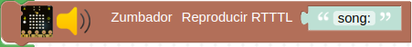
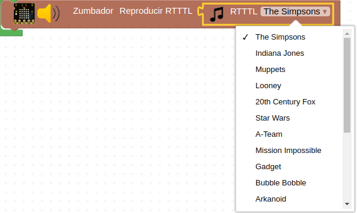

# Formato RTTTL
**Ring Tone Text Transfer Language (RTTTL)** es un formato basado en texto que fue desarrollado por [Nokia](https://es.wikipedia.org/wiki/Nokia) para transferir tonos de llamada entre teléfonos móviles Nokia.

El formato RTTTL es una cadena dividida en tres secciones: *"nombre"*, *"valor predeterminado"* y *"datos"*.

La sección *"nombre"* es una cadena que describe el nombre del tono de llamada. No puede tener más de 10 caracteres y no puede contener dos puntos ":".

La sección *"valor predeterminado"* es un conjunto de valores separados por comas, donde cada valor contiene una clave y un valor separados por un carácter =, que describe ciertos valores por defecto que deben respetarse durante la ejecución del tono. Los nombres posibles son:

* d - duración
* o - octava
* b - beat, tempo.

La sección *"datos"* es un conjunto de cadenas de caracteres separadas por comas, donde cada cadena contiene una duración, afinación, octava y un punto opcional, que si se pone aumenta la duración de la nota en una mitad.

Por ejemplo, la siguiente cadena de texto se corresponde con la Intro de Donkey Kong:

!!! tip "Intro Donkey Kong"
    d=4,o=5,b=140:8a#,8p,8d6,16p,16f.6,16g.6,16f.6,8a#,8p,8d6,16p,16f.6,16g.6,16f.6,8a#,8p,8d6,16p,16f.6,16g.6,16f.6,
    8a#,8p,8d6,16p,16f.6,16g.6,16f.6

Lo único que tenemos que hacer para reproducir la melodia es pegar la cadena en la zona de texto del bloque.

Arduinoblocks nos suministra información y enlaces referentes al tema accediendo desde nuestro proyecto a 'herramientas' y escogiendo 'RTTTL Info', tal y como vemos en la imagen siguiente:

  
*Acceso a RTTTL Info*

En la imagen siguiente tenemos desplegada la información que nos ofrece esta herramienta.

  
*Información RTTTL*

## **Bloques RTTTL**
El bloque de la imagen permite reproducir cualquier melodia RTTTL que peguemos en el campo *'song'*.

  
*Bloque Zumbador Reproducir RTTTL*

Existen un bloque en el que están definidas varias melodias típicas y es el que vemos en la imagen siguiente:

  
*Bloque Zumbador Reproducir RTTTL con listado de melodias*

